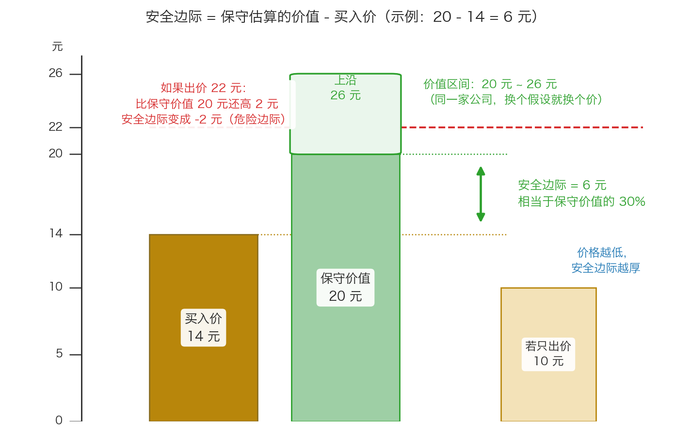
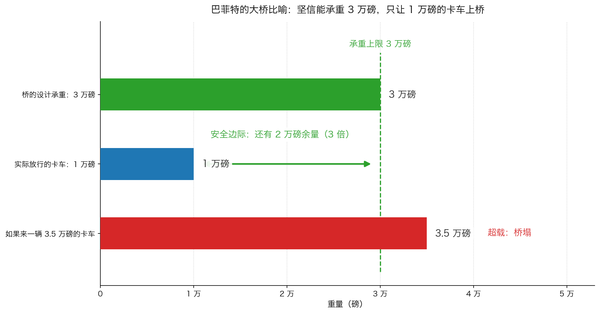
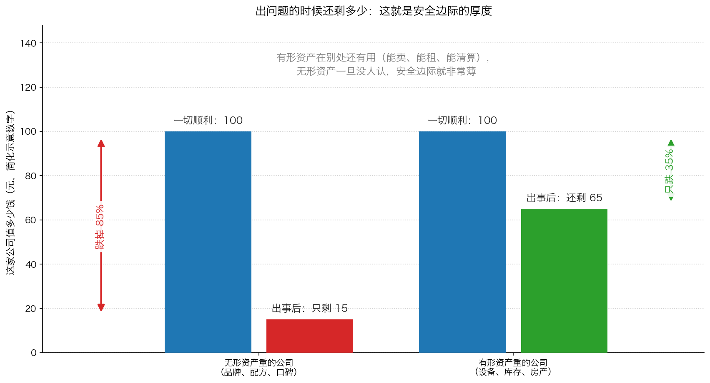

# 第 3 章：安全边际——全书的落点

> 本章你将：
> - 拿到"安全边际"的精确算法，能在一分钟内算出任何一笔买入的安全边际
> - 看懂格雷厄姆那句"安全边际总是依赖于所支付的价格"到底在说什么
> - 记住巴菲特的大桥承重比喻，并知道它比"打折"多说了什么
> - 知道为什么无形资产的安全边际更薄，以及这对 A 股/港股 选股意味着什么
> - 学会用一张手算表，把同一家公司在不同买价下的安全边际全部算出来
> - 最后回答：这个数字怎么变成你下单前的最后一道闸门

前面三章都在做同一件事：把"便宜"这件事讲清楚。第 0 章说不要亏钱，
第 1 章说你的收益从哪三条路来，第 2 章说价值本身会动、所以折扣要留厚一点。
现在，我们把这个"厚一点"变成一个可以计算的数字。这个词就是这本书的书名。
卡拉曼把它放在第六章的正中间，并且说得很清楚——**打折价提供了安全边际**。

---

## 3.1 先把这个词拆开

**生活里的例子（三个）：**

1. 你修一座桥，工程师算出它的极限承重是 3 万磅。你不会让一辆 3 万磅的卡车开上去，
   你只让 1 万磅的车过。那多出来的 2 万磅，就是你的**余地**。
2. 你装修房子，预算 20 万。你跟家人说"我们按 25 万准备"。
   那 5 万不是浪费，是防止中途发现水管要换、墙面要重做。
3. 你卖房，心理底价是 300 万。中介问你 280 万卖不卖，你说再等等——
   因为你当初买入的成本远低于 300 万，你有底气不慌。

这三件事有一个共同点：**你没有把一切都用满，你给自己留了一块不会被碰到的空间。**
用"边际"这个词，说的就是这块边缘上的富余量。

**准确定义：** 安全边际，是**你付出的买入价**与**你保守估算的价值**之间的差距。
它是你为自己估错、遇到坏运气、或者世界突然变得难以预测时，留出的容错空间。

**为什么它不叫"折扣"？** 因为折扣只描述"价格比价值低多少"这一个事实；
而安全边际还包含了一层意思：**我知道我可能会估错，所以我要留出空间来承受这个错。**
这就是为什么卡拉曼强调要用**保守**估算的价值，而不是你最有信心的那个数字。

> ⚠️ **易踩坑：** 安全边际不是"股价会涨多少"。那是预测，是猜未来。
> 安全边际是"我买入之后，就算事情变得比我想的糟，我还有多少缓冲"。
> 一个向前看，一个向下看——**向下看的那一个，才是保护你的那一个。**

---

## 3.2 格雷厄姆的 75 美分和 1.25 美元

这一节是整本书最有名的一段推理，卡拉曼用了不到两百字讲完（p105）：

> "今天价值1 美元的资产或者业务可能在不久的将来值75 美分或者1.25 美元。"（p105）

先把这句话读慢一点。它的意思是：**你连"今天它值多少钱"这件事都不能百分百确定。**
你以为值 1 美元，它可能其实值 75 美分（你高估了 25%），也可能值 1.25 美元（你低估了 25%）。
这不是你不够聪明，这是生意的本性——价值本身是一个范围，不是刻度盘上的一个点。

> 💡 **换个说法：** 如果价值是一个固定的数，投资就变成了一道小学数学题：
> 找到它，然后比价格。**但价值会动，你的估计还会错。** 所以这道题没有精确答案，
> 你唯一能控制的是"我付了多少钱"。

格雷厄姆的结论因此非常干脆：

> "因此，格雷厄姆对1 美元的价格购买1 美元的资产毫无兴趣。这么做没有任何优势，并可能会招致损失。"（p105）

付 1 美元买价值 1 美元的东西，你图什么呢？如果后来发现它其实值 75 美分，
你就亏了 25%；如果它真的值 1 美元，你也只是不赚不亏。**这笔交易的赔率是坏的。**

那么格雷厄姆要什么？

> "格雷厄姆只对以大幅低于潜在价值的打折价购买资产感兴趣。他知道使用打折价进行的投资不大可能让他蒙受损失。打折价提供了安全边际。"（p105）

卡拉曼补上了一句解释为什么这件事在投资里特别重要：

> "因为投资是一门科学，更是一种艺术，投资者需要安全边际。"（p105）

前面我们在第 1 章见过的那个说法——"用 50 美分买下价值 1 美元"（p100）——
就是这句话的口语版。现在把它变成算术。

---

## 3.3 ★安全边际怎么算：一张图和一张表

先看这张图。它是整门课最重要的一张图，请多看几秒。

图里有两个关键约定，请你务必记住：

**约定一：算安全边际只用一个基准——保守估算的价值下沿（图中是 20 元）。**
不是上沿 26 元，也不是中间值 23 元。为什么？因为你要防的是"我看错了、
它其实没那么值钱"，所以在所有可能的估法里，**你要拿最保守的那个来跟自己比**。

**约定二：安全边际可以是负数。** 图里那条红线就是例子：出价 22 元，
虽然还没有超过价值区间的上沿 26 元（看起来"还是在价值以内"），
但它已经高过了保守下沿 20 元 2 元——**安全边际 = 20 - 22 = -2 元**。
这时候卡拉曼的用词是"危险边际"（p106）。

### 手算表：同一家公司，不同买价

假设你对一家公司的保守估算价值是每股 20 元（这就是你的"下沿"）。
把不同买价下的安全边际全算出来：

| 买入价 | 计算 | 安全边际（元） | 安全边际 ÷ 保守价值 |
|---|---|---|---|
| 10 元 | 20 - 10 | +10 元 | +50% |
| 12 元 | 20 - 12 | +8 元 | +40% |
| 14 元 | 20 - 14 | +6 元 | +30% |
| 16 元 | 20 - 16 | +4 元 | +20% |
| 18 元 | 20 - 18 | +2 元 | +10% |
| 20 元 | 20 - 20 | 0 元 | 0% |
| 22 元 | 20 - 22 | -2 元 | -10% |
| 24 元 | 20 - 24 | -4 元 | -20% |
| 26 元 | 20 - 26 | -6 元 | -30% |

**这张表只用一个公式：**

$$安全边际 = 保守估算的价值 - 买入价$$

如果要用百分比表示（方便在不同价格的公司之间比较）：

$$安全边际率 = \frac{保守估算的价值 - 买入价}{保守估算的价值}$$

**手算示例：** 保守价值 20 元，买入价 14 元。
第一步，算差距：`20 - 14 = 6 元`。
第二步，算比例：`6 ÷ 20 = 0.30`，也就是 **30%**。
所以你可以说："我在 14 元买入，安全边际是 6 元，相当于保守价值的 30%。"

> 📌 **划重点：** 卡拉曼在书里**没有**给出一个"必须多少"的统一数字。
> 他在 p106 反问了三个问题：你愿意以及能够承受多坏的运气？
> 你可以忍受企业价值出现多大的波动？你对错误的忍受极限是多少？
> 他用一句话收尾："所有这些问题都视你对亏损的承受能力而定。"（p106）
> 所以在实际使用中，很多价值投资者会给自己定一条底线，
> 比如"安全边际低于 20% 就不出手"。这条线是你自己定的纪律，
> **重点是它必须提前定好，而不是等看上了某只股票再临时放宽。**

---

## 3.4 "安全边际总是依赖于所支付的价格"

这句话是格雷厄姆说的，卡拉曼在 p105 引用，也是本章最重要的一句引用：

> "安全边际总是依赖于所支付的价格。不管哪种证券，安全边际在某个价格时较大，在一些更高的价格时则较小，在一些更高的价格时甚至不存在。"（p105）

这句话有三层意思，我们逐层拆。

**第一层：安全边际不是股票的属性，是"股票 + 价格"的属性。**
所以"这家公司好不好"是个不完整的问题。完整的问题应该是
"**这家公司在这个价格上**好不好"。同一家优秀的公司，在 10 倍市盈率时是好机会，
在 60 倍市盈率时是危险的投资——公司没变，价格变了。

**第二层：安全边际随价格上升而变小，而且是连续的。**
上一节那张表就是这句话的算式版：买入价 10 元时安全边际 50%，
18 元时只剩 10%，20 元时归零。没有"及格线"这种东西，
它是一个连续的刻度。

**第三层：高到某个价格，安全边际就不存在了。**
注意格雷厄姆用的词是"甚至不存在"，而不是"变成负的"。他说得客气，
因为它确实取决于你的估值——但如果你用的是保守下沿，超过它就已经是负数了。

> 🇨🇳 **落到 A 股/港股：** 这是"好公司陷阱"的解药。
> 很多人买贵州茅台、腾讯控股、长江电力的时候，理由都是"这是好公司"。
> 这些确实是好公司，但**好公司 + 太高的价格 = 危险边际**。
> 反过来，一些看起来平平无奇的公司（长期破净的中国石油、
> 增长慢但现金流稳的公用事业），在足够低的价格上，反而可能给你很厚的安全边际。
> **你要买的是"价格与价值的差距"，不是"公司的名气"。**

---

## 3.5 巴菲特的大桥比喻

同一件事，巴菲特用了一个更好记的说法。卡拉曼在 p105 引了出来：

> "当你修建一座大桥时，你坚信它的承重量为3 万磅，但你只会让重1 万磅的卡车通过这座桥。这一原则也适用于投资。"（p105–p106）

这个比喻比"打折"多说了三件事：

**第一，你对自己算出来的数字本来就不该有百分之百的信心。**
"坚信承重 3 万磅"里的"坚信"，是工程师用计算和测试得到的信心；
但你依然只走 1 万磅。对应到投资：**你的估值再用心，也只是估计。**

**第二，余量不是浪费，是保险费。** 桥不会因为你只走 1 万磅就少收过路费——
你损失的是"多装一点"的可能；但如果桥塌了，你损失的是全部。
投资里也是：你放弃了"买在最低点"的可能，换来的是"不会因为一次判断失误而伤筋动骨"。

**第三，余量要多大，取决于你对这座桥的了解程度和你自己的承受能力。**
一座你亲手设计、天天维护的桥，和一座陌生图纸的老桥，余量当然不一样。
卡拉曼在 p106 把这件事交还给读者：

> "投资者必须具备什么样的安全边际？每个投资者的答案都不一样。"（p106）

### 用大桥的算术感受一下"余量"的价值

把比喻算成数字：

- 桥的承重：3 万磅；实际放行的卡车：1 万磅 → 余量 = 2 万磅，
  相当于"实际负载的 3 倍"或"承重能力的 67%"。
- 假设你的估值高估了 50%（你以为 3 万，其实只有 2 万）：1 万磅的车依然安全，
  还留着 1 万磅余量。
- 假设你估成了实际的 3 倍（你以为 3 万，其实只有 1 万）：这时 1 万磅的车正好压在极限上——
  **一点余量都没有了。** 一次超载（一个坏消息）就会出事。

> 📌 **划重点：** 安全边际的作用不是让你赚更多，而是让你**在判断出错时也不至于出局**。
> 你估得越不确定（不懂的行业、无形资产重的公司、周期性强的生意），要的余量就得越大。

---

## 3.6 谁没有安全边际

卡拉曼在 p106 列了一串"没有安全边际"的典型，读起来像点名：

> "多数投资者在自己的投资中并不寻找安全边际。那些把股票看成是可以交易的纸张而买入股票，并且依然在任何时候都满仓投资的机构投资者没能获得安全边际。跟随市场趋势和潮流，贪婪的个人投资者也是如此。"（p106）

他接着点了杠杆交易的人：

> "那些购买华尔街上的保险业或金融市场创新工具，只进行杠杆交易的投资者通常会获得危险边际。"（p106）

把这段话翻成今天的样子：

| 卡拉曼点名的 | 今天在 A 股/港股的样子 | 危险在哪 |
|---|---|---|
| 把股票看成可以交易的纸张 | 只看 K 线和消息，不看公司做什么生意 | 价格跌下来时没有任何依据可以判断"该不该拿住" |
| 任何时候都满仓的机构 | 排名压力下不敢空仓的基金（Week 5 讲过） | 没有现金，等于放弃了"等好球"的权利 |
| 跟随趋势和潮流的个人 | 追热门赛道、追"下一个风口" | 买入价里已经包含了别人的乐观，安全边际是负的 |
| 只做杠杆交易的人 | 融资融券、配资、借钱炒股 | 一次下跌就可能被迫卖出，把浮亏变成实亏 |

> ⚠️ **易踩坑：** 注意卡拉曼说的不是"这些人水平差"，而是
> **他们的做法在结构上就不可能产生安全边际**。安全边际只能来自"价格明显低于价值"，
> 而以上四种做法的共同点是：他们的买入价里已经装着别人的乐观和自己的急迫。

---

## 3.7 无形资产的安全边际为什么更薄

这是本章最容易被忽略、但对今天的投资者最重要的一节。

先说背景。卡拉曼承认一件事：无形资产确实很值钱。
他在 p106 提到，包括巴菲特在内的一些成功投资者越来越重视这类资产：

> "包括巴菲特在内，一些非常成功的投资者已经越来越强烈地意识到，无形资产价值——如广博执照或者软饮料配方——可以在无需进行投资以维持其价值的情况下继续增长。最终这些无形资产所产生的所有现金流都是自由现金流。"（p106）

这段话本身是在夸无形资产：一门生意如果靠品牌、配方、牌照赚钱，
不需要每年砸大钱更新设备，赚到的现金几乎都能自由支配——这是极好的商业模式。

**但卡拉曼紧接着就转了弯：**

> "我相信无形资产遇到的问题是，它们的安全边际有限，或者根本没有。"（p106）

为什么？因为安全边际的核心作用是"出事的时候保护你"。
而无形资产**恰恰在最需要保护的时候消失得最快**：

> "如果出现了问题——人们的口味出现了改变，或者竞争对手发起了进攻——这些无形资产提供的安全边际相当低。"（p106）

他举的例子就是 Dr Pepper 和七喜：这些公司最值钱的资产是饮料配方。
**如果消费者不再喜欢这个口味，配方值多少钱？** 答案是几乎不值钱——
你不能把配方卖掉、把厂房租出去、把库存清掉来收回大部分投入。

对比之下，有形资产是另一回事：

> "相反，对有形资产的评估能更加准确，为投资者防止出现亏损提供了更多的保护。"（p107）

卡拉曼给了一个非常好懂的例子：

> "例如，如果一家连锁零售店变得无利可图，连锁店的库存可以进行清算，应收账款可以被回收，租赁的场地可以转租，房地产可以卖给其他人。"（p107）

也就是说：**有形资产在"别的用途"里还有价值**（这就叫"替代用途"）——
卖不掉的货可以打折清仓，租来的店面可以转租，自有房产可以卖掉。
这些回收值构成了一个相对硬的地板。而配方、口碑、品牌认知这些东西，
一旦市场不认了，它们的替代用途接近于零。

### 一个容易读错的括号

卡拉曼在这里特意加了一个括号，很多人没注意：

> "（这并不意味着那些无形资产价值巨大的企业不是出色的投资机会。）"（p107）

**他不是让你别买茅台、别买腾讯。** 他是在说：
对这类公司，你的估值更不可靠，所以你需要**更厚的折扣**来补偿这个不确定性。
同样估出 20 元的保守价值，一家靠大坝发电的公司，你可能在 14 元就愿意买；
一家靠品牌和口味的公司，你可能要等到 10 元甚至更低。

### 手算感受一下

用上图那组示意数字算一遍，你会立刻明白差别的量级。

- 两家公司，你都保守估成每股 100 元。
- 有形资产型的公司出事后的回收值：约 65 元；
- 无形资产型的公司出事后的回收值：约 15 元。

**情形一：你以 65 元买入。**
有形资产型：即使生意彻底失败、进入清算，你能收回约 65 元，基本不亏。
无形资产型：同一场灾难里你只能收回约 15 元，`15 - 65 = -50 元`，亏损 77%。

**情形二：你以 40 元买入。**
有形资产型：清算回收 65 元，你还赚 25 元。注意，**这 25 元不是"安全边际"**——
按 3.3 的定义，你以 40 元买入保守价值 100 元的公司，安全边际是 `100 - 40 = 60 元`。
这 25 元是**清算硬地板额外给你的那层缓冲**：就算你对未来现金流的判断全错、
公司只剩清算价值，你依然赚 25 元。
无形资产型：清算回收 15 元，你亏 25 元——连硬地板都在你的买入价下面 25 元。

**结论：** "便宜"这个判断，必须结合"价值的支撑是什么"来看。
账面上同样是 100 元的价值，靠厂房和存货撑着的 100 元，比靠一个故事撑着的 100 元，
要硬得多。

> 🇨🇳 **落到 A 股/港股：**
> - **无形资产型：** 贵州茅台的品牌和产地、腾讯的社交网络与内容生态。
>   这类公司的优点是不需要大额资本开支就能赚钱（自由现金流好），
>   缺点是**出事时没有硬地板**，所以要求更大的折扣。
> - **有形资产型：** 长江电力的水电站和大坝、福耀玻璃的生产线、
>   中国石油的油气资产与管网、中国神华的矿井和铁路。
>   这类公司评估更"看得见"，清算或重置价值相对可算，
>   但缺点是往往需要不断投入维持（重资产、高折旧）。
> - **要特别警惕的一种"假有形资产"：商誉。**
>   公司高价收购另一家公司时，付出的价格超过对方净资产的部分会记成"商誉"，
>   它名字听着像资产，实质上是无形资产。一旦被收购的生意不达预期，
>   公司就要做"商誉减值"——账面净资产一夜缩水，这正是很多"破净股"看起来很便宜、
>   结果越跌越便宜的原因。**看破净，先看净资产里有多少商誉。**

---

## 3.8 怎么获得安全边际：卡拉曼的清单

p107 是这一章的行动纲领。卡拉曼把"投资者如何才能获得确定的安全边际"写成了一个清单，
我们逐条翻译成动作：

| 原书要求（p107） | 落到动作 |
|---|---|
| 一直以大幅度低于潜在价值的打折价进行购买 | 买入前必须算安全边际，算不出来就不买 |
| 更看重有形资产而不是无形资产 | 看净资产里有多少是商誉、专利这类东西；无形资产越重，要的折扣越大 |
| 将当前持有的股票替换成新出现的更好的便宜货 | 定期比较手上的和新出现的（但注意换股成本，见第 2 章） |
| 当任何一项投资的价格开始反映其潜在价值时卖出 | 涨到价值附近就减，不是"永远不卖" |
| 在必要的情况下持有现金，直至可以获得其他有吸引力的投资 | 现金是弹药也是保险，不要为了满仓而凑合买 |
| 不只看"是否"被低估，还要问"为什么"被低估 | 见下面单独讲 |
| 寻找有催化剂、管理层优秀且管理层自己持股的投资 | 好价值 + 有人推动实现 + 利益一致 |
| 多样化持股，必要时对冲 | Week 12 会专门讲组合与对冲 |

**其中"为什么"这一条，值得单独说。** 原话是：

> "投资者不应只将注意力放在当前持有的投资'是否'被低估上，还应包括'为什么'被低估。"（p107）

**生活里的例子：** 商场里一件大衣打三折。如果是因为换季清仓，你会很高兴地买；
如果是因为里衬有严重质量问题，三折也可能不值。
**"便宜"本身不是买入理由，你必须知道它为什么便宜，以及那个原因是不是你判断错了。**

> ⚠️ **易踩坑：** 最常见的错误是"看到便宜就买，但完全不知道它为什么便宜"。
> 便宜的常见原因有三类：① 市场情绪（好机会，长期会修复）；
> ② 公司确实出了问题但可以解决（要研究，风险大）；
> ③ 生意在结构性衰退（可能是便宜陷阱）。
> 你至少要能给自己的买入写出一句"它便宜是因为 ___，而我认为 ___"。

---

## 3.9 原书里的三个真实案例

卡拉曼用三个 1980 年代末的真实案例来展示安全边际的威力。
这些数字是原书的原始数字，我们照抄（并标注页码），
目的不是让你去找破产公司——那是 Week 11 的内容——而是让你看到
**当安全边际足够大时，坏消息也伤不到你**。

### 案例一：Erie Lackawanna 的股票（p107–p108）

背景极其简单：这是一家已经清算中的铁路公司，还有一笔由美国国税局批准的退税没有到账。
1987 年末，它的股价接近 140 美元，最低到过 110 美元。
卡拉曼强调了一件事：**即使不算上退税因素，股价依然低于每股净现金**。
用大白话讲：**这家公司账上的现金，比它的总市值还多。**
所以他的结论是：

> "该股下跌风险似乎为零。"（p108）

后来的结果：1988 年公司支付了 115 美元／股的清算分配，
1991 年中期又支付了 179 美元／股，而股价这时候还有约 8 美元。
（完整的手算在后面的"算一算"里。）

**"清算分配"是什么？** 生活类比：几个人合伙开了一家店，现在决定关门，
把店里的货、设备、房子都卖掉，还清欠款，剩下的钱按出资比例分给合伙人。
这一笔分回来的钱，就叫清算分配。

### 案例二：新罕布什尔服务公司的第二抵押债券（p108）

这家公司已经正式进入破产程序，但它的债券价格却在账面价格附近。
为什么还有人敢买？因为卡拉曼指出：**这家公司为这些债券提供担保的公用事业资产，
价值数倍于这些债券的本金**，而且公司还在支付这些债券的利息。
最后的结局是公司筹集资金赎回了债券，投资者拿到了每年 18% 的回报。

**"第二抵押债券"是什么？** 生活类比：你把房子先押给 A 借了一笔钱，
又押给 B 借第二笔。如果还不上钱、房子被拍卖，
**A 先拿钱，剩下的才轮到 B**。所以"第二"意味着排在后面、风险更大——
除非担保物本身价值远远够还所有人。

### 案例三：Texaco 的债券（p108–p109）

1987 年，Texaco 公司因为一场官司被判赔 100 亿美元，随后申请破产。
卡拉曼的判断是：**这家公司的资产价值，即使按最糟的情况算，也多于它的全部负债。**
但市场不管这些——破产消息一出，它的股票和债券价格立刻大跌。
其中一只债券以"九折"交易（因为价格里累积了约 18 个月的利息）。
如果公司最终完全偿付本金和利息，从 1987 年 11 月 1 日起分别持有 1 年、2 年、3 年，
年回报率分别是 **44.1%、25.4% 和 19.5%**（p109）。

卡拉曼对这一类机会的总结是：

> "由破产所带来的不确定性为价值投资者创造了绝好的机会，他们使用大量的安全边际而在各种情况下都取得了很好的回报。"（p109）

**请把这三个案例的共同结构记住，它比数字重要得多：**

1. 都出现了坏消息（破产、官司、清算）；
2. 坏消息把价格打得很低；
3. 但**在坏消息之下，还有一层硬东西撑着**（净现金、担保资产、覆盖负债的资产）；
4. 那一层硬东西，就是安全边际。

> 🇨🇳 **落到 A 股/港股：** 这个结构在今天的对应物包括
> 长期破净但资产扎实的公司、大额净现金的公司、可转债的债底（Week 11 讲）、
> 以及破产重整中的企业。**但请记住这需要真功夫**——
> 判断"那层硬东西到底有多硬"是全书最难的技术活，Week 9 到 Week 11 都会教。

---

## ✍️ 想一想

1. 有人跟你说："这家公司我算过了，值 30 元，现在 27 元，所以我买了。"
   用本章的约定，指出他至少犯了两个错。
2. 为什么卡拉曼要用"保守估算的价值下沿"做基准，而不是用"我认为最可能的那个价值"？
   如果用了最可能的那个数，会发生什么？
3. 一家你非常喜欢的公司（品牌极强、口碑极好），股价从 100 元跌到 60 元。
   有人说"抄底机会来了"。请你说出至少两个你不能直接下结论的理由。

> 💡 **参考思路：**
>
> 1. 第一，他用的多半是"最可能的估值"而不是保守下沿，而且他拿 30 元当成了确定的锚；
>    第二，27 元相对 30 元只便宜 10%，按本章的表，这个安全边际已经很薄——
>    只要他的估值高估了 10%（非常容易），安全边际就归零。
>    第三（附加），他没有说明"为什么它被低估"，也就是没回答 p107 的那个"为什么"。
> 2. 因为你要防的是自己估错。用最可能的数，你是在假设自己估得准；
>    用保守下沿，你是在假设自己可能估高。前者听起来聪明，后者才活得久。
>    如果用了最可能的数，最典型的后果是：一旦公司业绩不及预期，
>    你原本以为的"便宜 20%"瞬间变成"贵了 20%"，而你还以为自己有安全边际。
> 3. 至少两个理由：① **价值本身可能也跌了**（第 2 章讲过）——
>    品牌型公司的价值最怕口味、监管、竞争格局的变化，而它的价值没有硬地板；
>    ② 60 元是不是便宜，取决于你保守估的价值是多少，而不是取决于它从 100 元跌了多少。
>    "跌了 40%"是一个事实，不是一条买入理由。

---

## 🧮 算一算

这一节的算一算有两道题。第一题让你**给自己算一次安全边际**，第二题用原书案例走一遍完整流程。

### 第一题：算你自己的安全边际

**情境（简化示意数字）：** 你研究了一家公司，保守估算它的价值是每股 22 元。
现在的股价是 15 元。假设你打算买 1000 股。

**第 1 步：算安全边际（元）。**

`安全边际 = 22 - 15 = 7 元`

**第 2 步：算安全边际率。**

`7 ÷ 22 = 0.318...`，也就是约 **31.8%**。

（手算技巧：7 ÷ 22，先算 7 ÷ 22 约等于 0.32；如果你手边没计算器，
可以这样估：22 的 30% 是 6.6，32% 是 7.04，所以 7 元对应的比例在 31% 到 32% 之间。）

**第 3 步：算你实际付出的总金额。**

`15 元 乘以 1000 股 = 15000 元`

**第 4 步：算"缓冲垫"值多少钱。**

`7 元 乘以 1000 股 = 7000 元`

也就是说：如果这家公司的真实价值只有你估计的 68.2%（`22 乘以 0.682 约等于 15 元`），
你也只是不赚不亏。这就是安全边际给你的保护范围。

**第 5 步：把不同买价的表列出来，找到你的纪律线。**

假设你给自己定的纪律是"安全边际率至少 30%"：

| 买入价 | 安全边际（元） | 安全边际率 | 按你的纪律，能不能买 |
|---|---|---|---|
| 13 元 | 9 元 | 40.9% | 可以 |
| 14 元 | 8 元 | 36.4% | 可以 |
| 15 元 | 7 元 | 31.8% | 可以（刚过线） |
| 16 元 | 6 元 | 27.3% | 不可以（低于 30%） |
| 18 元 | 4 元 | 18.2% | 不可以 |
| 20 元 | 2 元 | 9.1% | 不可以 |
| 22 元 | 0 元 | 0% | 不可以 |
| 24 元 | -2 元 | -9.1% | 绝对不可以（危险边际） |

**第 6 步：写下你的买入指令。**

> "保守价值 22 元。安全边际率要求 30% 以上，也就是买入价不超过 15.4 元
> （算法：22 乘以 0.7 = 15.4）。所以我的买入价上限是 15.4 元。
> 超过这个价格，无论公司多好，我都不买。"

（这一步用到的算法很简单：要求 30% 的安全边际，就等于只付保守价值的 70%，
即 `22 乘以 (1 - 30%) = 22 乘以 0.7 = 15.4 元`。）

### 第二题：Erie Lackawanna（原书数字，p107–p108）

**情境：** 假设你在 1987 年末，以 110 美元／股买入 100 股。
之后你收到了两笔清算分配（1988 年 115 美元／股，1991 年中期 179 美元／股），
到 1991 年中期，股价还剩约 8 美元／股。

**第 1 步：算你投入的成本。**

`110 美元 乘以 100 股 = 11000 美元`

**第 2 步：算 1988 年收到多少钱。**

`115 美元 乘以 100 股 = 11500 美元`

**注意这一步意味着什么：** 11500 比 11000 还多 500 美元。
也就是说，**买入后大约一年，你就已经收回了全部本金，还多了 500 美元。**
这正好印证了原书那句"从而偿清了 1987 年年末买入该股时支付的所有费用"（p108）。

**第 3 步：算 1991 年中期收到多少钱。**

`179 美元 乘以 100 股 = 17900 美元`

**第 4 步：算手里剩下的股票值多少。**

`8 美元 乘以 100 股 = 800 美元`

**第 5 步：算总回收。**

`11500 + 17900 + 800 = 30200 美元`

**第 6 步：算总收益。**

`30200 - 11000 = 19200 美元`

收益率：`19200 ÷ 11000 约等于 1.745`，也就是约 **174.5%**。

换个说法：**你每投入 1 美元，最后拿回了约 2.75 美元**（30200 ÷ 11000 约等于 2.75）。

**第 7 步：这道题真正的重点。**

不是那 174.5%，而是：**你在第 1 年就收回了全部本金。**
从那一刻起，这笔投资无论后面发生什么，你都不可能亏钱了——
因为你的本金已经回到口袋里，剩下的都是赚的。

这就是"安全边际"最理想的样子：**不是赚得最多，而是让"亏"这件事在数学上变得几乎不可能。**

---

## ✅ 小测验

**1. 你用保守估算的价值下沿（每股 18 元）作为基准，以每股 15 元买入。
安全边际是多少？**
A. 3 元，相当于保守价值的约 16.7%
B. 3 元，相当于买入价的 20%
C. 0 元，因为没有超过价值区间上沿
D. 无法计算，因为价值是一个范围

**2. 关于无形资产的安全边际，下面哪个说法符合卡拉曼的原意？**
A. 无形资产价值巨大的企业不是好的投资机会
B. 无形资产不需要投入就能增长，所以它的安全边际最厚
C. 无形资产的安全边际通常更薄，因为出事时它们几乎没有替代用途；所以要求更大的折扣
D. 无形资产和有形资产的安全边际完全一样

**3. 巴菲特的大桥比喻，主要想说明什么？**
A. 修桥要花很多钱，所以投资要省钱
B. 即使你确信自己算得对，也要留出余量，让判断出错时不至于出局
C. 投资要像造桥一样精确计算，一分钱都不能差
D. 卡车越重收益越高

> **答案与解析**
>
> **1. A。** 安全边际 = 保守价值 - 买入价 = 18 - 15 = 3 元；
> 3 ÷ 18 约等于 16.7%。B 的分母用错了——分母要用**保守价值**，
> 不是买入价（用买入价当分母，会把安全边际率算得偏大，从而高估自己的保护）；
> C 是本章反复提醒的错误：基准是**保守下沿**，不是上沿；
> D 不对——价值是范围，但算法恰恰要求你从中挑最保守的那个数来算。
>
> **2. C。** p106–p107 的完整意思是：无形资产很值钱、能产生大量自由现金流，
> 但它**在出事时提供的保护很少**，因为配方、口碑这类东西几乎没有替代用途；
> 卡拉曼还专门用括号补了一句，这并不意味着无形资产价值巨大的企业不是出色的投资机会（p107），
> 所以 A 是误读；B 把"自由现金流好"和"安全边际厚"混为一谈，这是两件事；
> D 与原文相反。
>
> **3. B。** 桥的比喻讲的是"承重 3 万磅，只走 1 万磅"——余量的意义在于容错。
> A、D 不是比喻的含义；C 恰好说反了：比喻的重点恰恰是"不要用到极限"。

---

## 📖 回到原书

- 对应原书 **第六章中段**，`raw/安全边际-中文版/page_105.md` ~ `page_109.md`（原书 p105–p109）。
- **建议精读（本章是全书的落点，这几页值得读两遍）：**
  - p105：格雷厄姆的 75 美分／1.25 美元、为什么付 1 美元买 1 美元毫无优势、
    以及那句"安全边际总是依赖于所支付的价格"；
  - p105–p106：大桥承重比喻、投资者该要多大安全边际的四个问题；
  - p106：没有安全边际的四种人，以及无形资产的问题；
  - p107：有形资产的保护（连锁零售店清算的例子）和"获得安全边际"的清单；
  - p107–p109：Erie Lackawanna、新罕布什尔服务公司、Texaco 三个案例。
- **可以略读：** p108–p109 里债券条款的细节（到期日、利息累积方式），
  知道"价格里含了 18 个月利息，所以叫九折"就够了，Week 11 会专门讲困境证券。
- **原书金句（逐字引用）：**
  > "今天价值1 美元的资产或者业务可能在不久的将来值75 美分或者1.25 美元。"（p105）
  > "安全边际总是依赖于所支付的价格。不管哪种证券，安全边际在某个价格时较大，在一些更高的价格时则较小，在一些更高的价格时甚至不存在。"（p105）
  > "当你修建一座大桥时，你坚信它的承重量为3 万磅，但你只会让重1 万磅的卡车通过这座桥。这一原则也适用于投资。"（p105–p106）
  > "我相信无形资产遇到的问题是，它们的安全边际有限，或者根本没有。"（p106）
  > "相反，对有形资产的评估能更加准确，为投资者防止出现亏损提供了更多的保护。"（p107）

学到这里，你已经拿到了整本书最重要的那个工具。
下一章回答一个很现实的问题：**当市场下跌、你手上的东西在跌的时候，该怎么办？**
卡拉曼的答案是——那正是价值投资闪闪发光的时刻。
