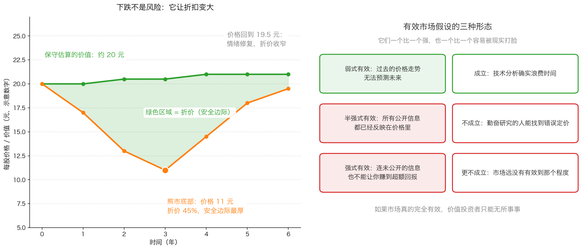

# 第 4 章：下跌的市场里，价值投资闪闪发光

> 本章你将：
> - 明白为什么下跌的市场是对一种投资哲学的"考试"，而不是灾难
> - 认识"雷管股票"：价格里塞满高预期、跌起来最狠的那一类
> - 学会看懂价值投资者手里的证券长什么样（低于净现金、低于营运资金净额、大幅低于账面价值）
> - 看懂有效市场假设的三种形态，以及卡拉曼为什么说只有一种成立
> - 弄懂"价值套利"和封闭式基金折价，为什么它被称为最完美的价值套利
> - 最后回答：当你的账户在跌的时候，你具体该做哪三件事

第 3 章我们拿到了整本书最重要的工具：安全边际。
但工具要在最难的时候用才见功夫——**市场下跌的时候**。
这一章讲的就是：下跌为什么对价值投资者是好消息，以及你为什么不该跟着一起恐慌。

---

## 4.1 潮水退去，才知道谁在裸泳

卡拉曼在 p109 引了一句大家都听过的俗话：

> "只有当潮水退去的时候，你才能知道谁在裸泳。"（p109）

**这句话的意思是：** 市场上涨的时候，几乎所有人都赚钱，
你分不清谁是靠本事、谁是靠运气、谁只是坐上了一波浪潮。
只有跌下来的时候，才能看出谁的投资里真的有价值撑着。

他紧接着说了一句更狠的：

> "下跌的市场是对一种投资哲学真正的考验。"（p109）

为什么高预期的股票跌得最惨？卡拉曼的解释是：

> "在强劲市场中表现不错的证券通常是那些投资者给予最高预期的证券。当这些预期没有实现时，这些证券就会大跌，它们通常不具备安全边际。"（p109）

**逻辑链是这样的：** 一只股票被追捧，是因为大家预期它未来会非常好。
这个预期被写进了价格里，所以价格里**没有留出错的余地**。
预期一旦落空（哪怕只是增长得慢一点），价格就必须重新定价——从"完美"改回"普通"。
而"从完美到普通"的距离，往往就是腰斩。

---

## 4.2 雷管股票：康柏电脑的故事

卡拉曼用了一个很有画面感的词：**雷管股票**。

**生活类比：** 雷管是炸药引信上那个一点就着的小东西。
它本身不大，但它是引爆整包炸药的那一下。雷管股票也一样：
它的价格里装着"一定会很好"的预期，**一旦预期被否定，价格就被引爆。**

原书举的例子是 1991 年的康柏电脑（p110），数字照抄如下：

- 1991 年 3 月 6 日，股价 **72 美元**；
- 4 月 24 日，跌到 **61.875 美元**；
- 接下来的一天，又跌了 **9.375 美元**；
- 5 月 14 日，单日大跌 **13.25 美元**，收于 **36 美元**。

从 72 到 36，**跌掉了整整一半**。卡拉曼解释了原因：

> "3 月6 日的股价反映了人们预期该公司的盈利将实现高增长。当公司高管随后宣布第一季度的盈利下降之后，这只股票就成了雷管。"（p110）

注意这里的因果：不是公司"变差了"，而是**盈利增速低于预期**。
一家仍在赚钱、只是增长慢了一点的公司，股价可以腰斩——
因为 72 美元的价格里，装的是一个"永远高速增长"的故事。

> 🇨🇳 **落到 A 股/港股：** "雷管"在 A 股最常见的形态，就是市场口中的"高景气赛道"。
> 当一只股票的市盈率被推到很高，它靠的已经不是当期利润，
> 而是"未来几年利润会翻好几倍"的假设。这类股票的特征是：
> **业绩只要稍微不及预期，跌幅就远超业绩本身的下滑幅度。**
> 这不是市场不理性，这是价格里原本就没有安全边际。

---

## 4.3 价值投资者手里的证券长什么样

说完了不该拿什么，卡拉曼描述了应该拿什么。先是总的原则：

> "价值投资者所拥有的证券无需非常高预期的支持。"（p110）

然后他列了几种具体的形态（p110），我们逐条解释：

> "一些股票的价格不及每股营运资金净额，一些股票的价格不及每股净现金（剔除所有负债之后持有的现金）。许多股票的股价与当期收益和现金流之间的比率均处在非常低的水平，且大幅低于账面价值。"（p110）

这三句话里有三个需要解释的词：

**① 每股净现金。**
生活类比：一个朋友欠你一笔钱，同时你自己也欠着别人钱。
把你能立刻拿到手的现金，先扣掉你欠别人的全部债务，剩下的才是"净"的。
把公司账上这样的净现金除以总股数，就是每股净现金。
**如果股价比每股净现金还低**，意味着你花 8 元买到的东西里，光现金就有 10 元——
剩下的业务等于白送。这种机会很少，但极端恐慌时会出现。

**② 每股营运资金净额。**
生活类比：一家小店把货卖掉、把别人欠它的钱收回来（这些都是"流动资产"），
再还掉欠供应商和银行的短期欠款（"流动负债"），手里剩下的那笔钱。
这就是"营运资金"。它比净现金宽松一些，因为它把存货和应收账款也算进来了。
股价低于每股营运资金净额，是格雷厄姆那一派最爱找的便宜货。

**③ 大幅低于账面价值。**
**账面价值**是会计账本上记的净资产（总资产减总负债）。
股价低于每股账面净资产，就叫**破净**。

> 🇨🇳 **落到 A 股/港股：** 破净在 A 股并不罕见。中国石油（601857.SH / 0857.HK）
> 长期处于破净状态，招商银行（600036.SH）等银行股也常年在净资产附近或下方交易。
> **但请你先别急着买。** 破净是不是便宜，取决于三件事：
> ① 账本上的净资产里有没有大量商誉（第 3 章讲过，商誉是假的有形资产）；
> ② 这些资产能不能变现、有没有替代用途；
> ③ 公司是不是在持续亏钱、把净资产一年年烧掉。
> 换句话说：**破净只是起点，安全边际要靠第 3 章那张表来算。**

---

## 4.4 为什么下跌对价值投资者是好消息

看好上面那张图的左边：**价格跌下去，绿色区域（折价）就变大了。**
同一个价值，你付的价格越低，安全边际越厚。卡拉曼写得很直接：

> "价值投资一个突出的特征就是能在整个市场下跌时期取得优异的表现。"（p110）

他给了两个理由。

**理由一：坏消息已经反映在价格里了，继续跌的空间有限。**

> "股票或者债券的价格可能反映出市场预期企业将继续公布糟糕的业绩报告，然而，已经反映了那些令人沮丧的基本面的证券价格，进一步下跌的空间有限。"（p110）

生活类比：一件商品已经被贴上"清仓甩卖"的标签，还能再便宜到哪里去？
当所有人都认为"这家公司完蛋了"，这个判断已经写进了价格——
**除非它比"完蛋"还糟，否则价格已经跌到位了。**

**理由二：认知一旦改变，你能赚两份钱。**

> "当基本面确实改善的时候，投资者不仅可以从业绩提高中受益，也可以从这些证券的估值上升中获利。"（p110–p111）

一份来自业绩改善，一份来自估值修复。第 1 章我们讲过这两个来源，
但那里强调的是"估值不可靠"；这里要说的是反面：
**当你买入时的估值已经被压到很低，估值的钟摆往回升，就成了你的朋友而不是风险。**

> ⚠️ **易踩坑：** 上面这一切有一个前提——**你估的价值是对的。**
> 如果下跌是因为这门生意真的在结构性变坏（第 2 章讲的"价值本身会动"），
> 那么价格跌了，价值也跌了，安全边际可能一点没变厚。
> 所以下跌时该做的第一件事不是"加仓"，而是**回到年报和生意本身，重算一遍价值**。
> 重算完了再决定，这才叫纪律；不重算就加仓，那叫赌。

---

## 4.5 一个更极端的例子：Telefonos de Mexico

卡拉曼在 p111 举了一个"估值修复"的极端案例，数字照抄如下：

1987 年年初，这家墨西哥电信公司的股价最低只有 **10 美分**。
当时分析师预计它 1988 年的每股收益是 **15 美分**，每股账面价值约 **75 美分**。
也就是说：**股价只有它当年预期利润的三分之二，只有账面价值的七分之一左右。**
市场当时在担心的是配股稀释（公司为了装电话要发新股筹钱）之类的事情，
却几乎完全忽略了估值本身。到了 1991 年年初：

**股价超过了 3.25 美元。** 从 10 美分到 3.25 美元，涨了三十多倍。
卡拉曼对这段涨幅的归因非常关键：

> "估值的上升反映了投资者心理的改变，而不是这家公司基本面的改善。"（p111）

**请把这句话记住。** 它不是让你去赌"心理改变"，
而是告诉你一件重要的事：**你手上那种"便宜但没人要"的股票，
回报的大头可能来自估值修复，而估值修复没有时间表。**
你唯一能控制的是买入价（第 3 章），剩下的是耐心（第 2 章）。

---

## 4.6 有效市场假设错在哪

价值投资能成立，前提是"价格会出错"。而在学术界，有一派理论认为价格不会错。
卡拉曼专门花了几页回应它（p111–p114）。先解释这个理论。

**有效市场假设是什么？** 用一句话说：**证券的价格已经反映了所有可得的信息，
所以没有人能持续地找到被低估的证券。**

**生活类比：** 想象一个超级高效的菜市场，每个摊位的价格都恰好等于菜的真实价值，
而且所有人信息完全一样、反应速度一样快。在这样的市场里，
你不可能"捡到便宜"，因为任何便宜都会被瞬间抹平。

**它的三种形态（p112）：**

| 形态 | 它主张什么 | 如果成立，意味着 |
|---|---|---|
| 弱式有效 | 过去的价格走势无法预测未来价格 | 技术分析（看图、看均线）没用 |
| 半强式有效 | 所有**公开**信息都已经反映在价格里 | 研究财报、读年报也没用 |
| 强式有效 | 连**未公开**信息也不能让你赚超额回报 | 任何研究都没用，随机选股即可 |

卡拉曼的判断非常明确：

> "在有效市场假设的三种形态中，我相信只有弱式有效市场假设是成立的。技术分析确实是在浪费时间。"（p112）

**为什么只承认弱式？** 因为承认"看图没用"对他没有损失，
但后两种形态如果成立，价值投资整件事就不成立了。而他有力地论证了它们不成立：

> "然而，市场远远没有达到有效的程度。"（p112）

他给出的理由很具体（p112–p113）：

1. **市场覆盖不均。** 数百名分析师盯着大盘股，而几千只小盘股、冷门债券
   可能只有几个人在看。原话是："对大盘股的定价较之小盘股、问题债券以及其他不受欢迎的投资标的更有效。"（p112）
   没人在看的地方，才容易出现错误定价。
2. **有大量真实的成功案例。** 巴菲特写过一篇文章，列举了一批采用格雷厄姆式方法、
   但持仓几乎不重叠的投资者，他们都取得了长期成功。
   卡拉曼引述巴菲特的结论："他认为，许多价值投资者中的唯一共性就是以低于潜在价值的打折价购买证券的哲学。"（p113）
3. **即使是大公司也会被群体思维蒙住眼睛**（p112）。

### 价格为什么会偏离价值

这一节是本章最实用的部分。卡拉曼列了一串"让价格出错"的机制（p113–p114），
它们和公司好坏无关，纯粹是市场的结构性行为：

- **供需本身**。短期价格由买卖双方决定，买卖的理由可以完全跟价值无关；
- **指数基金**。一只股票被纳入某个指数，指数基金就会买入，不管它贵不贵；
- **技术分析者**。成交量放大在他们眼里就是买入信号——他们根本不看价值；
- **给公司贴标签**。增长快就被当成成长股，市场愿意给很高的倍数；
  公布失望业绩就被只盯利润数据的投资者抛售，价格被压到远低于价值；
- **被迫卖出**。交不起保证金的人必须卖；债券基金不能持有评级被下调的债券，必须卖；
- **年底的税务卖盘、季度末的粉饰**（Week 5 讲过账面粉饰）。

这些机制的存在，正是个人投资者的机会所在：
**当别人被迫卖出、或者根本没在看的时候，价格才可能脱离价值。**

最后，卡拉曼引用了格雷厄姆和多德那句著名的比喻：

> "市场并不是一杆可以准确称取重要的秤，无法通过一种准确且客观的机制来秤取每种证券的价值……市场是一台投票机，无数个体给出选择，这些选择部分是理性的，而部分是感性的。"（p114）

**秤 vs 投票机，是这一节的核心。**
秤要称的是"这家公司值多少"；投票机数的是"有多少人现在想买它"。
短期看，投票机决定价格；长期看，秤决定价值。
价值投资者做的事情，就是在投票机给出离谱结果的时候，按秤上的数字行动。

---

## 4.7 价值套利：把"价格回归价值"当成一门生意

卡拉曼给价值投资下了一个很有意思的定义：

> "从某种意义上说，价值投资就是在证券价格与潜在价值之间进行的大规模套利。"（p115）

**套利**是什么？生活类比：同样的苹果，东边市场卖 5 元一斤，西边市场卖 8 元一斤，
你在东边买入、同时在西边卖出，赚 3 元差价。**两头同时做，所以几乎没有风险。**

原书举的是黄金的例子（p115，数字照抄）：
黄金在美国卖 400 美元／盎司，在英国卖 260 英镑／盎司，英镑兑美元汇率是 1:1.5。
那么英国的黄金换算成美元就是：

`260 英镑 乘以 1.5 = 390 美元`

比美国便宜 10 美元。于是套利者在英国买、在美国卖，赚 10 美元／盎司（再扣交易成本）。

**但价值投资和这种标准套利有一个关键区别**，卡拉曼说得很清楚：

> "然而，同典型的套利交易不同，价格投资并不是没有风险的，这种套利不仅不会马上获利，同时能否获利也存在不确定性。"（p115）

也就是说：你在 10 元买入价值 20 元的东西，
**没有人保证它明年就会涨到 20 元**，它也可能先跌到 7 元。
这就是为什么第 0 章要讲"不要亏钱"，第 2 章要讲"等待"，
第 3 章要讲"安全边际"—— 它们都是为了让你**在等待的过程中活下来**。

### 封闭式基金：价值套利最完美的例子

**先说什么是封闭式基金。**
生活类比：一群投资人凑钱成立一只"篮子基金"，把份额固定下来，
基金里装着一堆股票。**你想退出，只能把份额卖给别人，不能要求基金按净值把钱还给你。**
（对比一下：**开放式**基金随时可以按净值赎回，也就是按"篮子里东西的实际价值"把钱拿回来。）

于是就出现了一种奇怪的现象：**篮子里装着价值 100 元的股票，
但这份份额在市场上只卖 80 元。** 折价 20%。

为什么会折价？因为持有人没法强迫基金还钱，只能忍着，
或者急着用钱时低价卖给别人。而一旦有人推动基金改变规则：

> "当一只封闭式基金的价格大幅低于潜在价值时，这只基金的多数持有人可以迫使这只基金成为开放式基金（此时可以用净值来赎回基金）或者进行清算，将潜在价值直接返还给持有人。"（p115–p116）

一旦转成开放式或者清算，20% 的折价就会被填平——这就是为什么卡拉曼说：

> "将一只封闭式基金转换成开放式基金或者进行清算是价值套利中最完美的例子。"（p116）

**为什么说"最完美"？** 因为这里的三件事同时对上了：
① 价值可以算得很准（篮子里是什么股票，公开可查）；
② 有明确的催化剂（转开放式或清算）；
③ 不需要预测公司经营（你不需要判断某门生意好不好）。

卡拉曼也提醒：换成一家正常经营的公司，套利就难得多。
难度取决于价格与价值的差距、管理层能力、大股东的地位，
以及收购融资的难易（p116）。

> 🇨🇳 **落到 A 股/港股：**
> - A 股有**封闭式基金**和 **LOF**（上市开放式基金）这类品种，
>   它们的交易价格有时会低于净值，这个差价叫"折价率"；
> - 港股里常见的是**控股公司折价**：一家母公司的主要资产是它持有的几家上市子公司股权，
>   但母公司自己的市值却明显低于这些股权加起来值多少。
>   这类折价可以存在很多年，因为"催化剂"不一定出现。
> - **提醒：** 折价本身不是买入理由。你必须能回答："谁会来把这个折价填平，
>   大概什么时候？" 如果回答不了，那你买的可能是一个**没有期限的等待**。

---

## 4.8 把这一章变成三个动作

市场下跌时，你该做的是三件事，按顺序：

1. **先重算价值。** 拿最新年报和经营情况，重新估一次保守价值。
   如果价值没变，那价格下跌纯粹是好事；如果价值也跌了，重算你的安全边际。
2. **再看安全边际表。** 用第 3 章那张表，算出现在这个价格对应的安全边际是多少。
   如果它比你的纪律线更厚，那就是有机会；如果仍然不够厚，就继续等。
3. **检查自己有没有被迫卖出的风险。** 有没有用杠杆？有没有短期要用的钱在里面？
   如果两者都没有，那你**没有任何必须卖出的理由**——
   而被迫卖出，才是下跌真正伤人的方式。

> 📌 **划重点：** 下跌本身不伤人，**在下跌中被迫卖出才伤人**。
> 一切关于"不要亏钱"的纪律，最终都是为了让你在最坏的时刻仍然是那个做选择的人。

---

## ✍️ 想一想

1. 有人说："市场跌了 30%，我的股票也跌了 30%，说明我买错了。"
   这个推理成立吗？请你用本章的思路，把他该问的问题列出来。
2. 为什么"高预期的股票"在下跌中损失最大？请用"安全边际"解释，
   而不是用"庄家出货"之类的说法。
3. 你发现一只封闭式基金折价 20%，篮子的持仓清清楚楚。
   在决定买入之前，你最需要确认的一件事是什么？为什么它比折价幅度更重要？

> 💡 **参考思路：**
>
> 1. 不成立。股价下跌有三种可能：① 市场情绪变差（价值没变，安全边际变厚）；
>    ② 你当初估错了（价值本来就低，需要重估）；
>    ③ 生意真的变坏了（价值下降）。
>    这三种情况下该做的事完全不同。他该问的是："我当初估的价值是多少、
>    靠什么撑着的？现在那些事实变了没有？" 不回答这个问题就谈"买错没买错"，
>    等于让股价替他思考。
> 2. 因为安全边际 = 保守价值 - 买入价。高预期股票的买入价里，
>    已经装进了"未来会非常好"的假设，所以它的价格本来就高于保守价值，
>    安全边际是零甚至负数。预期落空时，价格要一次性把"过于乐观"这部分吐出来，
>    跌幅自然远大于业绩的下滑。
> 3. 最需要确认的是"**有没有催化剂，以及谁有能力推动它**"——
>    比如持有人能不能联合推动转开放式或清算、大股东有没有动机这么做。
>    没有催化剂的折价可以持续十年，你等不起；而有了催化剂，
>    这笔投资就从"赌市场情绪"变成了"算一道减法题"。

---

## 🧮 算一算

### 第一题：下跌之后，你的安全边际变成多少

**情境（简化示意数字）：** 你在一家公司上保守估算的价值是每股 20 元，
你在 16 元买入 1000 股。半年后市场整体下跌，它的股价跌了 30%。

**第 1 步：算你现在的账面盈亏。**

现在的股价：`16 元 乘以 (1 - 30%) = 16 元 乘以 0.7 = 11.2 元`

账面亏损：（11.2 - 16）乘以 1000 = **-4800 元**，跌幅 30%。

**第 2 步：算现在的安全边际（假设价值没变）。**

`安全边际 = 20 - 11.2 = 8.8 元`

安全边际率：`8.8 ÷ 20 = 0.44`，也就是 **44%**。

对比一下：你当初买入时只有 `(20 - 16) ÷ 20 = 20%`。
**同一家公司，跌了 30% 之后，安全边际从 20% 变成 44%。**
价格下跌对你手上这笔是坏事（浮亏），对还没买的部分是好事（更便宜）。

**第 3 步：如果你在 11.2 元再买 1000 股，成本会变成多少？**

- 第一批：`16 元 乘以 1000 股 = 16000 元`
- 第二批：`11.2 元 乘以 1000 股 = 11200 元`
- 总投入：`16000 + 11200 = 27200 元`，总共 2000 股
- 每股平均成本：`27200 ÷ 2000 = 13.6 元`

如果股价回到 18 元：

- 只买第一批：`(18 - 16) ÷ 16 = 12.5%`
- 买了两批：`(18 - 13.6) ÷ 13.6 = 32.4%`

**第 4 步：把最坏的情况也算一遍（这一步最重要）。**

如果这半年里，这门生意也变坏了，你把保守价值从 20 元下调到 14 元
（跌幅 30%，和股价一样），那么：

`新的安全边际 = 14 - 11.2 = 2.8 元`，安全边际率 `2.8 ÷ 14 = 20%`。

**结论：** 跌了 30% 之后，你的安全边际可能变厚到 44%，
也可能只值 20%——**区别完全取决于价值有没有跟着跌。**
所以第 1 步永远是重算价值，不是看跌幅。

### 第二题：康柏电脑的跌幅（原书数字，p110）

**情境：** 你在 1991 年 3 月 6 日以 72 美元买入 100 股康柏电脑。
到 5 月 14 日，股价收于 36 美元。

**第 1 步：算投入。**

`72 美元 乘以 100 股 = 7200 美元`

**第 2 步：算 5 月 14 日的市值。**

`36 美元 乘以 100 股 = 3600 美元`

**第 3 步：算跌幅。**

`(36 - 72) ÷ 72 = -50%`

**第 4 步：算回本需要多少涨幅。**

`(72 - 36) ÷ 36 = 100%`

**跌掉一半，需要翻倍才回本。**（这就是第 0 章那张图里的第三根柱子。）

**第 5 步：把中间那几天的数字也对一遍，感受"雷管"的节奏。**

- 4 月 24 日股价 61.875 美元；次日下跌 9.375 美元：
  `61.875 - 9.375 = 52.5 美元`；
- 从 52.5 到 5 月 14 日的 36 美元，又跌了 16.5 美元，跌幅 `16.5 ÷ 52.5 = 31.4%`。

**不到两个月，两次大跌，股价腰斩。**
而这期间公司的生意并没有"垮掉"——只是第一季度的盈利下降了。
**价格跌掉的部分，主要是那个"永远高增长"的预期被拿掉了。**

---

## ✅ 小测验

**1. 为什么"高预期"的股票在市场下跌时跌幅往往最大？**
A. 因为它们的股价里已经装满了乐观假设，没有安全边际
B. 因为大股东在出货
C. 因为它们的利润一定下滑得最厉害
D. 因为分析师故意看空

**2. 有效市场假设的三种形态里，卡拉曼认为哪一种成立？**
A. 强式有效
B. 半强式有效
C. 弱式有效
D. 三种都成立

**3. 为什么卡拉曼说"把封闭式基金转成开放式或者清算"是价值套利最完美的例子？**
A. 因为它涨得最快
B. 因为它的价值容易计算、有明确的催化剂，而且不需要预测公司经营
C. 因为封闭式基金永远不会亏损
D. 因为它的管理费最低

> **答案与解析**
>
> **1. A。** 原书 p109 说得清楚：在强劲市场中表现好的，往往是投资者给予最高预期的证券；
> 预期落空时它们就会大跌，"它们通常不具备安全边际"。
> B 是常见的阴谋论解释，但原书没有这种说法；
> C 不准确——康柏只是"盈利下降"，跌幅却是 50%，跌幅远大于业绩下滑；
> D 与本问题无关。
>
> **2. C。** p112 原话："在有效市场假设的三种形态中，我相信只有弱式有效市场假设是成立的。
> 技术分析确实是在浪费时间。" 因为如果半强式或强式成立，
> 基本面研究和价值投资就都没有意义了，而卡拉曼用大量事实证明市场远未达到有效（p112–p113）。
>
> **3. B。** p116 的上下文：封闭式基金篮子里装的是什么，公开可查，价值容易算；
> 转开放式或清算是一个明确的催化剂；而且你不需要判断某家公司经营得好不好。
> A 与原文无关（套利赚的是折价收敛，不是"涨得快"）；
> C 太绝对，折价可能长期存在，甚至扩大；D 也不是卡拉曼的理由。

---

## 📖 回到原书

- 对应原书 **第六章后半**，`raw/安全边际-中文版/page_109.md` ~ `page_116.md`（原书 p109–p116）。
- **建议精读：**
  - p109–p110：潮水退去、下跌是对投资哲学的考验、雷管股票（康柏电脑）；
  - p110–p111：价值投资者手里的证券长什么样；Telefonos de Mexico 的估值修复；
  - p112–p114：有效市场假设的三种形态、价格为什么会偏离价值、"投票机"那句名言；
  - p115–p116：价值套利、黄金的例子、封闭式基金折价。
- **可以略读：** p113 关于学术争论的段落（谁能反驳谁），
  知道"市场的无效性有大量真实案例支持"就够了。
- **原书金句（逐字引用）：**
  > "只有当潮水退去的时候，你才能知道谁在裸泳。"（p109）
  > "下跌的市场是对一种投资哲学真正的考验。"（p109）
  > "价值投资者所拥有的证券无需非常高预期的支持。"（p110）
  > "在有效市场假设的三种形态中，我相信只有弱式有效市场假设是成立的。技术分析确实是在浪费时间。"（p112）
  > "市场并不是一杆可以准确称取重要的秤，无法通过一种准确且客观的机制来秤取每种证券的价值……市场是一台投票机，无数个体给出选择，这些选择部分是理性的，而部分是感性的。"（p114）
  > "将一只封闭式基金转换成开放式基金或者进行清算是价值套利中最完美的例子。"（p116）

下一章是本周的最后一章，也是全书的第六章收尾：**怎么识别那些
"嘴上说价值投资、手上追涨杀跌"的人和产品。**
