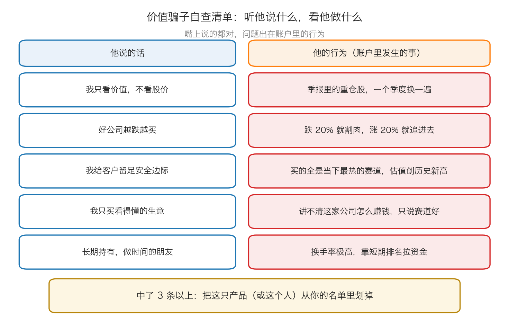

# 第 5 章：警惕价值骗子

> 本章你将：
> - 知道"价值投资者"这个称号可以被任何人自我认领，以及为什么会这样
> - 认识卡拉曼造的这个词：投资变色龙——嘴上说价值，手上追热点
> - 学会用"听他说什么，看他做什么"的对照法，十分钟识破一个假价值产品
> - 弄懂为什么这类人在上涨的市场里特别容易被当成高手
> - 亲手算一遍：一个"前五年很猛、第六年腰斩"的产品，长期到底输在哪里
> - 最后回答：面对任何推荐，你该先查哪三份文件

第 3 章和第 4 章给了你工具：怎么算安全边际、怎么面对下跌。
最后这一章讲一件很现实的事：**你手里的工具，别人也会拿来当招牌。**
卡拉曼在第六章的结尾专门写了一节，提醒读者提防"价值骗子"。

---

## 5.1 "价值"这个词，被用得最滥

卡拉曼开门见山：

> "各种各样的策略都冒用了价值投资之名。许多策略与最先由格雷厄姆所提出的投资哲学关系不大，或者根本毫无关系。"（p116）

他解释了这股风气的由来：20 世纪 80 年代中期，人们越来越注意到
一批真正的价值投资者取得了长期成功——他点名提到了巴菲特、
Mutual Series 基金公司的迈克尔·普莱斯、红杉基金公司的威廉姆·卢恩和理查德·卡尼夫等人。
名声带来了生意，生意带来了模仿者：

> "这些人所取得的成绩吸引了大量的'价值骗子'，即那些为了吸引资金而频繁调整策略的投资变色龙。"（p116）

**"投资变色龙"这个说法很准确。** 变色龙会根据环境改变自己的颜色；
投资变色龙会根据**当下什么好卖**，改变自己宣称的策略。
2021 年他说自己是"成长股猎手"，2022 年他改口叫"深度价值"，
2023 年他成了"高股息专家"。名字一直在变，唯一不变的是他需要你掏钱。

**生活类比：** 一家餐厅的招牌写着"祖传老汤，三十年不变"，
但你每次去，菜单上的菜全换了，连厨师都换了三批。
你不能说它违法——但你该知道，它卖的其实不是老汤，是**当季流行**。

---

## 5.2 他们具体做错了什么

卡拉曼列了四条，我们逐条翻译成人话（p116–p117）：

> "他们只会吹牛，破坏价值投资中的保守规则，使用了夸张的企业评估，对证券支付了过高的价格，且没有为他们的客户提供安全边际。"（p116–p117）

| 原书说的 | 翻成今天的样子 |
|---|---|
| 只会吹牛 | 路演、直播、专访里全是故事和金句，但拿不出一份可核对的估值过程 |
| 破坏保守规则 | 估值时只用最乐观的假设，把"可能"当成"一定" |
| 夸张的企业评估 | 动不动就说某公司"至少值现在的三倍"，但说不清依据 |
| 支付过高价格 | 买的时候不讲安全边际，追着热门标的抬价 |
| 没给客户安全边际 | 客户买在高位，一旦下跌没有任何缓冲 |

**注意这五条的共同点：它们都是"动作"层面的问题，而不是"观点"层面的问题。**
一个人可以真心觉得自己在做价值投资，同时每一笔买入都没有安全边际。
**这就是为什么本章的方法不是"听他怎么定义价值投资"，而是"看他的钱实际买了什么"。**

---

## 5.3 为什么他们短期看起来很成功

这是本章最反直觉、也最重要的一节。

> "尽管这些人行为轻率（或者正是由于他们的这种行为），他们能够在上涨的市场中取得不错的投资回报。"（p117）

为什么"轻率"反而能赚钱？因为在上涨的市场里，**敢出高价的人赚得最多**。
市场普涨时，那些买了最热门、最贵、最激进标的的人，账面回报往往最漂亮。
而真正的价值投资者因为拒绝追高，短期反而落后。

卡拉曼进一步解释了为什么很难揭穿他们：

> "很难在短期内证明一名过分乐观的投资者是错的，因为无法对价值给予精确的度量，还因为股票可以在很长一段时间内被高估。"（p117）

两个原因，都值得记住：

1. **价值没有精确答案。** 你说它值 20 元，他说值 40 元，
   短期内谁也证明不了谁对——因为价值本来就是范围，不是刻度（第 3 章）。
2. **高估可以持续很久。** 一只股票被高估之后，还可以更贵，
   持续几个月甚至几年。**"错"和"亏"之间，隔着一段可能很长的路。**

所以卡拉曼说了一句很无奈的话：

> "就一定程度而言，就像情人眼里出西施一样，事实上每种证券都可能成为某人严重的便宜货。"（p117）

紧接着他补了一句更讽刺的观察——在 80 年代末，
**真正的价值投资者反而不好过**：

> "因为拒绝购买那些价值骗子认为是便宜货，但实际上已经完全体现价值或者已经高估的证券，他们当中许多人表现都暂时落后于那些价值骗子。最保守的价值投资者实际上被人指责为'过于'谨慎，这些审慎的立场在1990 年被证明是非常有根据的。"（p117）

> 💡 **换个说法：** 短期里，"谨慎"看起来像"没本事"，
> 因为谨慎的代价（少赚的钱）是看得见的，而它避免的损失（还没发生）是看不见的。
> 这几乎是所有风险管理者的宿命——**直到那一天到来。**

---

## 5.4 那一天：1990 年

结局来了：

> "然而，当企业评估在1990 年恢复至历史水平的时候，多数价值骗子蒙受了巨大亏损。"（p117）

"企业评估恢复至历史水平"这句话需要翻译一下：**市场愿意给的估值倍数，
从泡沫时的高位回落到正常水平。** 那些靠"高估值"赚钱的人，在这一轮回落里被打回原形。
而他们的客户，是在最高位把钱交进来的。

卡拉曼还提醒读者，这不是一件过去了的事：

> "即使在今天，还有许多价值骗子没有褪去价值投资的伪装。"（p117）

---

## 5.5 一张自查清单

把这一节的内容做成一张可以随时用的表。**左边是他说的，右边是查得到的。**

逐条展开讲怎么查：

**第一条：他说"我只看价值，不看股价"——查他的持仓变了没有。**
公募基金每季度都会公布**季报**，里面会列出前十大重仓股。
把两个季度、四个季度的前十大重仓股对比一下：如果几乎全换了，
说明他的决策依据不太可能是"企业价值"（企业价值不会一个季度变一次）。

**第二条：他说"好公司越跌越买"——查他在下跌时做了什么。**
这一点从季报里能间接看出来：在市场大跌的季度，他是加仓了，还是减仓了？
如果他一边说"越跌越买"，一边在低位大幅降低仓位，那他在做的其实是追涨杀跌。

**第三条：他说"我给客户留足安全边际"——查他买的贵不贵。**
这一条要你自己动手：把他重仓股当前的市盈率、市净率，
和它自己过去几年的水平比一比。**如果说的是安全边际，
买的却是估值处在历史最高位的热门股，这两件事不可能同时为真。**

**第四条：他说"我只买看得懂的生意"——让他用三句话讲清那家公司怎么赚钱。**
如果他讲了三分钟还在说"赛道""空间""想象力"，而没有说清
"它卖什么、卖给谁、为什么别人抢不走它的生意"，那他就没看懂，或者不想让你看懂。

**第五条：他说"长期持有，做时间的朋友"——查换手率。**
换手率是衡量"一年里把持仓换了多少遍"的指标。
一只宣称长期持有的产品，如果换手率极高，那它做的其实是短线交易。
（换手率在基金的半年报、年报里能查到。）

> 📌 **划重点：** 这份清单的原理只有一条——**语言可以伪装，交易记录很难伪装。**
> 你不需要判断他的内心，你只需要核对他的话和账户里的行为是否一致。
> 中了三条以上，就把这个产品或这个人从你的名单里划掉，不必争论。

> 🇨🇳 **落到 A 股/港股：**
> - **查什么文件：** A 股公募基金的季报、半年报、年报（在基金公司官网或巨潮资讯网可查）；
>   私募产品的定期报告（如果你已经是持有人，你有权拿到）；
>   港股基金的月报/季报（在基金公司官网）。
> - **查什么字段：** 前十大重仓股、行业分布、换手率、规模变化、基金经理变更。
> - **一个特别有用的信号：** 基金经理变更 + 投资风格突然切换。
>   这往往意味着"变色龙"换了颜色，而不是策略进化了。
> - **另一类要警惕的：** 只讲故事的"大 V"和荐股群。
>   他们不必向你披露持仓，所以你永远无法核对他自己有没有买。
>   **无法核对的话，就当作广告听。**

---

## 5.6 严肃提醒：这不等于"怀疑一切"

写到这里要防一个副作用：**不要把"警惕价值骗子"变成"谁都不信"。**
卡拉曼反对的是**行为和说法不一致**，不是反对所有做得好的人。
真正该做的判断是这样的：

| 情况 | 怎么判断 |
|---|---|
| 一个人短期业绩好，也说得出估值依据 | 正常。继续观察，看他下跌时的表现 |
| 一个人短期业绩好，但完全说不清依据 | 警惕。他可能是运气好，也可能是骗子 |
| 一个人短期业绩差，但每一步都有依据、都留了安全边际 | 这可能是**正常**的价值投资者（p117 正是这么说的） |
| 一个人长期业绩好，但换手率极高、持仓一季一换 | 他可能很会交易，但他不是价值投资者——**别用价值投资的标准去理解他** |

最后一行尤其重要：**你不需要否定一个短线高手的能力，
你只需要知道"他做的不是价值投资"，然后决定这是不是你要的东西。**

---

## 5.7 结论：知易行难

第六章的最后一段，卡拉曼把整章收在了一句很朴素的话上（这句话从 p117 末行开始）：

> "价值投资知易行难。"（p117）

他接着说明"难"在哪里——不是难在技术：

> "价值投资者并不是超深奥的分析大师，并没有发明和使用复杂的电脑模型来找到吸引人的机会或者评估潜在价值。难就难在要遵守纪律，要有耐心和判断力。投资者需要遵守纪律以避免许多扔过来的毫无吸引力的投球，耐心等待合适的投球，并判断该在何时击球。"（p117–p118）

**这段话是整周的收束，请你把它抄在本子上。** 它说了三件事：

1. **不需要天才。** 你不需要复杂的模型，不需要比别人聪明。
2. **需要纪律。** 大部分时间你要做的是**拒绝**那些"看起来还行"的机会。
3. **需要耐心和判断力。** 判断力靠第 3 章那张安全边际表练；
   耐心靠第 2 章那场比赛练——那里没有裁判喊好球。

而这三点，恰好是骗子最不愿意做的事：拒绝会让他们没有业绩可讲，
等待会让他们没有故事可卖。**所以识别骗子其实有一条捷径：
看他是不是急着让你现在就买。**

---

## ✍️ 想一想

1. 一个产品的宣传语是"我们只买有价值的公司，长期持有"。
   你手上只有它的季报。请说出你会核对的三个具体字段，以及各自说明什么。
2. 为什么"缺乏精确的价值度量"这件事，既让价值投资者有机会，
   又让价值骗子有空间？这两件事怎么会是同一个原因造成的？
3. 有人说："既然短期无法证明乐观的人是错的，那我也可以先追热点赚一波。"
   请你用本章和上一章的内容，指出这个想法最大的风险在哪里。

> 💡 **参考思路：**
>
> 1. 可以核对：① **前十大重仓股**（连续两三个季度对比，看重仓是否一季一换）；
>    ② **换手率**（判断"长期持有"是真是假）；
>    ③ **重仓股的估值水平**（市盈率、市净率与它自身历史比，判断"安全边际"是真是假）。
>    这三个字段都是公开、可核对的，不需要听他怎么解释。
> 2. 因为"价值是一个范围、无法精确度量"，所以：一方面，
>    价格与价值之间会出现明显的差距，纪律严明的人可以抓住它（机会）；
>    另一方面，任何价格都能被说成"便宜"，短期无法证伪（骗子的空间）。
>    **同一个模糊性，对懂纪律的人是机会，对耍嘴皮的人是工具。**
> 3. 最大的风险是：你可能在一次下跌里被拿走很多年的成果（第 0 章的不对称），
>    而且你不知道自己赚的那一波里，有多少是靠运气。
>    更现实的是：**当你用"追热点"的方式赚到钱以后，
>    你很难在下一轮真的退出来**——第 4 章的雷管股票，跌起来是不打招呼的。
>    如果一定要参与，至少要清楚自己是在做交易而不是投资，
>    并且用能承受亏损的钱、控制单笔仓位。

---

## 🧮 算一算

### 第一题：一个"前五年很猛、第六年腰斩"的产品

**情境（简化示意数字）：**
产品 A 由一位"明星价值基金经理"管理：前 5 年每年 +25%，第 6 年 -50%。
产品 B 稳稳当当：连续 6 年每年 +10%。起点都是 100 万元。

**第 1 步：算产品 A 前 5 年的净值。**

一年一年往后乘：

| 年 | 计算 | 净值 |
|---|---|---|
| 第 1 年 | 100 万 乘以 1.25 | 125.0 万 |
| 第 2 年 | 125.0 万 乘以 1.25 | 156.3 万 |
| 第 3 年 | 156.3 万 乘以 1.25 | 195.4 万 |
| 第 4 年 | 195.4 万 乘以 1.25 | 244.3 万 |
| 第 5 年 | 244.3 万 乘以 1.25 | **305.4 万** |

（精确地说：1.25 连乘 5 次 = 3.0518，所以是 305.2 万左右；
上面每一步都做了四舍五入，所以最后取 **约 305 万**。）

**第 2 步：算第 6 年腰斩之后。**

`305 万 乘以 0.5 = 152.5 万`

**6 年下来，产品 A 从 100 万变成约 152.5 万，累计 +52.5%。**

**第 3 步：算产品 B 6 年的结果。**

`1.1 连乘 6 次 = 1.7716`

`100 万 乘以 1.7716 = 约 177.2 万`，累计 **+77.2%**。

**第 4 步：比较。**

| | 前 5 年每年 | 第 6 年 | 6 年后 | 累计收益 |
|---|---|---|---|---|
| 产品 A | +25% | -50% | 约 152.5 万 | +52.5% |
| 产品 B | +10% | +10% | 约 177.2 万 | +77.2% |

**A 在前 5 年每一年都比 B 风光，6 年下来却少赚了约 24.7 个百分点。**

换成"每年平均赚多少"来看：A 的 6 年折算下来大约是每年 7% 左右
（试算校验：`1.07 连乘 6 次 约等于 1.50`，接近 152.5 ÷ 100 = 1.525），
而 B 是稳稳的 10%。

**这，就是"价值骗子"最容易骗人的地方：他前面几年的成绩单是真的，
但那个成绩单是靠承担你并不知道的风险换来的。**

### 第二题：费用吃掉多少（承接 Week 4 的"谁在赚你的钱"）

**情境（简化示意数字）：** 某产品的收费是：管理费每年 2%（按资产规模收），
业绩提成 20%（按扣掉管理费之后的收益收）。你的毛收益是每年 10%。

**第 1 步：扣管理费。**

`10% - 2% = 8%`

**第 2 步：算业绩提成。**

`8% 乘以 20% = 1.6%`

**第 3 步：算你真正拿到的。**

`8% - 1.6% = 6.4%`

**第 4 步：算 10 年后的差距。** 起点 100 万。

- 你的实际收益（每年 6.4%）：`1.064 连乘 10 次 约等于 1.86` → **约 186 万**
- 如果毛收益全部归你（每年 10%）：`1.1 连乘 10 次 = 2.5937` → **约 259.4 万**
- 差额：`259.4 - 186 = 约 73.4 万`

**第 5 步：算你付出了多少比例。**

费用的总影响是 `10% - 6.4% = 3.6%` 的毛收益，
`3.6 ÷ 10 = 36%`。

**你承担了全部的市场风险，却把毛收益的约三分之一交给了别人。**
这不是说收费一定不合理（好的管理值这个价），而是说：
**在决定把钱交给谁之前，你一定要把费用算出来，再看他的策略值不值这个价。**

> ⚠️ **易踩坑：** 费用是**确定会发生**的，收益是**不确定**的。
> 一年 2% 的管理费，在牛市里感觉不到；在十年不涨的市场里，
> 它会实实在在地吃掉你 20% 左右的本金（`1.02 连乘 10 次 约等于 1.22`，
> 意思是十年后同样的资产要收走约 18%）。

---

## ✅ 小测验

**1. 卡拉曼说的"价值骗子"，最主要的特征是什么？**
A. 不懂财务报表
B. 为了吸引资金而频繁调整策略，嘴上说价值投资、手上追涨杀跌
C. 收费特别高
D. 只做大公司的股票

**2. 为什么价值骗子在上涨的市场里容易被当成高手？**
A. 因为他们有内部消息
B. 因为价值无法精确度量、股票可以被长期高估，所以短期内很难证明他们错了
C. 因为他们从不亏钱
D. 因为他们的收费低

**3. 用本章的自查清单识别一个"价值产品"，最有效的一步是？**
A. 听他在路演里怎么定义价值投资
B. 看他的学历和从业年限
C. 核对他的话和可查的行为记录（重仓股变不变、换手率高不高、买的贵不贵）
D. 看他的办公室在不在金融街

> **答案与解析**
>
> **1. B。** p116 的原话是"那些为了吸引资金而频繁调整策略的投资变色龙"，
> 并且 p116–p117 指出他们"破坏价值投资中的保守规则""没有为他们的客户提供安全边际"。
> A 不一定（很多骗子很懂报表，只是选择性使用）；C 不是定义特征；
> D 恰好相反，他们往往追逐最热的标的。
>
> **2. B。** p117 的解释就是这两条：无法对价值给予精确的度量；
> 股票可以在很长一段时间内被高估。A 是阴谋论；C 明显不对
> （p117 明确说他们后来蒙受了巨大亏损）；D 与问题无关。
>
> **3. C。** 本章的核心方法就是"语言可以伪装，交易记录很难伪装"。
> A 正是骗子最擅长的环节；B、D 与投资能力没有必然关系。

---

## 📖 回到原书

- 对应原书 **第六章结尾**，`raw/安全边际-中文版/page_116.md` ~ `page_118.md`（原书 p116–p118）。
- **建议精读：** p116–p117（价值骗子是谁、他们做错了什么、为什么短期看不出来）、
  p117（1990 年的结局）、p118（"价值投资知易行难"那段收束）。
- **可以略读：** p116 里那一长串美国基金经理的名字，
  知道"这些人因为长期业绩好而出名，也因此引来了模仿者"就够了。
- **原书金句（逐字引用）：**
  > "各种各样的策略都冒用了价值投资之名。许多策略与最先由格雷厄姆所提出的投资哲学关系不大，或者根本毫无关系。"（p116）
  > "然而，当企业评估在1990 年恢复至历史水平的时候，多数价值骗子蒙受了巨大亏损。"（p117）
  > "价值投资知易行难。"（p117）

---

## 🧭 本周收束

这一周我们走完了全书最重要的一程：

| 章 | 一句话记住它 |
|---|---|
| 第 0 章 | 先想亏，再想赚；一次大亏会拿走你未来好几年的成果 |
| 第 1 章 | 你的回报来自三处：企业赚钱（可靠）、倍数变化（不可靠）、折价收敛（要耐心） |
| 第 2 章 | 没有裁判喊好球，你可以一直不挥棒；而且价值本身会动，折扣要留厚 |
| 第 3 章 | **安全边际 = 保守估算的价值 - 买入价**；价格越高，它越小，高到某个价位就不存在 |
| 第 4 章 | 下跌让折价变厚；但在加仓之前，先重算价值 |
| 第 5 章 | 看行为，不看说法；急着让你现在买的，多半有问题 |

下一周（Week 8）我们进入第七章：**价值投资哲学的起源**——
看看这套方法是从哪里来的，它为什么强调"自下而上"、
为什么用"绝对表现"而不是"跑赢指数"来衡量自己，
以及一个被讲错了很多年的问题：**风险和回报到底是什么关系。**
