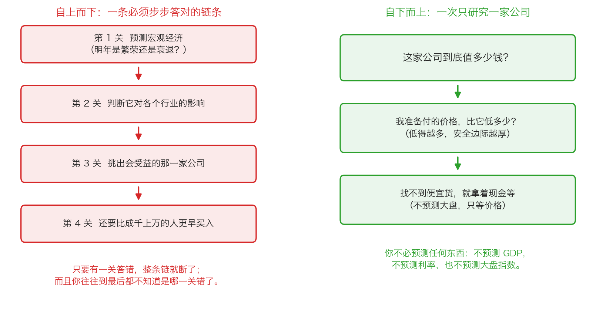

# 第 0 章：自下而上——从一家公司看世界

> 本章你将：
> - 分清"自上而下"和"自下而上"这两种投资思路，并说出它们各自要预测什么
> - 知道"预测宏观经济"这条路为什么对普通人格外危险：它要求你连续答对四道题，还要比别人快
> - 学会把一家公司当作研究的起点，问出卡拉曼给出的那三个问题
> - 明白"找不到便宜货就持有现金"不是消极，而是纪律的一部分
> - 知道为什么"我付的价格"是唯一你能完全控制的东西——这对你的钱包意味着什么

上周我们讲完了安全边际：**买入价与保守估算的价值之间的那段距离，就是你为自己估错留下的容错空间。**
但还有一个问题没解决：这个"估算价值"的活儿，该从哪儿下手？
从今天的经济新闻开始，还是从一家具体的公司开始？这一章就是回答这个问题的。

---

## 0.1 先看两种买菜的方法

假设你要做一顿晚饭，有两个人给你出主意。

第一个人说："先别看菜，先看天气。今年夏天要是雨水多，叶菜就会贵；如果南方发大水，
瓜果运输会受影响；再往后看，中秋节前猪肉一定会涨。所以，你现在应该去买——"

第二个人说："先去菜市场转一圈。哪个摊位的菜又新鲜又便宜，就买哪个。"

第一个人用的是**自上而下**：先判断大环境，再一层层往下推，最后落到具体的菜。
第二个人用的是**自下而上**：不管大环境，一个一个摊位看，看到划算的就买。

投资世界里也正好有这两派。

- **自上而下**（也叫从上往下）：先预测宏观经济，再判断哪些行业受益，最后挑公司、挑时机。
- **自下而上**（也叫自下往上）：不看大环境，一家公司一家公司地研究，看到价格明显低于价值的就买。

> 💡 **换个说法：** 自上而下的人先问"明年是牛市还是熊市"；自下而上的人先问
> "这家公司值 10 元，现在卖 6 元，为什么？"

卡拉曼在《安全边际》里说得很直接：**价值投资是自下而上的策略**。

> "价值投资哲学有三个要素：一、价值投资是自下往上的策略，使用这种方法可以分辨出特定的被低估的投资机会。二、价值投资追求的是绝对表现，而不是相对表现。三、价值投资是一种风险规避方法，对会出现哪些错误（风险）和哪些会进展顺利（回报）给予同等关注。"（p119）

这一周的后五章，讲的就是这三条里的后两条。这一章先讲第一条。

---

## 0.2 自上而下：一条必须连过四关的链条

我们先认真地、公平地把"自上而下"讲清楚——因为大多数人（包括很多专业机构）
其实都在用它，而你如果不明白它难在哪里，就很容易被它听起来的样子骗到。

卡拉曼在书里举了一个例子：假设你认为世界正在进入一个前所未有的和平与稳定期。
这听起来像个好消息，但一名自上而下的投资者要把它变成一笔赚钱的买卖，必须连续答对四关：

**第 1 关：预测宏观。** 上面那个例子里，你得先判断"世界是不是真的更和平稳定了"。

**第 2 关：把宏观结论翻译成对某个领域的影响。** 比如按书里的说法，
你得判断德国统一对德国的利率、对德国马克是利多还是利空。

**第 3 关：从领域落到具体的证券。** 比如据此买入德国 10 年期政府债券，
或者买入可口可乐公司的股票。

**第 4 关：还要比别人早。** 卡拉曼的原话是：至关重要的是不仅要快，而且要准确，
"否则其他人可能会捷足先登，通过买入和卖出使价格反映出预期中的宏观经济变化，
从而消灭了后来者的盈利潜能。"（p119）

> 📌 **划重点：** 自上而下的难点不在"预测得准不准"，而在**它是一条链条**。
> 只要有一环错了，整条链就断了；而且到最后你往往不知道是哪一环错了。
> 更麻烦的是第 4 关：**你不但要判断对，还要比成千上万个同样聪明的人判断得更早。**

用大白话说：这是一个"比谁更聪明、比谁更快"的游戏。卡拉曼在书里甚至怀疑，
这到底算不算投资——因为它可能是一种"博傻游戏"，只有当有人愿意出更高的价格时你才会赢。

---

## 0.3 为什么自上而下没有安全边际

这是本章最重要的一段推理，请慢一点读。

安全边际是什么？是**你付的价格，比你估算的价值低出来的那一截**。
它的前提是：你手里有一个"价值"。而自上而下最大的问题是：**它不产生价值，只产生预期。**

> "自上往下投资法中没有安全边际。使用这种方法的投资者并不以价值为购买依据，
> 而是根据一种概念、主题或者趋势来购买。他们的支付价格没有明确的限制，
> 因为价值并不是他们做出购买决定时考虑的内容。"（p120）

这句话的杀伤力非常强。请体会一下"支付价格没有明确的限制"是什么意思：
如果你买一只股票的理由是"利率要降了，券商股会涨"，那么当这只股票从 10 元涨到 20 元时，
你的买入理由**依然成立**——利率还是要降，主题还是那个主题。
你没有任何依据说"20 元太贵了"，因为你从来没有算过它值多少钱。

这就好比你去买一台冰箱，你的理由是"今年夏天会很热"。售货员说这台冰箱 8000 元，
你说"太贵了，我在网上看到同款 3000 元"——你之所以能砍价，是因为你知道它值多少。
而如果你只带着"今年夏天会很热"这个理由走进店里，你凭什么说 8000 元贵？

还有一个更隐蔽的难题。卡拉曼写道：自上而下方法面临的另外一个难题，
就是评估**有多少预期已经体现在了企业当前的股价中**。书里举了一个例子（p120）：
如果你预计某家公司每年增长 10%，并据此买入，但市场上的价格**已经**反映了
投资者对它增长 15% 的预期——那么即使你的预测完全正确（它真的增长了 10%），
你也可能亏钱，因为实际结果低于市场已经付过钱的那个预期。

> ⚠️ **易踩坑：** "我判断对了，但我还是亏了"——这不是运气差，这是自上而下方法的**结构性缺陷**。
> 你的判断必须同时超过"事实"和"别人已经付钱买下的那个事实"。

> 🇨🇳 **落到 A 股/港股：** 你每天在手机上刷到的那些内容——
> "央行降准，利好银行地产"、"明年是消费复苏年"、"新能源渗透率还要翻倍"——
> 都是典型的自上而下语言。它们未必是错的，但它们**没有告诉你该用什么价格买**。
> 一只股票可以在主题完全正确的情况下，让你亏掉一半的钱：你在 60 倍市盈率时买进去，
> 主题兑现了，市盈率回到 15 倍，股价照样腰斩。这就是我们 Week 2 讲过的
> "估值倍数"这一层在杀人。

---

## 0.4 自下而上：一次只回答一家公司的问题

现在换一条路。

> "相反，价值投资使用自下往上的策略，通过这种方法，投资者每次对一个单独的投资机会进行基本面分析。价值投资者一个接一个地寻找便宜的证券，并根据实际情况分析每个证券的基本面情况。"（p120）

这里第一次**正式给"基本面分析"下定义**：

- **生活类比**：你要不要跟一个朋友合伙开奶茶店？你会看什么？
  看他这个人靠不靠谱、店面租金多少、一天能卖几杯、原料成本多少、隔壁还有几家奶茶店。
  你**不会**去看"奶茶店概念股最近涨得好不好"。
- **准确一点说**：基本面分析就是研究一家公司**生意本身**——
  它靠什么赚钱、一年赚多少、欠了多少钱、竞争对手能不能抢走它的客人，
  然后据此估算它大概值多少钱。
- **A 股/港股 表达**：上市公司的年报、季报（在巨潮资讯网或港交所披露易可以下载），
  就是基本面分析最主要的原料。看走势图、看概念、看资金流向，都不是基本面分析。

自下而上的投资者，面对一家公司时只问几个问题。卡拉曼把这些问题列了出来（p121）：

1. 这家企业的潜在价值有多少？
2. 这种潜在价值能不能持续到股东真正从中获利？
3. 价格与价值之间的缺口缩小的可能性有多大？
4. 以当前的市场价格看，潜在的风险和回报是什么？

注意，这四个问题里**一个关于宏观经济的都没有**。它们全部围绕"这一家公司"。

也正因为这样，卡拉曼给出了全书最著名的一句话之一：

> "这一策略可以被精确地描述成“买入便宜货，然后等着”。"（p121）

> 💡 **换个说法：** 自上而下是"我先猜天气，再决定带不带伞"；
> 自下而上是"我只看今天的云，但我会等一个雨伞打五折的日子再买伞"。

---

## 0.5 为什么"更简单"反而更难

卡拉曼说了一句听起来有点反常识的话：**自下而上在许多方面比自上而下更简单**
（p121）。他的理由是：自上而下的投资者必须连续作出几个准确的预测，
而自下而上的投资者"对企业没有作出任何预测"。

这句话要理解准确：不是说不预测公司未来，而是说**你不需要预测未来会发生什么大事件**。
你要做的是估一个数（这家公司值多少），然后跟当前价格比较。这两件事的性质完全不同：

| | 自上而下要回答的 | 自下而上要回答的 |
|---|---|---|
| 问题的形式 | "明年会发生什么？" | "它现在值多少？" |
| 答案从哪来 | 预测（还没发生的事） | 计算（已经存在的账） |
| 对不对什么时候知道 | 很久以后 | 现在就能算 |
| 错了怎么办 | 很难发现，也很难承认 | 可以重新算一遍，对不上就卖掉 |

但"更简单"不等于"更容易做到"。自下而上真正的门槛是两个词：**耐心**和**纪律**。

> "投资者必须学会评估价值以在看到时知道遇到了便宜货。然后他们必须要有耐心，
> 并遵守纪律，直至等到便宜货的出现，并买入，而不去考虑市场当前的走向或者自己对宏观经济的看法。"（p121）

这里要接上 Week 7 我们讲过的一个比喻：投资像打棒球，但**没有裁判喊好球**。
球没到你觉得舒服的位置，你完全可以一直不挥棒。自下而上之所以能用，
正是因为你有"不挥棒"的权利——而这件事，恰恰是绝大多数机构做不到的（Week 5 讲过原因：
它们有排名压力，不敢空仓）。

---

## 0.6 一个不那么明显的结果：什么时候该拿着现金

上面那段话推下去，会得出一个非常具体的结论。卡拉曼是这么说的：

> "自下往上和自上往下这两种策略之间一个重要但并不明显的区别就是，为什么有时需要持有现金。
> 当无法找到诱人的投资机会时，采用自下往上的投资者会持有现金，当这样的投资机会出现时，
> 他们就会动用这些资金。只有当可以组建拥有诱人投资机会的多样化投资组合时，
> 采用自下往上法的投资者才会满仓投资。"（p121）

请注意这句话里的因果关系，它和绝大多数人的直觉是反的：

- **自上而下的人持有现金，是因为他预测市场要跌**（这叫"判断市场的时间"，也就是择时）。
  他的现金是**预测的产物**。
- **自下而上的人持有现金，是因为他没找到便宜货**。他的现金是**筛选的产物**——
  跟明天大盘涨跌毫无关系。

这两种现金看起来一样（都在账户里趴着），但性质完全不同。第一种现金的持有者，
一旦大盘涨了两周，就会开始怀疑自己、然后追进去；第二种现金的持有者，
只有看到一个价格明显低于价值的标的时才会动手。

> 📌 **划重点：** 现金在价值投资里不是"空仓等跌"，而是**没有好球可打时的一种正常状态**。
> 这个问题第 1 章还会接着讲（绝对表现者为什么敢拿现金），第 5 章会讲它的另一半好处
> （现金让你在市场下跌时有机会成本上的优势）。

---

## 0.7 另一个结果：你知道自己在赌什么

自下而上还有一个很实在的好处：**你能说清楚自己为什么买。** 这一点在赚钱时没啥感觉，
在亏钱时价值千金。

卡拉曼的推理是这样的（p121–p122）：自下而上的投资者面对的不确定因素有限——
这家企业值多少、这个价值能不能持续、价格与价值的缺口会不会缩小、当前价格下的风险和回报。
这些都是一次性想清楚的问题。

而自上而下的投资者很难知道"我的赌注什么时候失效了"。
书里给了一个非常具体的追问（p122）：如果你是根据"利率会下跌"的判断而投资的，
而实际上利率上升了，你如何、以及何时才会断定自己错了？

**对一个自下而上的投资者，"我错了吗"是一道可以重算的算术题**：
如果这家公司的价值是 10 元，你 6 元买的，现在价格 7 元、公司价值还是 10 元，
你的理由完全没变；如果发现公司的价值其实只有 5 元（比如大客户跑了），
那你的理由就没了，该卖。

这里有一句很漂亮的话，值得抄在笔记本上：

> "因继续持有那些丧失了持有理由的证券，投资者已经蒙受了巨大的损失。"（p122）

> 🇨🇳 **落到 A 股/港股：** 很多人被套牢之后的心理活动是"等回本我就卖"。
> 注意这句话里没有出现任何关于公司的信息——只有价格。这就是典型的自上而下思维残留：
> 买入理由是"它会涨"，所以卖出理由也只能是"它涨回来了"。
> 自下而上的做法是每个月问自己一次：**当初买它的理由（价格低于价值）现在还在吗？**

---

## 0.8 那你还要不要看新闻？

要，但要知道它在你的决策里排第几。

卡拉曼并没有说宏观永远不重要：

> "只有在影响到对证券的评估时，才会考虑使用自上往下的方法。"（p120–p121）

这句话的意思是：宏观信息是**估值的输入之一**，而不是**买卖的触发器**。
举例说：

- "央行降息"这条新闻，对一家高负债公司的价值可能有实质影响（它的利息支出会变少），
  那么你在估算它值多少钱时，要把这个因素算进去。这是**输入**。
- 但如果你的动作是"因为降息了，所以买入"，而没有算过它值多少、现在贵不贵，
  那就是把新闻当成了**触发器**——这是自上而下。

> ⚠️ **易踩坑：** 新闻本身不害人，"因为新闻而买"才害人。
> 检验方法很简单：**你能不能说出这只股票大概值多少钱？**
> 说不出来，那这笔买入的理由就是"它要涨"，而不是"它便宜"。

---

## ✍️ 想一想

1. 你身边有没有人（或者你自己）买过一样东西，理由是"它会涨"而不是"它值这个价"？
   把它换成股票，你觉得结果会有什么不同？
2. 卡拉曼说自上而下要"快而且要准确"。假设你在一家公司的年报里发现了一个别人没注意到的细节，
   你花了两周才想明白。这两周的时间，对你来说是优势还是劣势？为什么？
3. 如果明天有一位你很信任的经济学家告诉你"未来三年都是熊市"，
   按这一章讲的两种方法，你分别会做出什么动作？哪一个动作更依赖"他说的对不对"？

> 💡 **参考思路：**
> 1. 常见的例子是抢购限量球鞋、纪念币、某些"理财产品"。这类交易的共同点是：
>    你赚钱的唯一可能是**有下一个人愿意出更高的价**。它和"这家公司每年稳定赚钱、
>    你还能拿到分红"是两回事。把它换成股票，区别就体现在：一旦没人接盘，
>    价格会一直往下掉，直到跌到"它本身值多少"为止——而那时候你才发现，
>    原来它本身不值那么多。
> 2. 对自上而下的人来说，两周是**劣势**：别人已经把价格买上去了，你的"信息优势"没了。
>    对自下而上的人来说，两周是**优势**：如果这家公司真的值 10 元、现在卖 6 元，
>    那么再过两周它大概率还是 6 元附近，你有的是时间继续算、慢慢买。
>    **需要抢的便宜货，通常不是真的便宜。** 这句话可以当作一条实用的经验。
> 3. 自上而下的人会因为这句话调整仓位：提前卖出、持有现金等待。
>    这个动作的成败**完全取决于那位经济学家对不对**——而这件事你无法验证，
>    也没法在错的时候及时发现。自下而上的人的动作是：翻一遍自己关心的公司，
>    看看有没有谁的价格已经跌到明显低于价值。如果都没有，他本来就拿着现金；
>    如果有，他就买。**注意：他的动作不依赖"熊市预言"是否正确。**

---

## 🧮 算一算

> 下面用的是**简化示意数字**，目的是让你看清"链条"的结构，不是真实预测。

### 情境

一位自上而下的分析师向你推荐一只股票，他的推理是一条四环链条，
而且他每一步都很有把握——**每一步大约有七成把握**（这是示意，不是统计）。四步是：

1. 明年经济比今年好（把握七成）；
2. 经济好，消费行业最受益（把握七成）；
3. 消费行业里，甲公司最受益（把握七成）；
4. 别人还没反应过来，你能在低位买入（把握七成）。

### 问题一：四步全对的机会有多大？

**第 1 步：把"七成"写成小数。** 七成就是 0.7。

**第 2 步：算前两步同时成立。** 两件事都要发生，就把两个小数相乘：

$$0.7 \times 0.7 = 0.49$$

也就是说，前两关都过的机会是 **49%（不到一半）**。

**第 3 步：再乘第三步。** $0.49 \times 0.7 = 0.343$，即 **34.3%**。

**第 4 步：再乘第四步。** $0.343 \times 0.7 = 0.2401$，即 **约 24%**。

**结论：四步里每一步都有七成把握，连起来只剩不到四分之一。**
（如果你把每一步的把握提高到八成：$0.8 \times 0.8 \times 0.8 \times 0.8 = 0.4096$，
也只有约 41%。）

这就是"链条"的性质：**每一环的把握是相乘的，不是相加的。**
四环链条听起来比单点研究"更全面"，但它的成功率是四个数字的乘积。

### 问题二：第四关没赶上，会怎样？

假设你前三个判断**全部正确**。甲公司现在 10 元，你算过它值 12 元，
所以你觉得有得赚。但是你晚了一个月，价格已经先涨了 25%。

**第 1 步：算你实际付出的价格。**

$$10 \times (1 + 25\%) = 10 \times 1.25 = 12.5 \text{ 元}$$

**第 2 步：跟你算出来的价值比较。** 价值 12 元，你花 12.5 元买——贵了：

$$12.5 - 12 = 0.5 \text{ 元}$$

**第 3 步：算贵了多少（百分比）。**

$$0.5 \div 12 \approx 4.2\%$$

**结论：你判断对了三件事，最终仍然亏了大约 4%。**
这就是"支付价格没有明确的限制"的真实后果——你必须**同时**赢过事实和别人已经付出的价格。

### 问题三：那自下而上要算的是什么？

自下而上的投资者不算概率链，他只做一道减法：

$$\text{安全边际} = \text{保守估算的价值} - \text{买入价}$$

还是甲公司。假设你保守估算它值 10 元（比"乐观"的 12 元更保守），
你给自己要求的折扣是四成：

**第 1 步：算打六折的买价。** $10 \times (1 - 40\%) = 10 \times 0.6 = 6$ 元。

**第 2 步：等待。** 如果价格一直在 8 元，你就不买——这就是"买入便宜货，然后等着"。

**第 3 步：如果价格跌到 6 元以下，买入。** 此时即使你的估值高估了 30%
（真实价值只有 7 元），你 6 元买入依然没亏。

> 📌 **划重点：** 这两个算法的差别，不是"哪个更准"，而是**风险由谁承担**。
> 链条式判断把风险交给了"未来会不会按我说的发生"；
> 安全边际把风险交给了"我算错了多少还能不亏"——后者你能控制，前者你不能。

---

## ✅ 小测验

**1. 关于"自上而下"的方法，下面哪一句最准确？**
A. 只要预测对了宏观经济，赚钱是必然的
B. 它需要连续答对好几道题，而且因为它不看价值，支付价格没有明确的上限
C. 它比自下而上更安全，因为先看清了大方向
D. 它不需要关心别人怎么想、怎么做

**2. 卡拉曼说自下而上的策略可以被精确地描述成一句话。是哪一句？**
A. 低买高卖，见好就收
B. 买入便宜货，然后等着
C. 顺势而为，及时止盈
D. 分散投资，长期持有

**3. 一位自下而上的投资者手里有一笔钱，但他翻遍了自己能看懂的公司，
没有一家的价格明显低于他估算的价值。他应该怎么做？**
A. 先买点指数基金，避免踏空
B. 挑一家"看起来还不错"的公司买入，总比空着好
C. 持有现金，继续等
D. 等大盘跌 10% 之后再买

> **答案与解析**
>
> **1. B。** 自上而下的真正难点是"链条"——四个环节相乘，每一步都可能出错，
> 而且它不以价值为购买依据，所以价格涨到多高都不影响买入理由（p120）。
> A 错在把"预测对"等于"赚到钱"：书里的 10% 与 15% 的例子说明，
> 你的判断还得超过市场已经付过钱的预期。C 错在方向：先看清大方向不等于更安全，
> 相反它把风险集中到了一个你无法控制的变量上。D 错在自上而下恰恰是"比谁更聪明、
> 比谁更快"的游戏，它极度依赖对别人的判断。
>
> **2. B。** 原话见 p121。A 和 C 都含有"卖出时机"的暗示，
> 但价值投资的核心动作不是择时，而是等待价格低于价值才动手；
> D 是常见的理财口号，卡拉曼从没这么描述价值投资——对他而言，
> 多样化是控制风险的手段，不是策略本身。
>
> **3. C。** 这是自下而上与自上而下在"现金"上最明显的差别：
> 前者的现金是筛选的结果（没便宜货），后者的现金是预测的结果（猜要跌）。
> 选 A 或 B 的人，其实是在用"不能空着"的情绪做决定；
> 选 D 的人做的是择时——那正是卡拉曼说自下而上的投资者**不会做**的事。

---

## 📖 回到原书

- 对应原书 **第七章**「价值投资哲学起源」，`raw/安全边际-中文版/page_119.md` ~ `page_122.md`，即原书 p119–p122。
- 建议精读 p119–p122：价值投资哲学的三个要素、自上而下与自下而上的对比、
  "买入便宜货，然后等着"、以及"为什么有时需要持有现金"这一段。
- 可以略读 p119–p120 里关于德国统一、德国马克、可口可乐的那段具体举例——
  那是 1990 年代初的时代背景（两德统一发生在 1990 年），知道"这是一个宏观预测的链条"就够了。
- 原书金句（逐字引用）：

### 金句一：三个要素

> "价值投资哲学有三个要素：一、价值投资是自下往上的策略，使用这种方法可以分辨出特定的被低估的投资机会。二、价值投资追求的是绝对表现，而不是相对表现。三、价值投资是一种风险规避方法，对会出现哪些错误（风险）和哪些会进展顺利（回报）给予同等关注。"（p119）

这三句话就是整个 Week 8 的目录：本章讲第一条，第 1 章讲第二条，第 2 到第 5 章讲第三条。
注意第三条的措辞：**对风险和回报给予同等关注**。多数人只算能赚多少，
不算可能亏多少——这正是本周后面四章要反复回到的地方。

### 金句二：自下而上的全部动作

> "这一策略可以被精确地描述成“买入便宜货，然后等着”。"（p121）

如果你这一章只记住一句话，就记这一句。它包含了三个动作：
**评估价值**（才知道什么是便宜货）、**要求折扣**（这就是安全边际）、**等待**（不预测、不着急）。
三个动作里，普通人最容易做到的是"等待"，最难做到的是"评估价值"——
这正是 Week 9 要用一整周来讲企业评估的原因。

### 金句三：什么情况下才卖

> "因继续持有那些丧失了持有理由的证券，投资者已经蒙受了巨大的损失。"（p122）

这句话给了一个可以立刻用上的自查方法：**你能不能说出当初买它的理由？
那个理由现在还在吗？** 说不出来、或者理由已经没了，价格涨没涨回来都不该影响你的决定。

---

> 下一章我们接着讲三要素里的第二条：**为什么价值投资者只看绝对表现，
> 而不跟指数比**。你会看到一个具体的数字例子：一个人连续两年"跑赢指数"，
> 两年后却比指数少赚了 5 个多百分点。
