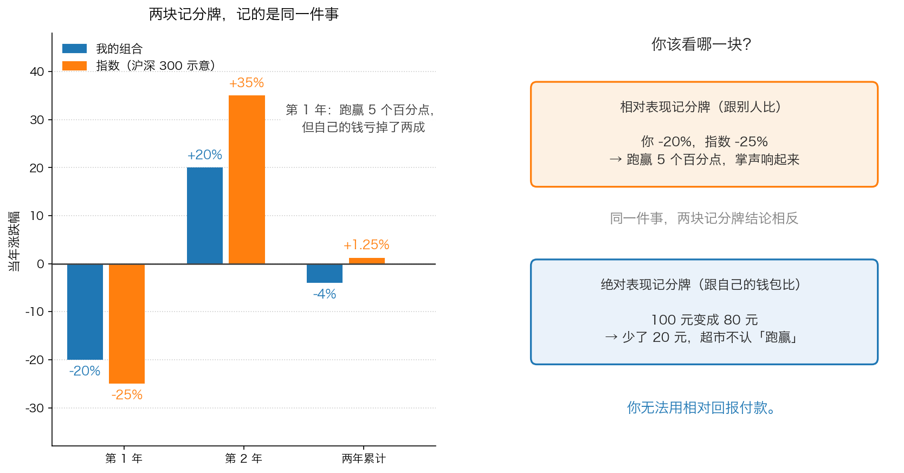

# 第 1 章：绝对表现——不要跟指数比

> 本章你将：
> - 分清"相对表现"和"绝对表现"这两块记分牌，并知道它们分别记的是什么
> - 搞懂什么叫"业绩比较基准"，以及指数到底是个什么东西
> - 亲手算一遍"两年都跑赢指数、两年后却比指数少赚了 5 个多百分点"是怎么发生的
> - 明白为什么机构"不得不"看相对表现，而你可以不看
> - 知道为什么绝对表现者敢拿着现金不买——以及现金真正的敌人是谁（这对你的钱包意味着什么）

上一章我们讲了价值投资的第一根柱子：**自下而上**，一家公司一家公司地看，
看到价格明显低于价值才动手。这一章讲第二根柱子：**你拿什么尺子量自己的成绩。**
尺子选错了，你会在一路亏钱的时候觉得自己很成功。

---

## 1.1 两块记分牌

先做一个思想实验。

假设你孩子这次考试考了 60 分（满分 100）。你会怎么评价？

- 如果全班平均分是 40 分，60 分是**全班第一**——老师说"考得不错"。
- 如果全班平均分是 90 分，60 分是**倒数几名**——老师说"要加油"。
- 但如果这是驾照科目一考试，及格线是 90 分——全班第几都无所谓，**你就是没过**。

第三种情况才是关键：**有些成绩是跟别人比的，有些成绩是有绝对标准的。**
而投资这件事，同时存在这两种标准，而且它们会给出**完全相反**的结论。

这就是"两块记分牌"：

| | 相对表现 | 绝对表现 |
|---|---|---|
| 跟谁比 | 指数、其他投资者、同类型基金 | 你自己的目标（我的钱有没有变多） |
| 记分方式 | 差了几个百分点、排第几名 | 100 元变成了多少钱 |
| 好消息长什么样 | "我亏了 20%，但别人亏 25%" | "我的钱变多了" |
| 适合谁 | 替别人管钱、需要定期交成绩单的人 | 替自己管钱的人 |

**相对表现**，就是"跟别人比出来的成绩"。这个"别人"在投资里通常是一个指数，
比如沪深 300、恒生指数。

**绝对表现**，就是"只跟自己比"：我投进去的钱，最后变成了多少。

> 💡 **换个说法：** 相对表现像运动会里的名次，绝对表现像体检报告上的指标。
> 你可以在运动会里拿第三名，同时体检报告一塌糊涂；也可以体检全优，同时比赛垫底。
> **问题在于：你到底想赢比赛，还是想健康？**

卡拉曼的观点没有任何含糊：

> "多数机构投资者和许多个人投资者已经采用了追求相对表现的定位（在第三章中已经有过讨论）。他们的目标是取得较市场、其他投资者或者较这两者都要好的表现，他们不关心是否取得了绝对正回报还是负回报。"（p122）

请特别注意最后半句：**他们不关心是否取得了绝对正回报还是负回报。**
这句话第一次读到会觉得很荒谬——做投资的人怎么会不关心自己赚不赚钱？
但在"相对表现"的世界里，这完全说得通：只要比别人亏得少，你就是赢家。

而卡拉曼紧接着给出了他反对的理由，一句话就把整件事说透了：

> "对多数投资者而言，绝对回报是他们唯一关心的事情，毕竟你无法从相对回报中获得实际的消费能力。"（p123）

**你无法从相对回报中获得实际的消费能力。** 这句话值得抄在本子上。
你跟隔壁老王比，你少亏了 5 个百分点——但超市不会因为你"跑赢"就少收你 5% 的钱。

---

## 1.2 什么叫"基准"：那把量你的尺子

要理解相对表现，得先认识一个新词：**业绩比较基准**（也常被叫做"基准"）。

- **生活类比**：你去体检，报告上除了你的身高体重，还会写"同龄人平均值"。
  这个平均值就是基准。它不决定你健不健康，它只是给你一个参照。
- **准确一点说**：业绩比较基准是衡量投资成绩用的那把尺子。
  公募基金的合同里会明确写着，比如"沪深 300 指数收益率乘以 90% 加上银行活期存款利率乘以 10%"。
  基金经不称职，就先看他有没有跑赢这把尺子。
- **A 股/港股 表达**：最常见的基准是**指数**。A 股里常被引用的有
  上证综合指数（常被简称为"上证指数"）、沪深 300 指数（代码 000300）、中证 500 指数（000905）；
  港股里最常被引用的是恒生指数（Hang Seng Index）和恒生中国企业指数（"国企指数"）。

这里要顺便把"指数"讲清楚，因为后面几章都要用到它。

**指数是一个"平均分"。** 假设市场上只有三家公司，股价分别是 10 元、20 元、30 元。
如果按股价平均，平均分就是 20 元。指数就是把很多家公司的股价（或者市值）
按某种规则加起来，算出一个能代表"整个市场涨跌"的数字。
所以当新闻说"今天大盘涨了 1%"，它的意思是：**这一篮子股票平均涨了 1%**。

它对你的实际意义是这样的：如果你买的股票跌了 3%，而指数涨了 1%，
那你今天的相对表现是"跑输 4 个百分点"——但这**一点也没有说明你的钱包出了什么事**，
因为你的股票今天跌 3%，可能只是因为某个与公司价值无关的短期消息。

> ⚠️ **易踩坑：** 指数不是"标准答案"，它只是"平均分"。
> 平均分可以用来检查自己有没有系统性犯错，但它**不是你的目标**。
> 把平均分当目标，就会出现下面这种荒唐事：明明亏了钱，却因为"比平均分好"而高兴。

---

## 1.3 算给你看："跑赢指数 5 个点，自己亏了 20%"

现在我们把这件事用具体数字走一遍。

> 下面这张表用的是**简化示意数字**，方便你跟着算，不是真实历史数据。

假设你在两年前投入 100 元，买了一个分散的组合；同期，指数也从 100 点开始。

| | 第 1 年 | 第 2 年 |
|---|---|---|
| 你的组合 | -20% | +20% |
| 指数 | -25% | +35% |

**第 1 年：** 你亏了 20%，指数跌了 25%。
相对表现：-20% 减去 -25%，等于 **+5 个百分点**，你跑赢了。
绝对表现：你的 100 元变成了 80 元，**少了 20 元**。

**第 2 年：** 你的组合涨了 20%，指数涨了 35%。
相对表现：+20% 减去 +35%，等于 **-15 个百分点**，你跑输了。
绝对表现：80 元变成 96 元。

**两年合起来：**

- 你：$100 \times 0.80 \times 1.20 = 96$ 元，累计 **-4%**。
- 指数：$100 \times 0.75 \times 1.35 = 101.25$，累计 **+1.25%**。

于是出现了这个尴尬的结果：**你在两年里有一年跑赢、一年跑输，
但两年下来，指数是赚的，你是亏的，而且你比指数少赚了 5.25 个百分点。**

> 📌 **划重点：** 这个例子里最关键的一点，不是"你水平差"，而是
> **"跑赢"和"赚钱"是两个独立的维度**。
> 一个人可以同时做到"经常跑赢"和"长期亏钱"——尤其在下跌的市场里，
> 因为跌 20% 永远比跌 25%"优秀"，但两个都是亏。

那为什么还有那么多人盯着相对表现？因为对**替别人管钱的人**来说，
相对表现就是他能不能继续干下去的依据。这一点我们下一节说。

---

## 1.4 为什么机构"不得不"看相对表现

Week 5 我们讲过机构投资者的处境：他们要交季度成绩单，
客户和销售渠道看的是"同类排名"，规模的压力逼着他们不能空仓，
所以他们比的是"这一季度谁跑得快"，而不是"这十年谁真正赚到了钱"。

这一章要补上另一半：**在这种处境下，追求相对表现是理性选择，而不是愚蠢。**

卡拉曼写得很清楚（p123）：

> "同以相对表现为中心的投资者相比，以绝对表现为中心的投资者通常眼光看得更远。一名追求相对表现的投资者一般不愿也没有能力忍受长期表现不佳，因此他们会投资当前流行的证券。如果不这么做，他短期内的业绩会面临危险。以相对表现为中心的投资者实际上可能会回避那些能在长期内带来诱人的绝对回报的、但短期内可能表现不佳的机会。"

请把这段话拆成三层来读：

1. **"不愿忍受长期表现不佳"**——不是不想，是不敢。客户会在最难看的那个季度赎回。
2. **所以只能买"当前流行的证券"**——流行的东西至少不会让你在短期内比别人差太多。
3. **结果是主动回避"短期难看、长期好看"的机会**——可是便宜货恰恰都是短期难看的，
   这正是 Week 3 和 Week 7 反复讲的：便宜货之所以便宜，是因为当下没人喜欢它。

这就解释了一个很多人想不通的现象：**为什么明明有那么多便宜的好公司，
大机构却不去买？** 答案是：制度不允许。
对他们来说，"和别人不一样"本身就是一种风险，哪怕"和别人一样地亏钱"更糟。

> 🇨🇳 **落到 A 股/港股：** 你在基金 App 上看到的"近一年排名""同类排名前 10%"，
> 全部是相对表现的语言。它对你唯一的用处是：**判断这个基金经理有没有稳定的方法**。
> 但它绝不能当成"我该不该买"的依据——一只基金可以在排名很靠前的同时，
> 让持有人整体上是亏钱的。

---

## 1.5 绝对表现者的三个行为差异

知道了定义还不够，得看它实际会带来哪些不一样的动作。卡拉曼在 p123 给了三个很具体的差别。

**差别一：眼光更远，愿意买"慢"的东西。**

> "而以绝对表现为中心的投资者更喜欢那些需要更长时间才能开花结果且损失风险更小、被市场遗弃的证券。"

注意这句话里有两个条件是**绑在一起**的：更长时间 + **更小的损失风险**。
不是"我愿意等，所以我不怕亏"，而是"我愿意等，是因为它亏的风险小"。
一个只追求高收益的赌徒也愿意等，但他等的是一个可能永远不来的故事。

**差别二：找不到便宜货时愿意持有现金。**

> "相反，当找不到便宜货的时候，以绝对表现为中心的投资者愿意持有现金。"（p123）

这一条和上一章讲的自下而上完全对接。以相对表现为中心的人不能持有现金，
因为现金在上涨的市场里会让你落后——他的目标是"至少跟市场一致"，
所以他的钱必须一直待在和市场有关的地方。而绝对表现者没有这个负担：
他的目标是"我的钱要变多、且不要永久变少"，如果现金能帮他等到更好的价格，
那现金就是最合适的仓位。

**差别三：更关注亏钱的概率，而不是赚钱的想象。**

这是全书反复出现的态度。多数人把全部精力放在"我能赚多少"上，
而价值投资者对"我可能亏多少"给予同等的关注。
这一点会在第 2、3 章展开，这里先记住这个提问方式的转变。

---

## 1.6 现金：不是闲置，是弹药

既然绝对表现者会拿现金，那我们就得说说现金到底是什么。这里要先破一个常见的误解。

**误解：现金 = 没有收益 = 浪费机会。**

卡拉曼的看法完全不同。他给现金列了四条好处（p123–p124）：

1. **现金就是流动性。** "流动性"这个词你在 Week 1 见过（Week 5 也讲过），这里再用生活语言解释一遍：
   流动性就是"你想用钱的时候，能不能马上把钱拿出来、并且不亏着拿"。
   你家的房子可能是很值钱的资产，但你今晚需要 10 万元，房子没法立刻变成钱——
   房子流动性差；你银行卡里的活期存款，流动性极好。
2. **现金能提供适量的名义回报。** "名义回报"就是账面上给你的那点利息，
   比如货币基金或者短期存款的收益。它不多，但它是正的。
3. **现金可以随时换成别的投资，交易成本极低。** 你要卖股票去买另一只股票，
   要付佣金、要等成交、还可能碰上跌停卖不出去；而现金一秒钟就能动用。
4. **现金不会让你错过未来的便宜货——恰好相反。** 这是最反直觉的一条，
   卡拉曼的原话是：

> "同其他的投资不同，现金没有产生任何的机会成本风险（指因无法在未来抓住便宜货而蒙受损失），因为在市场下跌时现金的价值没有下跌。"（p123–p124）

这句话的意思是：如果你满仓，市场跌了 30%，别人用同样的钱能买到比你多 40% 的股份，
而你什么也做不了——**这才是真正的"机会成本"**（这个词第 5 章会专门讲透）。
而你拿着现金，市场跌的时候你的购买力一分没少，你反而变成了那个能出手的人。

> ⚠️ **易踩坑：** 现金不是没有风险，它的风险是**通货膨胀**——
> 物价涨了，你手里的钱能买的东西变少了。原书说现金的回报"通常这些回报高于通胀"，
> 那是在 1991 年的美国利率环境下说的。今天的现实是：长期把全部资产放在活期里，
> 购买力大概率会被通胀慢慢吃掉。
> 所以正确的说法是：**现金是用来等待机会的短期仓位，不是一辈子的归宿。**
> 你要做的是把它当成"随时能上场的替补"，而不是"坐在板凳上退役"。

---

## 1.7 落到 A 股/港股：你该给自己记哪本账

现在把这一章变成你能用的东西。给你一个可以立刻执行的做法：**记两本账。**

**第一本：钱包账（主账）。**
只记两件事：今年我总共投进去多少钱、现在这些钱值多少钱。
不看排名，不看指数，不看别人。这本账回答的是"我离我的目标还有多远"
（比如"十年后这笔钱要够孩子上学"）。

**第二本：方法账（辅账）。**
一年记一次：同期沪深 300（或者你更关心的恒生指数）涨跌了多少。
**这本账不是用来比高低的，是用来做体检的**：

- 如果连续三年、五年你都明显跑输指数——那你不如直接买指数基金，
  这是最省钱也最诚实的结论。
- 如果你在指数下跌的年份跌得比指数少、在上涨的年份涨得比指数少，
  这**很正常**，因为你的组合里可能有现金、有低估值的大公司。
- 如果你在指数大跌的年份跌得**比指数还多**，那要检查：是不是买了太多靠故事撑着的股票。

> 📌 **划重点：** 相对表现是一把**体检用的尺子**，不是**比赛的终点线**。
> 用反了，你就会为了"不落后"而买入自己看不懂的东西——
> 这正是 Week 5 里那些机构正在做的事。

---

## ✍️ 想一想

1. 假设你的朋友对你说："今年我亏了 15%，但我跑赢大盘 10 个百分点，所以我做得不错。"
   你会追问他哪三个问题？
2. 为什么"以相对表现为中心"的人**不敢**在找不到便宜货的时候持有现金？
   这跟他"怕不怕客户"有什么关系？
3. 如果一个人连续十年每年都跑赢指数 1 个百分点，但十年里有六年是亏钱的，
   你会怎么评价他的水平？如果这个人是你自己，你会改变做法吗？

> 💡 **参考思路：**
> 1. 可以参考这样三个问题：**第一，你这两年的绝对收益是多少？**
>    （因为"跑赢"不能付账。）**第二，跑赢的原因是什么？** 是因为你持有现金、
>    还是因为你买的公司真的便宜？（前者靠运气和仓位，后者靠方法。）
>    **第三，如果明年大盘涨 40%，你打算怎么办？** 这个问题会暴露他是不是
>    在用"跑赢"来掩盖"我看不懂我买的东西"。
> 2. 因为他的成绩单是**别人给他打的分**，而别人只看短期排名。
>    一旦他持有现金，市场上涨时他的排名就会掉下来，客户就会赎回，
>    他可能连工作都保不住。所以对他来说，持有现金不是"判断问题"，
>    而是"饭碗问题"——这也正是个人投资者最大的结构性优势（Week 5 第 4 章讲过）。
> 3. 先看这十年的**累计**结果：每年跑赢 1 个百分点，看起来是"稳定超额"，
>    但如果六年是亏的，说明他的方法在下跌市场里保护不了本金，
>    十年的累计回报很可能**不如**直接买指数。
>    评价水平的关键不是"赢了几次"，而是"长期下来钱包里的钱有没有变多"。
>    如果这是你自己，最该检查的是：**我有没有因为盯着指数，而放弃那些
>    "短期难看、长期好看"的机会？**

---

## 🧮 算一算

> 下面用的是**简化示意数字**，让你亲手体验"跑赢但亏钱"是怎么发生的。

### 情境

两年前，你和小陈各投入 **100 元**。你买了一个自己挑的组合，小陈买了跟踪指数的基金。
两年后，数据如下：

| 时间 | 你的组合 | 指数 |
|---|---|---|
| 第 1 年 | 跌 20% | 跌 25% |
| 第 2 年 | 涨 20% | 涨 35% |

### 第 1 步：算第 1 年末两个人的钱

- 你：$100 \times (1 - 20\%) = 100 \times 0.80 = 80$ 元
- 小陈：$100 \times (1 - 25\%) = 100 \times 0.75 = 75$ 元

**这一步在算什么：** 把"跌百分之几"变成"还剩多少钱"。
记住这个换算：跌 20% 不是减 20，而是乘 0.80。

### 第 2 步：算相对表现（两个百分点的差）

- 第 1 年：你的 -20% 减去指数的 -25% = **+5 个百分点**（你跑赢）
- 第 2 年：你的 +20% 减去指数的 +35% = **-15 个百分点**（你跑输）

**这一步在算什么：** 相对表现永远是一道**减法**，单位是"个百分点"。
它跟你的钱没有直接关系。

### 第 3 步：算第 2 年末两个人的钱（关键一步）

- 你：$80 \times 1.20 = 96$ 元
- 小陈：$75 \times 1.35 = 101.25$ 元

**这一步在算什么：** 把两年的变化**连着乘**。
注意：第 2 年你是从 80 元开始涨的，不是从 100 元开始涨的。

### 第 4 步：算两年的累计回报

- 你：$(96 - 100) \div 100 = -4\%$
- 小陈：$(101.25 - 100) \div 100 = +1.25\%$

**这一步在算什么：** 把两年的过程压缩成一个数字，回答"我的钱最后是多了还是少了"。

### 第 5 步：回答那个让人不舒服的问题

你在第 1 年"跑赢"了 5 个百分点，两年下来你的累计回报比指数**低 5.25 个百分点**
（-4% 减去 +1.25%）。

> ⚠️ **易踩坑：** 很多人会想："那我第 2 年跟着指数买不就行了？"
> 这正是相对表现思维最危险的推论——它让你在**市场已经涨了很多之后**才去追，
> 而你的买入价越高，未来的收益越低。追着指数跑，等于永远在最高点附近上车。

### 第 6 步：再算一个"回本问题"

如果你在两年后想把 96 元变回 100 元，需要涨多少？

$$(100 - 96) \div 96 = 4 \div 96 \approx 4.2\%$$

**这一步在算什么：** 这就是 Week 3 讲过的"亏钱是复利的反面"。
亏 4% 需要涨 4.2% 才回本——小亏看着不吓人，但它是**逆水行舟**：
你必须先划回原点，才开始真正赚钱。

### 第 7 步（加练）：如果还有第 3 年

假设第 3 年你的组合涨 20%，指数涨 35%：

- 你：$96 \times 1.20 = 115.2$ 元，三年累计 **+15.2%**
- 小陈：$101.25 \times 1.35 \approx 136.69$ 元，三年累计 **约 +36.7%**

三年下来，你比指数少赚约 21.5 个百分点。
**注意：这三年里你并不是每年都跑输——第 1 年你还跑赢了 5 个点。**
一次"跑输得比较多"，就足以吃掉好几次"跑赢"——因为百分比是乘出来的，
不是加出来的。

---

## ✅ 小测验

**1. 你今年亏了 20%，而你选的参照指数跌了 25%。下面哪个说法最准确？**
A. 你成功了，因为你跑赢了指数
B. 你的相对表现是 +5 个百分点，但你的钱包少了 20%，这两件事必须分开看
C. 你没有跑赢，因为亏了就是亏了，跑赢没有意义
D. 只要你长期跑赢指数，亏钱也没关系

**2. "业绩比较基准"指的是什么？**
A. 你买入时的成本价
B. 衡量投资成绩时用的那把尺子，例如沪深 300 指数
C. 银行承诺给你的最低收益
D. 你希望达到的最高收益目标

**3. 一位以绝对表现为中心的投资者，在找不到便宜货的时候通常会怎么做？**
A. 先把钱买入指数基金，避免踏空
B. 挑一只最近涨得最好的股票跟上
C. 持有现金，继续等待
D. 用融资加杠杆，放大收益

> **答案与解析**
>
> **1. B。** 相对表现是减法（差几个百分点），绝对表现是乘法（我的钱变成多少），
> 两个维度都要看，但**只有绝对表现能花**（p123 的原话是"你无法从相对回报中获得
> 实际的消费能力"）。A 只看了相对表现，会把亏损当成成功；
> C 完全否定了相对表现的体检作用——长期跑输指数意味着你不如直接买指数基金；
> D 把"长期跑赢"当成了可以忽略亏损的理由，但长期跑赢本身就是个很难成立的假设，
> 更不能拿它当"亏钱没关系"的借口。
>
> **2. B。** 基准是一把尺子，不是承诺，也不是你的成本。
> 选 A 的人混淆了"我的收益"和"跟谁比"；选 C 的人把投资当成了存款；
> 选 D 的人把"目标"和"基准"搞混了——基准是用来衡量你的，
> 目标是你自己定的（比如"十年翻一倍"）。
>
> **3. C。** 这是绝对表现与相对表现最明显的动作差别（p123）。
> 选 A 和 B 都是相对表现思维：怕落后于市场，所以必须待在里面；
> 选 D 更糟——杠杆会把"暂时波动"变成"永久损失"，
> 这一点第 3 章会讲得很清楚。

---

## 📖 回到原书

- 对应原书 **第七章**「价值投资哲学起源」中的「采用绝对表现定位」一节，
  `raw/安全边际-中文版/page_122.md` ~ `page_124.md`，即原书 p122–p124。
- 建议精读 p122–p124：绝对表现与相对表现的定义、机构为什么做不到、
  "你无法从相对回报中获得实际的消费能力"、以及现金的四条好处。
- 可以略读 p123 里关于"现金的名义回报"的部分——那几段的利率环境是 1991 年的美国，
  今天的存款利率和通胀情况完全不同，只要抓住"现金是流动性、是弹药"这个结论即可。
- 原书金句（逐字引用）：

### 金句一：相对表现者的目标

> "多数机构投资者和许多个人投资者已经采用了追求相对表现的定位（在第三章中已经有过讨论）。他们的目标是取得较市场、其他投资者或者较这两者都要好的表现，他们不关心是否取得了绝对正回报还是负回报。"（p122）

这句话最扎人的地方在最后半句：**不关心正回报还是负回报**。
一旦你接受了"比别人亏得少就是赢"，你的行为就会彻底改变——包括在最该买入的时候不敢买。

### 金句二：为什么绝对表现才是你的目标

> "对多数投资者而言，绝对回报是他们唯一关心的事情，毕竟你无法从相对回报中获得实际的消费能力。"（p123）

这是本周最值得背下来的一句话。下次你因为"跑赢大盘"而高兴时，
先问自己一句：**我的钱变多了吗？**

### 金句三：现金的机会成本

> "同其他的投资不同，现金没有产生任何的机会成本风险（指因无法在未来抓住便宜货而蒙受损失），因为在市场下跌时现金的价值没有下跌。"（p123–p124）

这句话把"持有现金"从"错过机会"翻转成了"保留机会"。
但别忘了本章第 6 节的提醒：现金不是没有敌人，它的敌人是通胀。

---

> 下一章要纠正一个几乎人人都在说的常识：**"高风险高回报"**。
> 你会看到这句话错在哪里，以及卡拉曼为什么说：
> 风险本身并不创造差额回报，**只有价格能够创造差额回报**。
