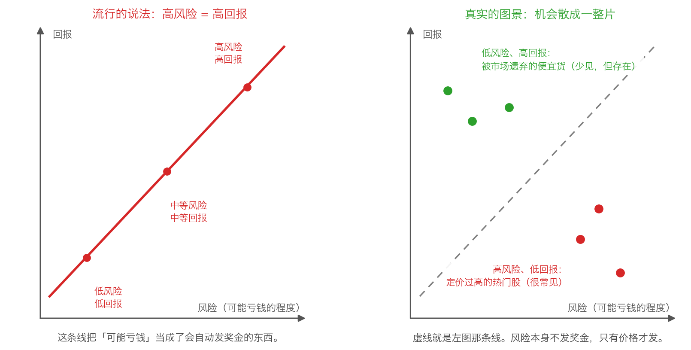

# 第 2 章：风险与回报——被讲错的关系

> 本章你将：
> - 认出那句你听过一百遍的话——"高风险高回报"——并且知道它错在哪里
> - 明白为什么"冒险"这件事本身不会给你发奖金，只有价格才会
> - 学会区分"教科书里的一条线"和"真实世界里的一整片区域"
> - 知道"高风险高回报"在什么条件下才勉强近似成立，以及为什么它仍然帮不了你
> - 拿到卡拉曼给风险的原始定义，为下一章"波动不是风险"做好准备——这对你的钱包意味着什么

上一章我们确定了记分牌：**只看绝对表现，跟自己的钱包比。**
这一章要处理一个更基础的问题：既然要避免亏钱，那"亏钱的可能性"——
也就是风险——到底是个什么东西？为什么要问这个？
因为你从小到大听到的那句"高风险高回报"，会直接把你送进坑里。

---

## 2.1 你在银行柜台听到的那句话

先回忆一个场景。你去银行或者打开理财 App，看到一排名词：

- R1 谨慎型、R2 稳健型、R3 平衡型、R4 进取型、R5 激进型。
- 旁边配一句话："风险越高，预期收益越高。"

再看基金销售发来的消息："这只基金波动大一点，但高风险高回报嘛。"

这句话听起来像是物理定律，像是"一分钱一分货"那样天经地义。
它甚至还有学术背书——商学院里教的**资本资产定价模型**（英文缩写 CAPM）
就是把"风险越大、预期回报越高"当成基本原则写进公式里的。

卡拉曼怎么评价它？

> "一些人坚持认为风险与回报总是正相关的，风险越大，回报也越高。事实上这就是几乎所有商学院中教授的资本资产定价模型中的一个基本原则，然而这一原则并不总是正确的。"（p124）

请注意他的措辞：不是"这个模型没用"，而是**"这一原则并不总是正确的"**。
这一章我们要做的，就是搞清楚它什么时候对、什么时候错，
以及为什么**对你**来说它几乎总是错的。

---

## 2.2 先讲清楚：什么叫"风险"

要让讨论有意义，得先给风险一个准确的定义。这里先给一个够用的版本，
下一章会展开（这是卡拉曼在 p125 给出的）：

> **风险 = 亏损的概率 + 潜在的亏损额。**

拆成两半看：

- **亏损的概率**：这件事有多大概率会亏？（"有多大可能"）
- **潜在的亏损额**：万一亏，会亏掉多少？（"会亏多惨"）

这两个维度必须一起看。举两个生活例子：

- **买彩票**：亏的概率极高（几乎必然），但潜在亏损额很小（几块钱）。整体风险不大。
- **把全部积蓄借给一个你不了解的"朋友的朋友"去做生意**：看起来"亏的概率不高，
  人家说得挺靠谱"，但潜在亏损额是全部积蓄。整体风险极大。

> 💡 **换个说法：** 判断风险不能只问"会不会亏"，还要问"亏起来有多惨"。
> 一个"小概率但会亏光"的投资，比一个"大概率只亏一点点"的投资危险得多——
> 因为前者会让你**退出游戏**。

这个定义先放在这儿，后面两章都要用它。

---

## 2.3 "高风险高回报"错在哪里

现在正面拆解那句话。它的错误在于把**两件不同的事**混成了一件：

1. **风险**是一种"可能亏钱"的状态；
2. **回报**是你实际拿到手的钱。

"高风险高回报"这句话暗示：**因为你承担了风险，所以市场会奖励你。**
这就像说"因为你今天出门没带伞，所以老天会奖励你 100 元"——
承担风险本身不是一种付出，市场没有理由为它付钱。

那市场为**什么**付钱？卡拉曼给出了本世纪最简洁的一句答案：

> "风险本身并不创造差额回报，只有价格能够创造差额回报。"（p124–p125）

我们把这句拆开：

- **"差额回报"**就是"超出平均水平的回报"，也就是你跑赢无风险利率、
  跑赢通胀的那部分。
- **"只有价格能够创造"**：你赚钱的唯一来源，是你**买得便宜**。
  一家公司值 10 元，你 6 元买，那 4 元的差距就是你的回报来源；
  至于这家公司是"稳健的公用事业"还是"波动剧烈的新兴行业"，跟你能不能赚到这 4 元没有必然联系。

反过来也一样：一家再稳健的公司，你在 20 元买入（价值只有 10 元），
你承担的不是"低风险"，而是实打实的亏损风险。

> 📌 **划重点：** 风险的真正作用不是"给你更高的回报"，
> 而是**让你有可能亏钱**。你之所以愿意承担它，应该是因为**价格足够便宜**，
> 而不是因为"高风险"这三个字本身。

---

## 2.4 正确的图景：一片区域，不是一个斜坡

现在把两种图景画出来对比，这是本章最重要的一幅图。

**左边的图（流行的说法）：** 一条从左下到右上的直线。
风险小就回报小，风险大就回报大，斜着往上走，干净利落。
这是教科书里的世界——也是理财宣传单上的世界。

**右边的图（真实的图景）：** 一片散开的机会。有的点在左上角
（**低风险、高回报**），有的点在右下角（**高风险、低回报**），
还有些点大致落在对角线上（不高不低）。

那书上那条向上的线呢？在右图里它变成了一条灰色的虚线——
**它只是一条参考线，不是物理定律。**

卡拉曼对这两片区域的描述是（p124）：

- **左上角那片**："在无效的市场中，有可能找到低风险高回报的投资机会。
  当信息的获得不是很畅通，对一项投资的分析尤其复杂，
  或者投资者进行买卖的理由与价值无关时，就会出现这样的机会。"
  翻译成普通话：**当一家公司没人愿意研究、或者大家都在因为跟价值无关的理由抛售它时，
  便宜货就出现了。**
- **右下角那片**："无效的市场也会提供高风险低回报的投资机会。
  在这样的市场中经常会出现定价过高和充满风险的投资，
  不仅因为金融市场倾向于给出过高的估值，还因为如果有足够多的投机者坚持支付过高的价格，
  市场力量难以修正高估的状态。"

翻译成普通话：**热门的东西可以一直很贵，而且它既贵又危险。**

> 🇨🇳 **落到 A 股/港股：** 左边那片在 A 股 长什么样？
> 一家现金比市值还多、业务没什么想象空间的传统公司，常年没人调研、成交清淡，
> 股价跌破净资产——这类标的的风险常常被高估、回报被低估。
> 右边那片呢？一只连拉很多个涨停的题材股，基本面说不清楚，
> 但每天都有"故事"在更新——它的高波动不是高回报的保证，而是**高风险**的证明。

---

## 2.5 那句错话在什么时候"近似成立"

如果你够严谨，会追问一句：那为什么教科书会这么写？难道它一点道理都没有？

有道理，但有极其严格的前提。卡拉曼自己就说了：

> "只有在有效市场中风险与回报之间的正相关才能保持一致，这种关系稍有偏离马上就会得到修正，这会让市场有效起来。"（p124）

这句话的意思是："高风险高回报"成立的前提是**市场是有效的**——
也就是"所有信息都已经反映在价格里了"，所以你想占便宜是不可能的，
你唯一能换到更高回报的方法，就是承担更大的风险。

但这里有两个坑：

**坑一：就算在有效市场里，"高回报"也是整体平均，不是你的结果。**
一个班平均分 80 分，不代表你能考 80 分。市场给出的"风险补偿"是给
**所有承担这类风险的人的平均值**，其中包含了那些血本无归的人。
当你听到"这类资产长期年化回报约 8%"，那 8% 是平均数，
而不是一份承诺书。

**坑二：市场根本不是有效的。** 这正是卡拉曼整本书的立论基础，
也是 Week 7 讲过的内容（原书在 p111 附近专门讨论过"价值投资的基础是
有效市场假设是错误的"）。他在这句话后面直接给出了结论：

> "因为金融市场多数时候是无效的，投资者无法简单地选中某个水平的风险，然后相信这一风险将带来相应的回报。必须对每项投资中的风险和回报进行独立的评估。"（p124–p125）

**"无法简单地选中某个水平的风险，然后相信这一风险将带来相应的回报。"**
这句话是对"高风险高回报"最直接的否定：
你不能说"我要 8% 的回报，所以我选 R4"，就像你不能说"我要长高，
所以我买一双 43 码的鞋"。

---

## 2.6 卡拉曼给出的风险定义

这一章的最后一站，回到"风险到底是什么"。除了前面那个"概率 + 幅度"的框架，
卡拉曼还补了一个关键点：**价格是风险的一部分。**

书里是这么说的（p125）：一项投资的风险——出现相反结果的概率——**部分**是与生俱来的。
他举了一个很朴素的例子：比起把 1 美元花在公用设备上，
把 1 美元花在生物研究上，是一项风险更大的投资——
后者出现亏损的概率以及亏损所占本金的百分比都要高于前者。

但他紧接着说，金融市场里的情况复杂得多：

> "然而，在金融市场中，可交易证券与相应企业之间的联系并不确定。在投资者的眼中，一种可交易证券所产生的各种各样的亏损或者回报并不完全来自于对应的企业，他们也会依赖于所支付的价格，而价格是由市场制定的。"（p125）

这句话是本周最关键的技术性论点之一，我们把它翻译过来：

- 你买的**不是**"这家公司"，你买的是"这家公司的股票"。
- 股票的价格由市场决定，可以离公司的真实价值很远。
- 所以**同一家公司，20 元买入和 6 元买入，是完全不同的两笔投资**——
  哪怕它的生意、管理层、行业一分钱没变。

而恰恰是这一点，把我们带到了下一章的敌人：**Beta 值**。
因为 Beta 说："这两笔投资的风险一样，因为这只股票过去的价格波动是一样的。"
卡拉曼的观点是："不对。20 元买入的那笔，风险大得多。"

> ⚠️ **易踩坑：** "这家公司很好，所以买它没错"——这句话缺了最关键的一半：
> **在什么价格买。** 好公司 + 坏价格 = 一笔糟糕的投资，
> 这是 Week 2 和 Week 7 反复讲过的道理。这一章把它落在了"风险"这个词上：
> 价格决定了你这笔投资的风险有多大。

---

## ✍️ 想一想

1. 保险是一个很有意思的行业：买保险的人**花钱承担风险**（保费），
   卖保险的公司**收钱承担风险**。用"风险本身不创造回报，价格才创造回报"这句话想一想：
   保险公司的利润从哪里来？
2. 有人说："我还年轻，能承受高风险，所以我应该买波动最大的股票。"
   这句话里"能承受高风险"到底指的是什么？他真正的优势是"能承受波动"，
   还是"能等到价格回归"？
3. 如果一家公司质地极好、增长很快，但价格是它价值的 3 倍；
   另一家公司质地平庸、增长很慢，但价格是它价值的六折。
   按这一章的定义，哪一笔投资的风险更大？为什么？

> 💡 **参考思路：**
> 1. 保险公司的利润来自**定价**：它收的保费，长期看要高于它实际赔付的钱。
>    如果它把保费定得太低（价格错了），就算它承担了风险，也会亏钱；
>    如果定价合理，它承担风险就能赚钱。这说明**承担风险不是收益的来源，定价才是**。
>    这也是为什么"高风险高回报"这种说法在商业世界里根本站不住脚——
>    没有哪个老板会因为"这笔生意风险大"就自动多赚钱。
> 2. "能承受高风险"这句话是被偷换过的。年轻人真正的优势是**时间**：
>    他有几十年的现金流可以持续投入，不需要在某个特定时点卖出。
>    所以他的优势是"不怕波动、能等到价值回归"，
>    而不是"应该去赌那些可能亏光的东西"。
>    把"能承受波动"偷换成"能承受本金永久损失"，是散户最常犯的错误之一。
> 3. 按本章的定义，**第一笔（3 倍价格）风险更大**。
>    因为风险是"亏损的概率加上潜在亏损额"：你用 3 倍的价格买入，
>    只要市场情绪回归正常，你的潜在亏损额就是三分之二；
>    而第二笔虽然公司平庸，但六折的价格给了你**容错空间**，
>    就算估值不动，你也不太会永久亏钱。记住这句话：
>    **决定风险的不是公司的好坏，而是你付的价格。**

---

## 🧮 算一算

> 下面用的是**简化示意数字**，让你亲手验证"只有价格能够创造差额回报"。

### 情境

有一家公司，我们叫它"甲公司"。它的经营情况如下：

- 每股每年赚 **1 元**（这是它的盈利能力，我们用"每股收益"来称呼它：
  公司赚的钱除以总股数，得到"每一股背后一年赚了多少钱"）；
- 市场上的人长期愿意为这类公司付 **12 倍**的价钱
  （这个倍数就是 Week 2 讲过的**市盈率**：股价除以每股每年赚的钱）；
- 所以这家公司在市场眼中的"正常价格"是：$1 \times 12 = 12$ 元。

现在有三个人，在**同一天**买入甲公司的股票：

| 买入的人 | 买入价 | 相当于多少倍市盈率 |
|---|---|---|
| 老王 | 24 元 | 24 倍 |
| 小李 | 12 元 | 12 倍 |
| 你 | 8 元 | 8 倍 |

### 第 1 步：先算三年后的"正常价格"

假设三年后，甲公司还是每年每股赚 1 元，市场还是愿意给 12 倍市盈率。
那么它的价格会是：

$$1 \times 12 = 12 \text{ 元}$$

**这一步在算什么：** 用"盈利能力乘以市场愿意给的倍数"来估一个大致合理的价格。
注意这里的假设是**盈利能力没有变化、市场情绪也没有变化**——
我们故意把这两个变量都固定住，好让"买价"这一个变量单独说话。

### 第 2 步：算三个人的结果

- 老王：$24$ 元买、$12$ 元卖，亏 $24 - 12 = 12$ 元，亏损率 $12 \div 24 = \textbf{50\%}$
- 小李：$12$ 元买、$12$ 元卖，**不赚不亏**
- 你：$8$ 元买、$12$ 元卖，赚 $12 - 8 = 4$ 元，收益率 $4 \div 8 = \textbf{50\%}$

**这一步在算什么：** 三个人面对的是同一家公司、同样的经营、同样的前景，
唯一的差别是**买入价格**。结果一个亏一半、一个打平、一个赚一半。

### 第 3 步：让公司也出点问题，再看一遍

假设三年里甲公司遇到了一点麻烦，每股每年赚的钱从 1 元掉到 0.8 元
（也就是盈利下滑了 20%）。市场还是给 12 倍：

$$0.8 \times 12 = 9.6 \text{ 元}$$

- 老王：$(9.6 - 24) \div 24 = -14.4 \div 24 = \textbf{-60\%}$
- 小李：$(9.6 - 12) \div 12 = -2.4 \div 12 = \textbf{-20\%}$
- 你：$(9.6 - 8) \div 8 = 1.6 \div 8 = \textbf{+20\%}$

**这一步在算什么：** 这才是真实世界的样子——公司总会有波动。
关键是：**同样一场 20% 的盈利下滑，三个人一个亏 60%、一个亏 20%、一个还赚 20%。**
企业层面的坏消息是不可避免的，但你**可以决定自己站在哪一边**。

### 第 4 步：回答本章的问题

- 三个人承担的风险一样吗？**不一样。** 老王的买入价里没有任何容错空间，
  只要公司稍微出点问题，他立刻亏损；而你的买价里已经包含了 4 元的缓冲。
- 他们的"高风险"换来了"高回报"吗？**没有。** 老王承担了最大的风险，
  拿到了最差的回报。这就是"高风险高回报"这句话的反例。

> 📌 **划重点：** 这个例子不需要任何复杂工具，就能得出本书的核心结论：
> **在同一家公司身上，风险与回报不是由"公司好不好"决定的，
> 而是由"你付了多少钱"决定的。价格低，风险就低、回报就高；价格高，反过来。**
> 这就是为什么卡拉曼说风险"也会依赖于所支付的价格"。

---

## ✅ 小测验

**1. 下面哪一句话最接近卡拉曼的观点？**
A. 风险越大，回报越高，这是市场规律
B. 风险本身并不创造差额回报，只有价格能够创造差额回报
C. 只要分散投资，风险就会自动消失
D. 波动越小的股票越安全

**2. "高风险高回报"这句话在什么条件下才勉强近似成立？**
A. 在任何市场里都成立
B. 只有在你选对了股票的时候才成立
C. 只有在市场大体有效、并且你看的是整个市场的长期平均结果时才近似成立
D. 只有在小盘股和新兴行业里才成立

**3. 同一家公司的股票，甲以 24 元买入（市盈率 24 倍），乙以 8 元买入（市盈率 8 倍）。
关于两人面对的风险，下面哪个说法最准确？**
A. 两人风险一样，因为是同一家公司、同样的经营
B. 甲的风险更大，因为他的买入价里没有留出任何容错空间
C. 乙的风险更大，因为便宜的东西一定有看不见的问题
D. 风险只跟这家公司所在的行业有关

> **答案与解析**
>
> **1. B。** 原话在 p125。A 恰恰是卡拉曼要反驳的那句话——它只在有效市场里
> 才"勉强"成立，而市场多数时候是无效的；C 把"多样化"当成了消灭风险的工具，
> 但多样化只能分散风险，不能消灭"买贵了"这件事（买贵了，买十只也一样贵）；
> D 混淆了波动与风险——这是下一章的主题，一只几乎不波动的股票可以阴跌好几年。
>
> **2. C。** 卡拉曼的原话是"只有在有效市场中风险与回报之间的正相关才能保持一致"（p124）。
> 注意"长期平均"这四个字：市场给的补偿是对**所有**承担这类风险的人的平均值，
> 里面包含了那些亏光的人，它不是给你的承诺书。A、B、D 都把"条件成立"
> 说成了"无条件成立"或者"取决于个人技巧"，都不对。
>
> **3. B。** 这是本章算一算得出的结论：风险不仅来自企业，
> 也来自你支付的价格（p125）。选 A 的人忽略了价格水平——
> 这恰好也是 Beta 值的盲区（第 4 章会讲）；选 C 是"便宜没好货"的偏见，
> 现实中便宜的原因经常是"没人愿意研究"或"大家都在因为与价值无关的理由抛售"
> （p124 说得很清楚）；选 D 把风险说成了行业的固有属性，
> 而卡拉曼整章的论点就是：风险取决于投资本质**和市场价格**，两者缺一不可。

---

## 📖 回到原书

- 对应原书 **第七章**「价值投资哲学起源」中的「风险和回报」一节，
  `raw/安全边际-中文版/page_124.md` ~ `page_125.md`，即原书 p124–p125。
- 建议精读 p124–p125：这一节只有两页，但每一句都在拆一句流行的话，
  值得一个字一个字读。
- 可以略读 p124 里提到"资本资产定价模型"的那半句——
  你不需要知道这个模型是什么，只要知道它是"高风险高回报"这句话的学术出处即可。
- 原书金句（逐字引用）：

### 金句一：那句话的来历

> "一些人坚持认为风险与回报总是正相关的，风险越大，回报也越高。事实上这就是几乎所有商学院中教授的资本资产定价模型中的一个基本原则，然而这一原则并不总是正确的。"（p124）

注意最后七个字：**并不总是正确的**。卡拉曼从来不否认教科书的存在，
他只是提醒你：教科书描述的是一个理想世界，而你要在真实世界里花钱。

### 金句二：被搞混的风险

> "其他一些人则错误地将风险等同于波动，强调证券价格波动的“风险”而忽视了可能作出定价过高、欠考虑或者糟糕投资的风险。"（p124）

这句话是下一章的引子。请特别注意它列出的三种"真正的风险"：
**定价过高、欠考虑、糟糕投资**——没有一个是"价格上下波动"。

### 金句三：这一章的核心

> "风险本身并不创造差额回报，只有价格能够创造差额回报。"（p124–p125）

十四个字，把整章讲完了。如果你只能记住一句话，就记这一句；
下次有人用"高风险高回报"劝你买什么，你就问他：
**这东西值多少钱？我现在付的价格比它低多少？**

---

> 下一章是本周的核心：**风险的本质**。我们会把"波动"和"风险"彻底分开，
> 你会看到两条波动幅度**完全一样**的股价走势，一个让你赚 20%，
> 一个让你亏 40%——而所有的"波动率""风险等级"指标都会告诉你：
> 它们两个一样危险。
