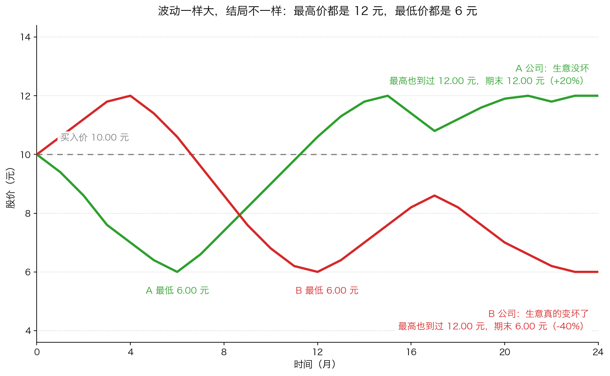
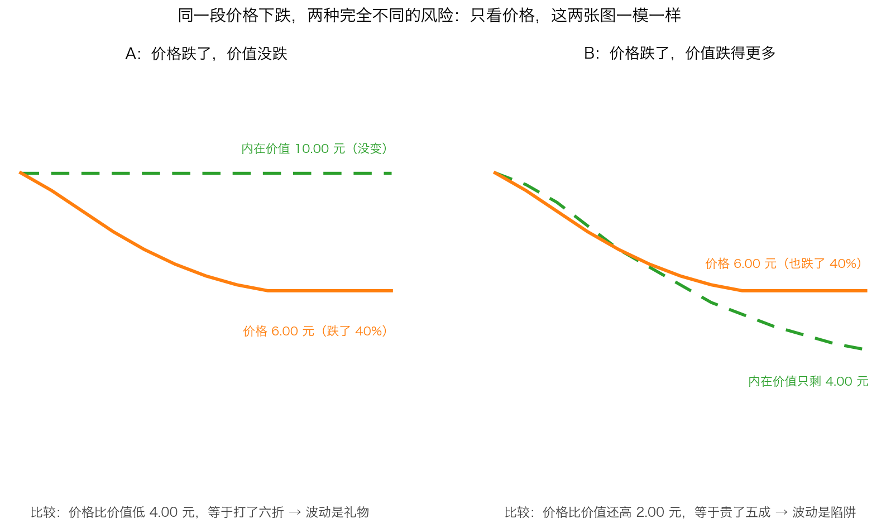

# 第 3 章：风险的本质——波动不是风险

> 本章你将：
> - 拿到卡拉曼对风险的完整定义，并且会用"概率 + 幅度"两个维度去衡量一笔投资
> - 彻底分清"价格波动"和"本金永久损失"这两件被大多数人混为一谈的事
> - 学会把每一次下跌分成三类：**礼物、考题、永久损失**，并知道每一类该做什么
> - 知道波动在什么情况下**真的**会变成风险——答案和"你会不会被迫卖出"直接相关
> - 拿到一张"什么钱可以进股市"的清单，这是这一周对你钱包最直接的保护

上一章我们纠正了一句话：**"高风险高回报"是错的**，因为风险本身不发奖金，
只有价格才发奖金。这一章要处理一个更根本的混淆。

这个混淆有多普遍？可以说，**绝大多数人一辈子都没意识到自己搞错了**。
他们每天看着股价上上下下，把"跌了"直接等同于"危险了"，
把"涨回来了"直接等同于"安全了"。卡拉曼用了整整一节来拆掉这个等号。
这一节只有两页（原书 p125–p126），但它是整个 Week 8 的核心。

---

## 3.1 先看两份"体检报告"

假设有两个人去做体检，报告上写着：

- **A 的报告**：血压今天 130，明天 118，后天 142，上下波动很大；
  但心脏、肝肾、血管全部正常。
- **B 的报告**：血压常年稳定在 122 左右，几乎不动；
  但肝脏上有一个正在变大的阴影。

如果你只看"血压波动"这一项，你会说 A 的身体状况更不稳定。
但任何一个医生都会告诉你：**B 才是那个需要立刻处理的人。**

这个类比就是本章的全部内容：

- **血压的上下波动**，相当于股价的波动；
- **那个正在变大的阴影**，相当于**本金的永久损失**；
- 大多数投资者（以及大多数风险指标）只测血压，不看阴影。

> 📌 **划重点：** 风险不是"价格上下起伏"，风险是**你的钱可能永远回不来**。
> 股价跌了可以涨回来，公司价值毁了就涨不回来——这两件事必须分开处理。

---

## 3.2 卡拉曼的定义：亏损的概率 + 亏损的幅度

先给出正式定义。卡拉曼是这么写的：

> "可以将一项投资的风险描述成亏损概率，以及潜在亏损额。"（p125）

一句话，两个部分：

1. **亏损概率**：这笔投资有多大的可能会亏钱？
2. **潜在亏损额**：万一亏，可能亏掉本金的百分之多少？

请注意，这个定义里**完全没有出现"价格波动"这四个字**。
它问的是两件事：**会不会亏**、**会亏多少**。

用两个生活场景对照：

| 场景 | 亏损概率 | 潜在亏损额 | 整体风险 |
|---|---|---|---|
| 花 2 元买一张彩票 | 极高（几乎必然） | 极低（2 元） | 小 |
| 把 50 万借给一个你不了解的生意人 | 说不清，看起来不高 | 极高（可能是全部） | 极大 |

第二个例子特别值得体会：**"看起来不高"的概率，加上"全部亏光"的幅度，
就是一个不能碰的投资**。很多人被坑，不是因为概率判断错了，
而是因为只看了概率，没看幅度。

> 💡 **换个说法：** 风险是一个乘法题：**会不会亏，乘以会亏多惨。**
> 两个数字都小，才是真的安全；只要有一个很大，这笔投资就不安全。

> 🇨🇳 **落到 A 股/港股：** 这个定义可以用来识别一类非常危险的东西——
> 融资买入（也叫"加杠杆"）：你借券商的钱买股票，股票跌到某个位置会被**强制卖出**
> （叫"平仓"）。它的特点是：亏损的**概率**看起来不高（很多人想"跌 20% 很难吧"），
> 但**潜在亏损额**是"你的全部本金，而且是在最坏的时点被强制兑现"。
> 用本章的定义一算，这是风险极高的行为，跟它的概率高低无关。

---

## 3.3 有些风险是天生的

风险并不全是价格造成的。有一类风险来自生意本身。卡拉曼举了一个很朴素的例子：

> "一项投资的风险——出现相反结果的概率——部分是与生俱来的。同用于购买公用设备的1 美元相比，花在生物研究上的1 美元是一项风险更大的投资。后者出现亏损的概率以及亏损所占本金的百分比都要高于前者。"（p125）

"公用设备"你可以理解成水电站、电网、自来水厂这类东西：需求稳定、
收入可预测、投进去的钱大概率能收回来。
"生物研究"就是新药研发：可能十年投入打水漂，也可能一上市就赚回全部成本。

这两者的差别是**生意本身的差别**，跟你花多少钱买它无关。落到 A 股/港股 上：

- 天生风险较低的生意：水电（长江电力这类）、高速公路、城市燃气、
  必需消费品（酱油、纸巾这类天天要用的东西）。
- 天生风险较高的生意：创新药研发、早期芯片设计、单一矿山的资源股、
  靠一个大客户活着的零部件厂。

天生风险高不代表不能投——**它只意味着你必须要求更低的买入价**。
这正好接上第 2 章：风险高不高，一半看生意，一半看你付了多少钱。

---

## 3.4 但价格也是风险的一部分

上一节说"部分是与生俱来的"，那么另一部分是什么？卡拉曼的回答是：**价格。**

> "然而，在金融市场中，可交易证券与相应企业之间的联系并不确定。在投资者的眼中，一种可交易证券所产生的各种各样的亏损或者回报并不完全来自于对应的企业，他们也会依赖于所支付的价格，而价格是由市场制定的。"（p125）

这句话你可能在第 2 章已经见过一次（我们从"风险与回报"的角度用过它）。
这里要从"风险"的角度再读一遍，因为它是理解下面这句话的钥匙：

> "风险视投资本质和市场价格而定的观点，与用Beta 值所描述的风险观点（下一部分内容将讨论这一话题）有着非常大的区别。"（p125）

卡拉曼为什么要专门点出 Beta？因为当时（以及现在）金融行业最流行的风险指标就是 Beta，
而 Beta 的定义里**根本没有"价格水平"这个变量**：一只股票从 10 元涨到 100 元，
只要它每天的波动幅度没变，Beta 就不变，金融学就说"它的风险没变"。

卡拉曼觉得这荒谬至极。第 4 章会专门讲 Beta，这里你只要先记住这个对比：

| | 卡拉曼眼里的风险 | Beta 眼里的风险 |
|---|---|---|
| 看什么 | 生意本身 + 你付的价格 | 过去的价格波动幅度 |
| 10 元买和 100 元买 | 完全不同（后者危险得多） | 完全一样 |
| 公司变坏了 | 风险上升 | 只要股价还没开始剧烈波动，就看不出来 |

---

## 3.5 回报能算清，风险算不清

这一节讲一个容易被忽略、但非常重要的不对称。卡拉曼说（p125–p126）：

- **回报**是可以事后精确计算的：你买了 100 股某公司的股票，你的回报
  "几乎完全依赖于卖出时交易价格。只有那时才能计算获得了多少回报。"
- 最安全的投资甚至在买入时就知道回报："票面利率为6%的1 年期美国短期国库券
  将在1年之后提供6%的回报。"（这句话里的"票面利率"就是债券上写明的利率，
  国库券可以理解成国家开的借条。）
- **但风险不一样：**

> "然而，同回报不同，投资结束时也无法对风险进行较投资开始时更加准确的量化。无法简单的使用一个数字来描述风险。"（p126）

这句话值得停下来想三分钟。它的意思是：

- 你赚了 30%，这是一个**事实**，可以写进账户。
- 但"这笔投资的风险有多大"，**在你赚钱之后，你依然不知道**。
  你可能只是运气好，恰好赌对了。

卡拉曼用了一个非常有画面感的例子：一口正在探测中的油井，
如果证实是枯井，我们叫它"有风险的"；如果喷油了，我们就叫它"没风险"吗？

> "然而，如果那口油井是喷油井，债券如期到期，以及股票价格大幅上涨，我们可以在进行投资时就称它们没有风险吗？根本不会这么说。"（p126）

> ⚠️ **易踩坑：** 这是投资中最常见的思维错误之一：**用结果评价决策。**
> "我买这只股票赚了钱，所以我的判断是对的"——不一定。
> 你可能在一个高风险的位置上赌赢了。反过来，"我亏了钱，所以我错了"也不一定，
> 你可能做了一个很好的判断，只是赶上了市场先生的坏情绪（Week 3 讲过市场先生）。
> **评价一个决策，要看当时掌握的信息和付出的价格，而不是看结果。**
> 原书给了一句很锋利的话：

> "关键是多数情况下，在投资结束之后所知道的风险不会多于在进行投资时所知道的风险。"（p126）

---

## 3.6 ★ 核心：波动不是风险

现在到本章的中心。请把下面这个区分刻在脑子里。

**价格的波动**：市场先生每天给你报的价。它由情绪、资金、供求、新闻决定。
它明天完全可能反过来。它**没有**动到你手里那份资产的一分一毫。

**本金的永久损失**：你投出去的钱**真的没了**。它通常来自三件事：
企业的价值被永久毁掉了（技术被淘汰、被大客户抛弃、财务造假）、
企业破产清算后你的那部分权利拿不回钱、
或者**你被迫在一个很低的价格上卖掉了本来没问题的资产**。

这两件事在"价格下跌"这个动作里同时出现，所以人们把它们混为一谈。
但它们的处理方式完全相反：

| | 价格波动 | 本金永久损失 |
|---|---|---|
| 谁造成的 | 市场先生的情绪 | 企业价值的真实毁损，或你的被迫卖出 |
| 会不会自己好 | 会（只要价值还在） | 不会 |
| 你该做什么 | 检查价值有没有变；没变就可以继续持有，甚至加买 | 承认判断错了，重新评估，必要时卖出 |
| 对长期投资者 | **往往是礼物** | 是唯一的真风险 |

用一句话概括卡拉曼这一节的全部内容：

> **下跌本身不是风险；下跌的原因和你的处境才决定它是不是风险。**

---

## 3.7 三种下跌：礼物、考题、永久损失

在实际操作里，你需要的不是定义，而是**分类的能力**。
每次你持有的东西跌了，请把它归到下面三类中的一类。

上面这张图是本章最重要的图。图中两条线的**最高价都是 12 元、最低价都是 6 元**
——也就是说，用"波动幅度"这把尺子量，它们**一模一样**。
但一条最后回到 12 元（赚 20%），另一条最后停在 6 元（亏 40%）。

所有的"波动率""风险等级""Beta 值"都会告诉你：**这两只股票的风险相同。**
这张图就是要让你亲眼看到那句话有多荒唐。

那么，怎么把下跌分成三类？问自己两个问题：

**问题一：公司的赚钱能力变了吗？** （不是股价变了吗，是**赚钱能力**变了吗。）
**问题二：我必须在近期卖出吗？**

| 类型 | 特征 | 本质 | 你该做什么 |
|---|---|---|---|
| **第一类：礼物** | 生意照旧赚钱，甚至更多；只是价格跌了。常见原因：大盘恐慌、行业被嫌弃、某个与经营无关的坏消息 | 价格波动 | 有闲钱就分批买更多；没闲钱就拿着，继续收分红 |
| **第二类：考题** | 生意确实变差了（周期低谷、某个产品失败），但公司的**长期赚钱能力没有被打断** | 需要判断 | 重新估算它的价值；如果价值只是暂时下降、价格又足够低，可以继续持有 |
| **第三类：永久损失** | 生意被**结构性**地毁掉了：技术路线被淘汰、核心客户流失、账目造假、债务爆掉走向破产清算 | 本金永久损失 | 承认错误，按新的价值重新判断，该卖就卖，不要"等回本" |

再看上面这张图：**左右两张图里的价格线一模一样**（都是从 10 元跌到 6 元），
唯一的区别是那条绿色的"内在价值"线。
- 左边：价值还是 10 元，你花 6 元买到 10 元的东西——**打了六折**，这是礼物。
- 右边：价值已经跌到 4 元，你花 6 元买的其实是 4 元的东西——**贵了五成**，这是陷阱。

**只看价格，你分不出这两张图。** 这就是为什么"盯着 K 线做决定"必然失败：
K 线里不含"价值"这个变量。

> 📌 **划重点：** 判断一类下跌属于哪一类，你**必须**去看生意本身：
> 去看它的财报、它的客户、它的竞争对手。
> 这就是 Week 9 要用一整周讲"企业评估"的原因——
> 没有估值能力，你永远分不清礼物和陷阱。

---

## 3.8 什么时候波动**真的**是风险

到这里你可能有一个疑问：那波动就完全无所谓吗？也不是。
卡拉曼非常精确地指出：**波动只在特定情况下，才会变成特定投资者的风险。**
这句话里的"特定"两个字是关键——**同一个波动，对不同的人意义完全不同。**

书里给了三种情况（p128–p129）：

**情况一：你必须在这个价格上卖出。**

> "那些需要急着卖出证券的持有人被市场上的价格所支配。成为成功投资者的秘诀就是当他们想卖出的时候卖出，而不是当他们不得不卖出的时候卖出。"（p128）

这是本章最重要的一句实操忠告。请想象两个人持有同一只股票，
都从 10 元跌到 6 元：

- 小王：下个月要付房子首付，必须在 6 元卖出 → 他的亏损是**真实的、永久的 -40%**。
- 你：这笔钱五年内不用，公司还在照常赚钱 → 你的"亏损"只是账面上的一个数字，
  而且你还能用分红在低位买更多股份。

**同一只股票、同一个价格、同一段波动，对一个人是灾难，对另一个人是机会。**
区别不在市场，在**你的处境**。

**情况二：这家公司自己急需用钱。**

> "如果一家企业必须在短期内筹集更多的资金以维持生存，投资这家公司的证券的投资者可能通过这家企业的股票和债券的当前价格来决定这家企业的命运，至少会起到部分的决定作用。"（p129）

这段话讲的是一个叫"反射效应"的现象（原书说第八章会详细讨论，也就是 Week 9 的内容）：
股价**反过来影响企业本身**。一家公司如果必须增发股票来筹钱，
股价越低，它就得卖出越多的股份，老股东被稀释得越厉害，甚至可能筹不到钱而倒下。
在这种情况下，价格下跌**不再只是价格问题**，它会真的伤害企业价值。

**情况三：你满仓，而且没有现金。**

> "如果你在市场下跌时满仓投资，你投资组合的价值会下跌，从而剥夺了你从更低的买入价格中获利的机会。这就产生了机会成本，即因放弃未来出现的机会而必然会引起的损失。"（p129）

"机会成本"这个词你在 Week 5 学过，这里我们把它讲透：

- **生活类比**：你把 10 万元存了一个三年期的定期，利率还不错。
  半年后，你遇到一个极好的机会（比如一套明显低于市价的房子），但你拿不出钱。
  你的损失不是"定期存款亏了"，而是"**错过了那个机会**"。
- **准确定义**：机会成本就是**因为把钱占在别处，而放弃掉的未来更好的机会**。
  它不是手续费，不是亏损，而是"本来可以赚到、但因为没子弹而没赚到"的那部分。
- **A 股/港股 表达**：市场大跌的时候，满仓的人只能看着；留着现金的人可以加仓。
  同样的下跌，前者被动，后者主动。

请注意情况三和情况一的区别：情况一是"被迫卖出"，情况三是"没钱可买"。
前者让你**实现亏损**，后者让你**错过机会**——两个都是波动造成的真实伤害。

---

## 3.9 面对风险，你只能做三件事

既然风险无法被精确计算（3.5 节），那投资者还能做什么？卡拉曼的回答非常简短：

> "投资者只能做几件事情才能应对风险：进行足够的多元化投资；如果合适，进行对冲；以及在拥有安全边际的情况下进行投资。确实如此，因为我们不知道，也无法知道自己以贴现价格进行的投资中的所有风险。当出错的时候，便宜的价格给我们提供了缓冲。"（p126）

三件事，逐个解释：

**第一件：足够的多元化投资。**
"多元化"就是不要把所有的钱压在一个地方。
注意"足够"两个字：Week 12 会讲，多元化不是越多越好，
买 50 只自己看不懂的股票不叫多元化，叫"分散地不懂"。
对新手来说，一个够用的起点是：**不要有任何一只股票占到你股票资产的 20% 以上**
（先记住这个粗略的数，Week 12 会重新讨论）。

**第二件：如果合适，进行对冲。**
"对冲"就是同时持有两样价格大概率往相反方向走的东西，
用一边的赚来缓冲另一边的亏。生活里最常见的对冲是给房子买火灾险。
对普通投资者来说，对冲**通常没有必要**，也常常做错（第 5 章会再提一次，
Week 12 会详细讲）。你知道有这个词、知道它的用途就够了。

**第三件：在有安全边际的情况下投资。**
这是全书的核心，也是 Week 7 讲过的内容，但这段话给了它一个新的解释角度：
**安全边际不是为了让你赚更多，而是因为"我们无法知道自己投资中的所有风险"，
所以需要一个缓冲。**

> "当出错的时候，便宜的价格给我们提供了缓冲。"

请注意这句话的措辞：**"当出错的时候"**——不是"如果出错"，是**当**。
卡拉曼默认你一定会犯错。整套方法不是建立在"我很聪明"上，
而是建立在"我一定会看走眼，所以我要留足余地"上。

---

## 3.10 落到 A 股/港股：三条保命纪律

这一章的知识可以立刻变成三条纪律。它们的共同点是：**它们保护的不是你的收益，
而是你"不必被迫卖出"的权利。**

**纪律一：只用三年以上不用的钱买股票。**
检验方法很简单：如果这笔钱在三年内有可能要用（结婚、买房、看病、孩子学费、
换工作期间的生活费），它就不该出现在股票账户里。
这条纪律直接消灭了 3.8 节的"情况一"。

**纪律二：永远不借钱买股票。**
融资融券、配资、消费贷入市、拿信用卡套现——全部不要。
借钱买股票有一个致命特点：**你的卖出时点不由你决定**，
而由价格的下跌幅度决定（跌到某个位置会被强制平仓）。
这就把"暂时波动"直接转化成了"永久损失"。

**纪律三：手里留一笔现钱。**
不是让你空仓，而是让你**永远有一部分钱可以在下跌时出手**。
具体多少取决于你的情况（Week 12 会讲流动性），但原则是：
市场大跌的那一天，你要么是买家，要么是旁观者——**不要做那个被迫卖出的卖家。**

> ⚠️ **易踩坑：** 这三条听起来一点都不"高级"，甚至有点像老年人理财建议。
> 但它们恰好对应了卡拉曼说的三种"波动变成风险"的路径。
> 投资里最难的部分从来不是"找到好公司"，
> 而是**在最坏的时候不要被迫出局**——因为只要你在场，机会就一直在。

---

## ✍️ 想一想

1. 你持有的股票跌了 30%，你用这一章的分类法判断它属于"礼物"。
   那么接下来你应该去查哪三件事，来确认自己的判断？
2. 两个人都持有同一只跌了 40% 的股票。一个人说"没关系，我等得起"，
   另一个人整夜睡不着。他们的差别在哪里？这个差别能不能在买之前就解决掉？
3. 有人说："我不怕波动，所以我从来不设止损。"另一个人说："我永远设 10% 的止损线。"
   用这一章的定义，评价这两种做法——它们分别在什么情况下是危险的？

> 💡 **参考思路：**
> 1. 至少要查三件事：**第一，公司最新的财报里，营业收入和利润是增长了还是下滑了？**
>    （判断赚钱能力有没有变。）**第二，它的现金流和负债还撑得住吗？**
>    （会不会因为缺钱而被迫做伤害股东的事。）**第三，当初让它便宜的那个原因还在吗？**
>    （比如"行业被嫌弃"，但公司的市场份额反而在上升——这就是礼物。）
>    如果这三件事都说不出问题，那么下跌大概率属于"礼物"或"考题"。
> 2. 差别在两个地方：**第一，这笔钱是不是他近期要用的**（决定他有没有"等"的权利）；
>    **第二，他到底知不知道这家公司值多少钱**（不知道的人，跌了就只能恐慌）。
>    这个差别**完全可以在买入前解决**：
>    只用长期的闲钱买，并且只买自己算得清价值的公司。
>    睡不着觉，通常是"仓位太重"或"看不懂"的信号，而不是市场的错。
> 3. 两种做法都不完整。**"从不设止损"**的前提是你真的会去看基本面，
>    否则你可能抱着一个价值已经被毁掉的公司一直等——那是第三类下跌，
>    应该卖出。**"机械地设 10% 止损"**的危险在于：它会把第一类下跌（礼物）
>    直接转成永久损失——你会在最便宜的时候被自己的规则赶出局，
>    这正是 3.8 节说的"被迫卖出"。
>    更好的做法是：**止损线不设在价格上，设在事实上**——
>    如果当初买入的理由消失了（价值真的坏了），就卖；如果只是价格波动，就不卖。

---

## 🧮 算一算

> 下面用的是**简化示意数字**，让你亲手验证"波动一样大，结局可以完全不同"。

### 情境

有两只股票，A 和 B，你都在 **10.00 元**买入。
三年里，它们的价格都走过了同样的两个极端：**最高 12.00 元，最低 6.00 元。**
三年后：

- **A 公司**：价格回到 **12.00 元**。它的生意没什么变化，只是市场情绪起落。
- **B 公司**：价格停在 **6.00 元**。它的主营产品被新技术替代，生意真的变坏了。

### 第 1 步：用"最高价与最低价相差多少"来量波动

$$12.00 - 6.00 = 6.00 \text{ 元}$$

相对于最低价 6.00 元：

$$6.00 \div 6.00 = 100\%$$

**A 和 B 的波动幅度完全一样**：最高价都比最低价高出 6.00 元，也就是 100%。
如果有一只基金同时持有这两只股票，任何"波动率"指标都没法把它们区分开。

**这一步在算什么：** 我们用初中生能算的口径（最高价与最低价相差多少）
代替那些复杂的统计指标。结论很清楚：**用波动量风险，A 和 B 是同一只股票。**

### 第 2 步：算三年后的真实收益

- A：$(12.00 - 10.00) \div 10.00 = 2 \div 10 = \textbf{+20\%}$
- B：$(6.00 - 10.00) \div 10.00 = -4 \div 10 = \textbf{-40\%}$

**这一步在算什么：** 波动相同，结局差了 60 个百分点。
这就是本章标题那句话的完整含义：**波动不是风险**。
真正的风险在 B 身上已经发生了——它的价值被永久毁掉了。

### 第 3 步：如果 B 最终破产清算

假设第三年末 B 公司清算，股东每股只拿回 **1.50 元**：

$$(1.50 - 10.00) \div 10.00 = -8.50 \div 10.00 = \textbf{-85\%}$$

再算回本需要涨多少：

$$10.00 \div 1.50 \approx 6.67$$

也就是说，需要上涨约 **567%** 才能回本。

**这一步在算什么：** 这就是"本金永久损失"长什么样。
它不是"跌了 40% 等一等就回来"，而是**数学上再也回不来了**。

### 第 4 步：如果 B 只是行业周期的低谷

换一个假设：B 公司只是遇到了行业低谷，第三年末价格回到 **11.00 元**，
生意也恢复了。那么：

$$(11.00 - 10.00) \div 10.00 = \textbf{+10\%}$$

在这个版本里，B 的下跌属于**第二类：考题**——它跌得很吓人，
但价值没有被打断，结果你是赚钱的。

**这一步在算什么：** 同样的价格走势（10 元到 6 元再回升），
因为**企业价值的变化不同**，一个是陷阱、一个是考题。
所以判断下跌性质时，你必须看生意，不能只看价格。

### 第 5 步：加上"被迫卖出"这个变量

现在假设你不是只买了 A 和 B，你还遇到了一件私事：
第二年孩子要交一笔学费，你必须在价格 6.00 元的时候卖掉一部分持股。

- 卖出的那部分：$(6.00 - 10.00) \div 10.00 = \textbf{-40\%}$，**真实的、永久的亏损**
- 如果你是卖 A：你亏掉 40% 之后，A 后来涨到 12 元，跟你再没关系了。
- 如果你是卖 B：你亏掉 40% 之后，B 后来可能破产，你也算"逃过一劫"——
  但这一次的 -40% 是你**被迫**接受的，不是你的判断。

**这一步在算什么：** 这说明**同一个波动，对不同处境的人是不同的东西**。
-40% 这个数字，对"必须卖"的人是永久损失，对"等得起"的人只是账面变化。

### 第 6 步：把这一章变成一个数字

拿张纸，把你现在（或曾经）持有的每一只股票列出来，对每一只填三个空：

1. 它的最高价与最低价相差多少？（波动大小）
2. 它的**赚钱能力**这两年是变好、变差，还是没变？（价值变化）
3. 我需要在三年内卖出它吗？（处境）

**第 2 栏填"没变"或"变好"、第 3 栏填"不需要"的，第 1 栏的数字再大也不构成风险。**
反过来，如果第 2 栏填"变差"、第 3 栏填"需要"，那么第 1 栏哪怕很小，也很危险。

---

## ✅ 小测验

**1. 卡拉曼所说的"风险"，指的是什么？**
A. 股价上下波动的幅度
B. 亏损的概率，以及潜在的亏损额
C. 市盈率太高
D. 公司所在行业不景气

**2. 一只股票从 10 元跌到 6 元，但公司的赚钱能力没有任何变化。
对一位三年内不需要动用这笔钱、手里还有闲钱的投资者来说，这最可能是什么？**
A. 本金的永久损失，应该立刻卖出
B. 一次机会，因为他可以用更便宜的价格买到更多股份
C. 说明他当初的判断错了
D. 说明市场是有效的

**3. 下面哪种情况最可能把"价格波动"变成"本金永久损失"？**
A. 你持有的公司减少分红
B. 你不得不在下跌的时候卖出，因为这笔钱下个月就要用
C. 你买的股票三年没有上涨
D. 大盘指数下跌了 20%

> **答案与解析**
>
> **1. B。** 这是 p125 的原话。A 是"波动"，恰恰是卡拉曼认为被错当成风险的东西；
> C 和 D 都只是"可能导致永久损失的线索"，不是风险本身的定义——
> 市盈率高不一定危险（高增长的公司可能有它的道理），
> 行业不景气也可能是周期低谷而非永久损伤。
>
> **2. B。** 判断的关键不是跌幅，而是"赚钱能力有没有变"加上"你会不会被逼着卖"。
> 这两个条件在这道题里都指向"不是永久损失"。选 A 的人把波动直接当成了风险；
> 选 C 的人用价格否定判断，属于"用结果评价决策"；
> 选 D 与事实相反——市场先生的情绪化报价正是无效市场的表现（Week 3 讲过）。
>
> **3. B。** 这是 3.8 节"情况一"：被迫卖出的那一刻，账面波动变成了真实亏损，
> 而且这个亏损**永久**地定格了（你失去了日后涨回来的那份资产）。
> A 可能是价值下滑的信号，但需要进一步判断；C 只是价格没动，既不是风险也不是收益；
> D 是市场整体波动，对长期投资者往往反而是机会。

---

## 📖 回到原书

- 对应原书 **第七章**「价值投资哲学起源」中的「风险的本质」一节，
  `raw/安全边际-中文版/page_125.md` ~ `page_126.md`，即原书 p125–p126。
- 建议精读 p125–p126：这是全书中关于"风险"最完整、最凝练的两页，
  建议至少读三遍——第一遍理解定义，第二遍理解"波动与风险的区别"，
  第三遍理解"投资者只能做的三件事"。
- 可以略读 p125 里关于"6% 票面利率的 1 年期美国短期国库券"的例子，
  那是 1991 年美国利率环境下的数字（当时短期利率确实在 6% 上下），
  今天你只要读懂"最安全的投资在买入时就知道回报"这个意思即可。
- 原书金句（逐字引用）：

### 金句一：风险的完整定义

> "可以将一项投资的风险描述成亏损概率，以及潜在亏损额。"（p125）

这一句话把全章讲完了。下次有人跟你推荐一个"风险不高"的东西，
你可以按这两个维度各问一句：**亏的概率有多大？万一亏会亏掉多少？**

### 金句二：喷油井算不算没风险

> "然而，如果那口油井是喷油井，债券如期到期，以及股票价格大幅上涨，我们可以在进行投资时就称它们没有风险吗？根本不会这么说。"（p126）

这句话是给"结果论者"的一记耳光。它提醒你：
**赚钱的结果不能证明决策的正确，亏钱的结果也不能证明决策的错误。**
要评价一个决策，看的是当时付出的价格和当时能掌握的信息。

### 金句三：投资者能做的三件事

> "投资者只能做几件事情才能应对风险：进行足够的多元化投资；如果合适，进行对冲；以及在拥有安全边际的情况下进行投资。确实如此，因为我们不知道，也无法知道自己以贴现价格进行的投资中的所有风险。当出错的时候，便宜的价格给我们提供了缓冲。"（p126）

这段话里最动人的是它的诚实：**"我们不知道，也无法知道"。**
卡拉曼没有把自己包装成一个能算准风险的人。他承认自己会错，
所以才需要便宜的价格来当缓冲——这就是安全边际的另一种解释方式。

---

> 下一章我们要拆掉那个被商学院和金融行业共同捧起来的风险指标：**Beta 值**。
> 你会看到它其实就是一个"斜率"，也会看到它到底漏掉了什么——
> 漏掉的东西，恰恰就是这一章讲的"本金永久损失"。
