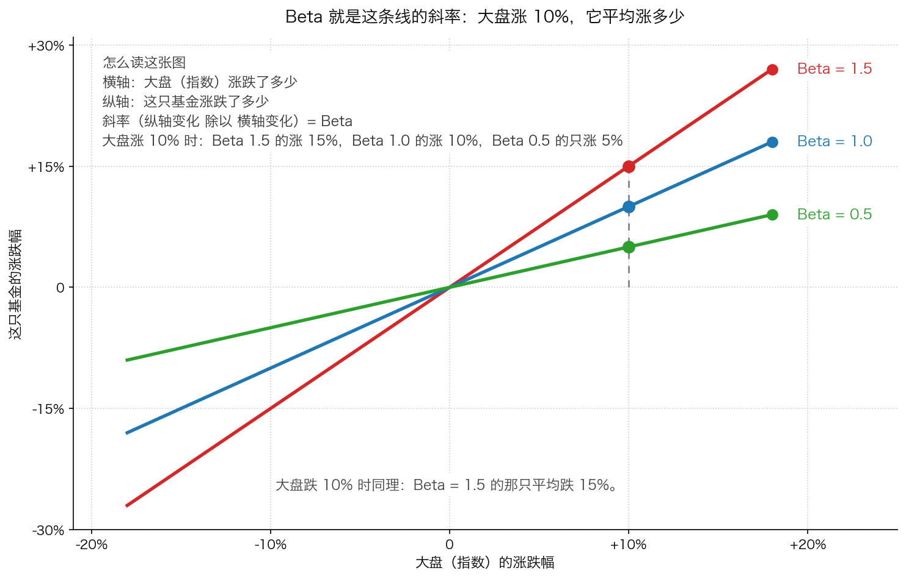
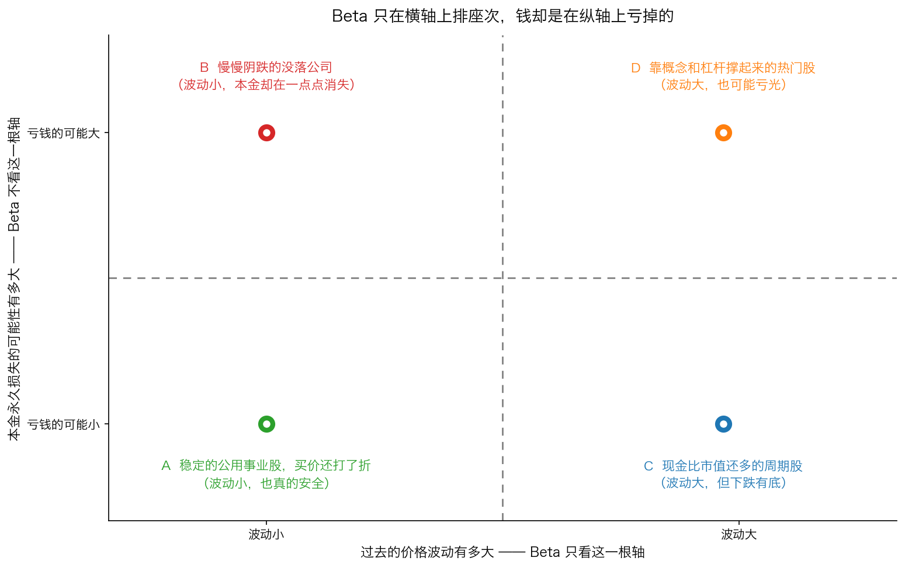

# 第 4 章：Beta 值，或更糟

> 本章你将：
> - 用大白话讲清楚 Beta 是什么：大盘涨跌 1%，这只基金平均涨跌百分之几
> - 看懂 Beta 的几何含义——它其实就是一条线的**斜率**，并学会从图上读出它
> - 知道学院派为什么喜欢这个数字，以及卡拉曼为什么说它是一个糟糕的风险指标
> - 学会画"Beta 看不见的那根轴"：波动大小和亏钱可能是两件完全不相关的事
> - 知道基金 App 上的"波动率""最大回撤""风险等级"该怎么用、什么时候别信——这对你的钱包意味着什么

上一章我们把"波动"和"风险"拆开了：**跌了不等于危险，本金永久损失才危险。**
但现实世界里，绝大多数的金融产品说明书、基金销售页面、
甚至银行的风险测评，用的都是"波动"这一套语言。
这套语言有一个最出名的代表，就是这一章的主角：**Beta 值**。
如果你不懂它，你就没法判断那些数字在说什么；如果你迷信它，你会被它带进坑里。

---

## 4.1 先用大白话讲清楚 Beta

先不讲定义，讲一个学校里天天发生的事。

假设有两个学生，小明和小红。老师讲课的速度变快一倍时，
小明的做题速度提高 1.5 倍，小红的做题速度只提高 0.5 倍。
我们就可以说：**小明对"老师速度"的敏感度是 1.5，小红是 0.5。**

Beta 值就是这个"敏感度"，只不过把"老师的讲课速度"换成"大盘指数"。

> **Beta = 大盘涨跌 1% 时，这只证券（股票或基金）平均跟着涨跌百分之几。**

几个典型的值：

| Beta | 含义 | 大盘涨 10% 时 | 大盘跌 10% 时 |
|---|---|---|---|
| 1.5 | 比大盘颠簸 1.5 倍 | 平均涨 15% | 平均跌 15% |
| 1.0 | 跟大盘同步 | 平均涨 10% | 平均跌 10% |
| 0.5 | 只有大盘一半的敏感度 | 平均涨 5% | 平均跌 5% |
| 0 | 跟大盘基本无关 | 大概不动 | 大概不动 |

**怎么算出来的？** 很简单：拿这只证券**过去**一段时间的涨跌幅，
跟同期大盘的涨跌幅相比。比如某个月大盘涨了 10%、这只基金涨了 15%，
那这个月它们之比就是 1.5。把很多个月的数字平均一下，就得到 Beta。

这里要强调两个词，它们后面会变成卡拉曼的攻击点：

1. **"过去"**——Beta 是用历史价格算出来的，它描述的是已经发生的事。
2. **"平均"**——它是一个统计结果，不是承诺。

> 💡 **换个说法：** Beta 就像给一个人测"跟着别人走的倾向"：
> 领导走得快，他跟得紧不紧。但它测不出这个人自己要去哪儿，
> 也测不出他会不会摔下悬崖。

> 🇨🇳 **落到 A 股/港股：** 你在券商 App 或者基金分析网站上，
> 经常能看到"Beta"这个符号。一般来说：
> - 跟踪沪深 300 的指数基金，Beta 接近 1；
> - 白酒、券商、半导体这类弹性大的行业，Beta 常常大于 1；
> - 水电、高速公路、银行这类生意稳定的公司，Beta 常常小于 1；
> - 货币基金、短债基金的 Beta 接近 0。

---

## 4.2 一张图看懂 Beta：它就是斜率

Beta 最准确的理解方式，是一张图。

**怎么读这张图：**

- **横轴**：大盘（指数）涨跌了多少；
- **纵轴**：这只基金涨跌了多少；
- 图中的每条线都穿过原点（大盘不动，它平均也不动），
  而**线的陡峭程度就是 Beta**。

在图里，横轴 10% 的位置画了一条竖直的虚线，它与三条线分别相交于三个点：

- 红色那条最陡，交点是 **15%**，所以它是 Beta = 1.5；
- 蓝色那条其次，交点是 **10%**，所以它是 Beta = 1.0；
- 绿色那条最平，交点是 **5%**，所以它是 Beta = 0.5。

**"斜率"这个词，用初中的话说就是：横着走一格，竖着走几格。**
在图上从原点向右走 10 格（大盘涨 10%），红色线向上走了 15 格，
所以它每走 1 格上升 1.5 格——这个 1.5 就是 Beta。

反过来，横轴向左走（大盘跌），三条线也一起往下：
大盘跌 10% 时，Beta = 1.5 的那只平均跌 15%。**它是双向的。**

> 📌 **划重点：** Beta 描述的是一种**跟随关系**，不是一种**因果关系**。
> 大盘涨了不会"导致"你的基金涨，它们只是同时被同一批资金和情绪推着走。
> 更重要的是：**Beta 只描述幅度，不描述原因。**

---

## 4.3 学院派为什么喜欢这个数字

公平地说，Beta 能流行起来是有原因的。它有三个明显的优点：

1. **它是一个数字。** 有了数字就能排序、比较、塞进公式里算。
   "这家公司风险是 1.35，那家是 0.82"——对写报告的人来说，
   这比"这家公司风险偏高"有用得多。
2. **它可以用历史数据算出来。** 不需要预测未来，不需要判断管理层，
   把价格数据丢进公式就有结果。这对大规模管理资金的人极具吸引力。
3. **它让"分散投资"有了数学依据。** 现代金融理论用 Beta 把风险拆成两部分：
   跟大盘一起动的部分（无法通过分散消除）和自己特有的部分（可以通过分散消除）。
   这套逻辑支撑了指数基金、资产配置等一整套实践。

所以 Beta 不是骗子发明的东西，它是一个**在特定假设下有用的工具**。
卡拉曼的批评也不是"这个数字算错了"，而是：
**它被当成了风险的定义，而它根本不配。**

---

## 4.4 卡拉曼的四条反驳

这一节的每一句话都来自原书 p127。我们一条一条过。

**反驳一：只看价格，不看企业。**

> "有关Beta 值的观点仅仅考虑了市场上的价格，而没有考虑到企业具体的基本面或者经济发展。"（p127）

这句话的意思是：Beta 的世界里只有价格数据。
一家公司是不是快倒闭了、它的债务是不是要到期了、它的产品是不是被淘汰了，
Beta **一概不看**。只要它的股价还没开始剧烈波动，Beta 就说它"风险不高"。

**反驳二：忽略了你付的价格。**

同一句话的后半段是：

> "同时，价格所处的水平也被忽略，就像50 美元IBM 的股票不会较100 美元的IBM股票风险更低一样。"（p127）

这句话要慢慢读，因为它说的正是我们在第 2、3 章反复强调的东西，
只是用了 1991 年的例子（IBM 是当时美国最有名的大公司之一）。

它的意思是：在 Beta 的眼里，**同一只股票，50 美元和 100 美元的风险是一样的**
——因为它的历史波动幅度一样，算出来的 Beta 就一样。
而按卡拉曼的定义，你在 100 美元买入的风险明显更大：你付的价格里没有一点容错空间。

> ⚠️ **易踩坑：** 这是全章最需要记住的一点。
> 一个用 Beta 排序的"风险评估表"，会把**同一家公司在天价时和白菜价时**评为同样的风险等级。
> 换句话说，它分不清"打折"和"泡沫"。

**反驳三：它假设你什么都改变不了。**

> "Beta 值没有考虑到投资者自己可以通过诸多努力给投资所施加的影响，如通过代理权征集、股东决议、与管理层进行交流、或者收购足够多的股份以获得企业的控股权，然后直接影响企业的潜在价值等。"（p127）

这句话里提到的四件事，说白了就是：**股东可以影响公司。**
- **代理权征集**：召集其他股东一起投票，推动某个议案（比如反对一项糟糕的收购）；
- **股东决议**：在股东大会上提出并表决提案；
- **与管理层交流**：直接找公司沟通（在 A 股，机构调研、给董秘打电话都算）；
- **收购控股权**：买下足够多的股份，直接换掉管理层、改变公司战略。

Beta 的模型里，投资者是一个**被动的旁观者**：价格怎么动，他就承受什么。
但现实中，投资者可以改变企业的价值——这也就改变了风险。
这一条对我们普通人的现实意义是：**你并不是只能被动接受风险**。
你手里的股票背后是一家真实的公司，你有股东权利，
你可以投票、可以提问、可以用脚投票（卖掉）——这些都是主动管理风险。

**反驳四：它假设上涨和下跌的风险相等。**

> "有关Beta 值的观点认为，任何一种投资的上涨潜力和下跌风险是相等的，它们只跟这一投资相较于整个市场的波动性有关。这一观点也与我们所认识的世界相矛盾。"（p127）

这句话非常关键。Beta 是一个"上下对称"的指标：
一只 Beta = 1.5 的股票，模型认为它"涨得更多，也跌得更多"，两边幅度一样。
但真实世界里，**上涨和下跌从来不对称**：

- 跌 50% 之后要涨 100% 才回本（Week 3 算过）；
- 一家公司可能涨 10 倍，也可能归零——但归零之后游戏就结束了，你没法"等它涨回来"；
- 更重要的是：**波动是上下对称的，但本金永久损失是单向的。**

---

## 4.5 更要命的一条：过去不等于未来

前面四条是"逻辑上不成立"，这一条是"**实证上不管用**"。
卡拉曼的原话是本章最锋利的一句：

> "现实情况就是证券价格以往的波动性无法对未来的投资表现（或者甚至是未来的波动）给出可信赖的预期，因此过去的波动性是一个糟糕的衡量风险的指标。"（p127）

请特别注意括号里那句补充：**"或者甚至是未来的波动"**。
它的意思是：Beta 不光预测不了未来的收益，它连**未来的波动**都预测不准。
用过去的波动去推测未来的波动，本身就不牢靠。

为什么会这样？因为波动往往来自**变化**，而变化是无法从历史数据里读出来的：

- 一家公司十年都很平稳，因为它的行业十年没变。第十一年，一项新技术出现了。
  历史数据说它"低风险"，现实是它的风险刚刚变得很高。
- 反过来，一家公司刚经历了一场危机（股价剧烈震荡），危机解决之后，
  它的波动可能会大幅下降——历史数据还是会说它"高风险"。

这是不是和 Week 4 讲过的"后视镜"毛病一模一样？
用后视镜开车，你看到的永远是已经走过的路。

---

## 4.6 Beta 看不见的那根轴

现在我们把前面所有内容压进一张图里。

这张图的横轴是**过去的价格波动**（Beta 唯一看的东西），
纵轴是**本金永久损失的可能性**（Beta 完全看不见的东西）。
四个象限里各放一个例子：

- **A：稳定的公用事业股，买价还打了折**——波动小，也真的安全。
  这是"低波动 + 低风险"的经典组合。
- **B：慢慢阴跌的没落公司**——它的股价每天只跌一点点，波动很小，
  但它的生意正在被时代淘汰。**这是 Beta 最危险的盲区**：
  它会给这种股票贴上"低风险"的标签，而你的本金正在一点点消失。
- **C：现金比市值还多的周期股**——股价大起大落，波动很大，
  但下跌有底（因为它的资产和现金摆在那里）。高 Beta，低风险。
- **D：靠概念和杠杆撑起来的热门股**——波动大，也可能亏光。高 Beta，高风险。

> 📌 **划重点：** Beta 只在**横轴**上排座次，而钱是在**纵轴**上亏掉的。
> 一个按 Beta 排序的清单，会把 A 和 B 排在一起（都"低风险"），
> 把 C 和 D 排在一起（都"高风险"）——而这四类投资的真实风险天差地别。

所以，用 Beta（或任何波动指标）看投资，你能得到的只有一句话：
**"它过去晃得厉害不厉害。"** 这句话不是没用，但它回答的不是
"我会不会亏钱"这个问题。

---

## 4.7 落到 A 股/港股：那些"风险数字"该怎么用

现在说实操。你在基金 App、银行理财页面、券商研报上会看到一堆数字，
它们大多是 Beta 家族的亲戚。我们把它们分类，告诉你**哪个能用、怎么用**。

**第一类：波动率、Beta、"风险等级 R1–R5"。**
它们衡量的是"过去晃得厉害不厉害"。**正确用法**：判断**你自己**受不受得了。
如果你看到一只基金"过去一年最大跌幅 35%"，你要问的不是"它危险吗"，
而是"如果我的 10 万元变成 6.5 万，我会不会在最低点卖掉？"
**如果你会，那它对你就是高风险**——注意，这里的高风险来自**你**，不是来自基金。

**第二类：最大回撤。** 意思是"从最高点跌到最低点，最多跌了多少"。
它的**正确用法**是做压力测试：把那个跌幅套到你自己的钱上，算一遍数字，
看看你睡得着睡不着。**错误用法**是把它当成"未来的最坏情况"——
历史最大回撤不代表未来不会更深。

**第三类：夏普比率之类把"收益除以波动"的指标。**
它们的逻辑是"每承受一份波动，换来多少收益"。
它**看起来**很科学，但请回想 4.4 节的第二条反驳：波动不是风险。
一个用波动做分母的指标，在评价"买得贵不贵"这件事上是瞎的。

那么，正确的做法是什么？把那些数字降级成"参考"，然后问自己四个问题：

1. **我付了多少钱？** （它比我认为的价值低多少？）
2. **这家公司值多少钱？** （这需要 Week 9 要讲的企业评估能力。）
3. **它的价值有可能被永久毁掉吗？** （行业会不会被替代？债务会不会爆？）
4. **我什么时候必须卖出这笔钱？** （三年内要用的钱，不该在这里。）

**这四个问题里，Beta 一个都回答不了。** 这就是本章的全部结论。

---

## ✍️ 想一想

1. 一家公司的股价连续五年每天只波动 0.5%，非常"稳定"。
   第六年，它的大客户宣布不再采购它的产品。请问：这五年里，
   它的 Beta 是多少？它的风险是多少？这两个答案之间是什么关系？
2. 有人告诉你："这只基金 Beta 只有 0.4，所以很安全。"
   你会追问哪三个问题？
3. 如果监管规定，所有基金销售页面都必须把"Beta"换成"过去三年最大回撤"，
   投资者的处境会变好吗？为什么？

> 💡 **参考思路：**
> 1. 这五年里，它的 Beta 会很低（波动小），会被自动标注成"低风险"。
>    但它的真实风险在第六年才暴露——**而且这个风险在头五年里一直在积累**。
>    这两个答案之间**没有必然关系**：低 Beta 只说明"过去晃得小"，
>    不说明"本金安全"。这就是图里 B 象限那种"慢慢阴跌"的公司。
> 2. 可以问：**第一，它便宜吗？** （Beta 低不代表价格低；一只 Beta 0.4 的
>    股票如果被炒到 60 倍市盈率，照样危险。）**第二，它持有什么？**
>    （Beta 0.4 可能只是因为它的持仓一半是债券或现金，那你就要单独看这部分。）
>    **第三，我什么时候要用这笔钱？** （如果明年要用，Beta 再低也不该买。）
> 3. 会好一点，但解决不了根本问题。最大回撤比 Beta 更直观、更容易理解，
>    但它**仍然是过去的价格数据**，仍然不看企业价值和买入价格。
>    真正的进步不是换一个更好的波动指标，而是**换一套语言**：
>    从"它晃得厉害吗"换成"它值多少、我付了多少、价值会不会被毁掉"。

---

## 🧮 算一算

> 下面的行情数据是**简化示意数字**，用来让你亲手算一遍 Beta。

### 情境

某只基金和大盘（比如沪深 300）在半年里的表现如下：

| 月份 | 大盘涨跌幅 | 这只基金涨跌幅 |
|---|---|---|
| 1 月 | +10% | +16% |
| 2 月 | -8% | -13% |
| 3 月 | +4% | +7% |
| 4 月 | -5% | -9% |
| 5 月 | +2% | +3% |
| 6 月 | -3% | -5% |

### 第 1 步：每个月算一次"两者的比值"

做法：用基金的涨跌幅**除以**大盘的涨跌幅。
遇到负数时，把两个数都当成"没有符号的大小"来除（也就是看绝对值），
因为我们算的是"幅度之比"。

- 1 月：$16 \div 10 = 1.6$
- 2 月：$13 \div 8 = 1.625$
- 3 月：$7 \div 4 = 1.75$
- 4 月：$9 \div 5 = 1.8$
- 5 月：$3 \div 2 = 1.5$
- 6 月：$5 \div 3 \approx 1.67$

**这一步在算什么：** 每一个月都在问同一个问题——
"大盘动 1 格的时候，它动了几格？"

### 第 2 步：把六个月的结果加起来

$$1.6 + 1.625 + 1.75 + 1.8 + 1.5 + 1.67 = 9.945$$

**这一步在算什么：** 先把六个月的"敏感度"汇总。
（注意：真实的 Beta 计算会用更复杂的方法处理每个月的权重，
这里用的是最朴素的"先算比值、再取平均"，结论方向一致。）

### 第 3 步：除以月数，得到平均敏感度

$$9.945 \div 6 \approx 1.66$$

**结论：这只基金的 Beta 大约是 1.66。**
意思是：过去这半年，大盘每涨跌 1%，它平均涨跌约 1.66%。

### 第 4 步：用 Beta 做一个"预测"

假设下个月大盘跌 10%，按 Beta = 1.66 推算，这只基金"平均"会跌：

$$10 \times 1.66 = 16.6\%$$

如果你投了 10 万元，那就是大约 1.66 万元的账面损失。
这就是 Beta 的**唯一**用途：**给自己做一个心理准备和压力测试。**

### 第 5 步：问 Beta 三个它答不出来的问题

现在到了关键部分。请试着让 Beta 回答下面三个问题：

1. **这只基金现在贵不贵？** ——答不出来。Beta 里没有"价格水平"这个变量。
   一只基金可能在过去半年涨了 80%，Beta 不变，但风险已经完全不一样了。
2. **它持有的公司会不会被淘汰？** ——答不出来。Beta 只看价格，不看企业。
3. **我会不会被迫在低点卖出？** ——答不出来。这取决于**你**的钱是闲钱还是急钱，
   跟基金的历史波动毫无关系。

### 第 6 步：把它和上一章连起来

回到第 3 章那张图：两条最高 12 元、最低 6 元的股价走势，
一条最后赚 20%，一条最后亏 40%。如果分别给它们算 Beta，
你会得到**几乎相同**的数字——因为它们的历史波动一模一样。

> 📌 **划重点：** 这就是本章的全部意义：
> Beta 能告诉你"这东西过去晃得有多厉害"，
> 但它**回答不了**"我会不会亏钱"。
> 前者可以拿来管理你自己的情绪（知道自己受不受得了），
> 后者才是你真正要解决的问题——而它只能靠**估值**和**安全边际**来解决。

---

## ✅ 小测验

**1. Beta 值衡量的是什么？**
A. 一家公司一共欠了多少钱
B. 一种证券过去的价格波动相对于整个市场的波动幅度
C. 这家公司未来能赚多少钱
D. 股价距离历史最高点跌了多少

**2. 一只基金的 Beta = 1.5。下面哪个说法最准确？**
A. 它一定比 Beta = 0.8 的基金亏得多
B. 大盘涨 10% 时它平均涨 15%，大盘跌 10% 时它平均跌 15%
C. 它的管理费一定更高
D. 它的内在价值比 Beta = 0.8 的基金更高

**3. 卡拉曼认为 Beta 作为风险指标最致命的缺陷是什么？**
A. 它的算法太复杂，普通人算不出来
B. 它只看过去的价格波动，既不看企业基本面，也不看买入价格，
   还假定上涨潜力和下跌风险是对称的
C. 它只能用于债券，不能用于股票
D. 它没有考虑通货膨胀

> **答案与解析**
>
> **1. B。** 这是 p127 的原话：Beta 就是把一种证券或组合过去的价格波动，
> 与整个市场的价格波动相比较。A 是负债，C 是盈利能力，D 是回撤——
> 这三个都是 Beta 不看的变量，也恰好是本章要你分清的东西。
>
> **2. B。** Beta 描述的是**双向**的跟随关系：涨得多，也跌得多，幅度大体对称。
> 选 A 的人把"波动大"直接等同于"亏钱多"——这正是卡拉曼反驳的思路，
> 一只高 Beta 的股票完全可能是被错杀的便宜货；选 C、D 则把 Beta
> 与费用、价值混为一谈，它们之间没有任何必然联系。
>
> **3. B。** 这一条把 p127 的四条反驳浓缩在一起：只看价格（不看基本面）、
> 忽略价格水平（50 美元和 100 美元的 IBM 风险被算成一样）、
> 忽略投资者可以影响企业、并假定涨跌风险对称。
> A 是"难用"，不是"用错"；C 与事实相反（Beta 最常用于股票）；
> D 是另一个维度的批评，不是卡拉曼这一节的重点。

---

## 📖 回到原书

- 对应原书 **第七章**「价值投资哲学起源」中的「Beta 值或更糟」一节，
  `raw/安全边际-中文版/page_126.md` ~ `page_128.md`，即原书 p126–p128。
- 建议精读 p127：卡拉曼对 Beta 的四条反驳全在这一页上，
  建议对照本章 4.4 节一条一条读过去。
- 可以略读 p127 里"代理权征集、股东决议"那半句——
  那是美国 1980 年代杠杆收购和公司治理争夺战的背景，
  你只要记住它的意思"股东可以主动影响企业价值"就够了。
- 原书金句（逐字引用）：

### 金句一：Beta 是什么

> "Beta 值就是将一种证券或者一个投资组合过去的价格波动与整个市场的价格波动进行比较。"（p127）

这是全书对 Beta 最平实的一句定义。注意"过去"两个字：
它测量的永远是已经发生的事情。

### 金句二：卡拉曼的态度

> "我认为，用一个反映过去价格波动的数字就能完全描述一种证券风险的想法真是太荒谬了。"（p127）

"真是太荒谬了"——在整本《安全边际》里，这是卡拉曼措辞最激烈的地方之一。
他平时写得很克制，这句话值得你多读两遍，感受他对这个指标的真正态度。

### 金句三：本章的结论

> "现实情况就是证券价格以往的波动性无法对未来的投资表现（或者甚至是未来的波动）给出可信赖的预期，因此过去的波动性是一个糟糕的衡量风险的指标。"（p127）

请注意括号里那半句"或者甚至是未来的波动"。
它说明 Beta 连"预测未来的波动"这件事都做不好——
一个连自己本职都做不好的指标，当然更没资格定义"风险"。

---

> 下一章是本周的最后一章：**价格暂时波动的实用性**。
> 我们会算一笔账：为什么"中间跌一半、最后涨回来"的行情，
> 会让坚持投入的人赚得比"一路上涨"更多；
> 以及这个结论必须附加什么前提，否则它就会变成一句害人的鸡汤。
