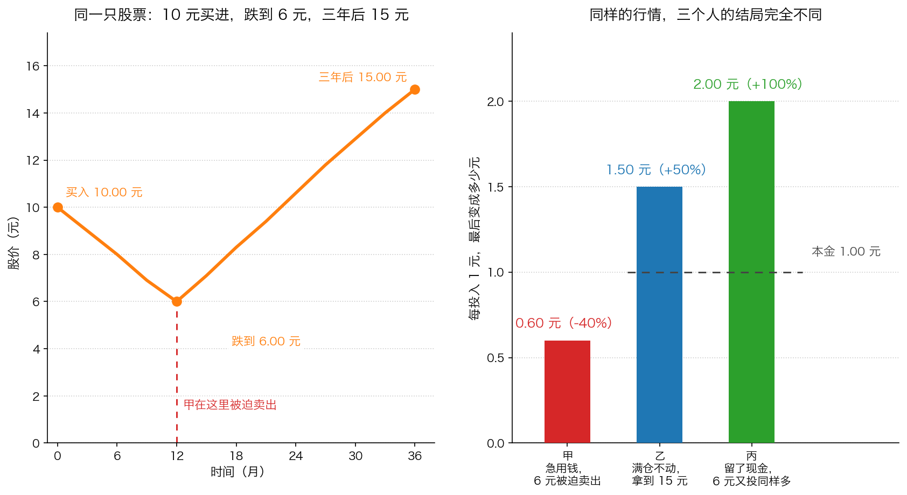

# 第 5 章：价格暂时波动的实用性

> 本章你将：
> - 分清"永久性损失的概率"和"价格暂时波动的概率"这两种完全不同的东西
> - 亲手算一遍：为什么"中间跌一半"的行情，反而让坚持投入的人赚得更多
> - 知道这个结论必须附加的三个前提——缺一个，它就从道理变成毒药
> - 搞懂"机会成本"是什么，以及为什么现金能在下跌时给你第二种优势
> - 拿到六条可以今天就执行的纪律，把你学到的风险观变成具体动作

上一章我们拆掉了 Beta：它只看过去的价格波动，看不见本金永久损失的可能。
这一章要回答最后一个问题，也是最实际的一个：
**既然波动不是风险，那价格上上下下这件事，对我到底有什么用？**

卡拉曼的回答很有意思——他专门用一节的篇幅（原书 p128–p130）
来讲"价格暂时性波动的**实用性**"。注意这个词："实用性"。
他不是说"你要忍受波动"，而是说**波动是可以被使用的**。
这一章就讲怎么用。

---

## 5.1 两种概率：一种会回来，一种不会

先把这一章的基础概念立清楚。卡拉曼是这么开头的：

> "一项投资除了伴有蒙受永久性损失的概率外，还伴有价格出现与潜在价值无关的暂时性波动的概率。（Beta 值没能区分这两者概率）"（p128）

这句话里有两个"概率"，请把它们当成两件完全不同的事情：

| | 永久性损失的概率 | 暂时性波动的概率 |
|---|---|---|
| 来自哪里 | 企业价值真的被毁掉；或你被迫在低点卖出 | 市场先生的情绪、资金进出、新闻噪音 |
| 会不会自己好 | 不会 | 会（只要价值还在） |
| 谁受影响 | 所有持有人（真的少了钱） | 只有"必须卖"或"没有现金"的人 |
| Beta 能区分吗 | **不能**（原书特意加了这句注） | |

**Beta 不能区分这两者**——这是上一章的结论在这里的第一次应用。
一只股票的 Beta 是 1.2，它可能是一只价值正在被毁掉的公司（真风险），
也可能是一家被错杀的好公司（假风险），但 Beta 给出的数字完全一样。

> 📌 **划重点：** 你每次面对下跌，第一件事不是看跌了多少，
> 而是问：**这次下跌里，有多少是"暂时性波动"，有多少是"永久性损失"？**
> 这两个东西的比例，决定了你该做什么。

---

## 5.2 短期下跌为什么会提高长期回报

现在讲这一章最反直觉、也最有用的一个结论。卡拉曼的原话是：

> "如果你以打折价购买了具有稳定价值的证券，那么短期内的价格波动要紧吗？长期而言，这种价格的波动不会有多大的影响，价值最终将反映在证券的价格中。"（p128）

紧接着他给出了更直接的表述：

> "具有讽刺意味的是，事实上长期投资的价格走向与受到市场影响的短期价格走向正好相反。例如，短期内价格的下跌实际上增加了长期投资者的回报。"（p128）

"短期内价格的下跌实际上增加了长期投资者的回报"——这句话第一次读会觉得像绕口令。
它成立的机制其实很简单，我们用一个生活例子先说明白：

> 💡 **换个说法：** 你每个月都去同一家超市买 10 斤米。
> 这个月米价从 5 元跌到 2.5 元，你会难过吗？不会——你会多买两袋。
> 明年米价涨回 5 元时，你的厨房里堆着的米，成本比按月买的人低得多。
> **下跌伤害的是"已经买完、且马上要卖"的人，帮助的是"还要继续买"的人。**

这正是价值投资者与普通股民最大的区别：**价值投资者是长期的净买入者。**
你现在的钱不多、未来还会持续有收入投进来，所以"价格便宜"对你是好消息，
就像"米价便宜"对还在买米的人是好事。

卡拉曼在同一节里还给了一个形象的比喻（p129）：

> "长线投资者对短期内的价格波动感兴趣的第三个原因就是，“市场先生”能够创造出非常诱人的买入和卖出机会。如果你持有现金，你就能利用这些机会。"

"市场先生"是 Week 3 学过的比喻：市场像一个情绪极不稳定的合伙人，
每天给你报一个价，你可以接受，也可以无视。
这一章补上了后半句：**当他报出荒唐的低价时，你得有钱才能接住。**

> 🇨🇳 **落到 A 股/港股：** 这个机制在现实中有一个很典型的场景——
> 一家每年稳定分红、生意没什么变化的公司，因为某个季度业绩不如预期、
> 或者因为整个板块被资金抛弃，股价跌了 30%。
> 如果你持有它的股票，你的账户上少了 30%；
> 但你每年的分红**一分没少**（假设分红金额不变），
> 而且同样的分红现在能买到更多的股份。
> 这就是"价格下跌提高长期回报"的实际样子：**不是股价涨回来救了你，
> 而是你在更低的价位上积累了更多份额。**

---

## 5.3 但有三类人，波动对他们真的是风险

上一节的结论听起来很美，但它有一个**绝对不能省略的前提**。
卡拉曼在讲完"下跌增加长期回报"之后，立刻补了一句转折：

> "然而，在非常时期，短期价格波动确实会给投资者带来影响。那些需要急着卖出证券的持有人被市场上的价格所支配。"（p128）

也就是说：**波动是不是风险，取决于你是谁、你的处境是什么。**
书里列出了三种"特定情况"（p128–p129）：

**第一类：必须在近期卖出的人。**
原书给了一句非常狠的话：成为成功投资者的秘诀就是**当他们想卖出的时候卖出，
而不是当他们不得不卖出的时候卖出**。这两者的差别，就是"礼物"和"灾难"的差别。
书里甚至给了一个很严格的推论：那些可能需要卖出证券的投资者，
除了最安全的短期国债之外，不应该持有任何交易性证券。

**第二类：投资"问题企业"的人。**
一家自己就快没钱的公司，股价会反过来决定它的命运（这就是上一章提过的"反射效应"）：
股价越低，它增发股票融资就越吃亏，甚至根本融不到钱。
对这类公司，价格下跌不是"打折"，而是"催命"。

**第三类：满仓、并且没有现金的人。**
这一条最容易被忽略，也最值得普通投资者留意。原文是：

> "如果你在市场下跌时满仓投资，你投资组合的价值会下跌，从而剥夺了你从更低的买入价格中获利的机会。这就产生了机会成本，即因放弃未来出现的机会而必然会引起的损失。"（p129）

请注意这句话里的因果链：**满仓 → 下跌时没钱 → 错过更便宜的价格 → 产生机会成本。**
它说的不是"你亏了钱"，而是"你**本来可以不亏**、或者**本来可以赚更多**"。

下面这张图把上面三种情况放在同一段行情里对比，请仔细看右边的柱子：
**三个人面对的是同一只股票、同一段价格走势，区别只在于"要不要被迫卖出"和"有没有现金"。**

图中的股票从 10 元跌到 6 元，三年后涨到 15 元：

- **甲**因为急用钱，在 6 元被迫卖出：每投入 1 元变成 **0.60 元（-40%）**，
  而且后来涨到 15 元与他无关；
- **乙**满仓不动，一直持有到 15 元：每投入 1 元变成 **1.50 元（+50%）**；
- **丙**留了现金，在 6 元时又投了同样多的钱：每投入 1 元变成 **2.00 元（+100%）**。

**这三个人里，没有一个人比另一个人更聪明**——他们的差别全在**买股票之前**就已经决定了：
这笔钱是不是闲钱、手里有没有留下现金。

---

## 5.4 什么是机会成本：现金的第二种价值

"机会成本"这个词第 3 章刚讲过，这里把它彻底讲清楚。

**生活类比**：你花了 200 元买了一张演唱会的门票，很开心。
但如果那 200 元本来可以用来买一本你更需要的学习资料呢？
你为了演唱会**放弃**的那本资料，就是这笔消费的机会成本。

**准确定义**：机会成本是指**因为你选择了 A，而放弃掉的 B 的价值**。
它不是一笔实际支出的钱，而是一个"本来可以"。

**为什么它在投资里特别重要？** 因为投资中的机会成本往往是**看不见的**：
你满仓被套，账面上亏了 30%，这个你看得见；
但"你本来可以在更低的价格买入"这件事，**没有任何账单会寄给你**。
你甚至不会意识到自己损失了什么。

卡拉曼接着给了降低机会成本的几种办法（p129–p130），我们把它们翻译成普通话：

1. **在组合里保留适量的现金。** 这是最直接的办法。
2. **持有那些能定期产生现金的证券。** 比如高比例分红的公司
   （A 股/港股 里的水电、煤炭、银行、高速公路类公司常常如此），
   它们每年把现金分到你手里，你就有子弹。
3. **优先考虑短期证券。** 短期债券到期快，钱很快回到你手上。
4. **关注催化剂。** "催化剂"就是能让价格向价值靠拢的事件
   （比如分拆、被收购、清算、大额回购），它会把账面的价值变成你手里的现金。
5. **适度对冲。** 这是更进阶的做法，Week 12 会讲，现在知道有这回事就行。

> ⚠️ **易踩坑：** 不要把"机会成本"和"亏损"混为一谈。
> 亏损是"你的钱少了"，机会成本是"你本来可以多赚"。
> 两者都要看，但它们的应对方法不同：对付亏损靠"买得便宜"，
> 对付机会成本靠"留有余地"。

---

## 5.5 什么时候波动是礼物：四个条件

现在把前面几节压缩成一张可以随身带的清单。
**一次下跌要成为"礼物"，必须同时满足下面四个条件：**

1. **你买的东西价值稳定。** 它的赚钱能力没有因为这次下跌而受损。
   （如果价值真的坏了，那就是陷阱，不是礼物。）
2. **你不需要在近期卖出。** 这笔钱是三年以上不用的闲钱。
3. **你还有能力继续买入。** 你有现金，或者你的收入还在持续进来。
4. **你愿意继续持有。** 这一点听起来最"软"，但最难：
   它要求你对自己的判断有依据，而不是靠勇气硬扛。

**四个条件里缺一个，性质就变了：**

| 缺哪一个 | 会变成什么 |
|---|---|
| 缺 1（价值真的坏了） | 陷阱——这是第三类下跌，该重新评估甚至卖出 |
| 缺 2（近期要卖） | 灾难——波动被"兑现"成永久损失 |
| 缺 3（没钱继续买） | 机会成本——你只能看着别人捡便宜 |
| 缺 4（拿不住） | 一样会在低点卖出，等于缺 2 |

> 📌 **划重点：** 这四条里，**只有第 1 条需要判断力，其余三条都是可以提前准备的。**
> 而你今天就能准备好的，是后三条：用闲钱、留现金、把理由写下来。

---

## 5.6 把波动变成朋友：六条今天的纪律

这一节是本周所有内容的落地清单。每一条都可以在你读完这一章之后立刻执行。

**第一条：给每一笔钱贴标签。** 在纸上写下三个数字：
① 未来 12 个月必须用的钱；② 一到三年内可能用的钱；③ 三年以上肯定不用的钱。
**只有第三类可以买股票。** 第一类放活期或货币基金，第二类考虑短期存款或短债。

**第二条：永远不借钱买股票。** 融资、配资、消费贷、信用卡套现——
它们会把"暂时波动"直接变成"强制卖出"。这是第 3 章讲过的纪律，这里再强调一次。

**第三条：分批买入。** 不要一次把钱全投进去。
分批的意义不只是摊平成本，更是**给自己留出反悔和修正判断的空间**：
你第一次买入之后，会逼着自己认真跟踪这家公司。Week 12 会讲具体方法。

**第四条：留一笔"看得见的现金"。** 它不是"没投出去的钱"，
而是你的**期权**——市场大跌那天，你有资格当买家。

**第五条：买入之前写下三句话。**
① 我认为它值多少钱、我是怎么算出来的；
② 我为什么觉得现在的价格便宜；
③ 出现什么情况，说明我错了。
**这三句话是你在恐慌时唯一可靠的锚。** 市场跌 30% 的时候，
你脑子里的第一反应一定是"快跑"；能救你的只有你自己在冷静时写下的字。

**第六条：把下跌当成一次体检，而不是一次审判。**
下跌的时候，你要检查的是**公司的经营**（财报、客户、竞争对手、负债），
而不是**自己的账户余额**。前者能告诉你真相，后者只会让你难受。

> 🇨🇳 **落到 A 股/港股：** 具体到工具上：
> - 第一类的钱 → 银行活期、货币基金；
> - 第二类的钱 → 定期存款、短债基金、国债逆回购（一种用国债做抵押的短期借钱工具）；
> - 第三类的钱 → 才考虑股票、指数基金、港股通标的。
> 分账户管理（比如两张银行卡、两个券商账户分开）比"心里记着"可靠得多——
> 因为人在着急的时候，只会看余额，不会看原则。

---

## 5.7 结论：三根柱子

这一章是 Week 8 的最后一章，也是全书第七章的结论部分。
卡拉曼用一段话把整章的落点总结完了：

> "价值投资者的主要目标是避免亏钱。价值投资策略的一个要素让这一目标的实现成为了可能。据我所知，自下往上法、通过基本面分析寻找一只低风险的便宜货是避免亏钱最可靠的方法。"（p130）

把这一周学的东西和我一起串一遍：

1. **自下而上**（第 0 章）：不预测宏观，一家公司一家公司地看，
   只问"它值多少钱、我付的价格够不够低"。找不到便宜货就持有现金。
2. **绝对表现**（第 1 章）：只跟自己的钱包比。跑赢指数不算成功，
   钱变多才算——因为你无法用相对回报付款。
3. **风险规避**（第 2、3、4、5 章）：
   - "高风险高回报"是错的，风险不发奖金，**只有价格发奖金**；
   - 风险是**亏损的概率加上潜在亏损额**，不是价格的上下波动；
   - 用它来衡量风险的所有指标（Beta、波动率、风险等级）
     都看不见"本金永久损失"这件事；
   - 波动本身是中性的，**它是礼物还是刀子，取决于你的处境**——
     而这件"处境"，是你今天就可以安排好的。

> 📌 **划重点：** 这一周没有教你任何选股技巧，它教你的是**站位**。
> 站在"我是长期净买入者、我手里有闲钱、我不需要被迫卖出"的位置上，
> 市场的下跌就从威胁变成了机会。而这个位置**不需要任何天赋，只需要纪律。**

> 下一周（Week 9）我们要开始学习这套方法里最需要技术的那一环：
> **企业评估**——一家公司到底值多少钱。
> 本周你反复听到"你要知道它值多少"，下周我们就来动手算。
> 到那时你会发现：本章说的"下跌是礼物"，前提是**你算得清那个价值**；
> 算不清，礼物和陷阱在你眼里长得一模一样。

---

## ✍️ 想一想

1. 同样一只股票从 20 元跌到 12 元。甲说"太好了，我再买点"，
   乙说"完了，我得赶紧卖"。用本章的四个条件，分析他们两个人的处境可能差在哪里。
2. "短期内价格的下跌实际上增加了长期投资者的回报"——如果一个人
   每个月都固定投入 2000 元买同一只指数基金，这句话对他成立吗？
   如果一个人是十年前一次性投入、现在准备取出来养老呢？
3. 有人说："既然下跌是好事，那我应该盼着股市跌。"
   这句话哪里对、哪里危险？

> 💡 **参考思路：**
> 1. 差异大概率在这几处：**甲的这笔钱是闲钱，乙可能近期要用**（条件 2）；
>    **甲有现金，乙满仓**（条件 3）；**甲算过这家公司值多少钱、知道 12 元是打折，
>    乙只是看到价格跌了**（条件 1 和 4）。注意：
>    乙不一定是错的——如果这家公司的价值真的坏了，乙卖出是对的。
>    我们无法从"跌了 40%"这一个信息判断谁对，只能从"价值有没有变"判断。
> 2. 对第一种人（每月固定投入），这句话**成立**：他每个月都在买，
>    价格越低，同样的 2000 元买到的份额越多，未来的回报越高——
>    这就是定投的数学原理（本章的算一算会亲手算一遍）。
>    对第二种人（一次性投入、即将取出），这句话**不成立**：
>    他的买入早就在十年前完成了，现在的下跌只是让他少拿钱，
>    而他也没有机会再买了。**同一句话，对不同的人结论相反——
>    这正是本章反复强调的"取决于你的处境"。**
> 3. 对的部分是：下跌确实为**净买入者**创造了更好的价格。
>    危险的部分是：**你无法知道下跌会到哪里，也无法知道价值会不会真的坏掉。**
>    盼着跌，会让你忽略第三种下跌（永久损失）；
>    更实际的态度不是"盼跌"，而是"准备好了"：
>    手里有现金、算得清价值、跌的时候按计划买，涨的时候按纪律卖。

---

## 🧮 算一算

> 下面用的是**简化示意数字**，让你亲手算出"下跌为什么会提高长期回报"。

### 情境

你打算连续三年、每年投入 **10000 元**买同一只基金。
三年后，这只基金的价格都是 **20 元**（两种情况最后的终点一样）。
区别在中间的路径：

- **情况 A（一路上涨）**：三年的买入价分别是 **10 元、16 元、20 元**；
- **情况 B（先跌后涨）**：三年的买入价分别是 **10 元、5 元、10 元**。

### 第 1 步：算每种情况各买到多少份额

份额就是"你买到的份数"，用投入的钱除以买入价：

**情况 A：**

- 第 1 年：$10000 \div 10 = 1000$ 份
- 第 2 年：$10000 \div 16 = 625$ 份
- 第 3 年：$10000 \div 20 = 500$ 份
- 合计：$1000 + 625 + 500 = \textbf{2125 份}$

**情况 B：**

- 第 1 年：$10000 \div 10 = 1000$ 份
- 第 2 年：$10000 \div 5 = 2000$ 份
- 第 3 年：$10000 \div 10 = 1000$ 份
- 合计：$1000 + 2000 + 1000 = \textbf{4000 份}$

**这一步在算什么：** 每一笔钱在当时的价位上"能换来多少东西"。
价格越低，同样一笔钱换来的份额越多。

### 第 2 步：算平均买入成本

三年一共投了 $10000 \times 3 = 30000$ 元：

- 情况 A：$30000 \div 2125 \approx \textbf{14.12 元/份}$
- 情况 B：$30000 \div 4000 = \textbf{7.50 元/份}$

**这一步在算什么：** 你每一份的平均成本。
情况 B 遭遇了一次腰斩，平均成本反而比情况 A 低了一半。

### 第 3 步：算三年后的总价值（终点价格都是 20 元）

- 情况 A：$2125 \times 20 = \textbf{42500 元}$
- 情况 B：$4000 \times 20 = \textbf{80000 元}$

**这一步在算什么：** 把份额换算成钱。

### 第 4 步：算总收益

- 情况 A：赚 $42500 - 30000 = 12500$ 元，
  收益率 $12500 \div 30000 \approx \textbf{+41.7\%}$
- 情况 B：赚 $80000 - 30000 = 50000$ 元，
  收益率 $50000 \div 30000 \approx \textbf{+166.7\%}$

**结论：中间经历过腰斩的情况 B，最终收益是情况 A 的 4 倍。**

**这一步在算什么：** 这就是"短期内价格的下跌实际上增加了长期投资者的回报"
这句话的完整算术。请注意它成立的三个前提：

1. **终点价格一样**（也就是价值最终没有受损，回到了 20 元）；
2. **你在下跌时继续买**（第 2 年那 10000 元是关键）；
3. **你中途没有卖出**（第 2 年账面浮亏 50% 的时候，你还在买）。

### 第 5 步：把前提拆掉，看会发生什么

**假设一：第 2 年你没有继续买，而是吓得卖掉了。**
那么情况 B 对你来说就是：10 元买入、5 元卖出 → 亏 50%。
"下跌增加长期回报"这句话对你**完全不成立**——因为你已经从"长期投资者"
变成了"被迫卖出的人"。

**假设二：这家公司第 3 年破产，清算价每股 1 元。**
情况 B 的 4000 份变成 $4000 \times 1 = 4000$ 元：

$$(4000 - 30000) \div 30000 \approx \textbf{-86.7\%}$$

**这一步在算什么：** 这就是"永久性损失"和"暂时性波动"的区别。
同样是"跌了很多然后没涨回来"，原因不同，性质完全不同：
- 如果是因为**价值被毁掉**（破产），那再低的价格也是陷阱；
- 如果是因为**市场情绪**（第 2 年那个 5 元），那它就是礼物。

**而这两件事，只能靠"你算得清这家公司值多少钱"来区分。**

### 第 6 步：如果你还有一笔现金（进阶）

假设在第 2 年价格 5 元的时候，你手里还额外有 10000 元现金并投了进去：

- 新增份额：$10000 \div 5 = 2000$ 份
- 总份额：$4000 + 2000 = 6000$ 份
- 总投入：$30000 + 10000 = 40000$ 元
- 三年后价值：$6000 \times 20 = 120000$ 元
- 收益率：$(120000 - 40000) \div 40000 = \textbf{+200\%}$

**这一步在算什么：** 这就是本章第 3 节说的"机会成本"的反面——
**有现金的人，在下跌中获得的不只是"没亏那么多"，而是真正的超额回报。**
这也是为什么卡拉曼把现金看作投资组合里不可或缺的一部分。

---

## ✅ 小测验

**1. "短期内价格的下跌实际上增加了长期投资者的回报"这句话，
在什么前提下成立？**
A. 在任何情况下都成立，只要拿得够久
B. 企业的价值没有受到永久损伤，而且投资者还有钱继续买、不必被迫卖出
C. 只要这只股票长期分红就一定成立
D. 只要投资者心理素质好就一定成立

**2. "机会成本"指的是什么？**
A. 买卖股票时要付的佣金和手续费
B. 因为把钱占用在别处，而错过未来更好机会所造成的损失
C. 通货膨胀导致的购买力下降
D. 股价下跌造成的账面浮亏

**3. 卡拉曼在给"什么时候该卖出"的建议时，强调的是哪一句？**
A. 在最低点买入，在最高点卖出
B. 当他们想卖出的时候卖出，而不是当他们不得不卖出的时候卖出
C. 永远不要卖出，长期持有
D. 只要跌 10% 就立刻止损

> **答案与解析**
>
> **1. B。** 这三个前提缺一不可：价值没坏（否则是永久损失）、
> 还有钱继续买（否则你只能看着）、不必被迫卖出（否则波动立刻变成真实亏损）。
> 选 A 的人把"长期"当成了万能药——长期持有的前提是**公司还活着且价值还在**；
> 选 C 只说了分红，分红不能拯救一家价值被毁掉的公司；
> 选 D 把问题归结为心理素质，忽略了"钱是不是闲钱""有没有现金"这些
> **可以在事前安排好**的客观条件。
>
> **2. B。** 原书的定义在 p129："因放弃未来出现的机会而必然会引起的损失"。
> A 是实际发生的费用，不是机会成本；C 是购买力风险，
> 它确实是持有现金的代价，但它和"错过机会"是两件事；
> D 是账面亏损。三者容易混，但只有 B 是"本来可以赚到、却因为没子弹而没赚到"。
>
> **3. B。** 这是 p128 的原话，也是本章最重要的一条实操忠告。
> 它的真正含义是：**你要提前安排好，让自己永远不需要在坏时点卖出。**
> A 是择时，没人能做到；C 忽略了"价值被毁掉"这种情况（该卖还是要卖）；
> D 是机械止损，它会把"礼物"直接变成"永久损失"——第 3 章已经讨论过。

---

## 📖 回到原书

- 对应原书 **第七章**「价值投资哲学起源」中的「价格暂时性波动的实用性」与「结论」，
  `raw/安全边际-中文版/page_128.md` ~ `page_130.md`，即原书 p128–p130。
- 建议精读 p128–p129：这一段把"什么时候波动是风险、什么时候是机会"讲得最完整，
  也是整个第七章里最实用的一段。
- 可以略读 p130 里关于"风险套利、破产与清算投资能带来现金流"的部分——
  那几类机会 Week 10 和 Week 11 会专门讲，现在只要知道
  "有些投资能更快地把钱还到你手上"就够了。
- 原书金句（逐字引用）：

### 金句一：两种概率

> "一项投资除了伴有蒙受永久性损失的概率外，还伴有价格出现与潜在价值无关的暂时性波动的概率。（Beta 值没能区分这两者概率）"（p128）

括号里那句话是这一周的点睛之笔：**所有的波动指标都不能区分这两种概率。**
它们把"可能会亏光的下跌"和"只是报价变低的下跌"算成一回事。

### 金句二：下跌与长期回报

> "如果你以打折价购买了具有稳定价值的证券，那么短期内的价格波动要紧吗？长期而言，这种价格的波动不会有多大的影响，价值最终将反映在证券的价格中。"（p128）

请注意这句话的两个限定词：**"以打折价"** 和 **"具有稳定价值"**。
把这两个词去掉，这句话就变成了害人的鸡汤。

### 金句三：整章的收尾

> "价值投资者的主要目标是避免亏钱。价值投资策略的一个要素让这一目标的实现成为了可能。据我所知，自下往上法、通过基本面分析寻找一只低风险的便宜货是避免亏钱最可靠的方法。"（p130）

第七章用这句话收尾：**自下而上 + 基本面分析 + 便宜的买入价**。
前两个是方法，最后一个是纪律。下一周，我们就开始学"基本面分析"
和"一只股票到底值多少钱"该怎么算。

---

## 本周回顾

| 章 | 一句话记住它 |
|---|---|
| 第 0 章 | 不预测宏观，一家公司一家公司地看；找不到便宜货就拿着现金等 |
| 第 1 章 | 只跟自己的钱包比——你无法用相对回报付款 |
| 第 2 章 | 风险本身不发奖金，**只有价格发奖金** |
| 第 3 章 | 风险是本金永久损失的可能，**不是价格波动** |
| 第 4 章 | Beta 只看见波动，看不见本金；它分不清打折和泡沫 |
| 第 5 章 | 波动是礼物还是刀子，取决于你有没有闲钱、现金和写下来的理由 |

> 📌 **本周最该带走的一句话：** 决定你投资结果的，
> 不是市场波动的大小，而是**你买入的价格**和**你是否被迫卖出**。
> 前者靠估值能力（Week 9 开始学），后者靠今天就能做的资金安排。
