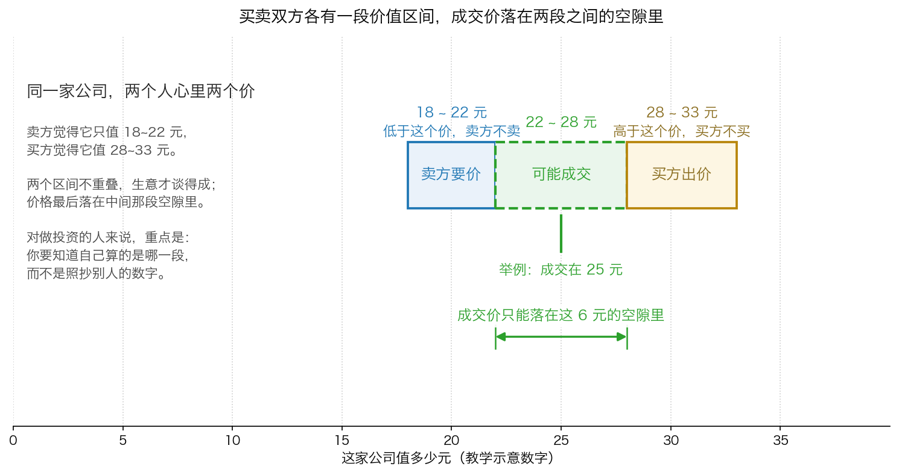
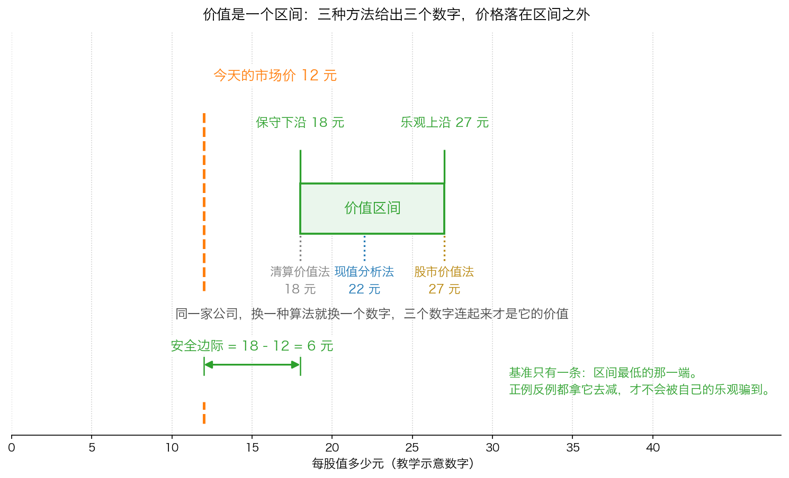

# 第 0 章：价值是一个范围，不是一个数

> 本章你将：
> - 用一个"给自己的房子估价"的生活场景，说清为什么企业价值天生给不出一个精确的数字
> - 知道"算得精确"和"算得正确"是两件完全不同的事，以及为什么计算器会让这件事更糟
> - 会说清格雷厄姆的"价值范围"到底是什么，以及为什么粗略的区间就够用了
> - 能看懂买卖双方各自的价值区间怎么决定成交价，并能用这个框架解释 A 股/港股 里的成交现象
> - 摸清这一周的三种估值方法各自管什么，以及它们为什么要一起用
> - 这对你的钱包意味着什么：以后看到"目标价 XX 元"，你会知道该追问哪三件事，而不是直接照着买

Week 7 我们讲了"必须打折"，Week 8 我们讲了"该怎么想"。
这两周都建立在同一个前提上：**你手里得先有一个"价值"的数字**。
这一章就来处理这个前提——而且要先告诉你一个坏消息：
这个数字**永远不可能精确**。好消息是，不精确并不妨碍你做决定。

---

## 0.1 先从你自己的房子说起

问你一个问题：**你现在住的房子（或者你父母住的房子），值多少钱？**

你大概会想一下同小区的成交价，然后给一个数，比如"大概 300 万"。

现在换一个问法：**它值 2,987,500 元吗？**

你会觉得这个问题很奇怪。你不可能知道得那么准。你能确定的只有一件事：
它大概在 280 万到 320 万之间，而且这个区间本身还挺宽的——
取决于楼层、朝向、装修、买家急不急、以及那阵子楼市冷不冷。

卡拉曼在书里就是用房子来打比方的。他在讲完企业估值有多难之后，写了一句：

> "你对自己房子的估价无法精确到几千美元。为何对复杂的大企业进行评估那么难呢？"（p131）

这句话有个巧妙的转折。他不是想说"大企业比房子难估"，
他是想说：**连一栋你天天住、看得见摸得着、还有同小区成交价做参照的房子，
你都只能给一个"大概"，那你凭什么觉得一家横跨几个行业、
有几千名员工、几十年历史的公司，能被你算到小数点后两位？**

> 💡 **换个说法：** 估值的本质不是"测量"，而是"**判断**"。
> 测量是拿尺子量桌子，量多少次都是 1.20 米。
> 判断是估计明年公司能赚多少钱——它取决于太多你控制不了的东西。
> 你不可能"测量"一家公司的价值，你只能"判断"它大概值多少。

---

## 0.2 精确的错觉：计算器不会替你想清楚假设

既然估值是判断，为什么还有那么多人以为自己算出了精确答案？

因为工具太好了。

卡拉曼在 1991 年写这本书的时候，最时髦的工具是**电子表格**——
一种能自动做加总、乘除、贴现的电脑表格。他当时的评价相当不客气：

> "计算机化电子数据表的出现让这一问题进一步恶化，并让人产生了能够进行全面且细致分析的错觉。"（p132）

他要表达的意思是：你把一堆假设填进表格，表格会吐出一个小数点后两位的数字，
比如"每股内在价值 47.83 元"。这个 47.83 看起来很权威，
于是你忘了问一个最要紧的问题：**这个数字是从哪些假设里长出来的？**

更早的一段话他说得更直接：

> "任何想精确评估企业价值的尝试都将带来不准确的评估。问题是人们很容易将作出精确预测的能力与作出正确预测的能力混为一谈。"（p131）

> 📌 **划重点：** 这一章最重要的一句话就是这个区分——
> **"算得精确"是一种算术能力，"算得正确"是一种判断能力。**
> 电子表格、财务模型、估值小程序，都只能帮你做前一件事。
> 它们把你填进去的假设，一丝不苟地放大成一个看起来很确定的数字。
> 假设错了，放大得越精确，错得越离谱。

顺便说一句，这个道理在别的地方也成立。你在超市看到"今日特价 9.98 元"，
那个 8 是精心设计的，它让你觉得这个价格是"算出来的"，而不是"拍的"。
金融里的精确数字有同样的心理效果——**小数点的作用不是提高准确度，而是提高可信度。**

---

## 0.3 格雷厄姆的答案：价值范围

那怎么办？不估了？当然不是。

卡拉曼的老师格雷厄姆早就想过这个问题。他在《证券分析》里给出了一个
听起来很"不专业"、但实际上极其解放人的答案：**你只需要一个范围。**

卡拉曼在书里把这段话抄了出来，标题就叫"价值范围"：

> "关键的一点是，证券分析并不是未来精确决定某种证券的内在价值。证券分析的目的仅仅是确定价值是否足够——如是否足以支持一种债券或者支持购买一种股票——或者价值是否大幅高于或者低于市场上的价格。对内在价值粗略和大致的衡量可能就已经足以达到这样的目的了。"（p132–133）

这段话值得拆成三层来读：

1. **证券分析的目的不是"精确决定价值"。** 它不是一项测量工作。
2. **它的目的是回答"够不够"。** 价值够不够支撑买入？价格是不是大幅低于价值？
3. **粗略和大致的衡量就够了。** 因为你要回答的是一个"是/否"的问题，
   而不是交一份精确的答卷。

> 🇨🇳 **落到 A 股/港股：** 这个思路解决了一个具体的困境。
> 假设你估出某家公司每股大概值 20 元，但你心里清楚误差可能有正负 20%。
> 那么这家公司的股价在 25 元时，你根本不需要纠结"20 元和 21.5 元哪个对"——
> 两种算法都告诉你它不便宜，**不做这笔投资**。
> 反过来，如果股价是 9 元，你也不需要纠结精度——
> 无论 18 还是 22，你都占了很大的便宜，**可以开始认真研究**。
> 真正需要精度的，只有股价正好落在 16 到 24 元之间那一小段灰色地带。
> 而价值投资的纪律是：**待在灰色地带之外，别在那儿做决定。**

格雷厄姆自己怎么做的呢？卡拉曼给了一个细节：

> "事实上，格雷厄姆常常会计算每股的营运资金净额（net workingcapital），即粗略地估测一下这家公司的清算价值。他对这种粗略的近似值的使用表明。他承认自己经常无法更精确地确定一家公司的价值。"（p133）

这就是本周第 3 章要讲的那把"最硬的尺子"——**清算价值**。
格雷厄姆用它的方式很朴素：不追求算准，只追求算出一个足够低的底。
如果价格比这个底还低，那就不需要更精确的计算了。

---

## 0.4 1989 年的两个拍卖：专业分析师的预期差两倍

你可能还是有点不服气：那是格雷厄姆那个年代信息不发达。
今天有券商研究所、有行业数据库、有专家访谈，专业分析师的估值总该准了吧？

卡拉曼给了两个真实例子，都在 1989 年。他没有给具体数字，
但给了一个让人印象深刻的对比：

> "例如，1989 年坎普公司将布鲁明戴尔卖给了有意购买这家公司的买家；HarcourtBrace Jovanovich 公司将旗下的Sea World 子公司进行了拍卖。在这两个案例中，华尔街对这两项资产的价值预期相差很大，最高的预期是最低的预期的两倍。"（p133）

**最高的预期是最低的预期的两倍。** 注意这是在什么情况下发生的：

- 这不是两家名不见经传的小公司。布鲁明戴尔是美国著名的连锁百货，
  Sea World 是著名的海洋主题公园。
- 分析师不是懒得研究。这些是要被买卖的整块资产，
  看一份资料就能决定几亿美元去向的生意，没人会马虎。
- 信息也不是不充分。买卖双方都做了尽职调查。

**结果还是差了一倍。** 卡拉曼的结论是这样的：

> "如果有着广泛信息的专业分析师都无法更确定地判断这些知名企业的价值，那么投资者不应自欺欺人，认为自己购买可交易的证券时有能力根据从公开渠道获得的有限信息作出更准确的预测。"（p133）

> ⚠️ **易踩坑：** 这一段最容易被误读成"所以研究没用"。
> 卡拉曼的意思恰恰相反——**研究非常有用，但它的用处不是让你算得更准，
> 而是让你知道"这家公司大概值多少"以及"我的把握有多大"。**
> 一个诚实的估值结论应该长这样：
> "我算出来大概 20 到 26 元，我最有把握的说法是'它肯定不止 12 元'。"
> 而不是"它值 23.47 元"。

那为什么市场上的分析师还是都给"一个数"呢？因为**一个数更好卖**。
这一点 Week 4 讲过：华尔街的生意需要你动手交易，
而一个精确的目标价，比一段诚实的区间更能推动你动手。

> 🇨🇳 **落到 A 股/港股：** 你可以做一个很简单的实验。
> 打开任意一只票的券商研报页面，把最近半年所有机构给的"目标价"抄下来，
> 算一下最高和最低差多少。你会发现差 50%、甚至差一倍是常态。
> 这不是分析师不专业，这是**估值这件事本身的性质**。
> 你要做的不是找出谁对，而是问：
> "**他们各自用的什么假设？这些假设我认不认？**"

---

## 0.5 买家的价值和卖家的价值，成交价在中间

为什么估值必然是一个范围？还有一个更根本的原因：**价值是相对于人的。**

同一家公司，对你是"未来几十年收分红的凭证"，对别人可能是"一块可以拆开来卖的地皮"。
两个人都没错，但算出来的数字完全不同。
卡拉曼把这件事总结成一句话：

> "每一项被买卖的资产都有一个受限于买家价值和卖家价值的价值范围，实际的交易价格将处在买卖双方的价值预期中间。"（p133–134）

这句话有点绕，我们用一张图把它拆开。

*图 0-1：卖家觉得这家公司只值 18 到 22 元，低于 18 元他不卖；买家觉得它值 28 到 33 元，高于 33 元他不买。两个区间不重叠，生意才谈得成，价格落在中间那段空隙里（数字是教学示意）。*

这里有一个反直觉但极重要的点：**双方并不需要"对价值有共识"才能成交。**
恰恰相反，**成交需要的是"没有共识"**。

- 如果双方都认为它值 25 元，卖家不会 20 元卖，买家不会 30 元买，**没有交易**。
- 正因为买家觉得 30 元以上才划算、卖家觉得 20 元就满意，
  中间那段 22 到 28 元才有得谈。

所以你去想一想：**每一次成交，都必然有一方是"错"的**（事后看）。
这不是市场的缺陷，这是市场能存在的前提。

> 💡 **换个说法：** 你在菜市场买菜也是一样。你觉得这把青菜值 5 元，
> 摊主觉得 2 元就该出手。你们对"这把青菜值多少"永远没有共识，
> 但你们在 3 元成交了。**价格从来不是"价值的正确答案"，
> 它只是"某一刻买家和卖家刚好都点头的那个数"。**
> 股票市场唯一的区别是：同意和反悔都只需要一秒钟，所以价格天天在变。

卡拉曼还举了一个具体得多的例子来解释这件事。1991 年年初，
Tonka 公司的垃圾债券价格大幅低于面值，股票每股只有几美元。
几家投行建议把公司卖掉，孩之宝（Hasbro）愿意出比其他买家更高的价——

> "事实上，较之保持独立经营或者同其他多数公司合并，tonka 公司与孩之宝公司的合并让该公司孩之宝创造了更多的现金流。对于tonka 公司的价值，金融市场与孩之宝公司分歧巨大，这种分歧随着孩之宝收购Tonka 公司之后被消除。"（p134）

注意最后半句：**分歧在收购完成后被消除了。**
金融市场（也就是每天的股价）认为 Tonka 值 A，孩之宝认为值 B，B 明显大于 A。
孩之宝按 B 附近的价格买下来，市场上那些按 A 定价的股票持有者赚到了钱。
**这笔钱的来源，就是"分歧"。**

---

## 0.6 三种方法，三把不同的尺子

好，既然价值是一个范围，那这个范围怎么算出来？

卡拉曼说他试过很多方法，最后只留下三种：

> "虽然存在许多用于企业价值评估的方法，但我发现只有三种方法是有用的。"（p134）

*图 0-2：同一家公司，三种方法各算出一个数字（示意数字 18 元、22 元、27 元），三个数字连起来才是它的价值区间。今天的市价 12 元落在区间外面。安全边际永远只拿区间最低的那一端去减。*

三种方法是：

| 方法 | 一句话说明 | 它在问什么 | 本周章节 |
|---|---|---|---|
| **现值分析法**（净现值法） | 把公司未来能产生的钱，一年一年折回今天，加起来 | "这家公司继续经营下去，能给我赚回多少钱？" | 第 1、2 章 |
| **清算价值法** | 假设公司今天就关门，把资产一件件卖掉还完债，还剩多少 | "最坏最坏的情况下，我能拿回多少？" | 第 3 章 |
| **股市价值法** | 看同类公司在股市上卖多少钱，拿这个来估 | "如果它明天在市场上挂出来，大概能卖多少？" | 第 4 章 |

加上一个和现值分析法长得很像的变体：**私有市场价值法**——
不看股市，而是问"一个老练的商人愿意花多少钱把整家公司买下来"。
它本质上也是拿别人的成交价来参照。

> 📌 **划重点：** 这三种方法**不是竞争关系，是互补关系**。
> - 现值分析法算的是"**上限**"：它假设公司一直好好经营下去。
> - 清算价值法算的是"**下限**"：它假设公司明天就完蛋。
> - 股市价值法算的是"**参照**"：别人今天愿意出多少。
>
> 你当然希望公司的价值接近上限。但你要付出的价格，
> 应该参考**下限**。这就是 Week 7 讲的安全边际的算法——
> 而这一周，你终于能把那个"价值"自己算出来了。

---

## 0.7 这一周的地图

最后交代一下这一周怎么走，你心里有个数：

1. **第 1 章**讲现值分析法——把未来的钱折回今天的完整手艺。
   这一章会给你一张一张的手算表格，全是除法和加法。
   同时它会诚实地告诉你这套方法的**三个难题**。
2. **第 2 章**专门处理三个难题里最难的那个：**贴现率该怎么选**。
   这一章的结论不是"用 10%"，而是"你要能说出为什么"。
3. **第 3 章**讲清算价值——那把最硬的尺子。
   我们会一级一级地把账面价值打折到清算价值，再讲格雷厄姆的"纯营运资金净额"。
4. **第 4 章**讲股市价值法，以及一个很迷人的现象：
   **价格反过来改写价值**（反射关系）。
5. **第 5 章**是这一周的收尾，也是全课程技术含量最高的一章：
   我们把卡拉曼书里那个**1990 年前后的真实案例**（Esco 电子公司）
   从头到尾算一遍。你会看到同一家公司，
   四种方法算出四段完全不同的价值区间，而股价只有 3 美元。

**不需要任何超出四则运算的工具。** 一支笔，一张纸，就够了。

---

## ✍️ 想一想

1. **如果你的房子只能给一个"大概 280 万到 320 万"的区间，
   为什么你从来不会因此拒绝卖房？** 把这个道理搬到股票上：
   "我算不出精确价值"这件事，为什么不应该成为你不做估值的理由？
2. **假设你和另一个人对同一家公司的估值差了整整一倍，你们各自都没算错。
   请说出至少三种可能造成这种分歧的原因。**
   然后想一想：在这种情况下，"谁对"这个问题有意义吗？
3. **卡拉曼说企业的价值会随着宏观经济、微观经济和市场因素变化而改变，
   所以投资者必须不断重估。** 那么问题来了：如果价值一直在动，
   "安全边际"是不是也一直在动？这对你"买入之后该怎么办"意味着什么？

> 💡 **参考思路：**
> 1. 因为你卖房要做的是一个**比较判断**，不是一个**精确测量**。
>    只要买家的出价落在你心里的区间之上、而且高于你的替代选择（比如不卖、出租），
>    你就卖；否则就不卖。你从来不需要知道"精确值"。
>    股票上是同一个道理：估值的用处是回答"**这个价格划不划算**"，
>    而不是拿一个精确数字去和股价做等号。所以"算不出精确价值"完全不构成拒绝估值的理由——
>    真正该拒绝的是"没有区间就下单"。
> 2. 常见的三种原因是：①**用的方法不同**（你用现值法，他用清算价值法，
>    同一家公司本来就该算出不同结果）；②**假设不同**（你认为未来五年每年增长 5%，
>    他认为零增长；你用 10% 贴现率，他用 15%）；③**对同一块资产的用途判断不同**
>    （你认为这块地要建厂，他认为这块地该卖掉，估值差一倍很正常）。
>    在这种情况下问"谁对"意义不大——因为**没有人能提前知道**。
>    有意义的问法是："**如果他的假设成立，我还会不会买？**"
>    如果你的答案是"即使按他那套更保守的假设，价格也划算"，
>    那你就找到了一个不依赖预测的投资。
> 3. 是的，安全边际一直在动。价值上升，同样的价格下安全边际变厚；
>    价值下降，安全边际变薄甚至消失。这意味着两件事：
>    ① **买入不是一次性动作**。你不能"研究一次，买入，然后忘掉"——
>    你要定期把假设重算一遍。
>    ② **卖出不是因为跌了，而是因为价值变了或者价格超过了价值**。
>    这一条 Week 12 会专门讲。现在你只要记住：
>    **一个不肯更新自己估值的人，和一个从不估值的人，风险其实差不多。**

---

## 🧮 算一算

这一章不涉及复杂的折现，但要练一件更基础的事：
**把"一个数"拆成"一段区间"**，并学会用区间来做决定。

### 情境

有一家公司，你用三种方法分别估了一下：

| 你用的方法 | 算出来的每股价值 |
|---|---|
| 清算价值法 | 15 元 |
| 现值分析法 | 24 元 |
| 股市价值法 | 30 元 |

今天这家公司的股价是 **11 元**。

### 第 1 步：写出这家公司的价值区间

**最低的一端 = 三种方法里最低的那个数 = 15 元**
**最高的一端 = 三种方法里最高的那个数 = 30 元**

所以这家公司的价值区间是 **15 元 到 30 元**。

*这一步在算什么：把三个独立的估计拼成一段范围。注意不是取平均值——
平均值 23 元把"最坏情况"给抹掉了，而最坏情况恰恰是价值投资者最在乎的。*

### 第 2 步：算安全边际（只拿最低的那一端去减）

安全边际 = 保守价值 - 买入价 = **15 - 11 = 4 元**

换算成百分比：4 除以 15 = **26.7%**

*这一步在算什么：算你"最多能错多少还不会亏本"。你按 11 元买入，
就算这家公司最后只值 15 元（三种方法里最差的那个结果），你仍然有 4 元的缓冲。*

> ⚠️ **易踩坑：** 这里只能拿**最低那一端 15 元**去减，
> 不能拿 30 元去减（30 - 11 = 19 元），更不能拿平均值去减。
> 同一个公式里必须只有一个参照点，否则你会同时算出好几个"安全边际"，
> 然后自动挑最让我高兴的那个——这是最常见的一种自欺欺人。

### 第 3 步：假设股价涨到 16 元，安全边际还在吗？

安全边际 = **15 - 16 = -1 元**

**安全边际变成负数了。** 意思是：如果这家公司最终只值 15 元，
你在 16 元买入就贵了 1 元。注意：16 元仍然远远低于价值区间上沿 30 元——
所以"股价还在区间内"**不等于**"有安全边际"。

*这一步在算什么：区分"股价低于价值区间上沿"和"有安全边际"这两件完全不同的事。
很多人只看前者，结果在区间中间就买了，把自己的容错空间用光了。*

### 第 4 步：如果股价是 7 元呢？

安全边际 = **15 - 7 = 8 元**

占保守价值的比例：8 除以 15 = **53.3%**

*这一步在算什么：看"厚"的安全边际长什么样。
股价越低于区间下沿，你的缓冲越厚。但要注意：股价跌到 7 元这件事本身，
也可能是在提示你——**你的 15 元估值可能估高了**。这一点是下一步要说的。*

### 第 5 步：股价越是低于你的估值，你越应该做什么？

**回去把假设重算一遍，问自己："市场看到了什么我没看到的东西？"**

具体要检查三件事：

1. **我用的数字是几年前的？** 如果最新的年报显示净利润大幅下滑，你的 15 元可能要下修。
2. **我的"最低那一端"是不是其实还能更低？** 比如清算价值的计算里，
   库存我按六折算，但如果这批库存是过时的电子产品，可能要按两折算。
3. **这家公司是不是在持续烧钱？** 一个每年亏掉一大笔现金的公司，
   它的"清算价值"会一年一年缩水——它不是静止的，是漏水的桶。

**如果三条都检查完了，估值站得住，那股价下跌就是好消息；**
**如果有一条站不住，那就不是便宜，是陷阱。**

*这一步在算什么：把"估值"从一次性考试变成周期性体检。这也是 Week 7 讲的那件事——
便宜和控制是两件必须同时成立的事。*

| 股价 | 安全边际（拿 15 元减） | 占保守价值的比例 | 该怎么办 |
|---|---|---|---|
| 7 元 | 8 元 | 53.3% | 先重算假设，站得住就是好机会 |
| 11 元 | 4 元 | 26.7% | 可以开始认真研究 |
| 15 元 | 0 元 | 0% | 没有缓冲，等于在赌自己的估值一定对 |
| 16 元 | -1 元 | 负数 | 贵了，不碰 |

---

## ✅ 小测验

**1. 卡拉曼说"人们很容易将作出精确预测的能力与作出正确预测的能力混为一谈"，这句话的意思是：**
A. 预测能力不重要，不用学
B. 算得精确（小数点多、模型复杂）和判断得对，是两件不同的能力；工具只能帮前一件
C. 只要用电子表格，就能算出正确的价值
D. 企业价值可以被精确计算，只是很难

**2. 关于"价值范围"，下面哪种说法符合格雷厄姆和卡拉曼的观点？**
A. 只要足够努力，就能把企业价值精确到一个确定的数字
B. 价值范围很宽就说明分析失败，应该继续研究直到范围收窄为一个点
C. 证券分析的目的不是精确决定内在价值，而是判断价值是否足够、价格是否大幅偏离价值
D. 价值范围只是给外行用的粗略说法，专业机构都能算到小数点后两位

**3. 一家公司三种方法估出的价值分别是 15 元、24 元、30 元，股价 19 元。
按本周的纪律，安全边际是多少？**
A. 11 元（拿 30 减 19）
B. 5 元（拿 24 减 19）
C. -4 元（拿 15 减 19）
D. 无法计算，因为三种方法结果不一致

> **答案与解析**
>
> **1. B。** 卡拉曼整段话的重点就是区分两种能力：电子表格让你**算得精确**，
> 但"精确"只是把你填进去的假设一丝不苟地放大出来，它不会替你判断假设对不对。
> 所以 A 错在"预测能力不重要"——他反对的是**假装能精确预测**，不是反对研究；
> C 错在把工具当答案，"垃圾进，垃圾出"说的就是这个；
> D 正好说反了，他的原话是"任何想精确评估企业价值的尝试都将带来不准确的评估"。
>
> **2. C。** 这是格雷厄姆原话的核心：证券分析的目的"仅仅是确定价值是否足够
> ——如是否足以支持一种债券或者支持购买一种股票——或者价值是否大幅高于或者低于市场上的价格"。
> A 和 D 都假设精度可达；B 把"范围宽"当失败，其实范围宽本身就是重要信息
> （说明这家公司难估，你应该更保守或者干脆放弃）。
>
> **3. C。** 安全边际必须用**保守价值的最低那一端**去减：
> 15 - 19 = -4 元。A 拿了最高端（30 元）去减，这是最典型的自欺欺人；
> B 拿了中间值去减，等于把最坏情况抹掉了；
> D 错在"三种方法结果不一致就没法算"——不一致是常态，本课程的做法是**取最低的那个当基准**。

---

## 📖 回到原书

- 对应原书 **第八章** 的前三节：
  `raw/安全边际-中文版/page_131.md` ~ `page_135.md`（原书 p131–p135），
  也就是"价值范围""企业评估"，以及"现值分析法"的开头一段。
- **建议精读：p131–p132**（为什么精确评估不可能、电子表格带来的错觉）。
  这两页是整章的立场，读懂了后面都好办。
- **建议精读：p132–p133**（格雷厄姆关于"价值范围"的原话，以及那两个拍卖案例）。
- **建议精读：p134**（买家价值、卖家价值、成交价三者的关系；Tonka 与孩之宝的例子）。
- **可以略读：p134–p135**（三种方法的清单）。
  这一周后面四章会把它们逐一展开，这里只要知道有哪三种就够了。
- 原书金句（逐字引用）：
  > "你对自己房子的估价无法精确到几千美元。为何对复杂的大企业进行评估那么难呢？"（p131）
  > "任何想精确评估企业价值的尝试都将带来不准确的评估。问题是人们很容易将作出精确预测的能力与作出正确预测的能力混为一谈。"（p131）
  > "如果有着广泛信息的专业分析师都无法更确定地判断这些知名企业的价值，那么投资者不应自欺欺人，认为自己购买可交易的证券时有能力根据从公开渠道获得的有限信息作出更准确的预测。"（p133）
  > "每一项被买卖的资产都有一个受限于买家价值和卖家价值的价值范围，实际的交易价格将处在买卖双方的价值预期中间。"（p133–134）
  > "要想成为一名价值投资者，你必须以低于潜在价值的贴现价格购买证券。"（p134）
