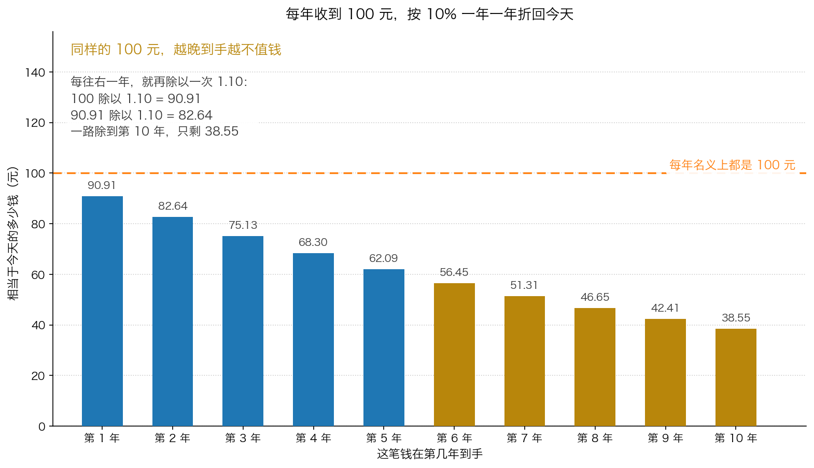
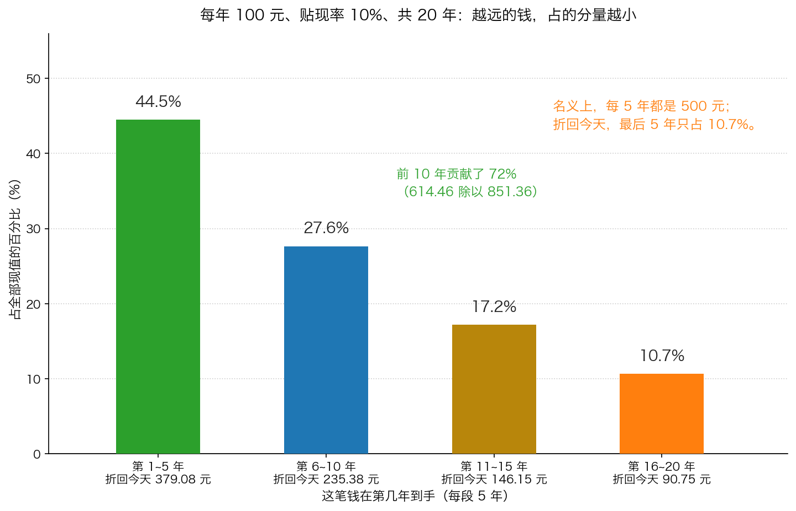

# 第 1 章：现值分析法——以及它的三个难题

> 本章你将：
> - 把 Week 2 学过的"一年一年往后除"正式用起来，算出一家公司未来所有现金的今天价值
> - 会手算一张完整的逐年折现表，并用一张"1.12 连乘小抄"省力气
> - 理解"永续年金"：为什么每年 100 元永远给下去，按 10% 只值 1000 元
> - 说出这套方法的三个难题：现金流预测不准、贴现率难选、价值的大头压在很远的未来
> - 知道卡拉曼给这三个难题的统一答案是什么，以及为什么"保守"是一种可以操作的纪律
> - 这对你的钱包意味着什么：你会知道任何一份"现金流折现估值报告"里，最该盯的不是结论，而是假设

第 0 章我们把"价值是一个范围"这件事立住了。从这一章开始，
我们要动手把那个范围算出来。第一种方法，也是三种方法里用得最多的一种：
**现值分析法**（也叫净现值法）。

它的全部内容可以压缩成六个字：**预测未来，折回今天。**
难的不是那两步除法，难的是你填进去的东西。

---

## 1.1 先把 Week 2 那把小刀磨一磨

Week 2 我们讲过贴现的全部数学。这里复习三句话，三十秒就够：

1. **钱有时间价值。** 今天的 100 元比明年的 100 元值钱。
2. **往未来算用乘法。** 100 元按 10% 走一年，是 100 乘 1.10 = 110 元。
3. **往今天算用除法。** 明年的 110 元折回今天，是 110 除以 1.10 = 100 元。

再补一条这一章要天天用到的规律：**除几次，取决于隔几年。**
第 1 年后的钱，除以一次 1.10；第 2 年后的钱，要除以两次，也就是除以 1.21；
第 3 年后的钱，除以三次，也就是除以 1.331。

| 年数 | 要除以的那个数（10% 的情况） |
|---|---|
| 1 | 1.10 |
| 2 | 1.21 |
| 3 | 1.331 |
| 4 | 1.4641 |
| 5 | 1.61051 |

这张表每一个数都是前一个数乘 1.10 得来的，Week 2 已经给过。

**现在换一个贴现率：12%。** 我们需要一张新小抄，做法完全一样，只是每次都乘 1.12：

| 年数 | 1.12 连乘这么多次的结果 | 怎么来的 |
|---|---|---|
| 1 | 1.120000 | 1.12 |
| 2 | 1.254400 | 1.12 乘 1.12 |
| 3 | 1.404928 | 1.2544 乘 1.12 |
| 4 | 1.573519 | 1.404928 乘 1.12 |
| 5 | 1.762342 | 1.573519 乘 1.12 |

> 📌 **划重点：** 这张小抄你要自己会算。方法只有一句：
> **每一个数 = 上一个数乘（1 加 贴现率）。**
> 10% 就乘 1.10，12% 就乘 1.12，15% 就乘 1.15。
> 会了这一步，剩下的全是除法，一台最便宜的计算器就够。

---

## 1.2 完整走一遍：把一家公司未来 5 年的钱折回今天

### 情境

假设有一家公司（数字是教学示意），你估计它**未来 5 年，每年能给你带来 100 元的现金**，
第 5 年之后就不值钱了。你要求的年回报率是 **10%**。

问题：**这家公司今天值多少钱？**

有人会脱口而出："5 年一共 500 元啊。" 这就错了——
因为明年的 100 元不等于今天的 100 元，后年的 100 元更不等。

正确做法是：**把每一年的 100 元，分别折回今天，再全部加起来。**

### 手算表

| 年份 | 名义上能拿到 | 要除以几（10% 小抄） | 折回今天值多少 |
|---|---|---|---|
| 第 1 年 | 100 元 | 除以 1.10 | **90.91 元** |
| 第 2 年 | 100 元 | 除以 1.21 | **82.64 元** |
| 第 3 年 | 100 元 | 除以 1.331 | **75.13 元** |
| 第 4 年 | 100 元 | 除以 1.4641 | **68.30 元** |
| 第 5 年 | 100 元 | 除以 1.61051 | **62.09 元** |
| **合计** | **500 元** | — | **379.07 元** |

一步一步算给你看：

- 第 1 年：100 除以 1.1 = 90.91
- 第 2 年：100 除以 1.21 = 82.64
- 第 3 年：100 除以 1.331 = 75.13
- 第 4 年：100 除以 1.4641 = 68.30
- 第 5 年：100 除以 1.61051 = 62.09
- 加起来：90.91 + 82.64 = 173.55；加 75.13 = 248.68；加 68.30 = 316.98；加 62.09 = **379.07**

**所以这家公司今天值 379.07 元，不是 500 元。**
差的 120.93 元，就是"时间"收走的钱。

*图 1-1：同样每年名义上收到 100 元，但越晚到手，折回今天越少。第 1 年的 100 元值 90.91 元，第 10 年的 100 元只剩 38.55 元。柱子的高度就是真实数字。*

### 换成 12% 会怎样

同样的 5 年、每年 100 元，只把贴现率从 10% 抬到 12%：

| 年份 | 名义上能拿到 | 要除以几（12% 小抄） | 折回今天值多少 |
|---|---|---|---|
| 第 1 年 | 100 元 | 除以 1.12 | 89.29 元 |
| 第 2 年 | 100 元 | 除以 1.2544 | 79.72 元 |
| 第 3 年 | 100 元 | 除以 1.404928 | 71.18 元 |
| 第 4 年 | 100 元 | 除以 1.573519 | 63.55 元 |
| 第 5 年 | 100 元 | 除以 1.762342 | 56.74 元 |
| **合计** | **500 元** | — | **360.48 元** |

**同一个预测，只换了个贴现率，价值就从 379.07 掉到 360.48，少了 18.59 元（约 5%）。**
记住这个感觉，第 2 章整章都在讲这件事，而它的威力远不止 5%。

### 如果你的预测期是 10 年呢

把同样的表拉长到 10 年、贴现率 10%：

| 年份 | 折回今天 | 年份 | 折回今天 |
|---|---|---|---|
| 第 1 年 | 90.91 | 第 6 年 | 56.45 |
| 第 2 年 | 82.64 | 第 7 年 | 51.31 |
| 第 3 年 | 75.13 | 第 8 年 | 46.65 |
| 第 4 年 | 68.30 | 第 9 年 | 42.41 |
| 第 5 年 | 62.09 | 第 10 年 | 38.55 |
| 前 5 年小计 | **379.07** | 后 5 年小计 | **235.38** |
| | | **10 年合计** | **614.45** |

一句话总结这张表：**前 5 年贡献了 62%，后 5 年只贡献了 38%。**
时间越往后，那笔钱对今天的贡献越小。这是这套方法最重要的一个性质，
第 1.6 节会把它变成一个难题。

---

## 1.3 永续年金：如果这笔钱永远给下去

现实里的公司不会在第 5 年就关门。所以算完明确能预测的那几年之后，
你还要处理"**那之后的一整段**"。这个"那一整段"有个名字，叫**终值**。

最简单的假设是：从第 6 年开始，每年永远给你同一笔钱。这种现金流叫**永续年金**。

**每年 100 元、永远给下去，按 10% 贴现，今天值多少？**

答案是一个除法：**100 除以 0.10 = 1000 元。**

为什么？用一句大白话解释：

> 假设你花 1000 元买下它，每年拿回 100 元。
> 100 元正好是 1000 元的 10% —— 你的本金一分没少，回报率正好是 10%，达标了。
> 假设你花 1200 元买下它，每年还是拿回 100 元，那只相当于 8.3%，达不到你要求的 10%。
> 所以你能接受的最高买入价，就是 **100 除以你要求的回报率**。
> 要求 10%，上限 1000 元；要求 12%，上限 833.33 元；要求 15%，上限 666.67 元。

> 💡 **换个说法：** 永续年金的估值，本质上就是"**这笔钱每年能给你多少，
> 除以你要求多少**"。它是一个"利率的倒数"关系——你要求得越高，愿意付的价越低。
> 这也解释了为什么**利率一涨，所有资产的价格都往下掉**：
> 全世界的"除以的那个数"都变大了。

那么"第 6 年以后永远每年 100 元"折算到**今天**值多少？要分两步：

1. **先算它在第 5 年末值多少。** 站在第 5 年末看，这是一笔从第 6 年开始的永续年金：
   100 除以 0.10 = **1000 元**。
2. **再把这 1000 元从第 5 年末折回今天。** 除以 1.61051：
   1000 除以 1.61051 = **620.92 元**。

所以"第 6 年以后那一整段"对今天的贡献是 620.92 元，
比前 5 年加起来（379.07 元）还多。

> ⚠️ **易踩坑：** 很多人在这一步会犯一个错：把"第 5 年末的 1000 元"
> 直接当成今天的价值。这就是**忘了折回来**。
> 站在第 5 年末看是 1000 元，站在今天看只有 620.92 元——
> 中间那 379 元是五年的等待成本。
> 在真实的估值报告里，"忘了把终值折回来"是最常见的高估来源之一。

---

## 1.4 难题一：未来现金流根本预测不准

现在你掌握了这套方法的全部手艺。接下来是坏消息：**这套手艺的难点不在算术上。**

卡拉曼在书的开头就把话说得很坦白：

> "当未来现金流很好预测，且能够选择合适的贴现率时，那么净现值法会是最准确和最精确的价值评估法之一。不幸的是，未来现金流通常情况下是不确定的，而且经常是高度不确定的。"（p135）

他给了一个绝妙的对照组：**年金**。年金每年给你一模一样的钱，所以它完美适用现值分析法。
但企业不是年金：

> "年金是完美的现值分析法的简化版例子。年金每年产生稳定的现金流或者现金流每年稳定的增长。很不幸，即使是最好的实体企业都不是年金。"（p135）

为什么不是？他接着说：

> "很少有企业能占领其他企业无法涉足的缝隙市场并持续产生高回报，多数企业都处在竞争激烈的环境中。无论是收入还是支出的微小变化都会给企业的盈利造成更大的影响。出错的几率高于正确的几率。"（p135）

注意最后那一句：**"出错的几率高于正确的几率。"**
这不是悲观，这是常识。一家公司面对的是：竞争对手在降价、客户在换供应商、
原材料在涨价、政策在变、汇率在动、关键员工在离职。
**你对它五年后的预测，大概率会在某个地方出错。**

卡拉曼用可口可乐做了一个示范，来说明"能预测的东西"和"不能预测的东西"
差别有多大：

> "可口可乐公司明年会销售苏打水么？当然会。今年该公司的销售会增加么?毫无疑问会的，因为自1980 年以来，可口可乐公司每年的销售量都在增长。但它的销售量会增加多少不是很明确。"（p136）

**"会不会"可以预测，"多少"不能。** 这个区分极其有用。再看一段他讲增长来源的话：

> "总的来说，找到可能让企业收益增长的来源，较之预测最终企业收益将增长多少以及这些来源会如何影响利润要简单得多。"（p137）

翻译成你可以直接用的方法：

- 你能做的事：**找出这家公司未来可能靠什么增长**（人口结构？提价？抢份额？新市场？）
- 你做不到的事：**算出这些增长最后会变成每股多少利润**

> 🇨🇳 **落到 A 股/港股：** 这个区分可以直接用来读研报。
> 一份研报如果说"高端白酒的消费人群在扩大，这家公司的产能还在投放"——
> 这是**来源**，是相对可靠的部分。
> 如果说"预计 2026 到 2028 年归母净利润分别为 812.4 亿、886.1 亿、951.7 亿"——
> 这是**结果**，小数点后的那位数基本没有信息量。
> 你读研报时应该重点看的，是它列出的增长来源你认不认，
> 而不是它算出来的那串数字。

他还举了 1990 年的一个具体教训：

> "出现了一个不可解决的矛盾：为了进行现值分析，你必须对未来进行预测，然后对未来的预测并不可靠。1990 年使用高杠杆融资的企业未能实现几年前所作出的信誓旦旦的预期的事实就突出了预测未来有多么困难，哪怕仅仅是预测几年的未来，这些公司包括美国南方公司和Interco 公司——这两家公司的业绩都不及自己预期的一半。"（p137–138）

**"不及自己预期的一半"** ——注意这些不是外部分析师的预测，
是公司**自己**做的预测，由最了解公司的人做的，还失败了。

---

## 1.5 难题二：贴现率难选

第二个难题是：**你到底该除以几？**

上面所有表格里，10% 和 12% 都是我随手给的。现实中这个数字从哪来？

卡拉曼的说法是这样的：

> "不存在适用于所有未来现金流的正确的单一贴现率，在选择贴现率时也不存在精确的方法。"（p139）

而且他专门点出了最流行的那种偷懒做法：

> "许多投资者会很自然地使用10%作为适用于一切投资的贴现率，而无视正在考虑中的投资的本质。"（p139）

**10% 是一个方便记忆的整数，但它不是答案。** 这一条太重要了，
我们整章第 2 章来展开。这里你只要先记住一个规律：
**贴现率越高，算出来的价值越低。** 所以"保守"这件事是有旋钮可以拧的。

---

## 1.6 难题三：价值的大头，压在你最看不清的地方

第三个难题最隐蔽，也最容易把人坑到。

前面 1.2 节的表已经露了苗头：同样是每年 100 元，前 5 年的 500 元折回今天有 379.07 元，
后 5 年的 500 元折回今天只有 235.38 元。

把预测期拉到 20 年，对比会更刺眼：

*图 1-2：同样每年 100 元、贴现率 10%，把 20 年分成四段，每一段折回今天占总现值的比例。名义上每段都是 500 元，但最后 5 年只占总现值的 10.7%。*

具体数字：

| 哪几年的钱 | 名义上收到 | 折回今天 | 占全部现值的比例 |
|---|---|---|---|
| 第 1~5 年 | 500 元 | 379.08 元 | 44.5% |
| 第 6~10 年 | 500 元 | 235.38 元 | 27.6% |
| 第 11~15 年 | 500 元 | 146.15 元 | 17.2% |
| 第 16~20 年 | 500 元 | 90.75 元 | 10.7% |
| **合计** | **2000 元** | **851.36 元** | **100%** |

再往外推：如果把这套现金流算到 30 年，第 21 到第 30 年那十年，名义上又给你 1000 元，
折回今天只有 **91.34 元**，占 30 年总现值的 **9.7%**。

**看出问题了吗？** 你预测的年份越往后，那些数字对今天的价值贡献越小；
可是在真实的估值里，恰恰是"最后那一段"贡献了最大的一块。

为什么？因为真实估值不会算 20 年就停，它通常是这样做的：

1. 明确预测未来 5 到 10 年（这段时间你还能讲出点道理）；
2. 然后**一次性补上一个"终值"**，代表"第 10 年以后的所有年份"。

而这个终值往往是靠"假设它以后每年都以某个速度稳定增长"算出来的。
结果就是：**你算出来的总价值里，可能有六成到八成，来自一个你完全无法验证的假设。**

### 用 Esco 那个真实案例先看一眼

第 5 章要详细讲的 Esco 电子公司，就是这个问题的活标本。
在"业绩毫无改善"的假设下，它每股每年给你 0.45 美元（前 5 年）、
之后每年 0.90 美元（永远）。按 12% 折回今天：

| 这一段的钱 | 折回今天 | 占总价值的比例 |
|---|---|---|
| 第 1~5 年 | 1.62 美元 | 28% |
| 第 6 年以后（永续那一整段） | 4.26 美元 | 72% |
| **合计** | **5.88 美元** | **100%** |

*图 1-3：Esco 电子公司每股现值的构成。前 5 年那五根小柱子加起来只有 1.62 美元，而"第 6 年以后永远每年 0.90 美元"这一根就有 4.26 美元，占总价值的 72%。*

**72% 的价值，建立在一个谁也证明不了的假设上。**
这就是"终值占比过大"这个难题的真实长相。

> 📌 **划重点：** 三个难题连起来看，你会发现它们指向同一件事——
> **现值分析法的输出精度，远远高于它的输入精度。**
> 你填进去的是猜测，算出来的是一个精确到分的数字。
> 这种落差会让人产生虚假的信心，而这正是卡拉曼最担心的。

---

## 1.7 卡拉曼的解法：保守立场

那就不用现值分析法了吗？用。但换一个用法。

> "价值投资者如何通过预测不可预测的事情来进行分析呢？唯一的答案就是保持保守立场。因为所有的预测都会出现错误，乐观的预测往往会让投资者处在不确定的情形下。必须诸事正确才能确保盈利，否则可能蒙受持续亏损。保守的预期可以更容易实现甚至被超越。"（p138）

这段话里有一句是钥匙：**"必须诸事正确才能确保盈利，否则可能蒙受持续亏损。"**

这就是乐观预测的可怕之处：它把"赚钱"变成了一件**需要所有事情都按你想的发展**才能实现的事。
而现实里，一件小事出错就够了。

接着是具体的操作规则：

> "投资者都知道只可做保守的预测，然后只能以大幅低于根据保守预测作出的价值评估的价格购买证券。"（p138）

**请注意这句话的结构，它有两个必须同时成立的部分：**

1. **做保守的预测**（把估值压低）；
2. **以大幅低于这个保守估值的价格买入**（把买价再压低一次）。

很多人只做了第一步——用保守假设估出一个较低的价值——然后就在这个价格附近买了。
这是不够的。**保守的估值不是安全边际，它只是安全边际的起点。**
安全边际是"保守估值"和"买入价"之间那一段距离。

> 🇨🇳 **落到 A 股/港股：** 这个"双重保守"的结构，你可以直接套到自己的纪律里。
> 例如：你给某家公司算出的保守价值是 20 元。
> 那就规定自己**只在 14 元以下才认真考虑买入**（也就是打七折）。
> 这个 14 元不是别人给你的，是你自己给自己定的。
> 它的作用不是让你赚更多，而是让你在"我算错了 30%"的情况下依然不亏本。

### 三个难题和三个对策

| 难题 | 它的表现 | 保守的做法 |
|---|---|---|
| 现金流预测不准 | 公司自己的预测都常常不及一半 | 用偏低的增长假设；宁可假设零增长，也不要假设高增长 |
| 贴现率难选 | 10% 还是 15%，没人能证明 | **往高里放**。拿不准就用 12%~15%，确定性极高的才用 8%~10% |
| 终值占比过大 | 六到八成价值压在一个假设上 | 别太相信终值；把明确能预测的那几年的现金流单独看，问自己"光靠这几年，我值不值" |

> 💡 **换个说法：** 现值分析法像一支很精密的狙击枪，但靶子在雾里。
> 卡拉曼的应对不是把枪扔掉，也不是假装雾不存在，
> 而是**站得离靶子更近一点再开枪**——也就是只在价格远远低于估算价值时才动手。
> 距离够近，就算偏了几厘米，也还是能打中。

---

## ✍️ 想一想

1. **为什么"公司明年还会不会卖苏打水"可以预测，但"明年能卖多少"就不能？**
   请用你自己熟悉的某个行业（比如楼下的餐馆、你所在的公司）举一个例子，
   分别说出一个"可以预测的"和一个"不能预测的"。
2. **如果你的估值里，有 70% 的价值来自"第 10 年以后"，你会怎么调整自己的做法？**
   提示：想一想你能做的是"让那部分更可靠"还是"降低对那部分的依赖"。
3. **"保守的估值不是安全边际，它只是安全边际的起点。"** 请用一句自己的话解释这句话。
   然后想一想：如果一个投资者只用保守假设估值，但按估值价买入，他有没有安全边际？

> 💡 **参考思路：**
> 1. "会不会"是一个**结构性问题**，答案藏在生意的性质里：这条街上的住户还需要吃饭，
>    这家餐馆就在他们楼下，所以"它明年还会营业、还有人吃"是相当确定的。
>    但"它明年能卖多少碗面"取决于几百个变量：隔壁开不开新店、
>    这几个小区有没有人搬走、食材涨不涨价、老板会不会换厨师。
>    **结构可以判断，数量只能猜。** 所以你在做估值时，应该把精力放在"这门生意靠什么活着"
>    这类结构问题上，而不是去争"明年是增长 8% 还是 11%"。
> 2. 两件事都要做，但顺序上先做第二件。
>    **降低对那部分的依赖**是你能控制的：把明确能预测的那几年（比如 5 年）单独算出来，
>    先问自己"光靠这 5 年，我付这个价划算吗"。
>    如果答案是"划算"，那么第 10 年以后那些假设无论对不对，你都不太可能亏大钱。
>    反过来，如果一笔投资**必须**靠第 10 年以后才能赚钱，那它就不是价值投资，
>    而是对一个遥远未来的赌注——不管你把那个未来描述得多有道理。
>    至于"让那部分更可靠"，你只能通过选生意来改善（比如需求极稳定的公用事业），
>    而不能通过把模型做得更复杂来改善。
> 3. 这句话的意思是：**估值保守不会自动给你安全边际，只有价格才能给你。**
>    保守估值只是把参照点往下挪了一格，你还得在这个参照点下面留出距离。
>    一个用保守假设估出 20 元、然后花 20 元买入的人，**没有安全边际**——
>    他的全部缓冲就是"我的保守假设一定不出错"，而这恰恰是没法保证的事。
>    他的安全边际只有在 14 元买入时才出现。

---

## 🧮 算一算

### 情境

有一家公司（数字是教学示意），你做了这样的预测：

- 未来 5 年，每年能产生 **200 元** 的自由现金流；
- 第 5 年之后，你不想假设它会永远增长，就假设它**从第 6 年开始每年固定给你 200 元，永远给下去**；
- 你要求的年回报率是 **12%**。

问题：**这家公司今天值多少钱？**

### 第 1 步：先写出 1.12 的连乘小抄

每一个数都是上一个数乘 1.12：

| 年数 | 除以几 |
|---|---|
| 1 | 1.12 |
| 2 | 1.2544 |
| 3 | 1.404928 |
| 4 | 1.573519 |
| 5 | 1.762342 |

*这一步在算什么：把"要除的那个数"先备好。所有折现的活儿都靠这张小抄。*

### 第 2 步：把前 5 年每年的 200 元折回今天

| 年份 | 名义现金流 | 除以几 | 折回今天 |
|---|---|---|---|
| 第 1 年 | 200 元 | 1.12 | 178.57 元 |
| 第 2 年 | 200 元 | 1.2544 | 159.44 元 |
| 第 3 年 | 200 元 | 1.404928 | 142.36 元 |
| 第 4 年 | 200 元 | 1.573519 | 127.10 元 |
| 第 5 年 | 200 元 | 1.762342 | 113.49 元 |
| **小计** | **1000 元** | — | **720.96 元** |

加法过程：178.57 + 159.44 = 338.01；加 142.36 = 480.37；加 127.10 = 607.47；
加 113.49 = **720.96**。

*这一步在算什么：把明确能预测的 5 年，一年一年折回今天再加起来。
注意名义上 1000 元，折回今天只剩 720.96 元，时间收走了 279.04 元。*

### 第 3 步：算"第 6 年以后那一整段"

**第一小步：站在第 5 年末看，这一整段值多少？**

每年 200 元永远给下去，你要求 12%，所以：

200 除以 0.12 = **1666.67 元**

（验算：1666.67 乘 12% = 200.00，正好是你每年拿到的钱。对上了。）

*这一步在算什么：永续年金的估值就是一个除法——每年的钱，除以你要求的回报率。
它回答的是"如果我只要求刚好拿到这份现金流，我最多愿意付多少"。*

**第二小步：把这 1666.67 元从第 5 年末折回今天。**

1666.67 除以 1.762342 = **945.72 元**

*这一步在算什么：别忘了折回来！第 5 年末的 1666.67 元和今天的钱不是一回事，
中间隔着五年的等待。这一步是整套算法里最容易漏掉的一步。*

### 第 4 步：加起来

720.96 + 945.72 = **1666.68 元**

**所以这家公司今天大约值 1666.68 元。**

*这一步在算什么：把"明确能预测的部分"和"之后那一整段"加在一起，
就得到了现值分析法的答案。*

### 第 5 步：看看这个答案有多脆弱

**换个贴现率会怎样？** 保持所有现金流预测一模一样，只把贴现率从 12% 抬到 15%。

先写 1.15 的连乘小抄：

| 年数 | 除以几 |
|---|---|
| 1 | 1.15 |
| 2 | 1.3225 |
| 3 | 1.520875 |
| 4 | 1.749006 |
| 5 | 2.011357 |

前 5 年折回今天：

| 年份 | 200 元折回今天 |
|---|---|
| 第 1 年 | 173.91 元 |
| 第 2 年 | 151.23 元 |
| 第 3 年 | 131.50 元 |
| 第 4 年 | 114.35 元 |
| 第 5 年 | 99.44 元 |
| **小计** | **670.43 元** |

第 6 年以后那一段：

- 站在第 5 年末：200 除以 0.15 = 1333.33 元
- 折回今天：1333.33 除以 2.011357 = **662.90 元**

合计：670.43 + 662.90 = **1333.33 元**

**对比一下：**

| 贴现率 | 同一套现金流预测下的价值 |
|---|---|
| 12% | 1666.68 元 |
| 15% | 1333.33 元 |

**一模一样的一家公司、一模一样的现金流预测，
只因为把贴现率从 12% 抬到 15%，价值就掉了 333.35 元，也就是 20%。**

*这一步在算什么：给"这个结论有多稳"做一次体检。当一个小假设的改动能让结果动 20% 的时候，
你就应该明白：把结论当成精确数字来用是不理智的。正确的用法是把它当成一段区间，
然后在区间之外才做决定。*

### 第 6 步：这个价值里，有多少压在第 5 年以后？

- 前 5 年：720.96 元，占 720.96 除以 1666.68 = **43.3%**
- 第 6 年以后：945.72 元，占 **56.7%**

**超过一半的价值，压在一个"永远每年 200 元"的假设上。**

那么该怎么做？把这 5 年单独拎出来看：**720.96 元**。
如果这家公司的价格远远低于 720.96 元，那么即使"永远"那部分一分钱都不值，
你也不吃亏。这个动作，就叫"**降低对终值的依赖**"。

*这一步在算什么：把估值从"一个数"拆成"两部分"，然后只依赖你最有把握的那一部分。
这是第 1.6 节那个难题的实战解法。*

---

## ✅ 小测验

**1. 一家公司未来 3 年每年给你 100 元，第 3 年之后就没有了。贴现率 10%。
这家公司今天值多少钱（最接近的答案）？**
A. 300.00 元
B. 248.69 元
C. 273.55 元
D. 330.00 元

**2. 一笔永续年金每年给你 60 元，永远给下去。你要求的回报率是 12%。
它今天值多少钱（忽略"从第几年开始"这个细节，只算这个永续年金本身的价值）？**
A. 500 元
B. 720 元
C. 60 元
D. 无法计算，因为年数是无穷多的

**3. 关于现值分析法的三个难题，下面哪种说法是正确的？**
A. 只要把预测期拉得足够长，现金流预测就会变得准确
B. 贴现率应该统一用 10%，这是行业惯例
C. 越远的现金流对今天的价值贡献越小，但真实估值里价值的大头常常正好落在最远的那一段（终值）
D. 只要模型做得足够复杂，终值占比过大这个问题就能解决

> **答案与解析**
>
> **1. B。** 一年一年除：第 1 年 100 除以 1.1 = 90.91；第 2 年 100 除以 1.21 = 82.64；
> 第 3 年 100 除以 1.331 = 75.13。加起来 90.91 + 82.64 + 75.13 = 248.68（约 248.69）。
> A 是"把三年直接相加"，等于假装钱没有时间价值；
> C 是"只把后两年打折、第一年不打折"这类半吊子算法的结果；
> D 比 A 还高，方向完全错了。
>
> **2. A。** 永续年金的价值 = 每年的钱 除以 贴现率 = 60 除以 0.12 = 500 元。
> B 的 720 是"60 乘 12"这种把除法做成乘法的典型错误；
> C 是完全没做贴现，把"每年拿到多少"当成了"它值多少"；
> D 错在"无穷多年就不可算"——永续年金的估值恰恰是整套现值法里最简单的一个除法，
> 因为它假设每年一样多，所以"无穷"被那个除法一次性吸收掉了。
>
> **3. C。** 远期现金流的折现值确实很小（10% 贴现率下，第 20 年的 100 元只值 14.86 元），
> 但真实估值不会算到 20 年就停，它会用一个"终值"代表之后所有年份，
> 于是价值的大头常常落在最不可靠的那一段。A 错在把"预测期变长"和"预测变准"混为一谈——
> 时间越远越难预测；B 正是卡拉曼点名批评的做法，他的原话是
> "许多投资者会很自然地使用10%作为适用于一切投资的贴现率，而无视正在考虑中的投资的本质"；
> D 错在模型复杂度和假设可靠度是两件事，第 0 章讲的"垃圾进，垃圾出"说的就是这个。

---

## 📖 回到原书

- 对应原书 **第八章** 的这几节：
  `raw/安全边际-中文版/page_135.md` ~ `page_138.md`
  （现值分析法和预测未来现金流中的困难，原书 p135–p138），
  以及 `page_141.md`（现值分析法的两种用法和敏感度分析，原书 p141）。
- **建议精读：p135**（年金为什么是"完美例子"，以及"即使是最好的实体企业都不是年金"）。
  这一段是本章第 1.3 节和第 1.4 节的源头。
- **建议精读：p136–p137**（可口可乐和啤酒行业的例子）。
  重点不是那些数字，而是他区分"可以预测的"和"不可以预测的"的方式。
- **建议精读：p138**（"唯一的答案就是保持保守立场"那一段）。
  这是整章的行动纲领，值得抄在本子上。
- **可以略读：p136–p137 里的行业细节**（啤酒、威士忌、无酒精啤酒的具体讨论）。
  时代背景，知道"增长来源的可预测性差别很大"这个结论即可。
- 原书金句（逐字引用）：
  > "当未来现金流很好预测，且能够选择合适的贴现率时，那么净现值法会是最准确和最精确的价值评估法之一。不幸的是，未来现金流通常情况下是不确定的，而且经常是高度不确定的。"（p135）
  > "很少有企业能占领其他企业无法涉足的缝隙市场并持续产生高回报，多数企业都处在竞争激烈的环境中。无论是收入还是支出的微小变化都会给企业的盈利造成更大的影响。出错的几率高于正确的几率。"（p135）
  > "本书中再出现的一个主题就是未来是不可预测的，除非是在一些限定条件下。"（p136）
  > "总的来说，找到可能让企业收益增长的来源，较之预测最终企业收益将增长多少以及这些来源会如何影响利润要简单得多。"（p137）
  > "价值投资者如何通过预测不可预测的事情来进行分析呢？唯一的答案就是保持保守立场。"（p138）
  > "投资者都知道只可做保守的预测，然后只能以大幅低于根据保守预测作出的价值评估的价格购买证券。"（p138）
