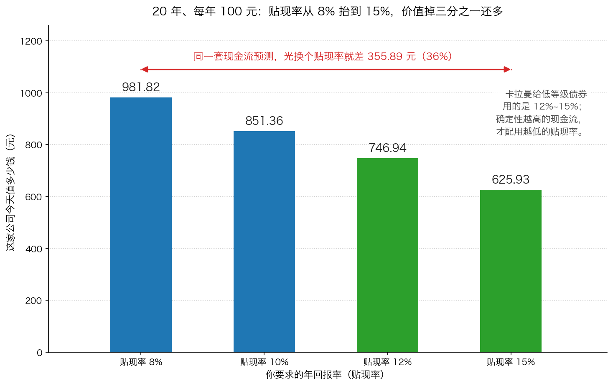

# 第 2 章：贴现率该怎么选

> 本章你将：
> - 用一个借钱的场景说清贴现率到底是什么，以及它为什么不是利率、不是通胀率、不是 GDP 增速
> - 知道卡拉曼为什么说"不存在正确的贴现率"，以及他为什么专门批评"一律用 10%"这种做法
> - 找到贴现率那个天然的锚：无风险利率，并知道它和 12%~15% 之间的关系
> - 理解为什么利率很低的时候，反而要格外警惕长期持股
> - 会做一次敏感度分析：把贴现率上下挪一挪，看结论会不会翻盘
> - 这对你的钱包意味着什么：以后听到"按 X% 贴现算出值 Y 元"，你的第一反应会是去问"那按 X 加 3% 呢"

第 1 章我们把现值分析法的算术全部走通了，也留下了三个难题。
三个难题里，**贴现率**是唯一一个你能自己拍板、也最容易被自己骗过去的。
这一章专门处理它。

---

## 2.1 贴现率到底是什么：一个借钱的故事

先别看公式，看一个场景。

你的一个远房亲戚找你借 **1 万元**，说好**一年后还你 1 万元整**。你借吗？

当然不借。你会说："存银行都还有利息呢，你至少要还我 1.05 万。"

现在换一个人。这次是个你不太熟的人，他做的生意你听不太懂，
他说一年后还你 1 万元。你还会要求 1.05 万吗？

不会。你可能会说："**至少要 1.15 万**，而且我要签合同。"

**同样是一年后还你 1 万元，为什么两次的"要价"不一样？**
因为你心里那个"最低回报要求"变了。第一次是 5%，第二次是 15%。

**这个"最低回报要求"，就是贴现率。**

卡拉曼给它下了一个更严谨的定义：

> "事实上，贴现率是指让当前的现金流与未来的现金流一致的利率。"（p138–139）

这句话读起来有点绕，但你可以这样理解：贴现率是那把"尺子"，
它规定了"今天的 1 元"和"明年的 1 元"之间怎么换算。
尺子定得越严（贴现率越高），明年的钱在今天就显得越不值钱。

> 💡 **换个说法：** 贴现率是"**你愿意为这笔未来的钱付多少**"的另一种表达。
> 你要求 10%，那么明年的 110 元在你眼里就值今天的 100 元。
> 你要求 15%，同样明年的 110 元只值今天的 95.65 元。
> 你没变，钱没变，**变的只是你心里那把尺子。**

### 为什么不能用低贴现率"让自己感觉好一点"

卡拉曼描述了两类投资者的心理：

> "非常喜欢当前预期而非未来预期，或者喜欢当前的确定性而不喜欢未来的不确定性的投资者，可能会使用高贴现率来贴现自己的投资。其他投资者可能更希望自己的预测是正确的，他们会使用一个较低的贴现率，这种贴现率让未来的现金流几乎具有同今天的现金流一样的价值。"（p139）

第二类人要特别当心。用低贴现率（比如 5%）会发生什么？未来的钱折回今天几乎不打折，
于是**任何一家公司看起来都很便宜**。你会觉得"这家公司值 100 元，才卖 60 元，太划算了"，
但真相是：你的尺子太松了。

> ⚠️ **易踩坑：** 把贴现率调低，是让自己"算出来的价值变高"最简单的方法，
> 也是自欺欺人最舒服的方式。判断自己有没有犯这个错，有一个简单的自检：
> **你选这个贴现率的理由，是在分析这家公司，还是在说服自己？**
> 如果你的理由是"这样算出来刚好比股价高一点"，那就已经错了。

---

## 2.2 卡拉曼说：不存在"正确"的贴现率

这是本章最重要的一句话，请读两遍：

> "不存在适用于所有未来现金流的正确的单一贴现率，在选择贴现率时也不存在精确的方法。"（p139）

注意他用的是**"不存在"**，不是"很难找"。这句话的含义很硬：

- 你永远不会在某个地方查到一个"正确的贴现率"；
- 就算你把一家公司研究到极致，贴现率这个数字仍然是**你自己拍的**；
- 所以你算出来的价值，本质上带着**你自己的影子**。

他接着说，影响你选择的因素有一大堆：

> "对一项特定投资所选择的贴现率是否合适不仅依赖于投资者对当前预期和未来预期的偏爱程度，投资者的风险偏好、对处在考虑之中的投资的风险认知和从替代投资中可获得的回报等因素也会带来影响。"（p139）

把这四件事拆开看，其实都很生活：

| 影响贴现率的因素 | 白话版 | 对你的实际操作意味着什么 |
|---|---|---|
| 对当前和未来预期的偏爱 | 你是"现在拿到才踏实"还是"愿意等" | 越不愿意等，贴现率越高 |
| 你的风险偏好 | 你是保守型还是激进型 | 保守型的人贴现率天然更高，这没错 |
| 你对这笔投资的风险认知 | 你觉得这门生意有多不确定 | **这是最重要的一个变量**，也是本章的核心 |
| 替代投资的回报 | 你不买它，还能买什么、能拿多少 | 别的选择越好，你对它的要求就该越高 |

> 📌 **划重点：** 第三个变量——"**你对这笔投资的风险认知**"——是你可以通过研究去改善的，
> 也是唯一应该让你调整贴现率的理由。
> 一家长期合同锁死、需求极其稳定的公司，你可以用 9%；
> 一家强周期、五年后完全看不清的公司，你应该用 15%。
> **贴现率是你对"确定性"的报价。**

---

## 2.3 10% 这个奇妙的整数：好用在哪儿，坑在哪儿

卡拉曼花了整整一段来批评一种流行做法：

> "投资者往往将事情看得过于简单，选择贴现率的方法就是一个很好的例子。许多投资者会很自然地使用10%作为适用于一切投资的贴现率，而无视正在考虑中的投资的本质。"（p139）

紧接着是一句非常有名的话：

> "10%是一个奇妙的整数，方便记忆，也易于使用，但它并不总是最好的选择。"（p139）

**"奇妙的整数"** ——这个说法很妙。10% 之所以流行，不是因为它在数学上有什么特殊地位，
而是因为**它是十进制的整数**，好记、好算、好解释。

- 10% 的好处：心算容易（除以 1.1、除以 1.21、除以 1.331）；
  它大致对应了股票长期的平均回报，所以听起来"合理"。
- 10% 的坑：它把"一家水电公司"和"一家亏损的矿业公司"当成了同一件事。
  前者你几乎能预测它明年的发电量和电价，后者你连它明年是赚是亏都说不准。
  **给它们套同一个贴现率，等于宣布"这两件事的不确定性一样"。**

> 🇨🇳 **落到 A 股/港股：** 这个坑在 A 股里有一个特别常见的变种。
> 有人会说："这家公司未来三年净利润复合增速 30%，所以给它 30 倍市盈率不算贵。"
> 这句话的问题不在倍数上，而在于**它用"增速"替代了"确定性"**。
> 30% 的增速如果只持续一年，那它和 10% 没什么区别，甚至更糟——
> 因为高增速往往伴随高投入、高波动。
> 反过来，一家增速只有 8% 但十年如一日的公司，可能比它更值钱。
> **估值里最贵的东西不是增长，是确定性。**

---

## 2.4 那个天然的锚：无风险利率

既然贴现率是"我要求多少回报"，那总得有个起点。起点在哪？

卡拉曼给了一个：

> "一项短期无风险投资（如果确实存在这样的投资）应当使用美国短期国债的收益率来进行贴现，之前曾提到，美国短期国债的收益率可以被看做是一种无风险利率。"（p139）

**无风险利率**的意思是：把钱放在一个几乎不可能亏本的地方，能拿到的回报。
在中国，最接近这个角色的通常被认为是**国债收益率**这一类指标
（具体数字每年、每月都在变，你可以自己去查最新的）。

为什么它是"锚"？因为它是你的**机会成本**：

- 如果什么都不做就能拿到 3%，那你买股票时要求 8% 就是合理的；
- 如果什么都不做能拿到 5%，那你要求 8% 就只多赚了 3 个点，**可能不值得承担亏本的风险**。

所以卡拉曼说，贴现率应该反映**"从替代投资中可获得的回报"**，再加上一块**风险补偿**。

那风险补偿加多少？他给了一个参照：

> "相反，市场用12%~15%甚至更高的利率来贴现低等级的债券，这反应了投资者无法确定这些债券在合约中规定的现金流是否会得到支付。"（p139）

**注意这半句话的关键词：低等级债券。** 这些债券的现金流是**写在合同里**的——
什么时候付息、付多少、什么时候还本，白纸黑字。市场还是要求 12%~15%，
原因是"**不确定它到底会不会付**"。

这个对比极其有教育意义：

| 投资的类型 | 现金流写在合同里吗 | 市场大致要求的贴现率 |
|---|---|---|
| 短期国债（最接近无风险） | 是，且违约概率极低 | 接近无风险利率 |
| 低等级债券 | 是，但可能违约 | 12%~15% 甚至更高 |
| 一家普通公司的股票 | **不是**，没有任何保证 | **至少不该低于低等级债券** |

**一家普通公司的股东，排在所有债权人后面。** 公司赚钱了，
先付利息、先还债，剩下的才轮到股东；公司倒闭了，先还债，股东常常一分钱拿不到。
如果市场对"有合同保障的低等级债券"都要求 12%~15%，
那么对一个"什么保障都没有"的股票，你凭什么只用 8%？

> 📌 **划重点：** 这就是卡拉曼那句话背后的完整逻辑：
> **贴现率不是从天上掉下来的，它是"无风险利率 + 风险补偿"。**
> - 无风险利率是那个锚，去查一下就知道大概；
> - 风险补偿取决于你对这门生意的把握；
> - 把握越大，加得越少；把握越小，加得越多；
> - **拿不准的时候，用高的那个。**
>
> 这也就是为什么"8%~10% 给确定性极高的现金流，
> 12%~15% 给看不清的现金流"是一个合理的起手式，而不是死规定。

不过卡拉曼也提醒了一句，别把这个"锚"想得太结实：

> "重要的是投资者应当像预测未来现金流时一样，谨慎选择贴现率。根据现金流的时间范围和规模的不同，即使差别很小的贴现率也能给现值计算带来相当大的影响。"（p139–140）

**"差别很小的贴现率也能给现值计算带来相当大的影响"** ——
这句话下一节我们就要亲手验证。

---

## 2.5 利率波动的时候，你要特别小心

贴现率不是个静态的东西。它会动，因为无风险利率会动。

> "企业价值会受贴现率变化乃至利率波动的影响。尽管如果利率乃至贴现率变保持不变时能更容易地确定一项投资的价值，但投资者必须承认这样一个事实——即它们确实会有波动——并采取行动，将利率波动给自己投资组合带来的影响降至最低。"（p140）

那能不能预测利率走向？卡拉曼的答案很干脆：

> "我相信不存在'正确'的利率。利率由市场决定，没有人能预测到利率将走向何方。"（p140）

那怎么办？他的做法很有意思——**不去预测，直接用当前的无风险利率当基准**：

> "多数时候我会对当前无风险利率朝好处想，并假设这些利率是正确的。"（p140）

这句话是实用主义的典范。**既然预测不了，那我就不预测，直接把当下这个数字当成给定的。**
这和 Week 8 讲的"自下而上"是同一个精神：不预测大环境，只处理眼前这家公司。

### 低利率时的那条警告

接下来这一段是本章最"反直觉"、也最值钱的建议：

> "然而，有时当利率非常低的时候，投资者可能发现股价的市盈率非常高。支付如此高市盈率的投资者所依赖的是利率继续维持在低位，但没有人能保证利率会一直保持在低位。这意味着当利率非常低的时候，投资者应当尤其反对长期投资持股，除非是出现了突出的投资机会，否则就应当持有现金或者进行能在出现更有吸引力的投资机会时能重新配置资金的短期投资。"（p140）

我们把它拆成一条链子，你会看到它的逻辑非常严密：

1. **利率很低** → 大家要求的回报低 → 愿意为同一笔未来的钱付更多 → **股价被推高，市盈率变得很高**。
2. **高市盈率意味着什么？** 它意味着你把未来的钱折回今天时用了很松的尺子。
   你付出的价格里，已经预支了"利率会一直低下去"这个假设。
3. **但利率不会一直低。** 卡拉曼承认利率有周期性：
   "高利率导致经济出现改变，而经济的改变最终让利率出现下降，反之亦然。"（p140）——
   但他同时说，知道这个规律**并不能帮你做出正确的预测**，因为"在经济周期成为现实之前，预见经济周期几乎是不可能的"。
4. **所以**：低利率 + 高市盈率的时候，你的安全边际最薄，而你的假设最脆弱。
   这时正确的动作是**降低暴露**：多留现金，或者只买短期、随时能撤的东西，
   除非你遇到一个"突出"的机会。

> ⚠️ **易踩坑：** 这条建议初看很像"择时"（预测市场高低点），其实不是。
> 择时是"我觉得要跌了，所以卖"。卡拉曼说的是"**我的估值里已经装不下安全边际了**，
> 所以我不买"。一个是从价格出发，一个是从价值出发。
> 判断自己属于哪一种，问一句就够了：
> **"如果市场明天涨 20%，我会后悔吗？"**
> 择时的人会后悔；按卡拉曼这一条做的人只会在心里说："那它就更贵了，我还是不买。"

> 🇨🇳 **落到 A 股/港股：** 这条建议在中国的语境里有很具体的对应：
> 当无风险利率（比如十年期国债收益率）处在历史低位，
> 同时市场上出现大量"给未来很多年后的利润付高价"的公司时，
> 你要格外小心。反过来，当无风险利率走高、大家都不愿意为未来付钱的时候，
> 你对未来现金流的每一分要求都能换到更多的东西——**那才是耐心的人的机会。**

---

## 2.6 现值分析法的两种用法，和一句关于股息的提醒

卡拉曼明确了这套方法可以怎么用：

> "投资者可以用两种方法来使用现值分析法。投资者可以计算一家企业的现值，然后使用算出的现值对证券进行估价。或者投资者可以计算出证券持有人将获得的现金流的现值，这些现金流包括债券持有人所获得的利息和本金支付，股东所获得到股息和未来股价预期。"（p140–141）

两种用法：

| 用法 | 折的是什么 | 什么时候用 |
|---|---|---|
| **算企业的现值** | 公司经营产生的全部现金流 | 评估**股票**。这是本章第 1 节一路在做的事 |
| **算证券持有人拿到的现金流** | 债券的利息和本金、股东收到的股息 | 评估**债券**。对债券，这是最好的方法 |

注意他对股票的态度：

> "相反，对企业现金流的分析师评估股票最好的方法。"（p141）

**给股票估值，要折公司的现金流，不是折你收到的股息。** 为什么不折股息？
他给了两个理由：

> "投资者唯一从股票中获得的现金流就是股息。评估时使用的股息贴现法并不能在评估股票时提供帮助，因为对多数股票而言，股息只占企业所有现金流很小的一部分，且必须至少预测未来几十年后的情形才能对企业价值给出一个有意义的近似值。"（p141）

两个理由，都很实在：

1. **股息只是公司现金流的一小部分。** 一家公司今年赚了 10 亿元，可能只分掉 2 亿，
   剩下 8 亿留在公司里（用来扩产、还债、回购）。如果你只折那 2 亿，
   就等于把留下来的 8 亿当成不存在——而那 8 亿其实还是股东的（它让公司更值钱）。
2. **要靠股息覆盖全部价值，你得预测几十年。** 因为股息率通常只有百分之几，
   要把公司价值"折"出来，就得把时间拉得非常长。而第 1 章的难题三告诉我们：
   越远的东西越不可靠。

> 💡 **换个说法：** 一家不分红的公司不是没有价值，
> 就像一个把利润全部投回去扩大店面、暂时不分钱的店主不是没有钱。
> 你评估的是**这家店本身值多少**，而不是"我今年从它手里拿到多少现金"。
> 当然，如果一家公司**永远**既不分红也不创造价值，那就是另一回事了——
> 那种情况的判断标准是：**它留下来的钱，有没有产生应有的回报。**
> 这一条 Week 2 讲净资产收益率的时候提过。

---

## 2.7 敏感度分析：把"稳不稳"算出来

贴现率选完了，是不是就可以算出一个数、然后拿去用了？

不行。还有最后一道工序，卡拉曼专门提到了它：

> "在实践中，鉴于给不同预期分配概率极其困难，投资者只会对少数几种可能的情况分配概率，然后必须进行敏感度分析，即评估不同现金流预期和贴现率给现值所带来的影响，投资者将谨慎使用这种价值评估法。"（p141）

**敏感度分析**这个词听起来很专业，其实就是一件很朴素的事：
**把假设上下挪一挪，看结论会不会翻盘。**

具体怎么做？三步：

1. **定几档假设。** 现金流定两三档（悲观、中性、乐观），
   贴现率定三四档（比如 8%、10%、12%、15%）。
2. **把每一档都算一遍**，填进一张表格。
3. **看表格。** 如果所有格子都指向同一个结论（比如"都明显高于今天的股价"），
   那这个结论是稳的。如果换个格子结论就翻了，那说明**这笔投资依赖的是假设，不是价值。**

*图 2-1：同一套现金流预测（20 年、每年 100 元），只把贴现率从 8% 抬到 15%，算出来的价值就从 981.82 元掉到 625.93 元，少了 355.89 元，也就是 36%。柱子高度是真实坐标。*

**这就是敏感度分析想让你看到的东西。** 一家公司值多少？
在好的假设下值 981.82 元，在严的假设下值 625.93 元。
**这两个数字都"对"** ——它们是同一家公司在你不同要求下的两个答案。

> 📌 **划重点：** 敏感度分析有三个用处，一个比一个重要。
> 1. **它把"价值是一个范围"从一个说法变成一个表格。** 你不用再争论"到底值多少"。
> 2. **它告诉你这笔投资怕什么。** 如果现金流假设动一动结论就翻，那它怕的是经营；
>    如果只有贴现率动才会翻，那它怕的是利率。
> 3. **它给你一个纪律。** 只有"即使在最保守的那个格子里也便宜"的时候，你才动手。
>    这就是 Week 7 讲的安全边际，在最保守的格子里自动实现。

---

## 2.8 一张可以抄走的贴现率选择表

把这一章的内容收成一张表。这不是规定，是起手式。

| 现金流的性质 | 举例（A 股/港股语境） | 起手贴现率 | 为什么 |
|---|---|---|---|
| 有长期合同锁死、需求几乎不变 | 水电、高速公路、部分公用事业 | 8%~10% | 你几乎能预测它明年的收入，风险补偿可以少加 |
| 需求稳定、有品牌、能提价 | 高端白酒、部分消费品牌 | 10%~12% | 需求稳，但提价能力和竞争格局仍会变 |
| 有明显周期性 | 煤炭、石油、航运、化工、券商 | 12%~15% | 你可能猜对了方向，但猜不对幅度和时点 |
| 看不清五年后 | 早期科技、依赖单一客户、重资产扩张期 | 15% 或**放弃** | 不是所有公司都值得估。看不懂就不估，这完全正当 |
| 已经陷入困境 | 亏损、被 ST、债务压顶 | 通常不估 | 这类公司要用第 3 章的清算价值法，而不是现值法 |

最后一行值得多说一句。卡拉曼在第八章结尾提醒：

> "虽然有无法进行评估的企业，但许多企业都是可以进行评估的。仅在自己知道的领域内进行投资的投资者会较其他人拥有更多的优势，虽然这可能有些难度。"（p161）

**"虽然有无法进行评估的企业"** ——这句话给了你一个正当的退出通道。
你不需要对每一家公司都给一个数字。看不懂的时候，最专业的做法是**不下注**。

> 🇨🇳 **落到 A 股/港股：** 把这套做法变成一句可以对着自己念的话：
> **"我要求每年 ___% 的回报，因为这门生意的确定性是 ___。"**
> 第一个空是你选的贴现率，第二个空是你的理由。
> 两个空都填得出来，才能开始算。填不出来，说明你还没准备好，
> 这时候该做的是继续研究，或者换一家公司——而不是随便挑个 10% 先算着。

---

## ✍️ 想一想

1. **同样是"一年后还你 1 万元"，为什么陌生人开口你会要 15%，好朋友开口你可能只要 3%？**
   把这个直觉搬到股票上：为什么一家"生意稳定、看得懂"的公司，
   你要求的回报率可以比一家"看不懂、波动大"的公司低？
2. **为什么卡拉曼说"当利率非常低的时候，投资者应当尤其反对长期投资持股"？**
   这句话听起来像是在预测市场，它和"择时"的区别在哪里？
3. **如果有人告诉你："这家公司按 8% 贴现算出值 50 元，现在的股价 40 元，所以便宜。"
   你会追问哪三个问题？** 想清楚每一个问题想让对方暴露什么。

> 💡 **参考思路：**
> 1. 因为"要多少回报"取决于你**承担了多少不确定性**。借钱给好朋友，
>    你几乎确定能拿回来；借给陌生人，你要为"可能收不回来"这件事要一份补偿。
>    股票上完全一样：一家水电公司明年发多少电、电价多少，大致可预测，
>    所以你的不确定性小，只需要在无风险利率上少加一点；
>    一家矿业公司明年是赚 20 亿还是亏 5 亿，可能只取决于大宗商品价格的一个拐弯，
>    你的不确定性大，就必须多要一块补偿。
>    **关键：贴现率高不是"这家公司不好"，而是"我看不清它"。**
> 2. 因为低利率这个环境本身就是"高估值"的燃料：大家要求的回报低，
>    于是愿意为同一笔未来的钱付更多，市盈率被推高。
>    这时你付出的价格里，已经预装了"利率会一直低"这个假设，
>    而卡拉曼明确说没人能保证这一点。一旦利率回升，估值和盈利会同时受压。
>    它和"择时"的区别在于**出发点不同**：择时是从价格出发（"我觉得要跌"），
>    他说的是从价值出发（"现在这个价格里，我算不出安全边际"）。
>    一个检验方法：择时的人在市场继续涨时会后悔，按这一条做的人只会觉得"更贵了"。
> 3. 至少问这三个：
>    ① **"8% 是怎么来的？"** ——看他有没有理由，还是随手挑了个方便记的整数。
>       这一问直接对应卡拉曼批评的"10% 是一个奇妙的整数"。
>    ② **"那按 12% 和 15% 算呢？"** ——逼出敏感度分析。如果换个贴现率结论就翻，
>       那这个"便宜"是假的。
>    ③ **"现金流的预测是你做的还是抄的？有没有做过更悲观的版本？"** ——
>       这一问是在检查"保守立场"。一个只做了乐观预测的人，
>       他的估值不是在估计价值，是在论证自己该买。

---

## 🧮 算一算

### 情境

有一家公司（数字是教学示意），你判断它未来 **10 年每年能给你 150 元的自由现金流**，
第 10 年之后你保守地假设什么都没有。你打算用三个不同的贴现率各算一遍，
看看结论稳不稳：**8%、12%、15%**。

### 第 1 步：先把三张小抄写好

**1.08 连乘**（每步乘 1.08）：

| 年数 | 除以几 | 年数 | 除以几 |
|---|---|---|---|
| 1 | 1.080000 | 6 | 1.586874 |
| 2 | 1.166400 | 7 | 1.713824 |
| 3 | 1.259712 | 8 | 1.850930 |
| 4 | 1.360489 | 9 | 1.999005 |
| 5 | 1.469328 | 10 | 2.158925 |

**1.12 连乘**（每步乘 1.12）：

| 年数 | 除以几 | 年数 | 除以几 |
|---|---|---|---|
| 1 | 1.120000 | 6 | 1.973823 |
| 2 | 1.254400 | 7 | 2.210682 |
| 3 | 1.404928 | 8 | 2.475964 |
| 4 | 1.573519 | 9 | 2.773080 |
| 5 | 1.762342 | 10 | 3.105850 |

**1.15 连乘**（每步乘 1.15）：

| 年数 | 除以几 | 年数 | 除以几 |
|---|---|---|---|
| 1 | 1.150000 | 6 | 2.313061 |
| 2 | 1.322500 | 7 | 2.660020 |
| 3 | 1.520875 | 8 | 3.059023 |
| 4 | 1.749006 | 9 | 3.517876 |
| 5 | 2.011357 | 10 | 4.045558 |

*这一步在算什么：把三把尺子准备好。注意 10 年后 1.15 连乘已经到 4.045558 ——
也就是说第 10 年的 1 元，按 15% 折回今天只剩两毛五。*

### 第 2 步：按 12% 一年一年折（这一档完整展开）

| 年份 | 名义现金流 | 除以几 | 折回今天 |
|---|---|---|---|
| 第 1 年 | 150 元 | 1.12 | 133.93 元 |
| 第 2 年 | 150 元 | 1.2544 | 119.58 元 |
| 第 3 年 | 150 元 | 1.404928 | 106.77 元 |
| 第 4 年 | 150 元 | 1.573519 | 95.33 元 |
| 第 5 年 | 150 元 | 1.762342 | 85.11 元 |
| 第 6 年 | 150 元 | 1.973823 | 75.99 元 |
| 第 7 年 | 150 元 | 2.210682 | 67.85 元 |
| 第 8 年 | 150 元 | 2.475964 | 60.58 元 |
| 第 9 年 | 150 元 | 2.773080 | 54.09 元 |
| 第 10 年 | 150 元 | 3.105850 | 48.30 元 |
| **合计** | **1500 元** | — | **847.53 元** |

加法过程：133.93 + 119.58 = 253.51；加 106.77 = 360.28；加 95.33 = 455.61；
加 85.11 = 540.72；加 75.99 = 616.71；加 67.85 = 684.56；加 60.58 = 745.14；
加 54.09 = 799.23；加 48.30 = **847.53**。

*这一步在算什么：把同一套现金流按 12% 折回今天。名义上 1500 元，折回今天只剩 847.53 元。*

### 第 3 步：换 8% 和 15% 各算一遍

**8% 那一列：**

| 年份 | 150 元折回今天 | 年份 | 150 元折回今天 |
|---|---|---|---|
| 第 1 年 | 138.89 元 | 第 6 年 | 94.53 元 |
| 第 2 年 | 128.60 元 | 第 7 年 | 87.52 元 |
| 第 3 年 | 119.07 元 | 第 8 年 | 81.04 元 |
| 第 4 年 | 110.26 元 | 第 9 年 | 75.04 元 |
| 第 5 年 | 102.09 元 | 第 10 年 | 69.48 元 |
| **合计** | | | **1006.52 元** |

**15% 那一列：**

| 年份 | 150 元折回今天 | 年份 | 150 元折回今天 |
|---|---|---|---|
| 第 1 年 | 130.43 元 | 第 6 年 | 64.85 元 |
| 第 2 年 | 113.42 元 | 第 7 年 | 56.39 元 |
| 第 3 年 | 98.63 元 | 第 8 年 | 49.04 元 |
| 第 4 年 | 85.76 元 | 第 9 年 | 42.64 元 |
| 第 5 年 | 74.58 元 | 第 10 年 | 37.08 元 |
| **合计** | | | **752.82 元** |

*这一步在算什么：把同一个模型跑三遍，只换贴现率这一个旋钮。*

### 第 4 步：把结果摆在一起看

| 贴现率 | 同一套现金流的现值 | 和 12% 相比 |
|---|---|---|
| 8% | 1006.52 元 | 高出 158.99 元（也就是高了 18.8%） |
| 12% | 847.53 元 | — |
| 15% | 752.82 元 | 低了 94.71 元（也就是低了 11.2%） |

**最高的 1006.52 和最低的 752.82，差了 253.70 元，占 12% 那一档的 29.9%。**

*这一步在算什么：量化"贴现率这个旋钮有多灵"。答案：非常灵。
同一套现金流预测、同一个模型，只因为你对回报率的要求不同，
算出来的价值就能差将近三成。这就是为什么卡拉曼说
"即使差别很小的贴现率也能给现值计算带来相当大的影响"。*

### 第 5 步：用这张表来做决定

假设这家公司现在的股价是 **700 元**。

- 按 15% 算，价值 752.82 元 → 安全边际 = 752.82 - 700 = **52.82 元**，占保守价值的 **7.0%**
- 按 12% 算，价值 847.53 元 → 安全边际 = **147.53 元**，占 **17.4%**
- 按 8% 算，价值 1006.52 元 → 安全边际 = **306.52 元**，占 **30.5%**

**注意：安全边际永远是拿"最保守的那一档"去减的**（这里就是 752.82 元）。
所以在 700 元这个价格上，你真正的安全边际是 **52.82 元，只有 7%**。

这厚不厚？**很薄。** 因为你的整个估值里，有 10 年的现金流预测在撑着，
只要有一个假设偏了，7% 的缓冲一下就没了。

**那么该怎么办？** 两个选择：

1. **降低买价。** 比如规定自己只在 600 元以下才买，那时按 15% 算的安全边际是 152.82 元，占 20.3%。
2. **提高确定性。** 回去研究这家公司的现金流到底有多稳。
   如果它其实是一家有长期合同的公司，那你确实可以用 10% 而不是 15%，
   但**这个结论必须来自研究，不能来自"我想买"**。

*这一步在算什么：把敏感度分析从一张表格变成一个动作。
表格本身不产生决定，"只在最保守的那个格子里也便宜"这条纪律才产生决定。*

---

## ✅ 小测验

**1. 关于贴现率，下面哪种说法符合卡拉曼的观点？**
A. 存在一个适用于所有投资的正确贴现率，只是很难找到
B. 贴现率应该统一用 10%，因为它方便记忆和使用
C. 不存在适用于所有未来现金流的正确的单一贴现率，选择贴现率时也不存在精确的方法
D. 贴现率就是通货膨胀率，用来抵消物价上涨

**2. 卡拉曼说"市场用12%~15%甚至更高的利率来贴现低等级的债券"。
他提这件事是想说明什么？**
A. 低等级债券是最好的投资，因为回报高
B. 如果连有合同保障的低等级债券市场都要求 12%~15%，那么对没有任何合同保障的股票，
    你要求回报时至少不该比这个更低
C. 股票的贴现率应该永远比低等级债券低，因为股票风险更小
D. 12%~15% 是一个可以套用到所有公司的标准贴现率

**3. 你对一家公司做了敏感度分析，结果是：按 10% 贴现值 50 元，按 12% 贴现值 42 元，
按 15% 贴现值 33 元。现在的股价是 30 元。按本周的纪律，你应该怎么判断？**
A. 便宜，因为三种贴现率算出来都高于 30 元
B. 只用最保守的那一档（33 元）来算安全边际，得到 3 元，太薄，不该买
C. 用平均值 41.67 元来算，安全边际 11.67 元，可以买
D. 应该用 10% 那一档，因为那是最合理的贴现率

> **答案与解析**
>
> **1. C。** 这是卡拉曼的原话。A 错在他用的词是"不存在"而不是"很难找"；
> B 正是他点名批评的做法——"许多投资者会很自然地使用10%作为适用于一切投资的贴现率，
> 而无视正在考虑中的投资的本质"；D 混淆了贴现率和通胀率，
> 贴现率回答的是"我要求一年赚回百分之几"。
>
> **2. B。** 他举低等级债券这个例子，是为了给"股票该用多少贴现率"提供一个**下限参照**：
> 连白纸黑字写明的现金流都要被要求 12%~15%，那什么保障都没有的股东权益，
> 要求的回报率不该更低。A 把"贴现率高"误读成了"回报高"，其实贴现率高恰恰说明风险大；
> C 说反了，股东排在债权人后面，风险更大；
> D 又回到了"一个数字套所有公司"的错误。
>
> **3. B。** 安全边际必须拿**最保守的那一档**去减：33 - 30 = 3 元，
> 只占 33 元的 9%，很薄。A 的问题是只看到"都高于股价"就以为有安全边际——
> "价格在区间内"和"有安全边际"是两回事（第 0 章那个"16 元"的例子讲过同样的坑）；
> C 用平均值把最坏情况抹掉了；D 是"挑一个让结论最好看的假设"，这正是自欺欺人的标准动作。

---

## 📖 回到原书

- 对应原书 **第八章** 的"贴现率的选择"一节，以及随后关于现值分析法用法的两页：
  `raw/安全边际-中文版/page_138.md` ~ `page_141.md`（原书 p138–p141）。
- **建议精读：p139 全页**。这一页是本章的核心：
  贴现率的定义、"不存在正确的单一贴现率"、"10%是一个奇妙的整数"、
  无风险利率这个锚、以及低等级债券那个 12%~15% 的参照。
  一页里有五个要点，值得逐句读。
- **建议精读：p140**（利率波动、为什么低利率时要反对长期持股）。
  这一段是全书对"宏观环境"最直接的一次表态，也是"不预测但要有反应"的示范。
- **建议精读：p141 前半页**（现值分析法的两种用法、股息贴现法为什么帮不上忙）。
- **可以略读：p141 后半页到 p144**（私有市场价值法）。
  它和"股市价值法"是同一类思路（拿别人的成交价来参照），
  我们放在第 4 章一起讲，这里先跳过。
- 原书金句（逐字引用）：
  > "不存在适用于所有未来现金流的正确的单一贴现率，在选择贴现率时也不存在精确的方法。"（p139）
  > "许多投资者会很自然地使用10%作为适用于一切投资的贴现率，而无视正在考虑中的投资的本质。"（p139）
  > "10%是一个奇妙的整数，方便记忆，也易于使用，但它并不总是最好的选择。"（p139）
  > "相反，市场用12%~15%甚至更高的利率来贴现低等级的债券，这反应了投资者无法确定这些债券在合约中规定的现金流是否会得到支付。"（p139）
  > "我相信不存在'正确'的利率。利率由市场决定，没有人能预测到利率将走向何方。"（p140）
  > "然而，有时当利率非常低的时候，投资者可能发现股价的市盈率非常高。支付如此高市盈率的投资者所依赖的是利率继续维持在低位，但没有人能保证利率会一直保持在低位。"（p140）
  > "在实践中，鉴于给不同预期分配概率极其困难，投资者只会对少数几种可能的情况分配概率，然后必须进行敏感度分析，即评估不同现金流预期和贴现率给现值所带来的影响，投资者将谨慎使用这种价值评估法。"（p141）
