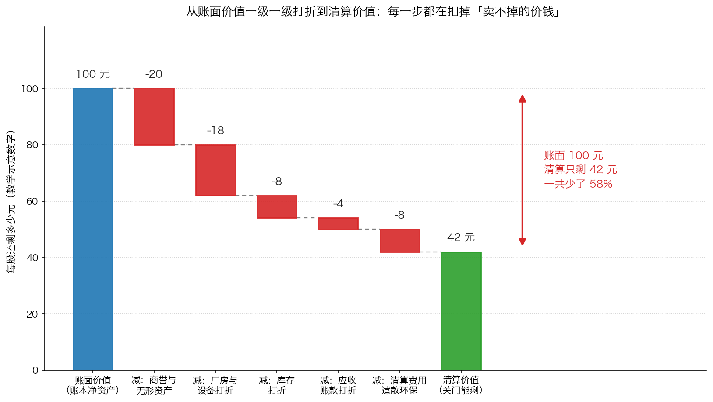
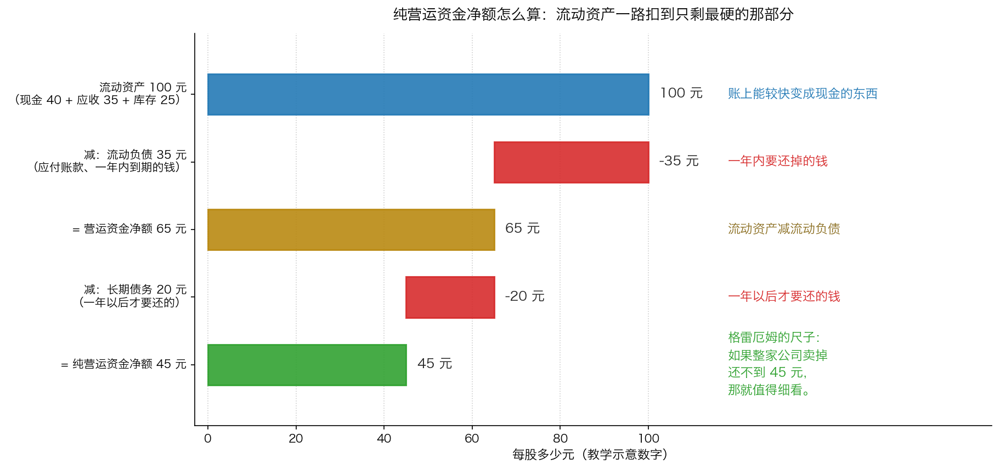

# 第 3 章：清算价值——最硬的那个底

> 本章你将：
> - 用一个"把家当卖光还债"的场景，说清清算价值到底是什么、它回答的是哪个问题
> - 看懂账面价值为什么必须一级一级往下打折，并能自己列出一张打折表
> - 分清六类资产各自能卖出什么价钱，知道哪一类最不能信
> - 学会格雷厄姆那把最硬的尺子：纯营运资金净额（net net），并能自己算一遍
> - 知道清算价值里最容易漏掉的那些债务：养老金、环保、遣散费
> - 这对你的钱包意味着什么：你会得到一个"最坏情况下值多少"的下限，从此不再只靠"未来会更好"来支撑你的买入决定

前两章讲的是"公司继续开下去值多少钱"。这是一种乐观的视角——
它假设公司会一直经营、一直赚钱、一直把钱交到你手上。

这一章讲的是相反的视角：**假设公司明天就关门。**

这个视角听起来很悲观，但它是价值投资里最重要的一块地基。
因为 Week 7 讲过：你付出的价格，要参考**下限**，不是上限。
而清算价值，就是那个下限里最硬的一档。

---

## 3.1 什么叫清算价值：一个把家当卖光的故事

先讲一个生活场景。

老王开了一家小饭馆，开了八年。生意不好，欠了供应商和银行一共 40 万元。
他决定关门。现在我们来算一件事：**关门之后，他手里还能剩下多少钱？**

他有什么：

- 账上现金 5 万元
- 冰箱、灶台、桌椅、装修 大概值 15 万（账本上记的是 25 万，因为当年买新的花了 25 万）
- 库存的食材和酒水，账本上记 4 万
- 供应商还欠他 2 万（因为他之前帮人垫过货款）
- 还有一块招牌和一个挺有名的店名

他把这些东西处理掉：

- 现金 5 万，直接就是 5 万
- 设备家具走二手市场，卖了 9 万（不是 25 万，也不是 15 万）
- 食材酒水清仓甩卖，卖了 1.5 万（不是 4 万）
- 那 2 万欠款，追回来 1.6 万（有一家已经跑路了）
- 招牌和店名，**一分钱没卖出去**

一共收回：5 + 9 + 1.5 + 1.6 = **17.1 万元**

还掉 40 万的债……等等，还不完。**这家饭馆的清算价值是负的。**
老王不但什么都剩不下，还得自己再掏钱还债。

**这就是清算价值**：把公司今天关掉，资产一件件变现、所有债务还清之后，
**股东手里还能剩下多少**。如果剩下的是负数，那股东一分钱拿不到。

> 📌 **划重点：** 清算价值回答的是一个非常具体的问题——
> **"假设这门生意彻底失败了，我这个股东还能不能拿回点什么？"**
> 注意它和"公司值多少钱"不是一回事：一家公司可能"很值钱"（因为它未来能赚很多），
> 但清算价值很低（因为它值钱的东西是品牌、团队、客户关系，
> 这些东西一旦关门就散了）。

卡拉曼给这个方法的定位很明确：

> "清算价值法仅对有形资产的价值作出保守的评估，这种方法并不评估诸如持续经营价值等这样的无形资产的价值。因此，当一只股票的售价低于清算价值这一几乎是最低的估值时，通常这是一项吸引人的投资。"（p144）

**"这一几乎是最低的估值"** ——他把话说得很满。为什么？
因为清算价值假设的是最坏的情况。如果一家公司的股价连"最坏情况"都低于，
那么除非它真的完蛋，否则你很难亏钱。

> 💡 **换个说法：** 清算价值就像买二手房时的"**拆旧价**"。
> 你买一套老房子，可能看中的是地段、学区、未来升值。
> 但假设这些全都不成立，房子旧到只能推倒卖砖头——那它还值多少钱？
> 这个数字很低，但它是一个**你不会跌破的底**（除非房子还欠着贷款）。
> 价值投资要找的，就是"市价低于拆旧价"的机会。

不过卡拉曼也马上给了一个重要提醒——**这个方法更多是"估值方法"，不是"实际会发生的事"**：

> "清算价值分析法是价值评估中的一种理论方法，但它通常并不是价值实现中所实际使用的方法。企业中资产的价值高于这些资产在清算时的价值，因此清算价值是对处在最坏情况下的企业进行的评估。即使连续经营的企业最终倒闭了，企业中的许多资产实际上并没有被清算，而是以可运作的整体被完整地卖给了其他企业。"（p144–145）

这段话有两层意思：

1. **清算价值是"最坏情况的估值"，不是"预测公司会清算"。**
   你用它，不是因为你认为公司要倒闭，而是因为它给了你一个不会更低的下限。
2. **现实中，资产往往是以"整体"卖掉的，价钱比一件件拆开卖更高。**
   一家亏损的工厂，设备单卖可能值 3000 万，但作为一个仍在运转的工厂卖给同行，
   可能值 8000 万。这就是下一节要说的**拆卖价值**。

---

## 3.2 拆卖价值：把每项资产卖给最需要它的人

卡拉曼给了一个升级版的方法：

> "拆卖价值法（break-up value）是清算价值分析中的一种方法，这种方法包括确定一家企业中各项资产的最高价值，不管这是一家持续经营着的企业还是一家正在清算的企业。多数宣布清算的企业实际上都是拆卖各项资产的。只要持续经营企业价值高于清算价值，持续经营企业价值就被保留下来。"（p145）

**拆卖价值 = 假设每项资产都能卖给最需要它的人，按最高价算。**

和"低价甩卖"的区别在时间：

> "有条不紊地分批清算资产肯定能较'低价甩卖'卖到更高的价格，但清算中的企业并不总是有着宽裕的时间。当一家企业陷入财务危机时，快速清算（低价甩卖）可能让资产价值实现最大化。在低价甩卖时，库存的价值必须较结存价值（carrying value）进行大幅打折，打折幅度将视库存的具体情况而定。"（p145）

所以清算价值其实不是一个数，而是**一段区间**：

| 情境 | 时间 | 卖价 | 专业说法 |
|---|---|---|---|
| 从容地一件件卖，卖给最合适的人 | 充裕（几个月到几年） | 最高 | 有序清算 / 拆卖 |
| 急着变现，谁出价就卖给谁 | 紧张（几周到几个月） | 最低 | 低价甩卖 |

**同一个仓库，两种卖法差价可能有一倍。** 这就是为什么你在评估
"这家公司清算能剩多少"的时候，必须先问一句：**它有没有时间？**

判断它有没有时间，看两件事：

1. **它是不是已经违约、被债权人逼着还钱？** 是的话，它没时间，按低价甩卖估。
2. **它的现金还能撑多久？** 一个每年烧掉一大笔现金的公司，
   时间不站在它这边——它今天不卖，明天资产更不值钱。

---

## 3.3 账面价值不等于清算价值：一级一级往下打折

现在到了本章最核心的一步。

很多初学者会问："清算价值不就是净资产吗？账上不是写了吗？"

**不是。** 账面价值（净资产）是会计账本上的记录，
它记的是"当年花了多少钱买这些东西"，而不是"今天能卖出多少钱"。

卡拉曼在书里用了一整页来讲"投资者应该在清算价值分析中如何评估资产价值"
（p145–p146），我们把它整理成一张表：

| 资产 | 清算时怎么估 | 打几折 |
|---|---|---|
| **现金** | 不用估，它就是钱 | 不打折 |
| **上市证券**（公司持有的股票、债券） | 按市价估，再减去卖出这些证券的成本 | 按市价，小幅扣手续费 |
| **应收账款**（别人欠公司的钱） | "接近于它们的票面金额"，但要判断哪些收得回来 | 大幅打折是有可能的 |
| **库存** | 看是成品、半成品还是原材料，看有没有过时风险 | 可能"大幅低于账面价值" |
| **固定资产**（厂房、设备） | 看它还能不能产生现金流，用在原用途还是别的用途 | 很难确定 |
| **商誉、品牌等无形资产** | **不算** | 直接按 0 算 |

*图 3-1：从账面价值一级一级打折到清算价值。示意数字：账面 100 元，扣掉商誉与无形资产、厂房设备打折、库存打折、应收账款打折、清算费用之后，只剩 42 元。每一根柱子都落在真实高度上，可以直接看出每一级扣了多少。*

**这张图的重点不是那几个具体数字**（它们是教学示意），
而是那个结构：**账面价值是一个起点，清算价值是它一路被扣减之后的终点。**
100 元的账面净资产，清算时可能只剩 42 元，少了 58%。

卡拉曼对库存的描述特别生动，值得原文看一下：

> "库存的可实现价值——几万张程序化后的电脑磁盘、几十双紫色帆布胶底运动鞋，或者几百万块口香糖——并不容易确定，且可能大幅低于账面价值。"（p146）

**"几十双紫色帆布胶底运动鞋"** ——这句话里有一种冷幽默。
它想说的是：库存的价值完全取决于**有没有人要**。
账面记的是成本，但市场只关心"这东西现在还有人买吗"。

他接着给了一个很有用的判断标准：

> "对库存价值的贴现程度将视库存中是否有成品、半成品或者原材料，以及是否有技术落后或者款式落伍的风险而定。超市库存的价值不会出现大幅波动，但堆满了电脑的仓库的库存价值肯定会出现较大的波动。"（p146）

翻译成一句话：**越容易过时的库存，折得越狠。**
超市里的米面粮油不会过时，打个小折就能卖；仓库里的旧款手机，
可能一分钱都卖不出。**同样是"库存"这两个字，清算价值能差出好几倍。**

固定资产也一样：

> "企业固定资产的清算价格很难确定。例如，厂房和设备的价值将视其产生现金流的能力而定，不管这些资产用于原来的用途还是用于其它用途。一些机器和设施可能只对现在的所有者具有价值。例如，酒店设备的价值较老化的钢厂更容易确定。"（p146）

**"一些机器和设施可能只对现在的所有者具有价值"** ——这是最要命的一句话。
一台专门为某条生产线定制的设备，对别人来说就是一堆废铁。
而一家酒店里的床、电视、空调，搬走就能用，所以好估价。

> 🇨🇳 **落到 A 股/港股：** 在 A 股/港股里，这几条可以直接用来检验"破净股"。
> 你看到一家公司市净率只有 0.5，第一反应是"便宜"，但你要往下问三句：
> 1. **它的净资产里有多少是商誉和无形资产？** 商誉是收购别人时多付的那部分钱，
>    清算时基本等于零。A 股里商誉占净资产比例很高的公司不少，
>    这类公司的"破净"是假破净。
> 2. **它的资产里有多少是"专用设备"和"过时库存"？**
>    一家做面板、做存储、做光伏的公司，它的产线在技术换代后可能减值一大截。
> 3. **它欠了多少钱、有多少是必须在一年内还的？**
>    净资产为正不代表清算价值为正——因为清算的时候，债权人排在股东前面。

---

## 3.4 格雷厄姆那把尺子：纯营运资金净额

讲了这么多"要打折"，你可能会问：那有没有一个**又快又保守**的算法？

有。卡拉曼说，格雷厄姆用的就是这一招：

> "在粗略计算一家企业的清算价值时，一些价值投资者仿效了本杰明•格雷厄姆的做法，将'纯营运资金净额（net net-workingcapital）'计算看做是一种捷径。营运资金净额是流动资产（资金、可交易证券、应收款项和库存）减去流动债务（应付账款、票据和一年内支付的税收）。纯营运资金净额就是营运资金净额减去所有的长期债务。"（p146）

这段话里有三个词要分清楚：

| 词 | 怎么算 | 直觉 |
|---|---|---|
| **流动资产** | 现金 + 可交易证券 + 应收账款 + 库存 | 一年内能变成钱的东西 |
| **流动负债** | 应付账款 + 短期票据 + 一年内要交的税 | 一年内必须还掉的钱 |
| **营运资金净额** | 流动资产 **减** 流动负债 | 短期的"净家当" |
| **纯营运资金净额** | 营运资金净额 **再减** 所有长期债务 | 最硬的那个底 |

*图 3-2：纯营运资金净额的计算过程（教学示意数字）。流动资产 100 元，减去流动负债 35 元得营运资金净额 65 元，再减去长期债务 20 元，得到纯营运资金净额 45 元。如果一家公司的总市值买不到这 45 元，格雷厄姆式的投资者就开始感兴趣。*

为什么说它是"捷径"？因为**它跳过了固定资产和无形资产**。
你不需要去猜厂房值多少、品牌值多少——直接把它们当成 0。
剩下的全是"一年内能变成现金"的东西，可靠性高得多。

为什么它有用？卡拉曼说得很清楚：

> "即使当一家企业的持续经营业务价值有限，以低估纯营运资金净额买入的投资者仍会受到流动资产清算价值估算值的保护。只要营运资金（working capital）没有虚报，业务没有快速消耗现金，这家企业可以清算它的资产，偿清所有的债务，并仍能给投资者提供超过市价的回报。"（p146）

这句话里有**两个前提条件**，请画上重点线：

1. **"只要营运资金没有虚报"** ——也就是说，账上那些应收账款真的收得回来，
   库存真的有人要。如果账目造假，这个底就是假的。
2. **"业务没有快速消耗现金"** ——这是最容易被忽略的一条。

关于第二条，他紧接着写了：

> "然而，企业的持续亏损能快速消耗纯营运资金净额。因此，在购买之前，投资者必须时刻考虑这家企业当前的经营状况。"（p146）

**这是纯营运资金净额这个方法的致命弱点，也是它唯一的弱点：它是会漏水的。**

设想一家公司账上净流动资产 10 亿元，但它每年亏损烧掉 2 亿现金。
五年后，那个"10 亿的底"就没了。你按 8 亿市值买进去，
觉得自己有 2 亿的安全边际——但两年后你会发现，不是股价跌了，
是**那个底自己往下走了**。

> ⚠️ **易踩坑：** "便宜"和"越来越便宜"是两件事。
> 用清算价值法选股的人，最常见的亏钱方式不是"估错了资产价值"，
> 而是"算漏了它在烧钱"。
> 所以你必须每年重算一遍这个数字。
> **一家净净股的纯营运资金净额，如果连续两年下降，它就不是安全边际，是倒计时。**

> 🇨🇳 **落到 A 股/港股：** "低于纯营运资金净额"这种机会在 A 股里很少见，
> 在港股的中小盘里相对多一些。为什么少？因为这需要同时满足几个条件：
> 账上现金多、欠债少、业务不被看好、而且**没有大股东想把它私有化**。
> 一旦这类公司出现，通常还会有一个信号值得注意：
> 大股东或者管理层开始**增持或者回购**。这条线索留到 Week 10 讲。

---

## 3.5 别忘了表外的东西：那些清算时才会冒出来的债

算到这一步，你是不是觉得清算价值已经算完了？还差一步。

卡拉曼专门提醒了那些"账上看不见、清算时才会出现"的负债：

> "投资者也应当考虑表外债务或者同生债务（contingentliabilities），如资金不足的养老金计划以及其他在实际清算过程中可能产生的债务，如由工厂关闭或者环境保护法所引起的债务。"（p147）

**表外债务**：账本的负债栏里没写、但公司实际上欠着的钱。
**或有债务**：平时不算债，但一旦发生某件事（比如关门），就变成债。

卡拉曼点了三类：

| 类型 | 什么意思 | 为什么清算时才出现 |
|---|---|---|
| **资金不足的养老金计划** | 公司承诺给退休员工的养老金，账上留的钱不够 | 只要公司一直经营，这笔钱可以慢慢补；一旦关门，缺口要一次性补上 |
| **工厂关闭引起的债务** | 遣散费、违约金、设备拆除和运输 | 不关门就不用付 |
| **环境保护法引起的债务** | 土壤修复、污染治理 | 只要厂还在运营，责任是"潜在的"；一旦关闭或转让，责任立刻显性化 |

**这三类东西的共同点是：它们在"公司继续经营"的世界里几乎不出现，
只在"公司关门"的世界里出现。** 所以你用清算价值法的时候，
必须把它们算进去——否则你估出来的"底"是虚高的。

> 💡 **换个说法：** 这就像你卖二手房时才想起来：
> 还欠着两年的物业费、房子有一处漏水要修、中介还要抽成。
> 这些钱在你"继续住着"的时候都不存在，只在"卖掉"的那一刻才出现。
> 清算价值的计算里，也有这么一批"卖的时候才出现"的账。

> 🇨🇳 **落到 A 股/港股：** 在中国的语境里，对应的是这几样：
> 员工安置费用（尤其是国企的老职工安置）、
> 未决诉讼的赔偿、对外担保（你给别的公司做的担保，对方还不上时你要还）、
> 以及环保整改的支出。
> 这些内容通常写在年报的"或有事项""承诺事项"或者"附注"里，
> 平时没人看，但它是清算价值分析里必须翻的一页。

---

## 3.6 清算的讽刺：它反而是让价值兑现的催化剂

讲到这里，清算听起来像是个悲剧。但卡拉曼说了一件很有意思的事：

> "清算通常意味着业务失败。但讽刺的是，投资者可能从清算中赚到钱。"（p147）

为什么？因为：

> "理由是企业的清算或者拆卖是实现企业潜在价值的催化剂。"（p147）

**催化剂**这个词 Week 7 提过一次，它的意思是"**能让价格向价值靠拢的事件**"。
一家公司的股价长期低于它资产的价值，这个状态可能维持很多年——
因为只要没人来"动"它，市场就懒得重新定价。

而清算（或者拆卖、被收购、大额回购）就是那个"动"。

卡拉曼对清算的评价，可以说是全书里对股市本质最精彩的一段论述之一：

> "从某种意义上说，清算是展现股市本质的界面之一。一张张的股票是否会永无止境地来回交易，或者股票是否代表了持有人在企业中的相应权力？企业的清算结束了这一争论，并将从企业资产卖给出价更高的人中获得的现金收入分给了股票持有人。如此，清算为股市提供了一个范围，迫使高估或者低估的股价围绕在实际的潜在价值附近波动。"（p147）

这段话值得慢慢读。它在说：

- **平时**：股票只是一张纸，在人与人之间来回倒手，价格由情绪决定。
- **清算的时候**：这张纸必须兑现成真金白银——卖掉资产，钱分给股东。
- **于是**：纸和资产之间那根断了的线，被强行接上了。

**这就是为什么"低于清算价值"是一个有意义的信号。**
不是因为它保证公司会清算，而是因为**它保证了这张纸背后有真实的东西撑着**。

> 📌 **划重点：** 清算价值给不了你"什么时候涨"，但它给了你两样东西：
> 1. **一个下限**：最坏情况下你大概能拿回多少；
> 2. **一张底牌**：如果管理层或者某个买家真的动手（清算、拆卖、私有化），
>    价格会被迫向价值靠拢。
> 第 1 条让你敢买，第 2 条让你等得起。

---

## 3.7 什么时候该用清算价值法

最后收一个问题：**什么时候该用这个方法？**

卡拉曼在第 4 章会给一个完整的选择表（我们下一章讲），
但有一条和清算价值法直接相关：

> "对于股价大幅低于账面价值的一家没有盈利的企业而言，最好的评估方法可能是清算价值法。"（p149）

**关键词是"没有盈利"。** 一家亏损的公司，你没法用现值分析法——
你连它的现金流是正是负都说不准，怎么折？这时候，
唯一还能给你一个数字的，就是"它账上的东西还能卖多少钱"。

所以三种方法的分工是这样的：

| 公司的情况 | 该用哪种方法 |
|---|---|
| 稳定盈利、现金流看得清 | 现值分析法（第 1、2 章） |
| 亏损、但资产实实在在 | **清算价值法**（本章） |
| 只持有可交易证券（比如封闭式基金） | 股市价值法（第 4 章） |

当然，最好的做法是**三种都算一遍**，然后：
- 用现值法当上限；
- 用清算价值法当下限；
- 用股市价值法做参照。

下一章讲完"股市价值法"和"反射关系"之后，第 5 章我们会用一家真实的公司
（Esco 电子公司）把这三条路全部走一遍，你会看到它们各自算出什么数。

---

## ✍️ 想一想

1. **为什么一家"品牌很响、团队很强"的公司在清算时可能一文不值，
   而一家"业务很平庸、但账上现金很多"的公司在清算时反而值钱？**
   想清楚这一点，你就明白了清算价值法的适用边界。
2. **格雷厄姆的"纯营运资金净额"跳过了固定资产和无形资产，直接把它们算成 0。
   这个做法"太粗糙"了吗？** 请说出这个粗糙做法换来了什么好处。
3. **一家公司股价长期低于它的清算价值，但管理层什么都不做。
   这时"便宜"对你有什么用？** 它最后要靠什么才能变成你账户里的钱？

> 💡 **参考思路：**
> 1. 因为清算价值只认**有形、可转让**的东西。
>    品牌和团队确实有价值，但它们的价值依附于"这家公司还在运营"这个前提——
>    公司一关门，员工散了、客户走了、品牌没有承载物了。
>    而现金、上市证券、能收回来的应收账款，不依赖任何前提，随时能变成钱。
>    这就是为什么卡拉曼说清算价值法"并不评估诸如持续经营价值等这样的无形资产的价值"，
>    也是为什么它被称作"最坏情况下的估值"。
>    **推论：越是靠无形资产赚钱的公司，它的清算价值越没有参考意义，
>    对它用现值分析法才合适。**
> 2. 不粗糙，它是一个**故意的取舍**：用"精度"换"可靠性"。
>    固定资产和无形资产的清算价，你根本估不准（一台专用设备值多少？
>    一个品牌值多少？专家都能吵起来）。既然估不准，不如直接算成 0，
>    得到一个"最保守也因此最可靠"的底。
>    这个取舍在投资里反复出现：**一个粗糙但可靠的下限，
>    比一个精确但不可靠的估计有用得多。** 这也正是第 0 章讲的"粗略和大致的衡量"。
> 3. 短期看，没什么用——价格不会因为你觉得便宜就上涨。
>    它要靠一个**催化剂**才能变成你账户里的钱：清算、拆卖、被收购、
>    大额回购、大股东私有化，或者公司自己开始认真处置资产。
>    这就是"便宜"和"赚到"之间的那道坎。
>    所以正确的做法是分两步：先用清算价值找到"便宜且不会归零"的公司，
>    再去问"**有什么事情会让市场重新看到它的价值？**"
>    如果找不到任何催化剂，那这笔"便宜"可能就一直是账面上的便宜——
>    而这正是 Week 10 要专门讲的话题。

---

## 🧮 算一算

### 情境

有一家制造业公司（**以下为简化示意数字，用于教学**），每股的数据如下：

| 项目 | 每股金额 |
|---|---|
| 现金及等价物 | 12 元 |
| 应收账款 | 20 元 |
| 库存 | 25 元 |
| 厂房与设备（账面净值） | 30 元 |
| 商誉与无形资产 | 13 元 |
| **资产合计** | **100 元** |
| 流动负债（应付账款、短期借款） | 30 元 |
| 长期债务 | 18 元 |
| **负债合计** | **48 元** |
| **账面净资产（每股）** | **52 元** |

今天这家公司的股价是 **20 元**。

### 第 1 步：先算账面净资产，确认账本上的数字

账面净资产 = 资产合计 - 负债合计 = 100 - 48 = **52 元**

市净率 = 20 除以 52 = **0.38 倍**，也就是"打三八折"。

*这一步在算什么：先确认"账本上写了多少"。这是所有人都会算的第一步，
也是唯一一步很多人会做的。*

### 第 2 步：按清算的规矩给每项资产打折

**① 现金 12 元：不打折。**
清算时它就是钱。

**② 应收账款 20 元：打七折，算 14 元。**
判断理由：这家公司的客户集中度偏高，有一部分欠款已经拖了很久。
（现实中的判断依据是年报附注里的"账龄分析"——欠得越久的越可能收不回来。）

**③ 库存 25 元：打四折，算 10 元。**
判断理由：制造业的库存里有一部分是半成品和专用原材料，
停产之后很难卖给别人。这是"打折最狠"的一项。

**④ 厂房与设备 30 元：打六折，算 18 元。**
判断理由：厂房本身（土地和建筑）比较保值，专用设备不保值。
行业不景气时，专用设备只能按废铁价卖。

**⑤ 商誉与无形资产 13 元：直接算 0。**
理由很简单：公司一关门，商誉就不存在了。这是清算价值法里**最容易被忽略的一刀**。

清算时的资产可变现价值：
12 + 14 + 10 + 18 + 0 = **54 元**

*这一步在算什么：把"账本上的资产"翻译成"能卖多少钱"。
注意从 100 元掉到了 54 元，一共扣掉 46 元——其中 13 元是商誉，
33 元是各类打折。**这一步做不做，结论会完全不同。***

### 第 3 步：扣掉清算时才出现的费用

假设还有这些一次性支出：

- 员工遣散费：每股 3 元
- 厂房环保整改与设备拆除：每股 2 元
- 律师、评估、中介等清算费用：每股 1 元

一次性支出合计 = 3 + 2 + 1 = **6 元**

扣掉之后的资产净值 = 54 - 6 = **48 元**

*这一步在算什么：这就是第 3.5 节讲的"表外债务"。
它们在"公司继续经营"的世界里不出现，只在"公司关门"的世界里出现。
不算这一步，你的清算价值会虚高。*

### 第 4 步：还债

- 先还流动负债 30 元：48 - 30 = **18 元**
- 再还长期债务 18 元：18 - 18 = **0 元**

**这家公司的清算价值 = 0 元。**

*这一步在算什么：**债权人在股东前面。** 这是整章最容易被忽略的一条。
账面净资产有 52 元，但清算之后股东一分钱都拿不到——
因为资产打折的损失（46 元）加上清算费用（6 元）一共 52 元，
正好把 52 元的股东权益全部吃掉，剩下的刚好够还债。*

### 第 5 步：把两个结论摆在一起看

| 指标 | 每股金额 | 股价 20 元处在什么位置 |
|---|---|---|
| 账面净资产 | 52 元 | 股价是它的 38%（看起来"破净"，很便宜） |
| 清算价值 | **0 元** | 股价是它的无穷多倍（实际上贵得离谱） |

**这就是"假破净"的完整长相。**

市净率 0.38 倍，看起来像是捡到了宝。但只要按清算的规矩算一遍，
你会发现这家公司的股东权益**完全依赖"它能继续经营下去"这一件事**。
它的价值不在资产里，在未来的经营里。

*这一步在算什么：把"账面便宜"和"真便宜"区分开。
判断标准不是市净率有多低，而是**净资产里有多少是清算时真的能变现的东西**。*

### 第 6 步：那么这家公司到底该怎么估？

**用现值分析法。** 因为它的价值来自未来能赚的钱，而不是现在能卖的东西。

而且你现在知道一件很有用的事：**它的"底"是 0。**
这意味着你在这家公司身上**没有下限保护**——
一旦经营恶化，你没有任何资产垫在下面。

所以对它，你的要求应该更严：

1. 用**更高的贴现率**（比如 15%，而不是 12%）；
2. 要求**更厚的安全边际**（比如只在保守价值的五折以下才考虑）；
3. **控制仓位**——因为没有下限保护的仓位，不该是你的重仓。

*这一步在算什么：把"清算价值"从一个估值方法，变成一个**风险度量**。
有时候清算价值算出来的结论不是"它值多少钱"，而是
"**如果一切都不顺利，我什么都没有**"——这本身就是一个极其重要的信息。*

---

## ✅ 小测验

**1. 关于账面价值和清算价值的关系，下面哪种说法正确？**
A. 清算价值就是账面净资产，因为账本上已经记好了
B. 清算价值通常低于账面价值，因为商誉、专用设备、库存等清算时会大幅打折甚至归零
C. 清算价值通常高于账面价值，因为资产会升值
D. 两者没有关系，各算各的

**2. 格雷厄姆的"纯营运资金净额"（net net）是用哪几项算出来的？**
A. 总资产 减 总负债
B. 流动资产 减 流动负债
C. 流动资产 减 流动负债 再减 所有长期债务
D. 净资产 减 商誉

**3. 你发现一家公司股价明显低于它账上的净流动资产，算出来"很便宜"。
下面哪一件事最可能让这个"便宜"变成陷阱？**
A. 公司的库存是超市里的米面粮油，不容易过时
B. 公司每年都在大额亏损、快速消耗现金，账上的钱一年比一年少
C. 公司的应收账款客户都是大型国企，回款稳定
D. 公司账上有大量现金且没有有息负债

> **答案与解析**
>
> **1. B。** 账面价值记的是历史成本，清算价值问的是"今天能卖多少"。
> 卡拉曼明确说清算价值法"仅对有形资产的价值作出保守的评估，
> 这种方法并不评估诸如持续经营价值等这样的无形资产的价值"。
> A 混淆了会计记账和市场变现；C 把方向说反了；
> D 错在两者恰恰是同一个起点上的两个终点——账面价值是起点，清算价值是打折后的终点。
>
> **2. C。** 卡拉曼的原话是："营运资金净额是流动资产（资金、可交易证券、应收款项和库存）
> 减去流动债务（应付账款、票据和一年内支付的税收）。纯营运资金净额就是营运资金净额
> 减去所有的长期债务。"所以 B 只说到一半（那是营运资金净额），
> A 是账面净资产，D 是另一个口径。
>
> **3. B。** 这是纯营运资金净额这个方法唯一的、也是最致命的弱点。
> 卡拉曼的原话是："然而，企业的持续亏损能快速消耗纯营运资金净额。
> 因此，在购买之前，投资者必须时刻考虑这家企业当前的经营状况。"
> A、C、D 都是让这个"便宜"更可靠的因素：
> 库存不易过时、回款稳定、现金多且无有息负债，这三条正好是
> "营运资金没有虚报，业务没有快速消耗现金"这两个前提的正面证据。

---

## 📖 回到原书

- 对应原书 **第八章** 的"清算价值"一节：`raw/安全边际-中文版/page_144.md` ~ `page_147.md`
  （原书 p144–p147）。
- **建议精读：p144 最后一段到 p145**（清算价值的定位、拆卖价值、
  以及"有条不紊地分批清算"和"低价甩卖"的对比）。
  这几段是本章第 3.1、3.2 节的出处。
- **建议精读：p145 最后一段到 p146**（各类资产怎么估、
  库存和固定资产那两段生动的描述、以及纯营运资金净额的定义）。
  这一页半是本章最实用的部分。
- **建议精读：p146 最后一段**（"持续亏损能快速消耗纯营运资金净额"）。
  一句话就点出了这个方法的死穴，值得抄在本子上。
- **建议精读：p147**（表外债务、清算作为催化剂、
  "清算是展现股市本质的界面之一"那一段）。这段是全书对清算最精彩的论述。
- **可以略读：p145 里关于应收账款和库存的具体举例**（电脑磁盘、紫色运动鞋、口香糖）。
  读个意思就好：库存值多少，取决于有没有人要。
- 原书金句（逐字引用）：
  > "清算价值法仅对有形资产的价值作出保守的评估，这种方法并不评估诸如持续经营价值等这样的无形资产的价值。"（p144）
  > "因此，当一只股票的售价低于清算价值这一几乎是最低的估值时，通常这是一项吸引人的投资。"（p144）
  > "企业中资产的价值高于这些资产在清算时的价值，因此清算价值是对处在最坏情况下的企业进行的评估。"（p145）
  > "库存的可实现价值——几万张程序化后的电脑磁盘、几十双紫色帆布胶底运动鞋，或者几百万块口香糖——并不容易确定，且可能大幅低于账面价值。"（p146）
  > "企业的持续亏损能快速消耗纯营运资金净额。因此，在购买之前，投资者必须时刻考虑这家企业当前的经营状况。"（p146）
  > "清算通常意味着业务失败。但讽刺的是，投资者可能从清算中赚到钱。"（p147）
