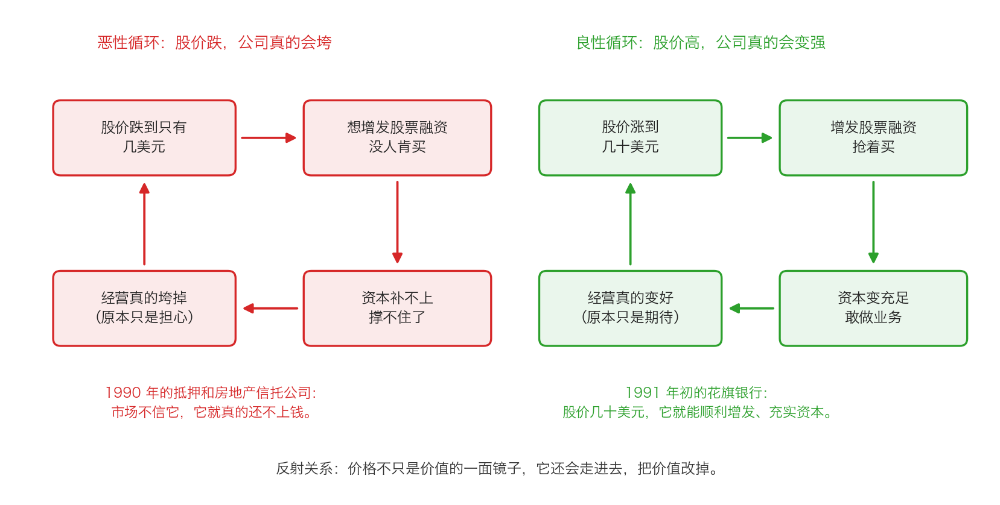

# 第 4 章：股市价值法——最省事的一招

> 本章你将：
> - 说清"用别人的成交价来估值"这件事怎么做，以及它和私有市场价值法的关系
> - 知道什么时候它是**唯一**可用的方法（答案是：只持有可交易证券的公司）
> - 看懂它最大的硬伤——循环推理，并且能一眼认出"A 公司 8 倍，所以 B 公司也该 8 倍"这种话
> - 拿到卡拉曼那张"什么时候用哪种方法"的选择表，并能对着自己的持仓做一遍
> - 理解反射关系：价格不只是价值的镜子，它还能反过来把价值改掉
> - 这对你的钱包意味着什么：你会知道"别人都按这个价买"从来不是买入理由，而且你会认出那些"股价一跌就真的会出事"的公司

前三章我们做了两件事：算公司自己能产生多少钱（现值分析法），
和算公司现在能卖多少钱（清算价值法）。这两种方法都是**往里看**——
看公司自己的现金流、自己的资产。

这一章讲的第三种方法，是**往外看**：看别人愿意出多少钱。

它是最省事的一招，也是最危险的一招。省事在于你几乎不用做预测；
危险在于，**它很容易变成一个自我循环的论证**。

---

## 4.1 什么叫股市价值法

先说定义。

**股市价值法**（卡拉曼用的英文是 stock market value）：
不看这家公司自己能赚多少，也不看它的资产能卖多少，
而是**看同类公司在股票市场上卖多少钱**，拿这个价格来估它。

卡拉曼给它的适用场景是这样的：

> "有时投资者必须依赖公开交易的股票市场和债券市场来对一只证券给出大致的价值评估。有时这是仅有的评估法，如封闭式共同基金。其他时候，尤其是如果必须在短时间内实现价值，股市价值法（stock market value）可能是几种无奈的替代方法中最好的评估方法了。"（p147）

注意两个词：**"仅有的"** 和 **"无奈的"**。
卡拉曼对这个方法的态度从一开始就很清楚——它是备胎，不是主力。

为什么？因为它的可靠性最低。他自己后面会说：

> "这种方法的可靠性不及前两种方法，它只会偶尔成为有用的价值准绳。"（p135）

**"只会偶尔成为有用的价值准绳"** ——这就是它的定位。

> 💡 **换个说法：** 这三种方法的关系，
> 有点像评估一套房子的三种方式：
> - **现值分析法**：算这套房子未来能收多少年租金，折回今天；
> - **清算价值法**：算这套房子拆了卖地皮、卖砖头能收回多少；
> - **股市价值法**：看隔壁同样户型上周成交了多少钱。
>
> 第三种最省事，也最容易出错——因为**隔壁那套可能刚被一个着急的人高价买走**，
> 也可能因为卖家急着用钱而贱卖。**它告诉你的是"市场情绪"，不是"房子本身"。**

---

## 4.2 它的亲戚：私有市场价值法

在讲股市价值法之前，必须先讲它的亲戚，因为卡拉曼把它们放在一起讨论，
而且这个亲戚在现实里用得更多。它叫**私有市场价值法**。

> "同净现值法相关的一种价值评估法就是私有市场价值法，这种方法以乘数估值法为基础，即根据老练且谨慎的商人最近购买的类似企业来评估企业的价值。私有市场价值法根据过去达成的交易给投资者提供了一些有用的经验法则，以指导他们对企业进行评估。"（p141）

**"乘数估值法"** 这个词需要解释一下。乘数就是倍数，比如"8 倍税前现金流"、
"12 倍市盈率"、"1.5 倍市净率"。所谓"用乘数估值"，就是：

**一家公司的价值 = 它的某个财务数字 乘 一个倍数**

比如："同行业的公司最近被收购时，价格都是税前现金流的 10 倍。
这家公司税前现金流是 5000 万，所以它大概值 5 亿。"

**这里的关键是那个倍数从哪来。** 私有市场价值法说：从"老练的商人
最近买下类似企业时付的价钱"里来。股市价值法说：从"同类公司在股市上的价格"里来。

**两者的区别只有一个：中间人是谁。**

| 方法 | 倍数从哪来 | 中间人 |
|---|---|---|
| 私有市场价值法 | 收购整家公司时付的价格 | 老练的买家（做尽职调查、要控制权） |
| 股市价值法 | 股市上同类公司的价格 | 每天在市场上买卖的投资者 |

卡拉曼专门讨论了这个"中间人"的作用：

> "私有市场价值分析法与现值分析法之间的差别在于是否有中间人的介入，也就是说是否出现了老练的商人，他可以带来正面的影响，也可以带来负面的影响。从正面的影响来看，如果这个中间人进行了一笔数额巨大的收购，这可能有助于让投资者对自己的现值分析得到验证。从负面的影响来看，买家确实有可能知识渊博却眼光独到，但也有可能并不如此，对买家判断的依赖可能让投资者变得自鸣得意，并忽视了自己应进行独立的评估以检查那些买家的判断。"（p144）

### 私有市场价值法的三个缺点

这个方法听起来很靠谱——"老练的商人付了多少钱"总比"股民付了多少钱"更有参考价值吧？
但卡拉曼立刻列了它的三个缺点：

> "然而，这种评估法并不是没有缺点。在一个行业中，所有的企业都各不相同，但私有市场价值法未能辨别出同一行业中不同企业之间的差别。另外，收购企业时所使用的乘数会不断变化，自最近一次交易完成以来，同类企业的估值可能已经出现了变化。最后，企业的买家并不一定需要支付合理且明智的价格。"（p141–142）

拆开看：

1. **它分不清企业之间的差别。** 同一个行业里，一家有独家技术，
   一家靠低价抢单，它们的价值可以差三倍。但"可比交易法"会给它们同一个倍数。
2. **倍数本身在变。** 三年前行业火热时是 12 倍，现在冷下来了可能只有 6 倍。
   你拿三年前的交易当参照，等于拿旧地图找新路。
3. **买家不一定理性。** 这是最要命的一条。

第三条他花了整整一页来举例，讲的是 1980 年代美国那波杠杆收购潮：

> "例如，20 世纪80 年代末期，投资者开始用以评估企业价值的'私有市场价值法'使用的价格不再是老练且谨慎的商人为购买企业所支付的价格。金融家从发行无追索权垃圾债券中赚到了钱，并使用着几乎都不是自己的钱。在风险和回报态度出现巨大倾斜以及巨额费用的刺激下，他们在进行企业收购时会支付过高的价格。"（p142）

**"使用着几乎都不是自己的钱"** ——这句话是整段的钥匙。
当一个人花的是别人的钱、而且亏了也不算他的，他对价格的敏感度就会消失。
于是"市场价"变成了一群不心疼钱的人喊出来的数字。

结果是什么？

> "一直以来对电视台的收购价格基本上是10 倍于税前现金流，但最终对电视台的收购价格最高达到了税前现金流的13-15 倍。其他许多有着类似客户的企业的价格也出现了相应的上涨。"（p143）

**从 10 倍到 13-15 倍。** 那些照着"最新的市场价"给企业估值的投资者，
以为自己用的是"市场价格"，其实用的是"泡沫价格"。
1989 到 1990 年融资一断，倍数掉回历史平均水平甚至更低，
这些人就"蒙受了巨额亏损"（p143）。

> ⚠️ **易踩坑：** 这是本章最重要的一条警告——
> **"最近成交价"不等于"价值"。** 它可能只是一个被扭曲的价格。
> 当市场上钱多得没处去的时候，所有东西的价格都会被推高；
> 当钱紧的时候，又会被压低。你用哪一个做参照，结论会完全不同。
> 所以卡拉曼的结论斩钉截铁：
>
> > "投资者必须忽略以上涨的证券价格为基础的私有市场价值。"（p143）
>
> 他还补了一句极其漂亮的话：
>
> > "在确定私有市场价值时，以保守的历史评估标准为依据的投资者将从真正的安全边际中受益，而其他人口中的安全边际将随着金融风暴的出现而灰飞烟灭。"（p143）
>
> **"其他人口中的安全边际将随着金融风暴的出现而灰飞烟灭"** ——
> 一针见血。建立在"市场价会一直这么高"上面的安全边际，不是安全边际，是杠杆。

### 那到底该怎么用别人的成交价？

卡拉曼没有说"完全别用"，而是给了一个界限：

> "我自己定了条规则，投资者应当根据自己愿意支付多少价格以拥有这家企业来评估企业，而不是依据别人愿意支付多少价格。"（p144）

> "私有市场价值法顶多应作为价值评估过程中的一项内容，而不应将这种方法看成是最终的价值判断。"（p144）

翻译成一句你可以直接执行的话：

**别人的成交价只能用来"验证"，不能用来"决定"。**
你自己先用现值法或者清算价值法算出一个区间，然后拿可比交易来看一眼：
"我算出来 20 元，市场上类似的公司最近是按 25 元成交的——那我这 20 元是不是太保守了？"
这个用法是健康的。反过来，"市场上类似公司卖 25 元，所以这家也值 25 元"——
这就是把决定权交给了别人。

> 🇨🇳 **落到 A 股/港股：** 这一节有几个非常具体的对应物。
> 1. **定增价、大宗交易价、协议转让价**：这些是"老练买家"出的价，
>    比每天的股价更有参考价值。你可以去巨潮资讯网查公司公告里的"权益变动报告书"。
> 2. **大股东增持价、员工持股计划价格**：这些是"内部人"愿意付的价。
>    注意：有的员工持股计划价格低得离谱（相当于打五折），那是激励，不是估值参考。
> 3. **AH 股溢价**：同一家公司，A 股和港股两个价格。这是一个天然的实验场——
>    **同一份资产，两个市场给出不同的价，说明价格里包含了市场情绪。**
>    差价本身不告诉你哪个对，但它提醒你："市场价格"不是唯一真理。

---

## 4.3 什么时候它是唯一可用的方法

讲了这么多缺点，那它什么时候真的有用？

卡拉曼给了最典型的场景：**封闭式基金。**

> "一家封闭式基金或者其他只拥有可交易证券的企业应当通过股市价值法来加以评估，其他方法没有用。"（p149）

为什么？因为封闭式基金的资产**本身就是一篮子股票**。
它的"现金流"就是这些股票的分红，它的"清算价值"就是把股票卖掉。
你不需要估——这些股票每天都有报价。**唯一要做的就是把它们的市价加起来。**

他举了一个真实例子：

> "假设对一家投资公司的价值进行评估。1990 年年中，封闭式基金沙菲尔价值信托基金（Schaefer Value Trust）计划举行股东投票，以考虑是否需要进行清算。"（p147–148）

> "评估沙菲尔基金清算价值最合适的方法就是股市价值法，计算该基金如果在股票市场马上卖出所有的持股将具有多少价值。其他方法都不适用于这样的公司。"（p148）

**"其他方法都不适用于这样的公司"** ——这句话把边界划得很清楚。

那么封闭式基金会出现什么机会？一个字：**折价**。

如果一篮子股票的市值是 10 亿元，而这只基金自己的总市值只有 8 亿元，
那就是"打八折"。这 2 亿元的差价从哪来？
从"基金不会清算"这个假设里来——只要不清算，折价可能永远存在。
而一旦有人推动清算（就像沙菲尔那次股东投票），
这个折价就有了一个明确的出口。

> 🇨🇳 **落到 A 股/港股：** 这个结构在 A 股/港股 里有几个直接的对应物：
> **封闭式基金、持有大量上市公司股权的控股公司、以及部分 B 股/H 股。**
> 共同特征是：**公司的主要资产是别人公司的股票，这些股票每天都有报价。**
> 对这类公司，现值分析法很难用（你没法"预测"股价），
> 清算价值法也不适用（资产就是市价），**只有股市价值法能用**：
> 把持股的市值加起来，减掉负债，再除以股数，得到一个"账面净值"，
> 然后和公司自己的市值比一比。
> 如果公司的市值明显低于它手里股票的市值，这就是一个"折价"。
> 但你要立刻追问一句：**折价为什么存在？会不会有东西把它兑现掉？**
> 没有催化剂，折价可以存在十年。

---

## 4.4 它的硬伤：循环推理

现在说这个方法最根本的问题。卡拉曼自己设了一个反问：

> "我知道你们肯定会想到，如果股市上交易的价格就是这些股票合理价值的近似值，那么这不就证明了股市是有效的这一与价值投资相对立的原则么？我的回答是很坚定，而且是否定的。"（p148）

他的回答是否定的，理由是这样一套推理会变成**循环**：

> "股市价值法是一项有缺点的评估方法。你不会希望用股市价值法来评估一个行业中的每家企业。你会发现，因为报业公司在市场上交易的价格往往是税前现金流的8 倍，那么人们会推断它们必定值这么多，这就成了循环推理了。"（p148）

**什么叫循环推理？** 我们把它摊开：

1. 报业公司的股价是税前现金流的 8 倍。
2. 于是我推断："报业公司值税前现金流的 8 倍。"
3. 于是我拿这个倍数去给另一家报业公司估值。
4. 估出来的结果**恰好等于市场本来就给它们的价格**。

**你什么都没算出来。** 你只是把市场价格换了个说法，重新讲了一遍。
这就是循环推理：**结论早就藏在前提里了。**

> 💡 **换个说法：** 这就像问路。你问一个人"这个地方怎么走"，
> 他说"跟着前面那个人走"。你再问前面那个人，他说"跟着后面那个人走"。
> 两个人都很确定，但**没有一个人真的知道路**。
> 市场价格也是这样：它由无数人的预期组成，
> 而每一个人的预期里都包含了"别人觉得它值多少"。**它是自我指涉的。**

那这个方法还有没有用？有，但只能用在一种很窄的场景：

> "然而，当报业公司的子公司将分拆给一家综合性媒体公司时，知道股市对报业行业的评估将对预测这家子公司短期内的交易价格提供一些帮助。"（p148）

注意这句话里的三个限定词：**分拆**、**短期内**、**交易价格**。
它说的是：如果你要预测一家子公司**下周**在股市上会以**什么价格**开始交易，
那么看看同行现在卖多少钱是有帮助的。

**它预测的是"价格"，不是"价值"。** 这个区分是本课程反复强调的：
价格和价值的差，正是你赚钱的空间。用股市价值法，你算的是价格。

> 📌 **划重点：** 股市价值法的作用范围可以总结成一个句子：
> **它告诉你"市场现在愿意出多少"，它不告诉你"这东西值多少"。**
> 前者对"短期会发生什么"有用，后者才是你买入的依据。
> 把这两件事混淆，是绝大部分"看起来很便宜结果一直不涨"的投资的根源。

---

## 4.5 什么时候用哪种方法：卡拉曼的选择表

卡拉曼自己给了一张很实用的对照表。我们原文照录：

> "有时某种评估方法可能会成为最合适的方法。例如，对有着稳定现金流的高回报企业，如一家生产消费类产品的企业，净现值法将是最合适的评估方法，对这样的企业使用清算价值法得到的评估将大幅低于净现值法得出的评估。同样，对于资产回报率受到控制的企业，如一家公用事业类企业，净现值法可能是最好的评估方法。对于股价大幅低于账面价值的一家没有盈利的企业而言，最好的评估方法可能是清算价值法。一家封闭式基金或者其他只拥有可交易证券的企业应当通过股市价值法来加以评估，其他方法没有用。"（p149）

整理成表格：

| 公司的类型 | 该用哪种方法 | 为什么 |
|---|---|---|
| 稳定现金流的高回报企业（消费品） | **现值分析法** | 它的价值来自持续赚钱，用清算价值会低估一大截 |
| 受管制、回报稳定的公用事业 | **现值分析法** | 收入可预测性最强，最接近"年金" |
| 亏损、股价大幅低于账面价值的公司 | **清算价值法** | 盈利是负的，没法折现；唯一能算的是资产能卖多少 |
| 封闭式基金、只持有可交易证券的公司 | **股市价值法** | 资产就是市价，其他方法都不适用 |

然后是这条最重要的操作原则：

> "我们应该经常同时使用几种评估方法。例如，在评估一家复杂的企业，如经营着几种不同业务的综合性企业时，部分资产可能最好使用一种评估法来加以评估，其他资产则使用另外一种方法来加以评估。投资者经常希望对一个单一的企业使用多种方法来进行评估，以获得这家企业的价值范围。"（p149）

**"一个单一的企业……获得这家企业的价值范围。"** ——
这句话就是我们这一周的主题。第 0 章说"价值是一个范围"，
到这里你终于看到了它的操作方式：**用几种方法各算一遍，得到一段范围。**

最后，怎么用这段范围做决定？

> "这时为了稳妥起见，投资者应当采取保守的立场，采用最低的评估，除非投资者有确凿的理由来选择更高的评估。确实，保守的立场可能会让投资者错过一些成功的投资，但这种立场也会防止投资者因采用了太过乐观的评估而蒙受了巨额的亏损。"（p149）

**"采用最低的评估，除非投资者有确凿的理由来选择更高的评估。"**
这就是我们这一周反复强调的那条纪律的原始出处。

---

## 4.6 反射关系：价格反过来改写价值

这一章的最后一个话题，也是最迷人的一个。

前面我们一直假设：**价值是因，价格是果。** 公司经营得好，价值高，股价自然高。
卡拉曼说：不一定。**有时候是反过来的。**

> "证券分析中一个复杂的因素就是证券价格与企业潜在价值之间的反射关系（reflexive relationship）或者互反关系（reciprocalrelationship）。"（p150）

**反射关系**（也叫互反关系）的意思是：**价格能影响价值。**

这在什么情况下发生？答案是：**当公司需要钱的时候。**

> "只要资金充沛，多数企业可以永远存在而无需担心自己证券的价格。然而，当企业需要更多的资金时，证券价格所处的水平可以显示出处在繁荣、勉强维持或者破产状态下的差异。"（p150）

这句话很关键。**一家不缺钱的公司，股价再低也死不了；
一家等着融资的公司，股价一低就真的会死。**

卡拉曼举了正面和负面两个例子。

**正面（自我实现的预言）：**

> "例如，如果一家资本化率不高的银行股价很高，那么这家银行就可以发行更多的股票，并让自己充分资本化，这是自我实现预言（self-fulfilling prophecy）的一种形式。只要股市说没有问题，那就没有问题。例如1991 年年初，花旗银行的股价涨到了几十美元，并可以轻而易举地为新发行的证券找到买家。"（p150）

**负面：**

> "然而，如果这家银行的股价仅为几美元，那么它可能就无法筹集到更多的资本金了，这将导致该银行最终倒闭，这是自我实现预言的一种负面形式，金融市场对一家企业生存能力的认知将影响到最终的结果。"（p150）

然后是另一类例子——**借了很多钱、债务马上要还的公司**：

> "债务即将到期且使用高杠杆融资的企业同样如此。如果市场认为一家企业信誉良好，如1991 年年初的万豪酒店集团（MarriottCorporation），那么这家企业就可以进行再融资，并实现预言。然而，如果市场认为这家企业没有信誉，如1990 年的抵押和房地产信托公司（Mortgage and Realty Trust），预言仍会实现，因为这家企业将无法履行其义务。"（p150–151）

*图 4-1：反射关系的两个方向。左边是恶性循环：股价跌到只有几美元，公司想增发融资没人肯买，资本补不上，经营真的垮掉，股价更低。右边是良性循环：股价涨到几十美元，增发顺利，资本变充足，经营真的变好，股价更高。原书的例子是 1990 年的抵押和房地产信托公司（左）和 1991 年初的花旗银行（右）。*

这张图值得盯着看一会儿。它说明了一件事：
**在"需要融资"这个条件下，股价不是价值的影子，而是价值的一个输入变量。**

### 还有一种反射：管理层看着股价做决定

卡拉曼还讲了第三种反射：

> "当一家企业的经理人使用证券价格而不是企业基本面作为评估企业价值的决定性因素时，就出现了另外一种形式的反射。如果一家企业的管理层相信低估的股价确实正确地反映了企业的真正价值，可能会采取行动来向市场证明这一点。例如，这家公司会以非常低的价格增发股票或者与其他企业合并，而这样的价值会给现有的股价带来巨大的稀释作用。"（p151）

这段话读起来有点绕，我们翻译一下：

**如果管理层把"股价低"当成了"公司真的不行"的证据，他们就会做出伤害股东的决策。**
比如在股价很低的时候增发股票去收购别的公司——等于用很便宜的价格卖自己的股份，
把老股东的权益稀释掉。

这是最坏的一种反射：**股价低 → 管理层觉得公司不值钱 → 用便宜的价格卖股份 →
老股东真的亏了。**

那么，反射关系什么时候重要？

> "多数时候反射理论是评估多数企业时的一项次要因素，但有时它也会成为一项重要因素。这种现象是一张百搭牌，这种评估因素并不由企业基本面决定，而是由金融市场本身来决定。"（p151）

**"多数时候是次要因素"** ——所以你不用天天担心它。
**"有时也会成为一项重要因素"** ——所以你必须知道它存在。

> 🇨🇳 **落到 A 股/港股：** 反射关系在 A 股/港股 里能直接观察到的场景有这么几类：
> 1. **高杠杆、短债多的公司**：如果它的股价大跌、评级被下调，
>    再融资就会变难，于是真的可能出现资金链问题。
>    看这类公司，你要看的不是"股价跌了多少"，
>    而是"**它未来 12 个月有多少债要还、手里有多少钱**"。
> 2. **银行和保险**：它们的资本充足率和股价直接挂钩。股价长期低迷，
>    补充资本的能力就受限。这就是卡拉曼拿花旗银行举例的原因。
> 3. **股权质押比例高的大股东**：股价一跌，质押的股票可能被强制平仓，
>    抛压进一步压低股价。这是一个更"技术性"但同样真实的反射。
> 4. **反过来**：股价高、能顺利增发的公司，会拿到便宜的钱去扩张。
>    这时候你要小心一件事——**"用高估的股票当现金去买东西"
>    是历史上最经典的毁灭价值方式之一**（卡拉曼在第 3 章讲整合风潮时讲过）。
>
> **一句话的用法：看到一家公司股价暴跌时，先问一句：
> "它需不需要靠市场给它钱？"** 如果不需要，跌下去往往是机会；
> 如果需要，跌下去可能是终点。

---

## 4.7 三种方法放在一起

这一章讲完，三种方法就齐了。我们用一张表收个尾：

| 方法 | 它在算什么 | 得到的是 | 什么时候最有用 | 最大的风险 |
|---|---|---|---|---|
| 现值分析法 | 公司未来能产生的钱，折回今天 | 价值的**上限** | 现金流稳定的公司 | 假设错、终值占比过大 |
| 清算价值法 | 今天关门，卖掉资产还完债剩多少 | 价值的**下限** | 亏损但资产实实在在的公司 | 资产估高了、公司在烧钱 |
| 股市价值法 | 同类公司在市场上卖多少钱 | 价格的**参照** | 只持有可交易证券的公司 | 循环推理、把泡沫当价值 |

而本书的做法是：**三种都用，然后取最低的那个当基准。**

下一章，我们要把这三条路全部走在一家真实公司身上。
它是一家 1990 年从大公司里分拆出来的国防企业，
股价 3 美元，有形资产账面价值超过 25 美元，
纯营运资金净额超过 15 美元。卡拉曼在书里把它算了一遍，
我们会跟着他的每一步，一年一年地算。

---

## ✍️ 想一想

1. **"因为报业公司在市场上交易的价格往往是税前现金流的 8 倍，
   那么人们会推断它们必定值这么多。"**
   请用你自己的话解释，为什么这个推理是循环的。
   它和"我问了 A，A 让我问 B，B 让我问 A"有什么相似之处？
2. **为什么卡拉曼说"只要资金充沛，多数企业可以永远存在而无需担心自己证券的价格"？**
   这句话反过来读就是：**什么样的公司最怕股价低？** 请举出三种。
3. **一家公司的股价长期只有它持有的上市公司股票市值的六折。
   这个"六折"是机会还是陷阱？** 请列出决定这个问题的两三个关键因素。

> 💡 **参考思路：**
> 1. 因为它的结论（"报业公司值 8 倍税前现金流"）和它的前提
>    （"报业公司的股价是 8 倍税前现金流"）**是同一件事的两种说法**。
>    你没有获得任何新信息，只是把市场价格换了个单位重新念了一遍。
>    它和"A 让我问 B、B 让我问 A"的相似之处在于：
>    **信息在一个封闭的圈子里打转，从来没有接触到圈子外面的东西**
>    ——在这里，"圈子外面的东西"就是这家公司真实的赚钱能力。
>    判断一句话是不是循环推理，有一个简单的测试：
>    **"如果市场价格明天腰斩，这个结论会变吗？"**
>    如果会变，那它依赖的是价格，不是价值。
> 2. 因为一家不缺钱的公司，股价跌了也不影响它继续做生意——
>    它的供应商照样供货，客户照样买单，员工照样上班。
>    最怕股价低的是那些**需要从资本市场拿钱**的公司：
>    ①**高杠杆、近期有大额债务到期**的公司（再融资要靠市场信心）；
>    ②**银行、保险等受资本充足率约束**的金融机构（股价低就补不了资本）；
>    ③**正在大额烧钱扩张、靠融资续命**的公司（下一轮融资的定价直接取决于股价）。
>    还有一类是**大股东高比例质押**的公司，那是间接的依赖。
> 3. 关键看三件事：
>    ① **这个折价有没有可能被消除？** 也就是有没有催化剂：
>       清算、分派股票给股东、被收购、大股东私有化、主动回购。
>       没有催化剂，六折可以存在十年，甚至变成四折。
>    ② **那些股票的市值是真的吗？** 如果它持有的是流动性很差的非上市股权，
>       或者是自己子公司的一堆股票，那"市值"本身就是估出来的。
>    ③ **母公司自己欠多少钱？** 你算的必须是"持股市值 减 全部负债"，
>       而且别忘了税——卖掉股票是要交税的。
>    **这三条都过了，六折才是机会；只看到"六折"两个字就买，那就是在赌。**

---

## 🧮 算一算

### 情境

有一家制造业公司（**以下为简化示意数字，用于教学**），我们叫它"甲公司"。
它最近的财务数据是：

- 每股净资产（账面价值）：**20 元**
- 每股收益：**2 元**
- 今天的股价：**13 元**

你在同一个行业里找到三家可比公司，它们的市场数据是：

| 可比公司 | 市净率（股价除以每股净资产） | 市盈率（股价除以每股收益） |
|---|---|---|
| A 公司 | 1.5 倍 | 12 倍 |
| B 公司 | 1.2 倍 | 10 倍 |
| C 公司 | 1.8 倍 | 15 倍 |

### 第 1 步：先用市净率算出一个区间

市净率法的公式是：**每股价值 = 每股净资产 乘 市净率**

- 用最低的 1.2 倍：20 乘 1.2 = **24 元**
- 用中间值 1.5 倍：20 乘 1.5 = **30 元**
- 用最高的 1.8 倍：20 乘 1.8 = **36 元**

所以按市净率估，甲公司值 **24 到 36 元**。

*这一步在算什么：把"同行卖多少钱"翻译成"甲公司值多少"。
注意这里没有做任何预测，只是把别人的倍数套过来——这就是股市价值法的全部动作。*

### 第 2 步：再用市盈率算一遍

市盈率法的公式是：**每股价值 = 每股收益 乘 市盈率**

- 用最低的 10 倍：2 乘 10 = **20 元**
- 用中间值 12 倍：2 乘 12 = **24 元**
- 用最高的 15 倍：2 乘 15 = **30 元**

所以按市盈率估，甲公司值 **20 到 30 元**。

*这一步在算什么：换一把尺子再量一次。
同一家公司、同一批可比对象，两把尺子给出的区间不一样（24~36 和 20~30）。
**这本身就是一个重要发现：方法不同，结果不同。** 这就是"价值是一个范围"。*

### 第 3 步：把两个区间合并

合并的方式是"取更宽的那个范围"：

- 最低端 = 两把尺子里最低的 = **20 元**
- 最高端 = 两把尺子里最高的 = **36 元**

合并后的价值区间：**20 元 到 36 元**。

*这一步在算什么：把两套估计拼成一段范围。
注意**不是取平均值**——平均值 28 元会把两端的可能性都抹掉，
而价值投资者要的恰恰是那个最低端。*

### 第 4 步：做一次"可比性质疑"

现在必须停下来问一个问题：**这三家公司真的和甲公司可比吗？**

假设你查完资料发现三件事：

1. 三家公司都是行业龙头，规模是甲公司的五倍以上；
2. 三家公司的股票每天成交额都很大，而甲公司的股票成交清淡；
3. 三家公司过去三年盈利稳定，而甲公司去年刚亏过一次。

**这三条都指向同一个方向：甲公司应该比它们更便宜才合理。**
所以第 3 步那个 20 到 36 元的区间，是**偏乐观**的。

按第 1 章讲的"双重保守"，我们再做一次打折。假设打八折：

- 保守下沿：20 乘 0.8 = **16 元**
- 乐观上沿：36 乘 0.8 = **28.8 元**

修正后的区间：**16 元 到 28.8 元**。

*这一步在算什么：把"可比性折扣"算进去。
可比公司法天生偏乐观，因为你挑出来的可比公司往往是行业里最受追捧的那几家。
**打折这一步不是可选项，是必选项。***

### 第 5 步：算安全边际

**安全边际永远拿最保守的那一端去减。**

安全边际 = 16 - 13 = **3 元**

占保守价值的比例：3 除以 16 = **18.75%**

*这一步在算什么：把估值变成决策。18.75% 的安全边际算厚还是薄？
本课程没有硬性标准，但你可以这样想：
**如果我的估值整体偏高了 20%（这是很常见的误差），还有没有缓冲？**
18.75% 的缓冲，在 20% 的误差面前刚刚够，谈不上厚。*

### 第 6 步：如果只用"同行都卖 1.5 倍"这一个数字呢？

假设你偷懒，只看了 A 公司的 1.5 倍市净率：

- 估值 = 20 乘 1.5 = 30 元
- 安全边际 = 30 - 13 = **17 元**，占 56.7%

**看起来好得多，对吧？** 但这个"好得多"是假的：

1. 你用的是**中间值**，不是最低值——你把最坏情况丢掉了；
2. 你没有做可比性质疑——你把甲公司当成了行业龙头；
3. 你只用了**一把尺子**——市盈率那把尺子本来会给你一个更低的答案。

**三个动作，把 3 元的安全边际变成了 17 元。**
这就是"用股市价值法偷懒"的完整过程：**你什么都没算错，只是每一步都往乐观的方向偏了一点。**

*这一步在算什么：让你亲眼看到，同样的数据、同样的方法，
"多做三步保守动作"和"少做三步"的结论能差五倍。
而这两者的差别，不在算术能力上，在纪律上。*

| 做法 | 估值 | 安全边际 | 占保守价值的比例 |
|---|---|---|---|
| 只用一个中间倍数 | 30 元 | 17 元 | 56.7% |
| 两把尺子取最低 + 可比性打八折 | **16 元** | **3 元** | **18.75%** |

---

## ✅ 小测验

**1. 关于股市价值法，下面哪种说法符合卡拉曼的观点？**
A. 它是最可靠的方法，因为市场价格反映了所有信息
B. 它的可靠性不及现值分析法和清算价值法，只会偶尔成为有用的价值准绳
C. 它和现值分析法一样精确，只是算起来更快
D. 只要可比公司选得够多，它就能给出精确的企业价值

**2. 卡拉曼说"因为报业公司在市场上交易的价格往往是税前现金流的 8 倍，
那么人们会推断它们必定值这么多，这就成了循环推理了"。
这里的"循环"指的是什么？**
A. 8 倍这个数字会随着时间自己循环变化
B. 结论（它们值 8 倍）和前提（它们的股价是 8 倍）是同一件事，
   推理没有接触到任何市场价格之外的信息
C. 报业公司的利润会有周期性地循环
D. 分析师们互相抄对方的报告

**3. 一家公司的股价是 3 美元，有形资产账面价值超过 25 美元，
它的债务很少，但它每年都在小幅亏损。按卡拉曼"什么时候用哪种方法"的选择表，
最适合它的第一把尺子是什么？**
A. 现值分析法，因为亏损是暂时的
B. 股市价值法，因为股价只有 3 美元
C. 清算价值法，因为股价大幅低于账面价值且没有盈利
D. 三种方法都不用，亏损的公司不能估值

> **答案与解析**
>
> **1. B。** 这是卡拉曼的原话："这种方法的可靠性不及前两种方法，
> 它只会偶尔成为有用的价值准绳。"A 正好是他在 p148 里坚决否定的观点
> （"我的回答是很坚定，而且是否定的"）；C 错在混淆了"省事"和"精确"，
> 它的缺点恰恰是"有缺点的评估方法"；D 错在可比公司越多越容易陷入循环推理，
> 而不是越精确。
>
> **2. B。** 循环推理的定义就是"结论已经藏在前提里"。
> 你用市场价格推出的"合理倍数"，再去乘一下，得到的结果当然还是市场价格。
> A 混淆了"倍数会变化"（这是私有市场价值法的另一个缺点）和"循环推理"；
> C 说的是行业周期，是另一件事；D 说的是分析师行为，也不是循环推理。
> 检验方法：**"如果市场价格明天腰斩，这个结论会变吗？"** 会变，就说明它是循环的。
>
> **3. C。** 卡拉曼的选择表里写着："对于股价大幅低于账面价值的一家没有盈利的企业而言，
> 最好的评估方法可能是清算价值法。"理由是：盈利是负的，现值分析法没法用
> （你没法折一串负的现金流）；而它账面价值实实在在，所以先算"最坏情况下能剩多少"。
> A 错在"亏损是暂时的"是一个需要证明的假设，不能拿来当选择方法的理由；
> B 错在"股价只有 3 美元"是现象不是理由，而且卡拉曼明确说股市价值法可靠性最低；
> D 错在亏损公司完全可以估值，只是要用对方法——这也正是下一章 Esco 案例的主题。

---

## 📖 回到原书

- 本章对应原书 **第八章** 的这三块：
  - 私有市场价值法：`raw/安全边际-中文版/page_141.md` ~ `page_144.md`（原书 p141–p144）；
  - 股市价值法：`page_147.md` ~ `page_148.md`（原书 p147–p148）；
  - 选择价值评估方法 + 反射关系：`page_149.md` ~ `page_151.md`（原书 p149–p151）。
- **建议精读：p143**（电视台收购价从 10 倍涨到 13-15 倍、以及
  "其他人口中的安全边际将随着金融风暴的出现而灰飞烟灭"）。
  这一页是全书对"跟着市场价走"最有力的一次批评。
- **建议精读：p144 最后两段**（"投资者应当根据自己愿意支付多少价格以拥有这家企业来评估企业，
  而不是依据别人愿意支付多少价格"）。这是本章的行动纲领。
- **建议精读：p148**（对"股市有效"这个反驳的回答、循环推理、报业公司的例子）。
- **建议精读：p149 全页**（四种公司类型对应四种方法、"采用最低的评估"）。
  这一页可以当成一张随身卡片。
- **建议精读：p150–p151**（反射关系、花旗银行和抵押和房地产信托公司这两个对照案例）。
- **可以略读：p142–p143**（1980 年代无追索权垃圾债券和整合风潮的具体背景）。
  读个意思就好：当买家花的不是自己的钱时，"市场价"就失真了。
- 原书金句（逐字引用）：
  > "同净现值法相关的一种价值评估法就是私有市场价值法，这种方法以乘数估值法为基础，即根据老练且谨慎的商人最近购买的类似企业来评估企业的价值。"（p141）
  > "投资者必须忽略以上涨的证券价格为基础的私有市场价值。"（p143）
  > "在确定私有市场价值时，以保守的历史评估标准为依据的投资者将从真正的安全边际中受益，而其他人口中的安全边际将随着金融风暴的出现而灰飞烟灭。"（p143）
  > "我自己定了条规则，投资者应当根据自己愿意支付多少价格以拥有这家企业来评估企业，而不是依据别人愿意支付多少价格。"（p144）
  > "一家封闭式基金或者其他只拥有可交易证券的企业应当通过股市价值法来加以评估，其他方法没有用。"（p149）
  > "这时为了稳妥起见，投资者应当采取保守的立场，采用最低的评估，除非投资者有确凿的理由来选择更高的评估。"（p149）
  > "只要资金充沛，多数企业可以永远存在而无需担心自己证券的价格。"（p150）
  > "金融市场对一家企业生存能力的认知将影响到最终的结果。"（p150）
