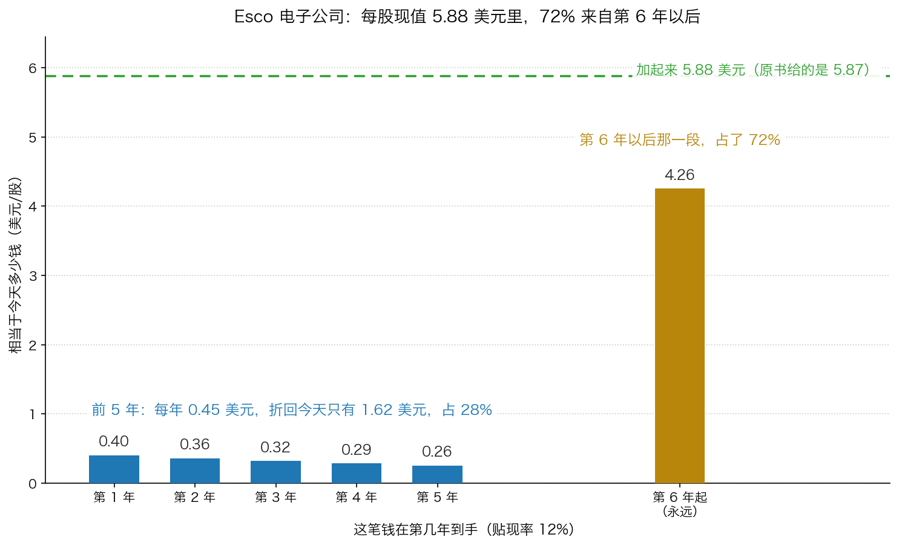
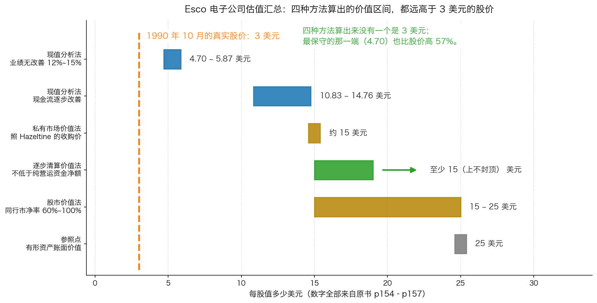

# 第 5 章：完整评估实例——Esco 电子公司

> 本章你将：
> - 认识 Esco 电子公司：一家 1990 年 10 月从爱默生电器公司分拆出来的国防企业
> - 把原书给出的全部关键数字（销售额、员工数、账面价值、营运资金、商誉摊销、债务）整理成一张表
> - 亲眼看到"商誉摊销"和"担保费到期"这两件事，是怎么变成每股 45 美分和 90 美分现金流的
> - 跟着卡拉曼一年一年地折现，把 4.70 美元和 14.76 美元这两个数字算出来
> - 看他怎么用四种方法围出一段价值区间，而股价只有 3 美元
> - 这对你的钱包意味着什么：你会走完一次完整的估值流程，并且知道"最保守的那个数字"才是你做决定的起点

这是这一周的收尾章，也是全课程技术含量最高的一章。

前四章我们分别讲了三种方法、贴现率怎么选、价值为什么是一个范围。
这一章把它们全部用在一家**真实的公司**上——
卡拉曼在书里用了十一页（p151–p161）来算这家公司，
我们会跟着他一步一步重算一遍。

**先交代一句：这是一个 1990 年前后的真实案例。**
所有的原始数字都**照抄原书并标注页码**。为了让你能跟着算，
我会补上一些原书没有明写的中间步骤（比如股数的推算），
这些补出来的部分我会明确标出"这是推算"。
凡是我自己算出来的结果和原书给的数字有差异，我也会如实写出来——
因为这本身就是最好的教材。

---

## 5.1 这家公司是怎么来的

故事从 1990 年 10 月开始。

> "让我举一个有关证券评估过程的详细例子。Esco 电子公司是一家国防企业，它于1990 年10 月从爱默生电器公司（Emerson Electric company)分拆了出来。"（p151）

**先把"分拆"这个词解释清楚。**

一家大公司（母公司）如果觉得某个业务不适合自己，可以把它"切"出来，
让它变成一个独立的上市公司，然后把新公司的股票**按比例分给自己的股东**。
这个过程就叫**分拆**（英文 spin-off）。

整个过程中**没有人付钱**——你不是"买"到了新公司的股票，
而是"白拿"的。母公司股东只是某天早上发现自己的账户里多了一只股票。

Esco 就是这么来的：

> "爱默生公司的股东可以以1:20 的比例获得Esco 公司的股份，也就是说一名拥有爱默生公司1000 股股票的持有人可以获得50 股Esco 公司的股份。"（p152）

**每 20 股爱默生，换 1 股 Esco。** 1000 股爱默生 → 50 股 Esco。

Esco 做的是什么生意？

> "Esco 公司从事多个与国防相关的业务，包括电子、武器、测试设备以及移动战术系统等。"（p152）

### 为什么分拆会创造机会

分拆创造机会，有三个结构性原因（这是理解整个案例的关键）：

1. **老股东不想持有它。** 买爱默生的人，看中的是一家多元化的工业巨头。
   忽然塞给他一家国防小公司，很多人的第一反应是"**这不是我要的东西，卖掉**"。
2. **没人研究它。** 分拆出来的公司往往规模小、没有分析师覆盖，
   连一份像样的研究报告都找不到。
3. **卖方压力集中。** 所有人同时想卖，而买的人很少——因为没人知道它值多少。

结果就是价格被砸下来：

> "Esco 公司股票刚刚开始交易时的价格为5 美元左右，但很快便跌至3 美元，这家分拆出来的公司的市价仅相当于15 美分的爱默生公司股价（爱默生公司的股价当时是40 美元左右）。不用说，许多爱默生公司的股东很快便卖出了Esco 公司的股份。"（p152）

**15 美分对 40 美元。** 卡拉曼用这个对比在提醒你：
在市场眼里，这家每年做 5 亿美元生意的公司，几乎等于不存在。

> 🇨🇳 **落到 A 股/港股：** "分拆"在 A 股/港股 里叫**分拆上市**，
> 常见的做法是母公司把一块业务拆到科创板、创业板或者港股上市。
> 但要注意一个重要的区别：
> - **美国式的 spin-off**：新股直接按比例送给老股东，**没有人付钱**，
>   所以必然出现"有人不想要、直接卖"的抛压。
> - **A 股/港股 常见的分拆上市**：通常是**发行新股募资**，
>   老股东不直接拿到新公司股票，所以没有那种"白拿然后甩卖"的抛压。
> **所以"分拆"这个逻辑在 A 股/港股 里的形态不一样**，你不能照搬。
> 真正和 Esco 对应得更近的，是这几种情形：
> ① **B 股转 H 股或者介绍上市**（新股不募资，直接挂牌）；
> ② **老股东实物分派**（把子公司的股票直接派给股东），
>    这在港股里偶有出现；
> ③ **大额限售股解禁、指数调出成分股**，也会造成"被迫卖出"的抛压。
> **共同点是：卖出的人不是因为它不好才卖，而是因为它不该在自己手里。**
> 这种抛压造成的低价，才是机会。

---

## 5.2 先把原书给的数字全部整理成一张表

在算任何东西之前，先把事实摆齐。下面是原书 p151 到 p153 给出的全部关键数字。

### 表一：这是一家什么样的公司

| 项目 | 数字 | 出处 |
|---|---|---|
| 分拆时间 | 1990 年 10 月 | p151 |
| 从哪家公司分拆 | 爱默生电器公司（Emerson Electric） | p151 |
| 业务 | 电子、武器、测试设备、移动战术系统 | p152 |
| 换股比例 | 每 20 股爱默生换 1 股 Esco | p152 |
| 年销售额 | 约 **5 亿美元** | p152 |
| 员工人数 | **6000 人** | p152 |
| 经营场所面积 | **320 万平方英尺**，其中 **170 万平方英尺**归公司自己所有 | p152 |
| 刚开始交易时的股价 | 约 **5 美元** | p152 |
| 分拆后的股价 | 跌到 **3 美元** | p152 |
| 相当于多少爱默生股价 | 15 美分（爱默生当时约 40 美元） | p152 |

### 表二：钱上的数字

| 项目 | 数字 | 出处 |
|---|---|---|
| 1986 年年末收购 Hazeltine 公司 | 花了 **1.9 亿美元**（当时 Esco 股价超过 15 美元/股） | p152 |
| 1985 年税后利润（实际值） | **3630 万美元** | p152 |
| 1989 年税后利润（估计值） | **670 万美元** | p152 |
| 1989 年支付的非经常开支 | 820 万美元 | p152 |
| 1990 年（估计值） | **亏损 520 万美元** | p152 |
| 1990 年支付的非经常开支 | 1380 万美元 | p152 |
| 净资产 | **4 亿美元** | p152 |
| 债务 | **4500 万美元** | p152 |
| 有形资产账面价值 | 超过 **25 美元/股** | p153 |
| 纯营运资金净额 | 超过 **15 美元/股** | p153 |

**在往下走之前，先停下来看一眼这两张表。**
这家公司：年销售 5 亿美元、6000 名员工、320 万平方英尺的场地、
净资产 4 亿美元、只有 4500 万美元债务。
它的股票卖 3 美元。

> 📌 **划重点：** 三组数字摆在一起，矛盾已经很明显了：
> - 有形资产账面价值 **超过 25 美元/股**；
> - 纯营运资金净额 **超过 15 美元/股**（也就是：流动资产减去全部负债之后，
>   每股还剩 15 美元以上的"硬东西"）；
> - 债务只有 4500 万美元，相对于 4 亿美元的净资产，**杠杆很低**；
> - 而股价是 **3 美元**。
>
> **3 美元是什么概念？** 它只是有形资产账面价值的 **12%**
> （3 除以 25 = 0.12），是纯营运资金净额的 **20%**。
> 换句话说：如果你花 3 美元买一股，然后这家公司立刻关门、
> 把流动资产变现、还掉所有债务，理论上你还能拿回 15 美元。

### 表三：两个把利润压下去的东西

这两个数字是理解整个案例的钥匙，单独列出来。

| 项目 | 数字 | 性质 | 出处 |
|---|---|---|---|
| **商誉摊销** | 每年约 **500 万美元**，即 **45 美分/股** | **非现金支出**（不真的花钱） | p153 |
| **担保费** | 每年 **740 万美元**，1991 到 1995 年每年支付 | **真实支出**，但只付 5 年 | p153 |
| 贝尔斯登分析师的 1991 财年预测 | **盈亏平衡** | 已经扣除了上面那 740 万美元 | p153 |

### 表四：未来的两个大问号

> "Esco 公司未来面临的两大问题让投资者感到担忧。第一个问题是，近期因承担了亏损的国防合同而让公司盈利大幅下降的趋势是否会逆转。第二个问题是，Esco 公司和美国政府之间两项悬而未决的合同纠纷结果会如何，不利的结果将让Esco 公司损失几千万美元的现金，并迫使该公司出现巨额亏损。"（p153）

1. **亏损的国防合同**：公司接了一批不赚钱的合同，把盈利压下去了。这批合同会结束吗？
2. **和政府的合同纠纷**：两项悬而未决，输了要赔几千万美元。

正是因为这两个问号，爱默生做了一个安排（原书说得很清楚，
分拆出来的是"由第三者暂为保管的普通股信托收据"，而不是普通股股份，
以确保 Esco 能履行义务并为爱默生提供补偿）。这件事本身就是一个信号：
**连母公司都觉得这家公司有不确定性。**

---

## 5.3 第一步：从利润走到现金流

现在开始算。第一步不是折现，而是**搞清楚这家公司每股每年能产生多少现金**。

因为利润和现金是两回事——Week 2 我们讲过这一点，Week 6 讲 EBITDA 时又强调过一次。

### 那块"不是钱的钱"：商誉摊销 45 美分/股

> "另外一项会对收益起到镇静作用的因素是，在收购Hazetine 公司之后，Esco 公司每年收取500 万美元左右的商誉价值摊销，且这笔费用是不可扣除的。因为商誉是一种非现金支出，单从这一项来源中获得的自由现金流为500 万美元，或45 美分/股。"（p153）

**先把"商誉"这个词说清楚。**

公司 A 花 10 亿元买下公司 B。B 的账本上净资产只有 6 亿。
多付的那 4 亿，会计上不能凭空消失，于是记成一个资产，叫**商誉**。

然后会计规则要求：这 4 亿要在若干年里**慢慢"消耗"掉**，
每年从利润里扣一笔，这个动作叫**商誉摊销**。

**关键在这里：摊销扣的是利润，不是钱。** 钱早在收购那天就付完了。
所以一笔商誉摊销会让"账面利润"变少，但**不会让公司少一分钱现金**。

卡拉曼说的就是这件事：Esco 每年有 500 万美元的商誉摊销，
它压低了利润，但它**同时是一笔真实的自由现金流**。

那么每股是多少？这里原书直接给了答案：**45 美分/股**。

我们可以反过来推算一下它的股数（**这一步是推算，不是原书内容**）：

500 万美元 除以 0.45 美元/股 = **约 1111 万股**

有了这个股数，后面很多数字都能互相验证。先记下来：

> **工作假设：Esco 大约有 1111 万股。**

### 那笔"5 年后就没了"的钱：担保费 45 美分/股

第二个数字是 740 万美元的担保费。这是 Esco 要为未到期的国防合同
向爱默生提供的担保，从 1991 年到 1995 年**每年支付**。

它是**真实的支出**——要真的付钱给爱默生。但它**只付 5 年**。
5 年之后这笔钱就不用付了，利润自然增加。

增加多少？原书直接给了：

> "从1996 年开始，公司无需再支付每年740 万美元的担保费，这意味着公司每年的税后收益将增加45 美分/股。"（p153–154）

我们验算一下（**这一步是推算**）：

- 740 万美元分摊到 1111 万股上：740 除以 1111 = 每股 **0.67 美元**（税前）
- 扣掉所得税之后：0.67 乘（1 减 大约三分之一的税率）= 每股约 **0.45 美元**

**正好对上原书说的 45 美分。** 这也反过来验证了"1111 万股"这个推算大致是对的。

### 于是我们得到了两条现金流

把上面两块拼起来，就得到了 Esco 每股的现金流：

| 时间段 | 每股现金流 | 怎么来的 |
|---|---|---|
| **第 1 到第 5 年** | 每年 **45 美分** | 商誉摊销带来的非现金自由现金流。担保费还在付，所以只有这 45 美分 |
| **第 6 年起** | 每年 **90 美分** | 45 美分（商誉摊销）+ 45 美分（担保费到期后不再支付，税后多出来的钱） |

原书是这样写的：

> "如果Esco 公司的业绩没有取得任何改善，那么这家公司将值多少钱呢？开始的5 年内，Esco 公司的现金流为45 美分/股，5 年之后当不再向爱默生公司支付担保费用后，公司的现金流为90 美分/股。"（p154）

**这就是"业绩毫无改善"的假设。** 注意它有多保守：

- 公司**没有变得更好**，销售额不增长，利润率不改善；
- 那批亏损的国防合同带来的拖累，假设会结束（否则现金流是负的），
  但也没有任何新的好事发生；
- 和政府的两项纠纷，假设不赢也不输。

关于资本支出，原书还有一句重要的假设：

> "例如，这些年来的折旧近似于资本支出，假设这种情况将持续至未来应该是一种较为保守的预测。"（p154）

意思是：公司每年折旧摊掉的钱，大约等于它每年花在设备上的钱。
两相抵消，所以**不用额外扣资本支出**。
他还提到，被亏损合同占用的营运资金未来可能被释放出来，
但"何时会出现这种转变还不确定"，所以**保守起见不把它算进来**。

> 📌 **划重点：** 这里是卡拉曼整套方法最值得学的地方——
> **他把每一个"可能变好"的因素都排除掉了，只留下"确定会发生"的那一件**
> （担保费到期）。这就是第 1 章讲的"保守立场"的具体操作：
> 乐观不是一种态度，而是一堆你需要主动**不去计算**的东西。

---

## 5.4 第二步：一年一年折现，算出保守情景下的价值

现在开始折现。原书用了两个贴现率：**12% 和 15%**。

先写 1.12 的连乘小抄（每一步乘 1.12）：

| 年数 | 除以几 |
|---|---|
| 1 | 1.120000 |
| 2 | 1.254400 |
| 3 | 1.404928 |
| 4 | 1.573519 |
| 5 | 1.762342 |

### 前 5 年：每年 45 美分

| 年份 | 现金流 | 除以几 | 折回今天 |
|---|---|---|---|
| 第 1 年 | 0.45 美元 | 1.120000 | **0.4018 美元** |
| 第 2 年 | 0.45 美元 | 1.254400 | **0.3587 美元** |
| 第 3 年 | 0.45 美元 | 1.404928 | **0.3203 美元** |
| 第 4 年 | 0.45 美元 | 1.573519 | **0.2860 美元** |
| 第 5 年 | 0.45 美元 | 1.762342 | **0.2553 美元** |
| **小计** | **2.25 美元** | — | **1.62 美元** |

加法过程：0.4018 + 0.3587 = 0.7605；加 0.3203 = 1.0808；加 0.2860 = 1.3668；
加 0.2553 = **1.6221**，取两位是 **1.62 美元**。

### 第 6 年以后：每年 90 美分，永远给下去

这一步分两小步，和第 1 章那道练习题一模一样：

**第一小步：站在第 5 年末看，这一整段值多少？**

每年 0.90 美元永远给下去，你要求 12%，所以：

0.90 除以 0.12 = **7.50 美元**

（验算：7.50 乘 12% = 0.90，正好是每年拿到的钱。对上了。）

**第二小步：把这 7.50 美元从第 5 年末折回今天。**

7.50 除以 1.762342 = **4.26 美元**

### 加起来

1.62 + 4.26 = **5.88 美元/股**

原书给的结果是：

> "这些现金流的现值为5.87 美元/股和4.7 美元/股，所使用的贴现率分别为12%和15%"（p154）

**我们算出来 5.88，原书是 5.87，差一分钱。**
（差别来自中间四舍五入的位数。）**这说明我们这套逐年手算的方法走对了。**

*图 5-1：Esco 电子公司每股现值的构成（贴现率 12%，业绩无改善的假设）。前 5 年那五根蓝色小柱子加起来只有 1.62 美元，占 28%；而"第 6 年以后永远每年 0.90 美元"这一根金色柱子就有 4.26 美元，占 72%。*

**这张图是这一章最重要的一张。** 它把第 1 章讲的"终值占比过大"
这个难题，变成了一家真实公司的具体长相：**你有 72% 的价值，
押在一个"永远每年 90 美分"的假设上。**

### 换成 15%

同样走一遍，1.15 的连乘小抄：

| 年数 | 除以几 |
|---|---|
| 1 | 1.150000 |
| 2 | 1.322500 |
| 3 | 1.520875 |
| 4 | 1.749006 |
| 5 | 2.011357 |

| 年份 | 现金流 | 除以几 | 折回今天 |
|---|---|---|---|
| 第 1 年 | 0.45 美元 | 1.150000 | 0.3913 美元 |
| 第 2 年 | 0.45 美元 | 1.322500 | 0.3403 美元 |
| 第 3 年 | 0.45 美元 | 1.520875 | 0.2959 美元 |
| 第 4 年 | 0.45 美元 | 1.749006 | 0.2573 美元 |
| 第 5 年 | 0.45 美元 | 2.011357 | 0.2237 美元 |
| **小计** | **2.25 美元** | — | **1.51 美元** |

第 6 年以后那一段：

- 站在第 5 年末：0.90 除以 0.15 = **6.00 美元**
- 折回今天：6.00 除以 2.011357 = **2.98 美元**

合计：1.51 + 2.98 = **4.49 美元/股**

**原书这里给的是 4.7 美元。我们算出来 4.49，差了 0.21 美元（约 4%）。**

这个差别值得说一句，因为它本身就是教材：

- 12% 那一档我们算到 5.88，原书是 5.87，几乎完全一致；
- 15% 那一档差了 4%。

一个可能的来源是"第 5 年之后那一整段"的处理方式。
如果按一个纯粹的永续年金来做比例缩放：5.87 乘 12 再除以 15 = 4.696，
**正好是原书的 4.7**。而对一个"前 5 年 45 美分、之后 90 美分"的两段式现金流，
这种直接按利率比例缩放会有一点点偏差。

**不管差别从哪来，它本身就是这一周最好的一个注脚：
同一套假设、同一个方法，两个认真的人算出来会差 4%。
所以永远不要拿估值的最后一位小数去做决定。**

> ⚠️ **易踩坑：** 有些初学者看到这里会想："那到底哪个对？"
> **正确的反应是：这不是"对不对"的问题，是"差多少"的问题。**
> 5.88 和 4.49 都在告诉你同一件事——这家公司远不止值 3 美元。
> 至于它到底是 4.49 还是 5.88，不影响你的决定。
> **只有当结论落在这个范围内的时候，你才需要纠结精度。**

### 保守情景小结

| 贴现率 | 我们逐年算出来的现值 | 原书给的数字 | 差别 |
|---|---|---|---|
| 12% | **5.88 美元** | 5.87 美元 | 0.01 |
| 15% | **4.49 美元** | 4.70 美元 | 0.21 |

**保守情景的价值区间：约 4.5 到 5.9 美元/股。**

---

## 5.5 第三步：如果公司真的改善了，值多少？

保守情景假设公司一点都不变好。现在换一个稍微乐观一点的假设。

> "如果Esco 公司成功在分拆之后的10 年内将自由现金流每年只增加220 万美元，或20 美分/股，它的价值又是多少呢？分别按照12%和15%的贴现率来结算，公司这些现金流的现值分别为14.76 美元和10.83 美元。"（p154–155）

**注意"只增加"这三个字。** 卡拉曼用的词是"只"——
每年多 20 美分，十年下来从 45 美分涨到 2.45 美元，
这是一个**温和**的假设，不是"这家公司要腾飞"。

下面这张表是我们按原书描述重建的（**重建方式说明**：
把第 1 年的现金流定在 0.65 美元，此后每年增加 0.20 美元，
第 10 年达到 2.45 美元，之后维持 2.45 美元不再增长）。
这个重建方式和原书的结果对得上（见下表最后一行）。

### 12% 的情况

| 年份 | 现金流 | 除以几 | 折回今天 |
|---|---|---|---|
| 第 1 年 | 0.65 美元 | 1.120000 | 0.5804 |
| 第 2 年 | 0.85 美元 | 1.254400 | 0.6776 |
| 第 3 年 | 1.05 美元 | 1.404928 | 0.7474 |
| 第 4 年 | 1.25 美元 | 1.573519 | 0.7944 |
| 第 5 年 | 1.45 美元 | 1.762342 | 0.8228 |
| 第 6 年 | 1.65 美元 | 1.973823 | 0.8359 |
| 第 7 年 | 1.85 美元 | 2.210682 | 0.8368 |
| 第 8 年 | 2.05 美元 | 2.475964 | 0.8280 |
| 第 9 年 | 2.25 美元 | 2.773080 | 0.8114 |
| 第 10 年 | 2.45 美元 | 3.105850 | 0.7888 |
| **10 年小计** | — | — | **7.72 美元** |

第 10 年以后：假设维持每年 2.45 美元不变。

- 站在第 10 年末看：2.45 除以 0.12 = **20.42 美元**
- 折回今天：20.42 除以 3.105850 = **6.57 美元**

合计：7.72 + 6.57 = **14.29 美元/股**

**原书给的是 14.76 美元。** 差 0.47 美元（约 3%），同一个量级。

### 15% 的情况

| 年份 | 现金流 | 除以几 | 折回今天 |
|---|---|---|---|
| 第 1 年 | 0.65 美元 | 1.150000 | 0.5652 |
| 第 2 年 | 0.85 美元 | 1.322500 | 0.6427 |
| 第 3 年 | 1.05 美元 | 1.520875 | 0.6904 |
| 第 4 年 | 1.25 美元 | 1.749006 | 0.7147 |
| 第 5 年 | 1.45 美元 | 2.011357 | 0.7209 |
| 第 6 年 | 1.65 美元 | 2.313061 | 0.7133 |
| 第 7 年 | 1.85 美元 | 2.660020 | 0.6955 |
| 第 8 年 | 2.05 美元 | 3.059023 | 0.6702 |
| 第 9 年 | 2.25 美元 | 3.517876 | 0.6396 |
| 第 10 年 | 2.45 美元 | 4.045558 | 0.6056 |
| **10 年小计** | — | — | **6.66 美元** |

第 10 年以后：

- 站在第 10 年末：2.45 除以 0.15 = **16.33 美元**
- 折回今天：16.33 除以 4.045558 = **4.04 美元**

合计：6.66 + 4.04 = **10.70 美元/股**

**原书给的是 10.83 美元。** 差 0.13 美元（约 1%）。

### 净现值法的完整结论

> "根据上述假设，Esco 公司的净现值最保守为4.70 美元/股，乐观的预期为14.76 美元/股，这一价值范围确实很大，但这两种情况下的价值都高于3 美元的股价，也没有采用过于乐观的假设。"（p155）

**请再读一遍最后半句："也没有采用过于乐观的假设。"**
卡拉曼在强调：14.76 美元这个上限，不是靠想象力堆出来的。
它的假设只是"每年多赚 20 美分"，而且第 10 年之后就不再增长了。

**净现值法给出的价值区间：4.70 到 14.76 美元/股。**

---

## 5.6 第四步：另外三种方法各算一遍

### 私有市场价值法：不适用，但有一个参照

> "投资者也会希望用除净现值法以为的其他方法来评估这家公司的价值。然而，私有市场价值法并不适用于这一案例，因为近期没有出现过大规模国防企业的收购案。即使有这样的收购案例，Esco 公司悬而未决的合同纠纷也会让任何人丧失买下整个公司的兴趣，除非能以极低的价格购买这家公司。实际上早在Esco 公司被分拆出来之前，这家公司就被挂牌出售，但没有人愿意接受爱默生公司提出的价格。"（p155）

**这一段特别重要，因为它教的是一个"不做"的动作。**
卡拉曼没有硬凑一个倍数出来，他直接说：**这个方法在这里不适用。**

那参照点在哪？在和 Esco 自己的历史比：

> "爱默生公司在4 年前才以1.9 亿美元的价格购买了Hazeltine 公司，在Esco 公司被分拆出去的时候，这家公司仅构成了Esco 公司的一项业务。即使仅以收购Hazeltine 公司时使用的估值水平接管Esco公司，Esco 公司的价值也是其股市价值的许多倍，仅Hazeltine 公司的价值就相当于15 美元的Esco 公司股价。"（p156）

**注意这个比较的结构：**

- 1986 年，爱默生花 **1.9 亿美元**买了 Hazeltine；
- Hazeltine 后来只是 Esco 的**其中一项业务**；
- 如果按当年那笔交易的水平给 Esco 估值，**仅 Hazeltine 这一项就相当于 15 美元/股**；
- 而整个 Esco 的股价是 **3 美元**。

**一句话：4 年前花 1.9 亿买来的东西，现在整个公司的市值只有它的一小部分。**

> 💡 **换个说法：** 这就像一个房东四年前花 190 万买下一栋楼，
> 现在整栋楼（包括后来加盖的两层）在市场上只标价 30 万。
> 你可以争论"它到底值 150 万还是 200 万"，
> 但你很难说它值 30 万。

**私有市场价值法给出的参照：约 15 美元/股（仅 Hazeltine 一项）。**

### 逐步清算价值法：不低于 15 美元

> "清算价值法也不是特别适用于这个案例。国防企业的清算并不简单。这类企业的资产用途有限，库存和应收账款只对一家持续经营的国防公司而言才有价值。然而，可以在逐步清算的基础上对Esco 公司进行评估，也就是说正在执行的合同继续执行直至完成，公司也不再寻找新合同。这种情况下的企业价值是不确定的，但很难想象通过这种清算方式获得的收益会低于15 美元/股的纯营运资金净额。"（p156）

**"很难想象……会低于 15 美元/股的纯营运资金净额。"** ——
这是卡拉曼的一个典型表述：他不说"它值 15 美元"，
他说"**我很难想象它会低于 15 美元**"。

为什么清算价值法在这里也不完全适用？因为他诚实：
国防企业的资产用途有限，"库存和应收账款只对一家持续经营的国防公司而言才有价值"——
也就是说，第 3 章讲的那个"打折"问题在这里特别严重。

**所以他退了一步，用了一个更硬的算法：逐步清算。**
不是今天关门大甩卖，而是"把手上的合同做完，不再接新合同"。
这比"低价甩卖"从容得多，所以能拿回的钱也更多。

**逐步清算价值法给出的下限：不低于 15 美元/股。**

### 股市价值法：同行都在 60%~100% 的账面价值

> "股市价值法是另外一种有用的准绳，尤其是在衡量刚刚上市交易的分拆企业该以什么样的合理价格进行交易中能提供帮助。"（p156）

> "在这个案例中，Esco 公司的股价就像是一家坐落在另外一个星球上的企业才有的股价。3 美元的股价仅为该公司有形资产账面价值的12%，对一家有着正现金流、债务有限的有生命力的公司而言，这样的股价太低了。事实上，该公司的股价可以较当前的价格上涨400%而依然不足其有形资产账面价值的一半。当然，当时其他国防公司的股价走势同样疲软，多数国防类股的价格仅为收益的4-6 倍。近期刚刚被分拆出来的另外一家国防公司阿里杨特技术系统公司（Alliant Techsystems）的股价仅为预期收益的2 倍，然而，多数国防公司的股价都为账面价值的60%-100%，且此前一直高于这样的水平。"（p156–157）

把这一段的数字整理出来：

| 参照对象 | 数字 |
|---|---|
| Esco 自己的股价 | 3 美元，**仅为有形资产账面价值的 12%** |
| 原书的说法：股价即使大幅上涨，仍不足有形资产账面价值的一半 | 按 25 美元的账面价值反推，涨到 12 美元时相当于 25 美元的 **48%**，刚好不到一半 |
| 其他国防公司的市盈率 | 多数只有 **4 到 6 倍** |
| 阿里杨特技术系统公司 | 只有预期收益的 **2 倍** |
| **多数国防公司的市净率** | **账面价值的 60% 到 100%** |

**关键在最后一行。** 同行的股价当时也很疲软（4-6 倍市盈率、有公司只有 2 倍），
但它们的市净率是 60% 到 100%。而 Esco 是 **12%**。

**整个行业都在被嫌弃，而 Esco 被嫌弃得特别厉害。**
这就是"相对"的意义：你不能只看它便宜，你要看它**比同行便宜多少**。

用同行的市净率给 Esco 估值：

- 25 美元 乘 60% = **15 美元**
- 25 美元 乘 100% = **25 美元**

**股市价值法给出的区间：15 到 25 美元/股。**

（这里要提醒一句：卡拉曼自己说得很清楚，
股市价值法是"有缺点的评估方法"，"你不会希望用股市价值法来评估一个行业中的每家企业"。
所以这个 15~25 美元只能当参照，不能当结论。）

### 还有一个参照：调整后收益

还有一个数字可以帮我们理解股价有多低。

> "尽管Esco 公司的盈利不及其他多数的国防企业，然而，即使忽略商誉价值摊销和740 万美元的特别费用，这家公司的股价仅为收益的3 倍。"（p157）

这句话里的"收益"，是把两个东西加回去之后的收益：
商誉摊销 45 美分，加上担保费税后 45 美分，
**调整后的每股收益大约是 1 美元**。

**股价 3 美元 除以 1 美元 = 3 倍。**
也就是说，**如果不算那两笔把利润压下去的东西，这家公司只卖 3 倍市盈率。**

这个 1 美元在后面还会用到，因为卡拉曼用它来验证"涨多少才算贵"。

---

## 5.7 第五步：把四种方法摆在一起

现在到了这一章、也是这一周的收尾动作：**把所有的结果排成一排。**

*图 5-2：Esco 电子公司估值汇总。四种方法给出四段区间：现值分析法（业绩无改善）4.70~5.87 美元；现值分析法（现金流逐步改善）10.83~14.76 美元；私有市场价值法约 15 美元；逐步清算价值法至少 15 美元；股市价值法 15~25 美元。参照点是有形资产账面价值 25 美元。而 1990 年 10 月的真实股价是 3 美元。*

| 方法 | 得到的结果 | 出处 |
|---|---|---|
| 现值分析法（业绩无改善，12%） | 5.87 美元 | p154 |
| 现值分析法（业绩无改善，15%） | 4.70 美元 | p154 |
| 现值分析法（现金流逐步改善，12%） | 14.76 美元 | p154–155 |
| 现值分析法（现金流逐步改善，15%） | 10.83 美元 | p155 |
| 私有市场价值法（照 Hazeltine 的收购价） | 约 15 美元（仅那一项业务） | p156 |
| 逐步清算价值法 | 不低于 15 美元（纯营运资金净额） | p156 |
| 股市价值法（同行市净率 60%~100%） | 15 到 25 美元 | p157 |
| 参照点：有形资产账面价值 | 25 美元 | p153 |
| 参照点：纯营运资金净额 | 15 美元 | p153 |
| **今天的股价** | **3 美元** | p152 |

### 这张表在告诉你什么

**第一，同一家公司，不同方法算出来的数字能差 5 倍多。**
最低的 4.70 美元，最高的 25 美元。这就是第 0 章讲的"价值是一个范围"。
**任何人给你一个精确的估值，你都可以问他："那换一种方法呢？"**

**第二，区间很宽，但结论很一致。**
这是这张表最有意思的地方：

- 最保守的方法（现值分析法 + 业绩无改善 + 15% 贴现率）→ **4.70 美元**
- 最乐观的方法（股市价值法 + 同行上限市净率）→ **25 美元**
- 而股价是 **3 美元**

**四种方法，没有一种算出 3 美元。**

**第三，保守的那一端离股价最远的那家公司，才是最好的机会。**
在这个案例里，**最保守的一档是 4.70 美元，比股价 3 美元仍然高出 57%**。

### 安全边际怎么算

按我们这一周反复讲的纪律：
**安全边际 = 最保守的那一端 减 买入价**

安全边际 = 4.70 - 3 = **1.70 美元**

占保守价值的比例：1.70 除以 4.70 = **36.2%**

**这就是卡拉曼说的那个"巨大安全边际"：**

> "3 美元的股价，25 美元/股的有形资产账面价值以及债务有限，这些都给投资者提供了巨大的安全边际。"（p157）

### 如果涨一倍呢？他的验算特别漂亮

卡拉曼做了一次反向验算，用来证明"3 美元便宜"不是靠乐观假设撑起来的：

> "看上去Esco 公司的价值轻而易举就能较3 美元的股价翻番，即使这样其价值也仅为调整后收益的6 倍，为纯营运资金净额的40%，也不足有形资产账面价值的25%。这家公司值10 美元/股吗？根据使用稍显乐观的假设的净现值法或者逐步进行清算的清算价值法，这是有可能的。"（p157）

我们把他的验算一步一步摊开。假设股价涨到 **6 美元**（翻倍）：

| 换个角度验证 6 美元 | 怎么算 | 结论 |
|---|---|---|
| 是调整后收益的几倍？ | 6 除以 1 = 6 | 只有 **6 倍市盈率**（同行是 4~6 倍，说明还没涨到行业水平） |
| 是纯营运资金净额的多少？ | 6 除以 15 = 0.40 | 只有 **40%**（连"关门清算能拿回的钱"的六成都不到） |
| 是有形资产账面价值的多少？ | 6 除以 25 = 0.24 | 不足 **25%**（还是大幅破净） |

**看清楚这个验算的威力了吗？**
它说的是：股价**翻一倍到 6 美元**，从每一个角度看，它**还是便宜的**。
它不是"涨到合理价"，它只是"从非常便宜涨到便宜"。

然后卡拉曼问了一个更远的问题："这家公司值 10 美元/股吗？"
他的回答很克制：**"根据使用稍显乐观的假设的净现值法或者逐步进行清算的清算价值法，这是有可能的。"**
（对照上面那张表：乐观的净现值是 10.83 到 14.76，逐步清算是 15 以上。
所以 10 美元确实在可能范围内。）

> 📌 **划重点：** 这一段示范了一个极有价值的思维习惯：
> **不要问"它能涨多少"，要问"如果它涨了 X，它还算便宜吗"。**
> - 涨一倍到 6 美元，还便宜（6 倍市盈率、40% 净营运资金、24% 账面价值）。
> - 涨到 10 美元，还在合理区间内。
> - 这就是为什么这笔投资的"下跌风险有限、上涨空间很大"——
>   **不是因为有人预测它会涨，而是因为它的起点实在太低了。**

---

## 5.8 最精彩的一句：你不需要知道它值多少

算到这里，你可能会有一个疑问：

"这套方法算出来是 4.70 到 25 美元，区间这么宽，那到底该怎么用？"

卡拉曼的回答，是这一章、也可能是整本书里最漂亮的一段话：

> "3 美元股价的Esco 公司的奇妙之处在于，人们不必确切地知道这家公司的价值。这样的价格代表了公司陷入了灾难，只要公司没有陷入灾难，不管出现哪种情况，这家公司的股价都会上涨。最糟的情况是，由合同纠纷引起了巨额亏损，但即使如此股价也已经反映了这种可能性。"（p157）

我们把这段话的逻辑拆开，你会看到它有多严密：

**第一步：3 美元这个价格，隐含了什么假设？**
它隐含的是"这家公司要完蛋"。因为一家有形资产账面价值 25 美元、
纯营运资金净额 15 美元、债务只有 4500 万的公司，如果它正常活着，
不可能只值 3 美元。**这个价格已经把灾难定价进去了。**

**第二步：那么，只要灾难没有真的发生呢？**
公司继续做生意、合同继续执行、员工继续上班——那么，
市场迟早要面对一个事实：这家公司不是要完蛋的。
**这时候，价格就必须往上调整。**

**第三步：如果灾难真的发生了呢？**
"最糟的情况是，由合同纠纷引起了巨额亏损，但即使如此股价也已经反映了这种可能性。"
**这就是"下限"的意义：你付的价格已经把坏消息包含在内了。**

> 💡 **换个说法：** 这就像一个被所有人认定要倒闭的店，
> 铺面连带存货被人用"废品价"接手了。接下来会发生什么？
> - 它真的倒了 → 接手的人按废品处理，没赚没亏；
> - 它没倒，继续做生意 → 接手的人赚了一大笔。
>
> **你不需要知道它到底值 4.7 美元还是 25 美元。你只需要知道"它不止值 3 美元"。**
> 这就是第 0 章讲的格雷厄姆那句话的实战版：
> "证券分析的目的仅仅是确定价值是否足够……或者价值是否大幅高于或者低于市场上的价格。"

### 后来怎么样了

原书的结尾给了答案：

> "根据公开披露的文件，在分拆之后不久，Esco 公司的董事会主席用自己的私人账户再市场中买入了该公司的股票。1991年年初，由分拆引起的卖盘压力开始减弱，国防类股开始上涨，Esco"（p157–158）

> "公司的股价上涨至超过8 美元。"（p158）

**从 3 美元涨到超过 8 美元。** 而这个过程中，
公司的经营并没有发生戏剧性的好转——**是卖盘压力消失了，行业情绪回暖了。**

还有一件事值得注意：**董事会主席用私人账户在市场上买入。**
这条线索 Week 10 会专门讲（内部人士买入是信息量最大的信号之一），
这里先记住：**当管理层用自己的钱、在公开市场上买自己公司的股票时，
那是一个和"股权激励"完全不同的信号。**

> ⚠️ **易踩坑：** 读完这个案例，最容易产生的一个错误想法是：
> "原来就是找股价远低于账面价值的公司，买了就等涨。"
> 这个理解漏掉了三件事：
> 1. **卡拉曼是把四种方法都算了一遍，才敢下结论的。** 他不是看到"破净"就买。
> 2. **他算出来的是"低于 3 美元是机会"，而不是"低于账面价值就是机会"。**
>    一家账面价值 25 美元、但年年巨额亏损、烧钱速度很快的公司，
>    3 美元也可能不便宜——因为它的账面价值会缩水。
> 3. **Esco 的债务只有 4500 万。** 这是整个案例能成立的隐形前提。
>    如果它欠着 4 个亿的债、明年就到期，那么"崩盘"的反射关系（第 4 章）
>    就可能真的把它拖垮——那时候 3 美元就不是机会，而是终点。

> 🇨🇳 **落到 A 股/港股：** 这个案例在今天的 A 股/港股 里，能给你三个可操作的动作。
> 1. **看"破净"时，一定先看净资产里有多少是硬的。** Esco 的关键不是"破净"，
>    而是它的**纯营运资金净额就有 15 美元**。你在 A 股/港股 里找同类机会时，
>    应该先算净营运资金（流动资产减全部负债），
>    而不是先看市净率——市净率里可能塞满了商誉和过时的产线。
> 2. **找"被迫卖出"造成的低价。** Esco 的低价来自分拆后的被动抛售。
>    A 股/港股 里类似的结构有：限售股解禁、指数成分股调整、
>    大股东爆仓被强平、基金到期清盘。这些卖出**不是因为公司变差了**，
>    所以才可能造成错误定价。
> 3. **算完四种方法，然后写出你自己的区间。**
>    不要只写一个数。写上"我算出来最低 ___ 元、最高 ___ 元，
>    我只在 ___ 元以下才考虑买"。最后那个空，就是你给自己定的纪律。

---

## ✍️ 想一想

1. **为什么 Esco 的股价会跌到只有有形资产账面价值的 12%？
   请从"谁在卖、为什么卖、谁在买"三个角度解释。**
   然后想一想：这三个原因里，哪一个和"公司经营得不好"有关？
2. **卡拉曼说"3 美元股价的 Esco 公司的奇妙之处在于，人们不必确切地知道这家公司的价值"。
   请用你自己的话解释：为什么"不需要知道精确价值"反而是一种优势？**
   如果你知道它精确值 12.36 美元，你的做法会有什么不同？
3. **在这个案例里，最保守的估值是 4.70 美元，股价是 3 美元，安全边际 36%。
   但同一套方法在 15% 贴现率下算出来是 4.49 美元（我们的逐年表）。
   如果股价是 4.5 美元而不是 3 美元，你还会买吗？**
   请说清楚你的判断依据是哪个数字。

> 💡 **参考思路：**
> 1. **谁在卖**：爱默生的原有股东。他们买爱默生是为了持有一家多元化工业巨头，
>    忽然账户里多出来一家国防小公司，很多人第一反应就是卖掉。
>    **为什么卖**：不是因为他们研究后认为 Esco 不好，
>    而是因为它**不该出现在自己的组合里**——这就是"被迫卖出"。
>    **谁在买**：几乎没人。因为这是一家刚分拆的小公司，没有分析师覆盖、
>    没有研究报告、还有两个悬而未决的合同纠纷。
>    **三个原因里，只有第三个（合同纠纷）和公司经营有关，
>    前两个纯粹是"技术性"的。** 这就是这类机会的本质：
>    价格的下跌大部分来自"供需结构"，而不是"基本面恶化"。
>    而技术性的抛压会消失，基本面恶化不会——**这就是你要分辨的东西。**
> 2. 因为投资决策需要回答的是"**这个价格划不划算**"，而不是"它精确值多少"。
>    当价格远远低于任何一种估算的下限时，精确度就变得不重要了——
>    4.70 和 25 之间的差距很大，但它们都在 3 的上面。
>    **"不需要精确"是一种优势，因为它让你摆脱了"我必须算准"这个不可能完成的任务**，
>    把注意力放到了真正重要的事情上：价格有没有留出足够大的缓冲。
>    如果你知道它精确值 12.36 美元，你的行为反而可能变坏——
>    你会开始计算"12.36 减 3 等于 9.36，我还有 9.36 的空间可以亏"，
>    然后可能在 9 美元、10 美元的时候就开始买了，
>    而那时候你的"精确估值"一旦错了，缓冲就没了。
>    **精确的数字会让人放松纪律，宽区间反而让人保持保守。**
> 3. 关键看你**用哪个数字做基准**。
>    如果你的纪律是"拿最保守的那一端去减"，那么：
>    - 按我们逐年算出来的 4.49 美元：4.49 - 4.5 = **-0.01 美元**，安全边际是负的，不买；
>    - 按原书的 4.70 美元：4.70 - 4.5 = 0.20 美元，只有 4.3%，太薄，也不该买。
>    **两种算法都告诉你：4.5 美元不是买点。**
>    这个例子的价值在于：它演示了"同一家公司，3 美元是机会，4.5 美元就不是了"。
>    决定这个差别的不是公司变了，而是**价格把缓冲吃掉了**。
>    **所以纪律的作用不是让你赚更多，而是让你在价格不合适的时候不出手。**

---

## 🧮 算一算

这一次，我们要把 Esco 的保守情景**用一个原书没用的贴现率再算一遍**，
然后回答一个原书没有直接回答的问题：
**如果股价是 5 美元（它刚开始交易时的价格），这笔投资还成立吗？**

### 情境

沿用原书的假设，一字不改：

- 第 1 到第 5 年，每股现金流 **0.45 美元**；
- 第 6 年起，每股现金流 **0.90 美元**，永远给下去；
- 贴现率用 **10%**（比原书的 12% 低，因为 10% 是很多人习惯用的数字，
  我们正好用它来看"用 10% 会不会把结论算得太乐观"）。

股数按 1111 万股。

### 第 1 步：写 1.10 的连乘小抄

每一步乘 1.10：

| 年数 | 除以几 |
|---|---|
| 1 | 1.100000 |
| 2 | 1.210000 |
| 3 | 1.331000 |
| 4 | 1.464100 |
| 5 | 1.610510 |

*这一步在算什么：把要除的那些数准备好。注意 10% 的小抄很好记：
1.1、1.21、1.331、1.4641、1.61051。*

### 第 2 步：把前 5 年的 0.45 美元折回今天

| 年份 | 现金流 | 除以几 | 折回今天 |
|---|---|---|---|
| 第 1 年 | 0.45 美元 | 1.100000 | **0.4091 美元** |
| 第 2 年 | 0.45 美元 | 1.210000 | **0.3719 美元** |
| 第 3 年 | 0.45 美元 | 1.331000 | **0.3381 美元** |
| 第 4 年 | 0.45 美元 | 1.464100 | **0.3074 美元** |
| 第 5 年 | 0.45 美元 | 1.610510 | **0.2794 美元** |
| **小计** | **2.25 美元** | — | **1.7059 美元** |

加法过程：0.4091 + 0.3719 = 0.7810；加 0.3381 = 1.1191；
加 0.3074 = 1.4265；加 0.2794 = **1.7059**。

*这一步在算什么：把明确能预测的 5 年折回今天。名义上 2.25 美元，折回今天只剩 1.71 美元。*

### 第 3 步：算第 6 年以后那一整段

**第一小步**：站在第 5 年末，每年 0.90 美元永远给下去，要求 10%：

0.90 除以 0.10 = **9.00 美元**

（验算：9.00 乘 10% = 0.90，对上了。）

**第二小步**：把这 9.00 美元折回今天：

9.00 除以 1.610510 = **5.5883 美元**

*这一步在算什么：把"永续"那一整段折回今天。这里是最容易漏掉"再折一次"的地方——
站在第 5 年末看是 9.00 美元，站在今天看只剩 5.59 美元，中间差的是五年的等待成本。*

### 第 4 步：加起来

1.7059 + 5.5883 = **7.2942 美元/股**

**所以在 10% 的贴现率下，Esco 保守情景下每股值 7.29 美元。**

*这一步在算什么：得到 10% 这一档的答案。现在我们有三个贴现率的结果了。*

### 第 5 步：把三档贴现率摆在一起

| 贴现率 | 保守情景下的每股价值 | 前 5 年那部分 | 第 6 年以后那部分 |
|---|---|---|---|
| 10% | **7.29 美元** | 1.71 美元（23%） | 5.59 美元（77%） |
| 12% | **5.88 美元** | 1.62 美元（28%） | 4.26 美元（72%） |
| 15% | **4.49 美元** | 1.51 美元（34%） | 2.98 美元（66%） |

**注意最后两列。** 不管用哪个贴现率，**第 6 年以后那一段都占了三分之二以上**。
这不是巧合，这是这家公司的价值结构：**它的价值主要来自"以后"，
而不是"现在"。**

这也是为什么卡拉曼要那么小心地处理终值——
**他知道自己算出来的数字，大部分悬在一个无法验证的假设上。**

*这一步在算什么：做敏感度分析。三个贴现率，得到三个答案，差值接近 3 美元。*

### 第 6 步：算安全边际（基准：最保守的那一档）

**按我们的纪律，基准永远是区间最低的那一端。**
在保守情景里，最低的是 15% 贴现率下的 **4.49 美元**。

用股价 3 美元算：

安全边际 = 4.49 - 3 = **1.49 美元**

占保守价值的比例：1.49 除以 4.49 = **33.2%**

*这一步在算什么：把三个答案收成一个决策。
注意：如果你拿 10% 那一档的 7.29 美元去减，安全边际是 4.29 美元，占 58.8%——
**好看得多，但那是自己给自己发的奖金。** 同一道题不能有两个参照点。*

### 第 7 步：核心问题——如果股价是 5 美元呢？

Esco 刚开始交易时股价是 5 美元左右，后来才跌到 3 美元。
我们用同样的方法算一遍，只换价格：

| 股价 | 安全边际（拿 4.49 美元减） | 占保守价值的比例 | 判断 |
|---|---|---|---|
| 3 美元 | 1.49 美元 | 33.2% | 有厚缓冲，值得认真研究 |
| **5 美元** | **-0.51 美元** | **-11.4%** | **在保守情景下，没有缓冲** |
| 6 美元 | -1.51 美元 | -33.6% | 保守情景下已经贵了 |

**结论很清楚：在"业绩毫无改善"这个保守假设下，
5 美元就已经不划算了。**

那这是不是说"5 美元不该买"？**不一定。** 你还有别的方法：

| 方法 | 5 美元这个价格怎么看 |
|---|---|
| 现值分析法（保守情景，4.49~7.29） | 5 美元在区间内，缓冲很薄甚至没有 |
| 现值分析法（改善情景，10.70~14.29） | 5 美元便宜（有 53% 到 65% 的空间） |
| 私有市场价值法（约 15） | 5 美元便宜 |
| 逐步清算价值法（不低于 15） | 5 美元便宜 |
| 股市价值法（15~25） | 5 美元便宜 |
| 有形资产账面价值（25） | 5 美元只有账面价值的 20% |

**四种方法里有三种说它便宜，只有最保守的那一种（业绩毫无改善的现值法）
说它"没什么缓冲"。**

**那么正确的动作是什么？** 不是"买"或者"不买"，而是：

1. **承认自己现在处在一个需要判断的位置**：你必须在"公司会改善"和"公司不改善"之间下注。
2. **用仓位来表达你的不确定**：如果只买一点点（比如计划仓位的三分之一），
   那么"押错了"的代价是有限的。
3. **留出加仓的空间**：如果它跌到 3 美元，你可以再加——
   那时的安全边际是 33%，是 5 美元时的无穷多倍。

*这一步在算什么：这是整章最重要的一个动作——
**把"贵/便宜"变成一个带条件的判断，而不是一个结论。**
5 美元在"公司不改善"的世界里不便宜，在"公司会改善"的世界里很便宜。
你不知道自己在哪个世界里，所以你的动作必须能同时容纳这两种可能。*

> 📌 **划重点：** 这个练习的最后一层意义是：
> **估值的输出不是一个数字，而是一张"条件表"。**
> "如果 ___ 成立，它值 ___；如果 ___ 不成立，它只值 ___。
> 所以我的动作是 ___。"
> 任何人（包括你自己）给你一个不带条件的估值，
> 都只是把不确定性藏起来了，而不是消除了它。

---

## ✅ 小测验

**1. Esco 电子公司 1990 年 10 月从哪家公司分拆出来？分拆后股价跌到多少？**
A. 从通用电气分拆，跌到 10 美元
B. 从爱默生电器公司分拆，跌到 3 美元
C. 从爱默生电器公司分拆，跌到 15 美元
D. 从贝尔斯登分拆，跌到 5 美元

**2. 卡拉曼说 Esco 每年 500 万美元的商誉摊销"是一种非现金支出"，
所以他把它算成了自由现金流（约 45 美分/股）。为什么商誉摊销要加回来？**
A. 因为商誉摊销是税法允许的抵扣，可以少交税
B. 因为商誉摊销只是在账面上分年"消耗"当年收购多付的钱，
   它减少了账面利润，但不减少公司手里的现金
C. 因为商誉摊销是公司自己随便定的，可以不算
D. 因为商誉其实是一项真实的资产，会升值

**3. 卡拉曼用四种方法给 Esco 估值，结果从 4.70 美元一直到 25 美元，
而股价只有 3 美元。他说"人们不必确切地知道这家公司的价值"，原因是：**
A. 因为估值本来就不重要，买便宜货靠感觉
B. 因为 3 美元这个价格已经把"公司陷入灾难"定价进去了，
   只要灾难没真的发生，价格就必须向上调整
C. 因为 3 美元正好等于他的估值下限，所以是精确匹配的
D. 因为公司最后被收购了，所以估值没用

> **答案与解析**
>
> **1. B。** 原书 p151–p152 写得很清楚：Esco 电子公司"于1990 年10 月从爱默生电器公司
> （Emerson Electric company)分拆了出来"，股票"刚刚开始交易时的价格为5 美元左右，
> 但很快便跌至3 美元"。A 错在公司名；C 的 15 美元是纯营运资金净额
> （也是 Hazeltine 那一项业务对应的股价），不是股价；
> D 里的贝尔斯登是给出 1991 财年盈亏平衡预测的分析机构，不是母公司。
>
> **2. B。** 会计上，收购时多付的钱记成"商誉"这个资产，
> 之后要分年从利润里扣掉（摊销）。但**钱在收购那天就已经付完了**，
> 摊销只是账面动作。所以它压低利润、不减少现金——
> 卡拉曼的原话是"因为商誉是一种非现金支出，单从这一项来源中获得的自由现金流为500 万美元，
> 或45 美分/股"。A 错在方向：摊销在这里"不可扣除"，
> 而且它的意义不在省税；C 错在商誉摊销的年限和方法受会计准则约束，不是随便定的；
> D 说反了，商誉是会被摊销掉的，而且清算时通常一文不值（第 3 章讲过）。
>
> **3. B。** 这是卡拉曼那段话的完整逻辑：
> "这样的价格代表了公司陷入了灾难，只要公司没有陷入灾难，不管出现哪种情况，
> 这家公司的股价都会上涨。最糟的情况是，由合同纠纷引起了巨额亏损，
> 但即使如此股价也已经反映了这种可能性。"
> A 完全违背了整本书；C 错在 3 美元远远低于他的估值下限 4.70 美元，
> 不是"精确匹配"；D 错在收购不是这个案例的结局，
> 原书给的结局是"1991 年年初，由分拆引起的卖盘压力开始减弱，
> 国防类股开始上涨，Esco 公司的股价上涨至超过8 美元"。

---

## 📖 回到原书

- 对应原书 **第八章** 的最后一节，也是全书最长的一个案例：
  `raw/安全边际-中文版/page_151.md` ~ `page_161.md`（原书 p151–p161）。
- **建议精读：p152–p153**（公司的基本情况、全部关键数字、
  商誉摊销和担保费）。这两页是本章所有计算的原材料，值得逐句抄下来。
- **建议精读：p154–p155**（净现值法的两种情景、4.70 与 14.76 这两个数字）。
  重点看他是怎么把"每年多 20 美分"这种温和假设用上的。
- **建议精读：p156–p157**（私有市场价值法的"不适用"、
  逐步清算的 15 美元下限、股市价值法的同行对比、
  "即使翻番也还是便宜"那段验算）。
- **建议精读：p157 那段"奇妙之处"**（人们不必确切地知道这家公司的价值）。
  这是整个案例的灵魂，也是这一周的收尾。
- **建议精读：p158–p159**（收益为什么不是好的衡量标准、商誉摊销的例子）。
  这一段把第 5.3 节讲的东西从一家公司拔高成了一般原则。
- **可以略读：p159–p161**（账面价值和股息收益率的讨论）。
  结论很直接：卡拉曼认为这两项"给投资者提供的信息有限"，
  应当只看做更全面分析的一部分。知道这个立场即可。
- 原书金句（逐字引用）：
  > "Esco 公司从事多个与国防相关的业务，包括电子、武器、测试设备以及移动战术系统等。"（p152）
  > "这家公司被分拆时的资本化率比较保守，相对于4 亿美元的净资产，公司只有4500 万美元的债务。"（p152）
  > "这些现金流的现值为5.87 美元/股和4.7 美元/股，所使用的贴现率分别为12%和15%"（p154）
  > "根据上述假设，Esco 公司的净现值最保守为4.70 美元/股，乐观的预期为14.76 美元/股，这一价值范围确实很大，但这两种情况下的价值都高于3 美元的股价，也没有采用过于乐观的假设。"（p155）
  > "3 美元的股价，25 美元/股的有形资产账面价值以及债务有限，这些都给投资者提供了巨大的安全边际。"（p157）
  > "3 美元股价的Esco 公司的奇妙之处在于，人们不必确切地知道这家公司的价值。"（p157）
  > "投资者必须记住，无需在每项投资中都做得很好，事实上选择性投资无疑能改善投资业绩。"（p161）
